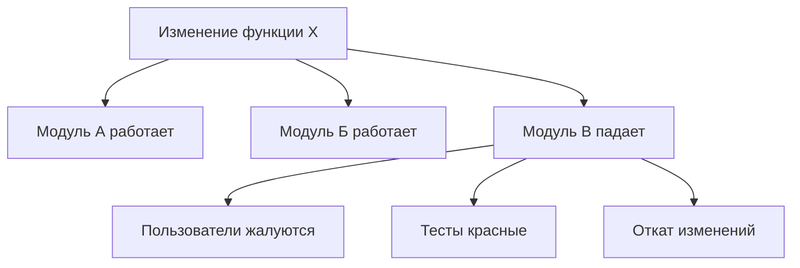
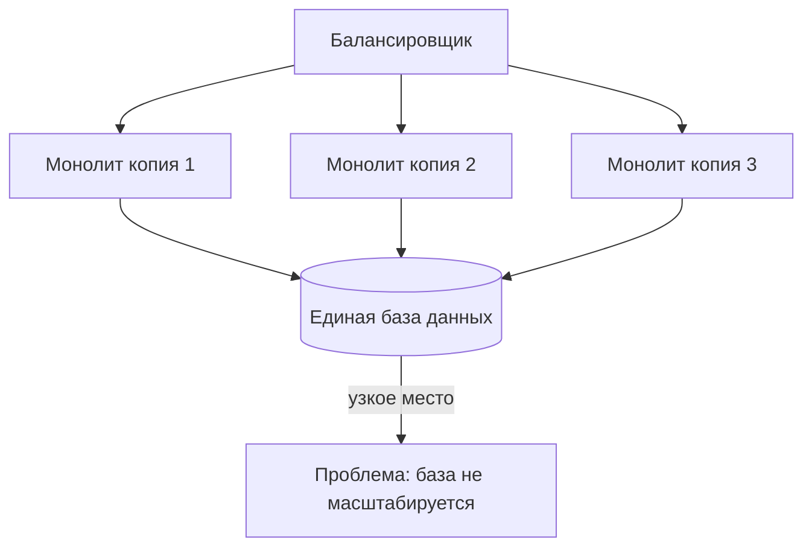
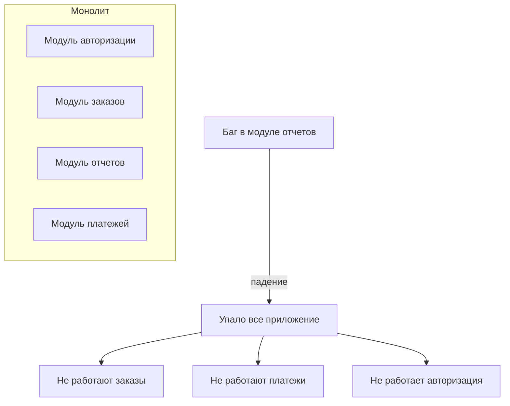
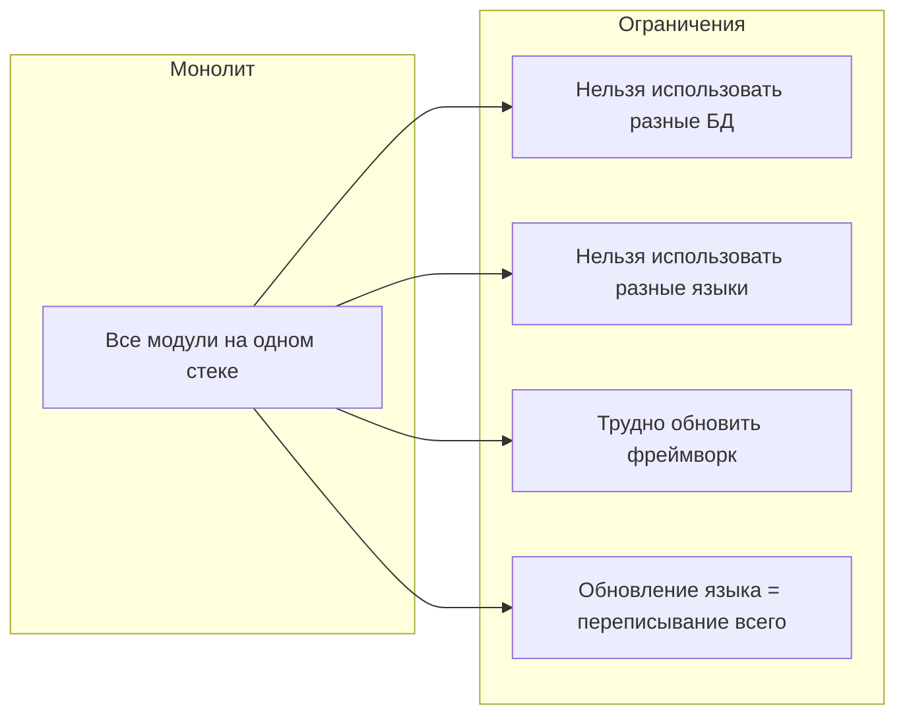
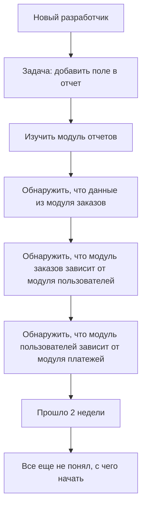
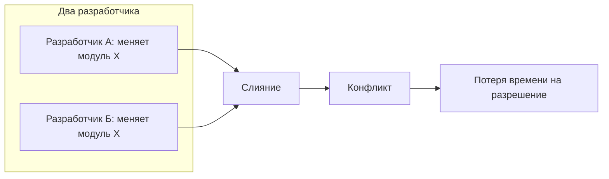
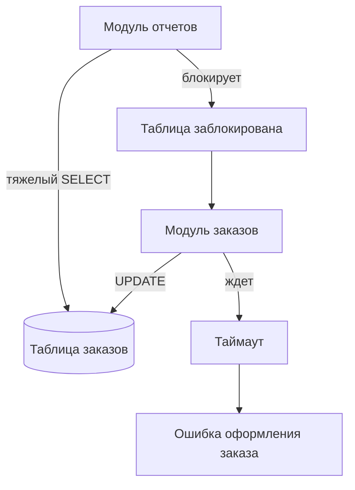

## Введение: Когда особняк становится слишком тесным

Представьте особняк, в котором живет семья из трех человек. Тихо, просторно, все друг друга слышат, быстро договориться. Проходит 10 лет. В особняке теперь живет 50 человек. Тесно, шумно. Чтобы пройти из кухни в гостиную, нужно пересечь пять комнат, в которых кто-то работает. Чтобы переставить мебель в одной комнате, нужно согласовать с десятью соседями. Один начал готовить обед — и дым пошел по всему дому.

Большой монолит — это тот же особняк, в котором стало слишком много людей. Он начинался как удобное и простое решение. Но по мере роста проекта — добавления новых функций, новых разработчиков, новых требований — проблемы накапливаются. И в какой-то момент монолит перестает быть удобным и начинает тормозить разработку, развертывание, масштабирование.

Важно понимать: проблемы возникают не потому, что монолит "плохой". А потому что любая система имеет предел, после которого ее внутренняя организация требует изменений. Этот предел зависит от многих факторов: архитектуры внутри монолита, размера команды, требований к производительности. Для одного проекта монолит начинает "болеть" на 10 тысячах строк кода, для другого — на миллионе. Но симптомы одни и те же.

## Проблема первая: Долгая сборка и развертывание

Когда проект маленький, сборка занимает несколько секунд. Вы меняете код, нажимаете кнопку, через 10 секунд видите результат. Когда проект становится большим, сборка может занимать 10, 20, 30 минут. А развертывание — еще 10-15 минут.

Что происходит внутри. Компилятору нужно обработать миллионы строк кода. Линтерам — проверить их все. Тестам — пройти все сценарии, включая те, которые не имеют отношения к вашему изменению. Сборщику — упаковать все зависимости. Чем больше кодовая база, тем дольше каждый этап.

Для разработчика это означает, что цикл "изменил код — увидел результат" растягивается с минут до часов. Продуктивность падает. Разработчики начинают бояться делать маленькие изменения, потому что каждая проверка требует долгого ожидания. Появляется соблазн коммитить "большими порциями", что еще больше усугубляет проблемы.

Для бизнеса это означает, что новые фичи выходят медленнее. Время от идеи до продакшена увеличивается. Конкуренты, у которых сборка быстрее, обгоняют вас.

С чем это связано. Долгая сборка — это не просто "много кода". Это часто признак того, что модули слишком сильно связаны. Если бы модули были изолированы, вы могли бы собирать и тестировать их отдельно, а не каждый раз пересобирать все. Но в беспорядочном или слабо модульном монолите это невозможно.

## Проблема вторая: Страх перед изменениями

В большом монолите разработчики начинают бояться что-либо менять. Не потому что они плохие, а потому что последствия изменений непредсказуемы.

Как это выглядит. Вы меняете одну функцию. Локально все работает. Вы коммитите. Через час приходит сообщение от тестировщика: "сломался отчет по продажам". Вы не трогали отчет по продажам. Но оказалось, что функция, которую вы изменили, использовалась и в том модуле, который вы знали, и в модуле отчетов, о существовании которого вы не подозревали.

Почему это происходит. В большом монолите трудно понять все связи между модулями. Функции переиспользуются в неожиданных местах. Глобальные переменные или синглтоны создают скрытые зависимости. Отсутствие четких границ приводит к тому, что изменение в одном месте аукается в другом, совершенно не связанном по смыслу.

Для команды это означает, что каждый коммит — это лотерея. Даже если вы все протестировали локально, нельзя быть уверенным, что ничего не сломалось в другой части системы. Команда тратит время на отладку, на исправление "сломанного не мной", на долгие сессии code review, где каждый пытается понять, как изменение повлияет на остальную систему.

Для бизнеса это означает нестабильность. Релизы становятся нервными. Часто приходится откатывать изменения. Пользователи видят ошибки. Доверие к команде падает.

## Проблема третья: Ограниченное масштабирование

Монолит масштабируется копированием всего приложения. Но это работает только до определенного предела.

Проблема в том, что база данных — общая для всех копий. Вы можете добавить 100 копий монолита, но база данных останется одна. А база данных имеет свой предел. Диск может быть слишком медленным. CPU базы данных может быть на 100%. Сетевые соединения могут закончиться.

Что происходит в такой ситуации. Вы добавляете новые серверы с монолитом, но производительность почти не растет — узким местом становится база данных. Вы не можете масштабировать только "тяжелый" модуль (например, модуль отчетов, который делает сложные запросы). Вы масштабируете все копии целиком, даже если остальные модули почти не нагружены. Это неэффективно с точки зрения затрат на инфраструктуру.

Для бизнеса это означает, что в какой-то момент рост нагрузки упирается в потолок. Вы не можете обслужить больше пользователей, даже если готовы платить за серверы. Нужно менять архитектуру, а это долго и дорого.

## Проблема четвертая: Ограниченная надежность

В монолите все работает в одном процессе. Это означает, что ошибка в любой части системы может уронить все приложение целиком.

Пример. В модуле отчетов есть утечка памяти. Через несколько часов работы монолит падает. Вместе с ним падают и модуль заказов, и модуль платежей, и регистрация пользователей. Хотя сами по себе эти модули работали исправно. Ошибка в одном, не самом важном модуле, привела к полному отказу всей системы.

Почему так происходит. В одном процессе все модули разделяют память, потоки, файловые дескрипторы. Исчерпание ресурсов одним модулем (память, открытые файлы, потоки) влияет на все остальные. Нет механизма изоляции — как в микросервисах, где каждый сервис работает в своем процессе и падение одного не убивает другие.

Для бизнеса это означает, что система может быть нестабильной даже при небольших ошибках. Доступность страдает. Пользователи видят ошибки 500 вместо ответа. В часы пик, когда нагрузка максимальна, риск падения особенно высок.

## Проблема пятая: Технологическая зависимость

Монолит обычно пишется на одном языке программирования, использует один фреймворк, один тип базы данных. Это упрощает начало, но становится ограничением со временем.

Что это означает на практике. Вы хотите попробовать новую базу данных, которая лучше подходит для одного из модулей. В монолите это сложно — вся система завязана на одну БД. Вы хотите переписать один модуль на другом языке, потому что он лучше подходит для задачи (например, Python для аналитики и Go для высоконагруженных операций). В монолите это невозможно — все должно быть на одном стеке.

Особенно болезненно это становится, когда технологии устаревают. Вы хотите обновить версию фреймворка. Но в большом монолите это может потребовать изменений в тысячах мест. Команда откладывает обновление, накапливая технический долг. В конце концов система оказывается на версиях, которые уже не поддерживаются, а переход на новые становится невозможным без полной переписки.

## Проблема шестая: Сложность онбординга новых разработчиков

В маленьком монолите новый разработчик может разобраться за неделю. В большом монолите на это могут уйти месяцы.

Почему так. В большом монолите огромная кодовая база. Тысячи файлов, сотни тысяч строк кода. Нет четких границ между модулями. Документация устарела или отсутствует. Чтобы понять, как работает одна фича, нужно прочитать код десяти разных модулей, понять их взаимодействие, разобраться в неявных зависимостях.

Для команды это означает, что масштабирование команды (добавление новых людей) не ускоряет разработку — или ускоряет, но с большими затратами. Новые разработчики долгое время не продуктивны, а их вопросы отвлекают опытных коллег.

Для бизнеса это означает, что вы не можете быстро нарастить команду для срочного проекта. Вы привязаны к тем людям, которые уже знают систему. Если ключевые разработчики уходят, знание системы уходит с ними.

## Проблема седьмая: Конфликты в команде

Когда весь код в одном репозитории, а вся команда работает над одним проектом, конфликты неизбежны.

Как это выглядит. Два разработчика независимо друг от друга меняют разные части кода. Они коммитят. Git говорит: "конфликт слияния". Они тратят время на разрешение конфликта. Через неделю ситуация повторяется. Чем больше команда, тем чаще конфликты.

Проблема усугубляется, когда изменения затрагивают одни и те же файлы. Даже если разработчики меняют разные функции в одном файле, git может не понять, как объединить изменения. Приходится собираться вместе и вручную разбираться, что делать.

Для команды это означает, что параллельная работа становится болезненной. Разработчики начинают координировать свои действия: "Я сейчас работаю над файлом X, ты пока не трогай его". Это снижает скорость разработки. Появляются "зоны ответственности", которые де-факто закреплены за конкретными людьми, потому что только они знают, как не сломать систему при изменениях.

## Проблема восьмая: Медленные тесты

В маленьком проекте тесты проходят за минуту. В большом монолите тесты могут идти час, два, три.

Почему так. В монолите обычно принято запускать все тесты перед релизом. Это разумно — вы хотите убедиться, что ничего не сломалось. Но когда тестов тысячи, а каждый тест может занимать секунды или минуты, общее время становится огромным.

Особенно медленными бывают интеграционные тесты, которые поднимают всю систему, базу данных, внешние зависимости. В монолите таких тестов много, потому что модули сильно связаны и трудно тестировать их изолированно.

Для разработчика это означает, что каждый коммит — это долгое ожидание. Можно запустить только часть тестов локально, но тогда есть риск пропустить ошибку. В результате разработчики коммитят реже, изменения становятся больше, риски растут.

Для CI/CD это означает, что пайплайн сборки и тестирования может занимать часы. Релизы становятся редкими (раз в неделю или даже раз в месяц). Бизнес не может быстро реагировать на изменения рынка.

## Проблема девятая: Общая база данных как корень зла

Многие проблемы большого монолита упираются в общую базу данных. Это не всегда очевидно, но база данных часто является главным ограничителем.

Что делает общая база данных проблемой. Во-первых, она создает скрытые связи между модулями. Модуль заказов читает таблицу пользователей напрямую. Модуль платежей пишет в таблицу заказов. Никто не знает всех связей. Изменение схемы таблицы — это всегда риск сломать что-то в неожиданном месте.

Во-вторых, общая база данных ограничивает масштабирование. Вы не можете шардировать данные по модулям, потому что все модули используют все таблицы. Вы не можете использовать разные типы баз данных для разных задач.

В-третьих, общая база данных создает конкуренцию за ресурсы. Модуль отчетов делает тяжелый аналитический запрос, который блокирует таблицы. В это время модуль заказов не может оформить покупку, потому что ждет освобождения таблиц. Пользователи видят задержки.

Для бизнеса это означает, что система может работать медленно или падать в самый неподходящий момент. Час пик, когда много заказов, — это одновременно время, когда менеджеры хотят смотреть отчеты. И эти два вида нагрузки конфликтуют.

## Проблема десятая: Невозможность независимого развертывания

В монолите нельзя развернуть только измененную часть. Вы всегда развертываете все приложение целиком.

Что это значит на практике. Вы исправили одну строчку в модуле, который отвечает за отображение баннера на главной странице. Чтобы выпустить это исправление, вы должны пересобрать весь монолит, прогнать все тесты (час), развернуть новую версию (еще 15 минут), перезапустить приложение. Во время перезапуска система недоступна (или доступна, но с риском ошибок, если нет стратегии zero-downtime).

Если вы работаете над разными модулями одновременно, их изменения накапливаются в одном релизе. Модуль А готов на прошлой неделе, но релиз задерживается, потому что модуль Б еще не готов. Функциональность, которая уже готова, не попадает к пользователям.

Для бизнеса это означает медленные циклы поставки. Конкуренты, которые могут выкатывать изменения каждый день (или каждый час), получают преимущество. Бизнес-требование "выпустить фичу срочно" упирается в технические ограничения монолита.

## Когда проблемы становятся критическими

Не все проблемы проявляются одновременно. Вот признаки того, что проблемы большого монолита стали критическими и требуют действий.

**Признак 1: Время сборки превышает 30 минут.** Разработчики начинают тратить больше времени на ожидание, чем на написание кода. Это прямой удар по продуктивности.

**Признак 2: Релизы происходят реже раза в неделю.** Если вы не можете выпускать изменения чаще, вы теряете гибкость. Бизнес не может быстро реагировать на рынок.

**Признак 3: Команда регулярно откатывает релизы.** Это признак того, что изменения стали непредсказуемыми. Тесты не ловят все ошибки, или тестов недостаточно.

**Признак 4: Разработчики жалуются на конфликты при слиянии.** Если это происходит несколько раз в день, значит, кодовая база слишком перегружена для текущего размера команды.

**Признак 5: База данных становится узким местом.** Вы добавляете серверы, но производительность не растет. Все упирается в запросы к БД.

**Признак 6: Онбординг нового разработчика занимает больше месяца.** Это признак того, что система слишком сложна для понимания.

Если вы видите хотя бы два-три признака из этого списка, монолит начинает мешать. Это не значит, что нужно срочно переходить на микросервисы. Но это значит, что нужно что-то менять: улучшать модульность внутри монолита, выделять отдельные сервисы для критических частей, пересматривать работу с базой данных.

## Резюме

Большие монолиты сталкиваются с набором проблем, которые растут по мере роста системы.

- **Долгая сборка и развертывание** — время от коммита до продакшена растет, продуктивность падает
- **Страх перед изменениями** — непредсказуемые последствия, частые поломки, нервные релизы
- **Ограниченное масштабирование** — база данных как узкое место, неэффективное использование ресурсов
- **Ограниченная надежность** — ошибка в одном модуле убивает всю систему
- **Технологическая зависимость** — привязанность к одному языку, фреймворку, базе данных
- **Сложность онбординга** — новые разработчики долго не продуктивны
- **Конфликты в команде** — частые конфликты слияния при параллельной работе
- **Медленные тесты** — долгий CI/CD пайплайн, редкие релизы
- **Общая база данных** — скрытые связи, конкуренция за ресурсы, блокировки
- **Невозможность независимого развертывания** — изменения разных модулей вынужденно группируются в один релиз

Важно понимать: эти проблемы не фатальны. Многие проекты успешно живут в монолите годами, потому что принимают меры: улучшают модульность, автоматизируют тестирование, используют zero-downtime деплой, оптимизируют базу данных. Но в какой-то момент затраты на борьбу с проблемами становятся выше, чем выгоды от простоты монолита. И тогда приходит время менять архитектуру.