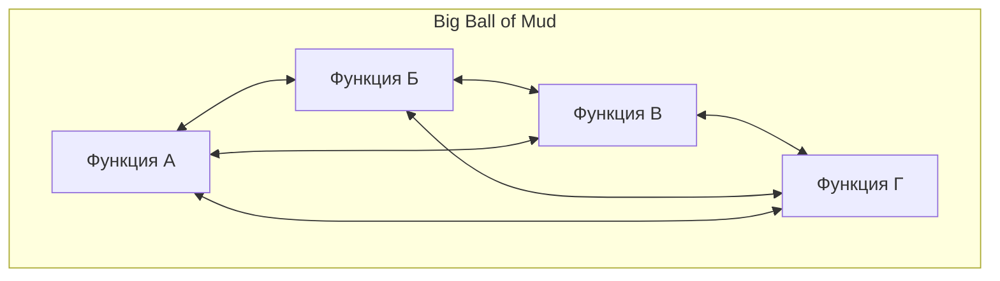
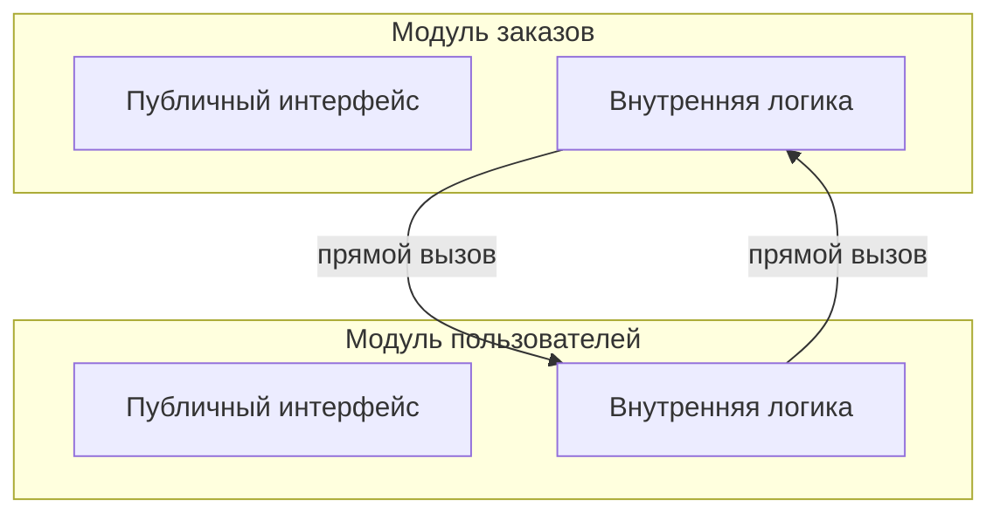
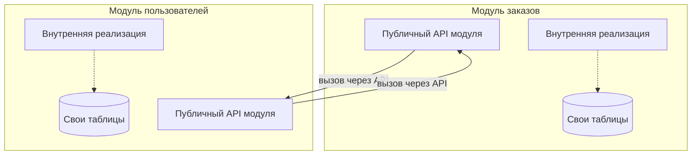
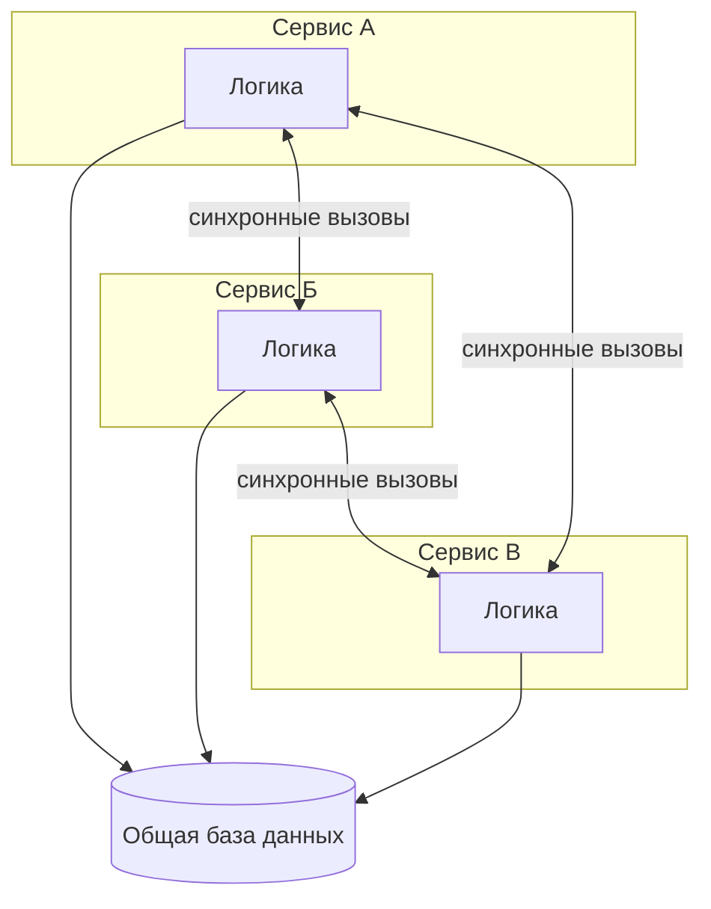
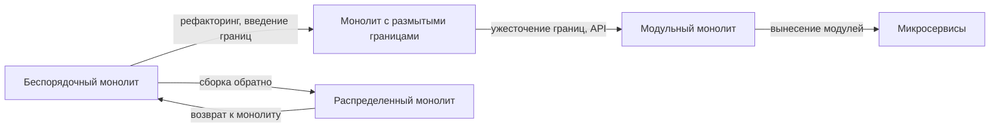

## Введение: Не все монолиты одинаковы

Когда говорят "монолит", многие представляют один большой файл, в котором написано все приложение. Или один сервер, на котором крутится "все подряд". На самом деле монолитов существует несколько разновидностей, и они сильно отличаются друг от друга по внутренней организации, гибкости и "боли", которую испытывает команда при работе с ними.

Представьте три здания. Первое — это склад, где все вещи свалены в кучу. Найти что-то невозможно, изменить расположение одной вещи нельзя без того, чтобы не обрушить всю кучу. Второе — это офис open space, где все рабочие места находятся в одном большом помещении, но у каждого отдела есть своя зона, а между зонами — проходы. Третье — это здание с отдельными комнатами, каждая комната изолирована, имеет четкую границу, но все комнаты находятся под одной крышей и подключены к общим коммуникациям.

Это три вида монолитов. У них общее свойство — все находится в одном развертываемом модуле. Но внутреннее устройство radically разное. Понимание этих различий помогает оценить, насколько "плох" текущий монолит в проекте и в каком направлении его можно улучшать, не переходя к микросервисам.

## Спектр монолитных архитектур

Виды монолита можно расположить на спектре: от полного хаоса до строгой модульности. Чем правее, тем лучше организован монолит и тем проще его поддерживать и развивать.

Но есть и промежуточные виды. На практике чаще всего встречаются три основных типа: беспорядочный монолит ("big ball of mud"), монолит с размытыми границами (когда модули есть, но они сильно связаны) и модульный монолит (с четкими границами). Иногда выделяют также "распределенный монолит" — это отдельная, очень болезненная разновидность.

## Беспорядочный монолит (Big Ball of Mud)

Это худший вид монолита. Название говорит само за себя: большой шар грязи. В такой системе нет четкой структуры. Код организован как попало. Модули либо отсутствуют, либо существуют только номинально. Зависимости хаотичны и циклические. Изменение в одном месте непредсказуемо ломает другие.

Как распознать беспорядочный монолит. В коде нет четкого разделения на модули по смыслу. Функции работы с пользователями, заказами, платежами и отчетами перемешаны в одних и тех же файлах. База данных — одна большая схема, где все таблицы связаны со всеми внешними ключами. Разработчики боятся что-то менять, потому что "непонятно, что еще сломается". Добавление новой функциональности требует изменений в десятке мест, не связанных напрямую с этой функциональностью.

Почему такой монолит возникает. Чаще всего — из-за отсутствия архитектурной дисциплины. Проект начинался как "быстрый прототип", потом стал продакшеном, потом к нему добавляли фичу за фичей, не тратя время на рефакторинг. Или команда не имела опыта, или дедлайны были слишком жесткими. Беспорядочный монолит — это не результат злого умысла, а результат накопленного технического долга.

Чем опасен беспорядочный монолит. Он убивает скорость разработки. Каждое изменение требует времени на понимание того, "как все связано". Риск сломать что-то растет экспоненциально с размером системы. В конце концов команда приходит к состоянию, когда проще переписать систему с нуля, чем менять существующую. Но переписать с нуля — это тоже огромный риск.

Что делать, если вы оказались в беспорядочном монолите. Первый шаг — признать проблему. Второй — начать постепенно вводить границы. Не пытайтесь переписать все сразу. Выберите один небольшой модуль, который относительно изолирован. Отделите его код, создайте четкий интерфейс для взаимодействия с остальной системой. Постепенно, шаг за шагом, превращайте беспорядочный монолит в модульный. Это долгий процесс, но другого пути нет.

## Монолит с размытыми границами (Modular Monolith with Leaky Boundaries)

Это промежуточный вид. В системе есть модули — то есть код разделен по папкам или пакетам. Есть понимание, что "модуль заказов" и "модуль пользователей" — это разные вещи. Но границы между модулями "текут" — код одного модуля напрямую вызывает внутренние функции другого, использует его внутренние структуры данных.

Как распознать монолит с размытыми границами. В коде есть папки "orders", "users", "payments". Но если посмотреть на вызовы, модуль заказов напрямую читает таблицу пользователей (в обход интерфейса модуля пользователей). Модуль платежей вызывает внутренние функции модуля заказов. Изменение внутренней структуры одного модуля ломает другой модуль, хотя формально эти модули должны быть независимы.

Почему возникают размытые границы. Часто это результат эволюции. Проект начинался с четкими модулями, но потом понадобилось "быстро добавить фичу". Самый простой способ — вызвать функцию из соседнего модуля напрямую, а не через публичный интерфейс. Со временем таких "прямых вызовов" становится много, и границы перестают существовать. Модули есть, но они не защищены.

Чем опасны размытые границы. Они создают иллюзию порядка. Разработчики думают, что система модульная, но на самом деле она уже близка к "большому шару грязи". Изменения все еще болезненны, потому что нельзя гарантировать, что изменение внутренностей одного модуля не сломает другой.

Что делать. Нужно ужесточать границы. Ввести правило: модули общаются только через четко определенные публичные интерфейсы (API). Внутренние функции и данные модуля не доступны снаружи. Если нужно, чтобы два модуля обменивались данными, создайте для этого публичный метод. Технически это можно обеспечить через механизмы языка (например, пакеты с ограниченной видимостью в Java или __all__ в Python). Процесс "запечатывания" границ требует времени, но он менее болезненный, чем полная перестройка беспорядочного монолита.

## Модульный монолит (Modular Monolith)

Это лучший вид монолита. Система состоит из четко выделенных модулей. Каждый модуль имеет публичный интерфейс (API) и скрытую внутреннюю реализацию. Модули общаются друг с другом только через эти публичные интерфейсы. Внутри модуля может быть сложно, но снаружи он выглядит как черный ящик с понятными входами и выходами.

Как распознать модульный монолит. Код четко разделен на модули. У каждого модуля есть свой API (набор функций или классов, которые можно вызывать извне). Внутренние детали модуля скрыты. База данных может быть общей, но доступ к таблицам осуществляется только через модуль-владелец (никто не читает таблицу "users" напрямую, все идут через модуль пользователей). Изменение внутренней реализации модуля не требует изменений в других модулях, если публичный API не меняется.

Преимущества модульного монолита. Он почти так же хорош, как микросервисы, но без распределенной сложности. Вы можете разрабатывать модули независимо (разные команды могут работать над разными модулями, если договорятся об API). Вы можете тестировать модули изолированно. Вы можете даже переиспользовать модули в разных проектах (как библиотеки). При этом у вас нет сетевых задержек, распределенных транзакций, проблем с версионированием API в рантайме.

Как построить модульный монолит. Ключевой принцип: четкие границы и инверсия зависимостей. Модули не должны зависеть от деталей друг друга. Если модулю А нужно что-то от модуля Б, модуль А определяет интерфейс этого "чего-то", а модуль Б реализует этот интерфейс. Зависимости идут внутрь, к абстракциям, а не между модулями напрямую. Это похоже на Clean Architecture, но на уровне модулей внутри одного развертываемого артефакта.

Модульный монолит — это часто лучшая точка на спектре для многих проектов. Он дает достаточно гибкости и модульности, но не требует перехода к полноценным микросервисам со всеми их проблемами. Более того, модульный монолит — это отличная стартовая точка для постепенного перехода к микросервисам: если какой-то модуль станет слишком нагруженным или потребует независимого масштабирования, его можно "вынести" в отдельный сервис, оставив API неизменным.

## Распределенный монолит (Distributed Monolith)

Это особый вид антипаттерна. Название звучит как оксюморон — как может монолит быть распределенным? Но на практике такое встречается часто. "Распределенный монолит" — это система, которая формально разбита на микросервисы, но по внутренней связности и поведению остается монолитом.

Как распознать распределенный монолит. Формально у вас есть несколько сервисов, они запущены на разных серверах, общаются по сети. Но изменения в одном сервисе почти всегда требуют изменений в других. Обновить один сервис без обновления других нельзя — они слишком тесно связаны. Сервисы используют общую базу данных (или даже общие таблицы). Сетевые вызовы синхронные и образуют длинные цепочки (сервис А вызывает Б, Б вызывает В, В вызывает А). При падении одного сервиса падают все, кто от него зависят, что приводит к каскадным отказам.

Почему возникает распределенный монолит. Чаще всего из-за желания "сделать микросервисы", но без понимания принципов. Команда просто берет монолит и механически разрезает его на части по принципу "один класс — один сервис". При этом не проводятся работы по ослаблению связей, не меняется архитектура данных, не вводятся асинхронные взаимодействия. Получается тот же монолит, но теперь он еще и медленный (из-за сети) и ненадежный (из-за распределенных отказов).

Чем опасен распределенный монолит. Это худшее из двух миров. Вы получаете все сложности распределенных систем (сетевые задержки, частичные отказы, распределенные транзакции, сложный мониторинг) и при этом не получаете преимуществ микросервисов (независимое развертывание, изолированное масштабирование, слабую связанность). Распределенный монолит — это архитектурный антипаттерн, который убивает продуктивность команды.

Что делать. Если вы обнаружили, что ваша система — распределенный монолит, у вас два пути. Первый — вернуться к обычному монолиту, собрав сервисы обратно в одно приложение. Это проще, чем пытаться "доделать" микросервисы. Второй — провести серьезную работу по ослаблению связей: разделить общую базу данных, заменить синхронные вызовы на асинхронные события, ввести четкие API с версионированием. Второй путь сложнее и дольше, но в некоторых случаях оправдан.

## Сравнение видов монолита

| Вид монолита | Структура | Границы между модулями | Скорость изменений | Риск поломок | Сложность перехода в микросервисы |
| :--- | :--- | :--- | :--- | :--- | :--- |
| Беспорядочный | Отсутствует | Нет границ | Очень низкая | Очень высокий | Очень высокая (нужна полная перестройка) |
| С размытыми границами | Формально есть | Текущие, нарушаются | Низкая | Высокий | Высокая (нужно запечатать границы) |
| Модульный | Четкая | Строгие, соблюдаются | Высокая | Низкий | Низкая (можно выносить модуль за модулем) |
| Распределенный (антипаттерн) | Формально есть сервисы | Нет (связи через сеть) | Низкая | Очень высокий | Нужно возвращаться к монолиту или переделывать |

## Как определить, какой вид монолита в вашем проекте

Вот несколько практических тестов, которые помогут понять, с каким видом монолита вы имеете дело.

**Тест на зависимость при изменении.** Выберите одну функциональность, которая кажется изолированной (например, расчет скидки). Измените ее внутреннюю реализацию, не меняя внешнего поведения. Сколько других мест в коде пришлось изменить? Если ни одного — границы четкие. Если несколько — границы размыты. Если десятки — вы в беспорядочном монолите.

**Тест на развертывание.** Можно ли обновить только часть системы? В классическом монолите — нет. Но если у вас распределенный монолит, формально можно обновить один сервис. Проверьте, что произойдет, если вы обновите один сервис, не обновляя другие. Если все сломается — вы в распределенном монолите.

**Тест на базу данных.** Кто имеет доступ к таблицам? В хорошем модульном монолите каждая таблица имеет владельца — конкретный модуль. Другие модули читают и пишут данные только через API модуля-владельца. Если все модули читают все таблицы напрямую — границ нет.

**Тест на тестирование.** Можете ли вы протестировать один модуль изолированно, подставив заглушки для других модулей? В беспорядочном монолите это почти невозможно из-за циклических зависимостей. В модульном — легко.

## Эволюция монолита: от хаоса к порядку

Важно понимать, что виды монолита — это не статические категории. Проект может эволюционировать от беспорядочного к модульному. Это требует усилий, но возможно.

Путь от беспорядочного монолита к модульному: начните с выделения одного модуля, который относительно изолирован. Создайте для него четкий API. Постепенно переводите других "потребителей" этого модуля на использование API вместо прямого доступа к внутренностям. Повторяйте для других модулей. Это долгий процесс, но каждый шаг улучшает ситуацию.

Путь от модульного монолита к микросервисам: выберите модуль, который имеет смысл вынести (например, потому что он требует независимого масштабирования или его разрабатывает другая команда). Сделайте его API сетевым (например, через HTTP или gRPC), сохранив семантику. Запустите как отдельный сервис. Остальная система продолжает работать через тот же API, но теперь по сети. Постепенно выносите другие модули, если это нужно.

## Резюме

Монолит — это не одна архитектура, а целое семейство. Разные виды монолита дают разный опыт разработки и имеют разные перспективы.

Беспорядочный монолит ("big ball of mud") — это хаос. Изменения медленные и страшные, риски высокие. От него нужно уходить, вводя модульность.

Монолит с размытыми границами — это иллюзия порядка. Модули есть, но они не защищены. Нужно ужесточать границы, вводить публичные API.

Модульный монолит — это хорошая, зрелая архитектура. Четкие модули, строгие границы, высокая скорость изменений. Для многих проектов это оптимальная точка.

Распределенный монолит — это антипаттерн. Худшее из двух миров. Нужно либо возвращаться к обычному монолиту, либо серьезно переделывать архитектуру.

Понимание этих видов помогает принимать осознанные решения. Если проект только начинается, стремитесь сразу к модульному монолиту — это сэкономит годы боли в будущем. Если проект уже существует, оцените, к какому виду он относится, и выберите стратегию улучшения. И помните: микросервисы — это не панацея. Хороший модульный монолит часто лучше, чем плохие микросервисы (и тем более — чем распределенный монолит).