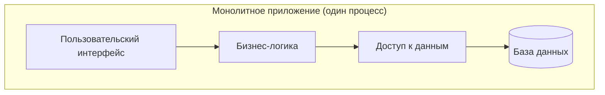
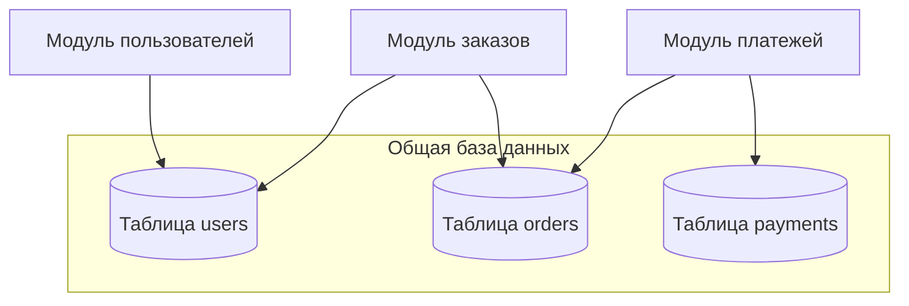
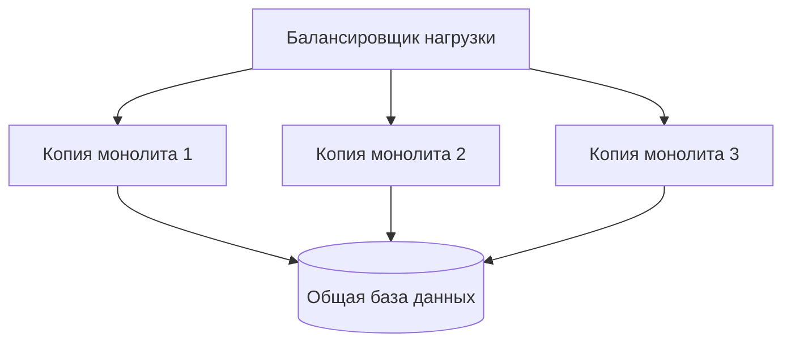

## Введение: Один дом vs поселок

Представьте, что вам нужно разместить компанию из 50 человек. Есть два варианта. Первый — снять один большой особняк, где все сотрудники находятся под одной крышей. Второй — построить поселок из маленьких домиков, по одному-два человека в каждом, с дорогами и мостами между ними.

Монолит — это тот самый большой особняк. Все части системы находятся внутри одного развертываемого модуля. Весь код, вся бизнес-логика, все сервисы — все собрано в одном месте, компилируется (или интерпретируется) вместе и запускается как единое приложение.

**Монолитная архитектура** — это подход, при котором программное обеспечение строится как единое целое. Пользовательский интерфейс, бизнес-логика, доступ к данным — все это работает в рамках одного процесса, часто на одном сервере. Если нужно что-то изменить, вы меняете код, пересобираете приложение и развертываете его заново целиком.

Для системного аналитика монолит — это не "плохо" и не "хорошо". Это архитектурное решение с четкими последствиями. Понимание этих последствий позволяет вам оценивать, подходит ли монолит для конкретного проекта, какие риски с ним связаны и как долго он сможет эффективно работать.

## Что значит "единое целое"

Ключевая характеристика монолита — это единый процесс. Все компоненты системы работают внутри одного операционного процесса. Они общаются друг с другом через вызовы функций или методов, а не через сеть. Это фундаментальное отличие от распределенных систем (микросервисов), где компоненты работают в разных процессах и общаются по сети.

Что это означает на практике. Когда один компонент монолита вызывает другой, это происходит со скоростью оперативной памяти (наносекунды или микросекунды). Нет задержек на сериализацию данных, нет сетевых вызовов, нет риска, что вызываемый компонент "упал" отдельно от вызывающего. Все либо работает, либо не работает — целиком.

Второй важный аспект — единое развертывание. Вы не можете обновить отдельную часть монолита. Вы собираете весь проект в один артефакт (JAR-файл, Docker-образ, папку с файлами) и развертываете его целиком. Если вы изменили одну строчку кода в модуле отчетов, вам все равно придется пересобрать и перезапустить все приложение.

Третий аспект — общая база данных. Чаще всего монолит использует одну базу данных для всех своих нужд. Модуль управления пользователями, модуль заказов, модуль отчетов — все они читают и пишут в одни и те же таблицы. Это упрощает транзакции и запросы (можно сделать JOIN между любыми таблицами), но создает скрытые связи между модулями.

## Монолит — это не "плохой код"

Важное уточнение: монолитная архитектура не означает "беспорядочный код" или "отсутствие структуры". Монолит может быть идеально организован внутри. В нем могут быть четкие модули, чистая архитектура, правильные границы между компонентами.

Разница между "плохим монолитом" и "хорошим монолитом" — это разница между свалкой в одном здании и хорошо спланированным офисом. В плохом монолите все перемешано, изменение в одной части ломает другую, нельзя ничего изменить, не задев остальное. В хорошем монолите есть четкие модули, каждый модуль отвечает за свою функциональность, модули общаются через четкие интерфейсы.

Более того, правильно построенный монолит может быть проще в поддержке, чем хаотичный набор микросервисов. Один из парадоксов современной разработки: микросервисы часто выбирают, чтобы "навести порядок", но без дисциплины они создают еще больший хаос, просто распределенный по множеству репозиториев.

## Как выглядит монолит с точки зрения развертывания

С практической точки зрения монолит — это то, как вы доставляете код в продакшен. Процесс выглядит так:

1. Разработчик пишет код и отправляет его в репозиторий
2. CI/CD система собирает все приложение целиком (компиляция, сборка зависимостей, запуск тестов)
3. Создается единый артефакт (например, JAR-файл для Java, папка dist для Node.js, Docker-образ)
4. Этот артефакт развертывается на серверах
5. Приложение перезапускается (или подхватывает изменения, если есть механизм hot reload)

Весь процесс для всего приложения. Нельзя сказать: "Я обновлю только модуль отчетов, остальное не трогаю". Любое изменение — даже исправление опечатки в логах — требует пересборки и переразвертывания всего приложения.

Для системного аналитика это важно, потому что влияет на процесс поставки изменений. Если бизнес просит "срочно исправить одну маленькую опечатку", ответ может быть: "Мы не можем выкатить только это исправление. Мы должны пересобрать все приложение и перезапустить его. Это займет 20 минут, и во время перезапуска система будет недоступна". В микросервисной архитектуре вы могли бы обновить только один сервис за 2 минуты без простоя.

## Монолит и база данных

В классическом монолите все модули используют одну базу данных. Это одновременно и преимущество, и проклятие.

Преимущество: простота работы с данными. Вы можете написать один SQL-запрос, который объединяет данные из таблиц пользователей, заказов и платежей. Вы можете использовать ACID-транзакции, которые обновляют данные во всех этих таблицах атомарно. Если что-то пошло не так посреди операции, все изменения откатываются. Нет необходимости в распределенных транзакциях, сагах, компенсирующих действиях.

Проклятие: все модули оказываются связаны через схему базы данных. Модуль заказов начинает зависеть от того, как устроена таблица пользователей. Изменение схемы одной таблицы может сломать несколько модулей. Вы не можете "изолировать" модуль, потому что данные физически находятся в одном месте.

Для системного аналитика это означает, что изменения в данных — это самые дорогие изменения в монолите. Добавить новое поле в таблицу "пользователи" — просто. А вот изменить тип поля, переименовать таблицу или разделить одну таблицу на две — это большая операция, требующая согласования всех модулей, которые используют эти данные.

## Масштабирование монолита

Монолит масштабируется двумя способами. Первый — вертикальное масштабирование: вы берете сервер мощнее (больше CPU, больше RAM, быстрее диски). Второй — горизонтальное масштабирование через копирование: вы запускаете несколько копий монолита на разных серверах и ставите перед ними балансировщик нагрузки.

Второй способ работает, но с ограничениями. Все копии монолита используют одну и ту же базу данных. А база данных — это самое узкое место. Вы можете добавить 100 копий монолита, но если база данных не справляется с нагрузкой, вы ничего не выиграете. База данных обычно масштабируется вертикально (нужен более мощный сервер БД) или через репликацию (читаем с реплик, пишем в мастер).

Проблема в том, что в монолите все модули конкурируют за ресурсы базы данных. Модуль отчетов, который делает тяжелые аналитические запросы, может заблокировать таблицы, нужные модулю заказов для оформления покупок. Модуль импорта данных, который массово вставляет записи, может замедлить все остальные модули. В монолите трудно изолировать нагрузку от разных модулей.

## Когда монолит — это правильный выбор

Монолит часто критикуют, особенно в сообществах, где модно говорить о микросервисах. Но монолит — правильный выбор для огромного количества проектов.

**Начальный этап проекта.** Когда вы только начинаете, у вас нет понимания, какие части системы будут нагружены, а какие нет. Монолит позволяет быстро двигаться, менять архитектуру внутри, не тратя время на распределенные транзакции и сетевые вызовы. Большинство успешных стартапов начинали с монолита и перешли на микросервисы только когда монолит действительно перестал справляться.

**Небольшие команды.** Если у вас команда из 3-5 разработчиков, монолит проще в координации. Все работают в одном репозитории, видят весь код, могут легко вносить изменения в любую часть. В микросервисной архитектуре та же команда потратит половину времени на организацию взаимодействия между сервисами, на деплой, на мониторинг.

**Проекты с простыми требованиями к масштабированию.** Если ваша система обрабатывает 100 запросов в секунду и вы не ожидаете роста до 10 000, монолит будет работать отлично. Не нужно платить за сложность распределенной системы, если она не нужна.

**Проекты с сильными требованиями к консистентности.** Если вам нужны ACID-транзакции, сложные JOIN, внешние ключи — монолит с одной базой данных дает все это "из коробки". В распределенной системе обеспечить такую же консистентность очень сложно и дорого.

## Монолит и микросервисы: ключевые различия

Чтобы лучше понять монолит, полезно сравнить его с альтернативой — микросервисами.

| Аспект | Монолит | Микросервисы |
| :--- | :--- | :--- |
| Развертывание | Единое, перезапуск всего приложения | Независимое, каждый сервис отдельно |
| Масштабирование | Копиями всего приложения | Каждый сервис отдельно под свою нагрузку |
| Внутренние вызовы | Вызовы функций (быстро) | Сетевые вызовы (медленно) |
| Транзакции | ACID, одна база данных | Распределенные, eventual consistency |
| Технологии | Единый стек технологий | Разные языки и фреймворки для разных сервисов |
| Команда | Одна команда на все | Разные команды на разные сервисы |

Для системного аналитика это сравнение дает понимание, о чем спрашивать бизнес. "Как часто мы планируем обновлять систему?" — если часто, то независимое развертывание микросервисов дает преимущество. "Какая у нас команда?" — если 3 человека, монолит проще. "Насколько важна строгая консистентность?" — если критична, монолит дает ее бесплатно.

## Признаки того, что монолит начинает мешать

Монолит — хорошее решение, но не навсегда. Со временем любой успешный монолит сталкивается с проблемами. Вот признаки, что монолит перерос свои возможности.

**Долгое время сборки и развертывания.** Если сборка проекта занимает 30 минут, а развертывание — 15, разработка замедляется. Каждое изменение требует ожидания. Это признак того, что монолит слишком большой.

**Частые конфликты при слиянии кода.** Если команда из 20 человек постоянно конфликтует в одном репозитории, тратя время на разрешение конфликтов вместо разработки, это признак того, что монолит слишком большой для такой команды.

**Невозможность изолировать нагрузку.** Если модуль отчетов своими тяжелыми запросами замедляет оформление заказов, а это происходит в часы пик, монолит мешает бизнесу. Вам нужно масштабировать модуль отчетов отдельно, но в монолите это невозможно.

**Сложность внедрения новых технологий.** Если вы хотите попробовать новую базу данных или новый язык для одного модуля, в монолите это практически невозможно. Все должно быть на одном стеке.

**Страх перед изменениями.** Если разработчики боятся что-то менять, потому что "неизвестно, что еще сломается", это признак того, что границы внутри монолита размыты, модули слишком сильно связаны. Технически это можно исправить рефакторингом, но на большом монолите рефакторинг может быть очень дорогим.

## Монолит с точки зрения системного аналитика

Когда вы как системный аналитик работаете с проектом, построенным как монолит, вот на что стоит обращать внимание.

**Запросы на изменения.** Оценивайте, как изменение в одной части системы может повлиять на другие части. В монолите связи не очевидны. Таблица, которую вы меняете для одного модуля, может использоваться тремя другими. Функция, которую вы оптимизируете, может вызываться в неожиданных местах.

**Нефункциональные требования.** Особенно важны требования к доступности и времени простоя. При развертывании монолит перезапускается целиком. Если бизнесу нужен аптайм 99.99%, вам понадобятся стратегии zero-downtime deployment (blue-green, canary, rolling). Это возможно, но сложнее, чем в микросервисах.

**Масштабирование.** Понимайте, какие части системы создают нагрузку. Если 80% нагрузки создает один модуль, а остальные 20% — все остальные, монолит все равно заставит вас масштабировать все целиком. Это неэффективно с точки зрения затрат на инфраструктуру.

**Границы ответственности.** Даже внутри монолита должны быть четкие границы. Если вы видите, что в требованиях модули постоянно пересекаются, изменения в одном требуют изменений в другом, это проблема архитектуры, а не монолита как такового. Но в монолите эта проблема проявляется острее, потому что нет физических границ между модулями.

## Распространенные заблуждения о монолите

**"Монолит — это устаревшая архитектура".** Нет. Монолит существует и будет существовать. Netflix, Google, Amazon начинали с монолитов. Многие успешные компании до сих пор используют монолит в ядре своего бизнеса. Микросервисы — это не замена монолита, а дополнение для определенных случаев.

**"В монолите нельзя использовать разные технологии".** В классическом понимании — да. Но современные монолиты могут быть "модульными монолитами", где разные модули собраны в один артефакт, но внутренне используют разные технологии. Например, модуль машинного обучения может быть на Python, а основной код — на Java, если они общаются через вызовы внутрипроцессных сервисов.

**"Монолит нельзя масштабировать горизонтально".** Можно. Запустите 10 копий за балансировщиком. Ограничение не в монолите, а в базе данных. Но и базу данных можно масштабировать через репликацию или шардирование. Просто это сложнее, чем масштабирование stateless-микросервисов.

**"Монолит всегда превращается в большой ком грязи".** Только если команда не уделяет внимания архитектуре. Хорошо структурированный монолит с четкими модулями и границами может оставаться чистым годами. Проблема не в монолите, а в отсутствии дисциплины.

## Резюме

Монолитная архитектура — это подход, при котором вся система работает в одном процессе, развертывается как единое целое и обычно использует одну базу данных.

Преимущества монолита:

- Простота разработки на старте
- Быстрые внутренние вызовы (без сети)
- ACID-транзакции и сложные JOIN "из коробки"
- Один артефакт для развертывания
- Проще отладка и мониторинг

Недостатки монолита:

- Любое изменение требует переразвертывания всего
- Масштабируется только целиком (нельзя изолировать горячие модули)
- Общая база данных создает скрытые связи между модулями
- Со временем сборка и развертывание становятся медленными
- Трудно внедрять новые технологии для отдельных частей

Для системного аналитика ключевой вывод: монолит — это правильный выбор для большинства проектов на начальном этапе и для многих проектов навсегда. Переходить на микросервисы стоит только тогда, когда монолит действительно начинает мешать, а не потому что "так модно". И даже тогда разумно начать с "модульного монолита" с четкими границами, который потом можно будет разбить на микросервисы, если потребуется.