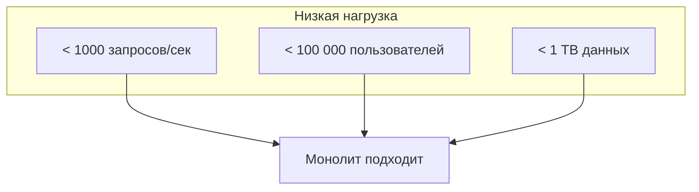
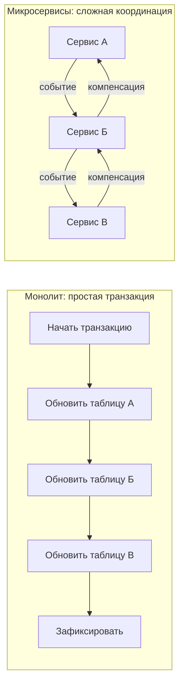
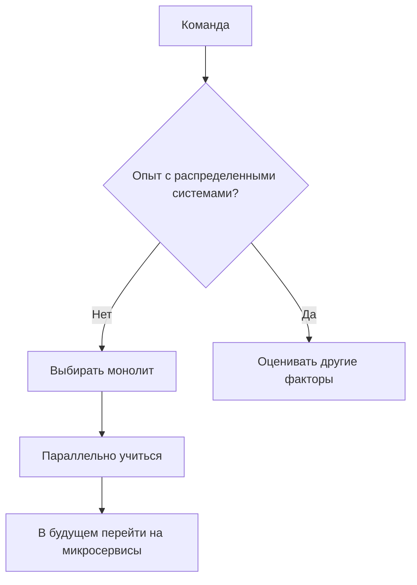
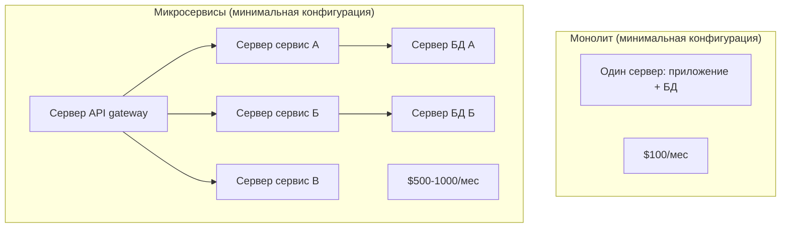

## Введение: Инструмент под задачу, а не мода

В мире программной архитектуры часто возникает соблазн выбрать "модное" решение. В 2010-х все хотели микросервисы, в 2020-х — serverless. Но архитектура — это не про то, что круто, а про то, что подходит для конкретной ситуации.

Монолит — это как складной нож. Для повседневных задач, когда нужно открыть посылку или починить карандаш, он идеален. Вы носите его с собой, он всегда под рукой, вы знаете все его функции. Но если вам нужно забить гвоздь или распилить бревно, складной нож не поможет. Это не значит, что нож плохой. Это значит, что вы выбрали не тот инструмент.

Выбор монолита — это стратегическое решение. Оно определяет, как команда будет работать, как быстро можно выпускать изменения, сколько будет стоить инфраструктура, насколько сложным будет управление системой. Принимать это решение нужно осознанно, понимая и преимущества, и ограничения.

## Когда монолит — это правильный выбор

### Начальный этап проекта (стартап, MVP)

Это самый частый и самый правильный сценарий для монолита. У вас нет готового продукта, нет пользователей, нет понимания, какая функциональность действительно нужна. Вы проверяете гипотезы, быстро меняете требования, часто переписываете код.

В этой ситуации скорость разработки важнее всего. Монолит дает максимальную скорость на старте. Нет необходимости проектировать API между сервисами, настраивать сеть, организовывать сервис-дискавери, писать код для распределенных транзакций. Вы просто пишете код, как учили.

Более того, большинство успешных стартапов, которые потом перешли на микросервисы, начинали с монолита. Twitter начинался с монолита на Ruby on Rails. Airbnb — с монолита на Ruby. Shopify до сих пор в значительной степени монолит. И это нормально.

Вот конкретные признаки того, что монолит подходит для вашего проекта:

- Команда меньше 10 человек (все могут работать в одном репозитории без сильных конфликтов)
- Вы не знаете точно, какие функции будут нужны через полгода (а это почти всегда так на старте)
- Вам нужно выпустить первую версию как можно быстрее (time-to-market критичен)
- У вас ограниченный бюджет на инфраструктуру (один сервер дешевле десяти)
- У вас нет опыта работы с распределенными системами (и нет времени его приобретать)

### Проекты с простыми требованиями к масштабированию

Не все проекты становятся Google или Amazon. Есть множество успешных бизнесов, у которых нагрузка растет медленно и предсказуемо.

Представьте внутреннюю систему учета для компании на 500 сотрудников. В час пик — 100 одновременных пользователей. Через пять лет — 200. Такой проект может жить в монолите десятилетиями, и проблем не будет.

Или представьте интернет-магазин, который продает товары для узкой ниши (например, запчасти для старых автомобилей). Клиентов не миллион, а 10 тысяч. Нагрузка невысокая. Монолит будет работать отлично.

Признаки того, что масштабирование не будет проблемой:

- Ожидаемая нагрузка — не более 1000 запросов в секунду
- Количество пользователей — не более 100 000 (активных)
- Объем данных — до 1 ТБ (помещается на один сервер)
- Рост нагрузки — медленный, предсказуемый, линейный

В таких условиях монолит не только допустим, но и предпочтителен, потому что не добавляет лишней сложности.

### Проекты с сильными требованиями к консистентности данных

Некоторые системы требуют строгой согласованности данных. Финансовые системы, системы бронирования, системы учета инвентаря — там нельзя допустить, чтобы данные разошлись.

В монолите с одной базой данных ACID-транзакции работают "из коробки". Вы можете обновить несколько таблиц в одной транзакции, и база данных гарантирует, что либо все изменения применятся, либо ни одно. Нет необходимости в распределенных транзакциях, сагах, компенсирующих действиях.

В микросервисной архитектуре обеспечить такую же гарантию очень сложно. Нужно использовать паттерн Saga, который требует компенсирующих транзакций. Если что-то пошло не так, нужно откатывать изменения через отдельные операции. Это сложно в реализации и отладке.

Поэтому для систем, где консистентность критична, монолит часто остается лучшим выбором даже при большом масштабе.

### Команды без опыта распределенных систем

Микросервисы требуют нового набора компетенций. Нужно уметь проектировать API, работать с сетевыми задержками, обрабатывать частичные отказы, настраивать сервис-дискавери, распределенное трассирование, агрегацию логов.

Если в команде нет такого опыта, попытка внедрить микросервисы приведет к распределенному монолиту (антипаттерн) или к хаосу. Система будет сложной, нестабильной, а разработка — медленной.

Монолит позволяет команде расти. Вы можете начать с монолита, а когда команда наберется опыта, а система вырастет — постепенно переходить к более сложной архитектуре. Начинать сразу с микросервисов без опыта — рискованно.

### Проекты с сильной связностью бизнес-логики

Некоторые предметные области устроены так, что разные функции системы очень тесно связаны. Примеры: сложная ERP-система, где изменение в одном модуле тянет изменения во многих; бухгалтерская система, где все проводки связаны; система управления производством, где каждый процесс влияет на другие.

В таких случаях разбиение на микросервисы будет искусственным. Границы между сервисами придется проводить там, где их нет в бизнес-логике. В результате микросервисы будут постоянно общаться друг с другом, создавая сложные сети зависимостей. Это будет распределенный монолит — худшее из двух миров.

Монолит в такой ситуации — честное признание того, что система сильно связана по своей природе. Вместо того чтобы бороться с этой связанностью, тратя ресурсы на изоляцию, монолит позволяет работать с ней явно.

### Проекты с ограниченным бюджетом

Микросервисы требуют больше инфраструктуры. Вам нужны серверы для каждого сервиса (хотя бы маленькие), балансировщики нагрузки, сервис-дискавери (например, Consul или etcd), распределенное трассирование (Jaeger), агрегация логов (ELK), контейнеризация (Docker, Kubernetes). Это все стоит денег.

Монолит может работать на одном сервере. База данных и приложение — на одной машине. Или приложение на одном, база на другом — но это уже "роскошь". Для стартапа с ограниченным бюджетом это огромное преимущество.

Конечно, можно запустить микросервисы на одном сервере (через Docker Compose), но тогда теряются многие преимущества (изоляция отказов, независимое масштабирование). А сложность остается.

### Проекты, где время разработки важнее всего

Бывают ситуации, когда нужно "просто сделать работающую систему". Внутренний инструмент для отдела маркетинга. Прототип для презентации инвесторам. Система для однодневной акции.

В таких случаях архитектурная "чистота" не важна. Важно получить работающий продукт с минимальными затратами времени. Монолит позволяет двигаться быстрее, потому что:

- Нет необходимости проектировать API
- Нет необходимости настраивать сети
- Проще отладка (можно поставить breakpoint в любом месте)
- Проще тестирование (один процесс, одна база данных)
- Проще деплой (скопировать файл и перезапустить)

Если сроки горят, а архитектурное совершенство подождет — выбирайте монолит.

## Когда монолит — рискованный выбор (но иногда все равно выбирают)

Есть ситуации, где монолит технически не оптимален, но может быть выбран по другим причинам. Важно понимать эти риски.

**Большая команда (20+ человек).** В большом монолите с такой командой неизбежны конфликты при слиянии кода, долгая сборка, сложность координации. Но если команда хорошо структурирована и монолит модульный, работать можно. Например, команда Shopify долгое время работала в монолите с сотнями разработчиков — благодаря строгой модульности и дисциплине.

**Высокая нагрузка на запись.** Если ваша система обрабатывает тысячи запросов на запись в секунду, монолит с одной базой данных может не справиться. Но иногда можно масштабировать базу данных вертикально (супер-сервер) или через шардирование. Это сложно, но возможно.

**Необходимость независимого развертывания.** Если бизнесу нужно выкатывать изменения по частям, монолит это затрудняет. Но можно использовать feature toggles (включать функциональность по конфигурации) или zero-downtime деплой (blue-green, canary). Это требует дисциплины, но возможно.

## Принятие решения: вопросы, которые нужно задать

Вот список вопросов, которые помогут принять решение. Чем больше ответов "да" на первые вопросы, тем больше монолит подходит. Чем больше "да" на вторые, тем больше стоит думать о микросервисах.

**В пользу монолита:**

- Команда меньше 10 человек?
- Вы на стадии MVP или прототипа?
- Нагрузка меньше 1000 запросов/сек?
- Данные помещаются на один сервер (< 1 ТБ)?
- Нужны сложные транзакции (ACID)?
- Бюджет ограничен?
- Сроки горят?
- У команды нет опыта распределенных систем?

**Против монолита (в пользу микросервисов):**

- Команда больше 20 человек и продолжает расти?
- Ожидается нагрузка > 5000 запросов/сек?
- Данные > 10 ТБ и продолжают расти?
- Разные части системы имеют разные требования к масштабированию?
- Нужно независимое развертывание разных частей?
- Разные части системы лучше писать на разных языках?
- Команда уже имеет опыт микросервисов?

Ни один вопрос не является решающим. Решение всегда компромиссное.

## Примеры из практики

**Пример 1: Финтех-стартап.** Команда из 5 разработчиков строит систему для микрокредитования. Требования: строгая консистентность (нельзя потерять транзакцию), высокая безопасность, но нагрузка небольшая (сотни заявок в день). Решение: монолит. Просто, надежно, дешево. Через два года, если бизнес вырастет, можно будет пересмотреть.

**Пример 2: Внутренний портал для корпорации.** Команда из 8 человек, нагрузка — 2000 сотрудников. Функций много, но все они тесно связаны (пользователи, заявки, согласования). Решение: модульный монолит. Модули внутри изолированы, но работают в одном процессе. База данных одна, транзакции простые.

**Пример 3: Платформа для интернет-магазинов (SaaS).** Команда из 50 человек. Тысячи клиентов, каждый со своим магазином. Нагрузка разная: у одних 10 заказов в день, у других — 10 000. Решение: гибридное. Ядро (пользователи, платежи) — модульный монолит. Тяжелые модули (поиск, аналитика) — отдельные сервисы.

**Пример 4: Сервис доставки еды.** Команда из 200 человек. Пиковая нагрузка — 50 000 заказов в час. Разные части системы имеют разные требования (прием заказов — низкая задержка, аналитика — высокая пропускная способность). Решение: микросервисы. Монолит здесь уже не справится.

## Резюме

Монолит — это правильный выбор в следующих ситуациях:

- **Начальный этап проекта.** Быстрота разработки важнее масштабируемости. Вы еще не знаете, что будет нужно.

- **Низкая или предсказуемая нагрузка.** Не всем проектам нужен масштаб Google. Если нагрузка небольшая, монолит проще и дешевле.

- **Строгая консистентность.** ACID-транзакции — это сила монолита. Для финансовых систем это часто критично.

- **Небольшая команда.** Пока команда помещается в один репозиторий без сильных конфликтов, монолит удобен.

- **Ограниченный бюджет.** Микросервисы требуют больше инфраструктуры. На старте каждый доллар на счету.

- **Отсутствие опыта.** Лучше начать с монолита, наработать опыт, а потом усложнять архитектуру, чем сразу утонуть в сложности микросервисов.

Главное — принимать решение осознанно. Не потому что "монолит — это плохо" или "микросервисы — это модно". А потому что для вашего проекта, вашей команды, вашего бизнеса это правильный выбор сегодня. И помните: решение не навсегда. Монолит можно эволюционировать в модульный монолит, а потом — в микросервисы, если потребуется. Начинать с микросервисов сложно, а перейти от монолита к микросервисам — трудно, но возможно. Поэтому, если сомневаетесь — начинайте с монолита.