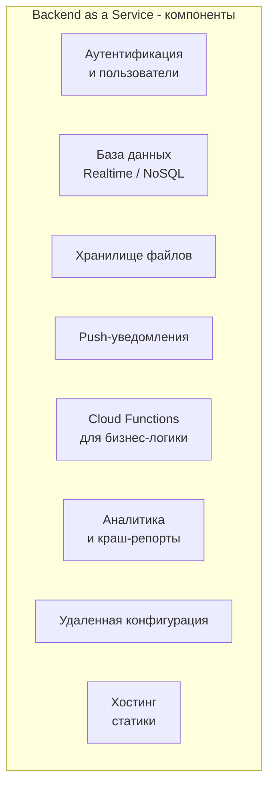
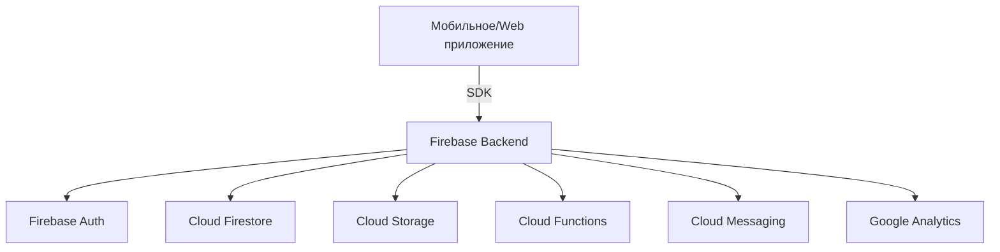
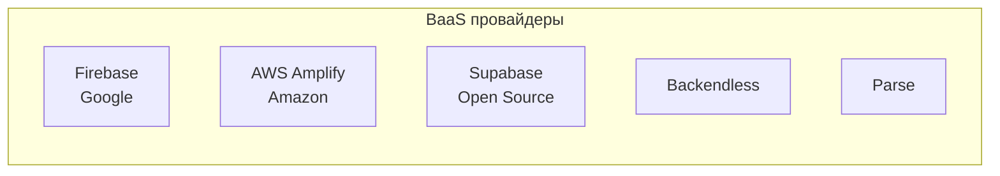
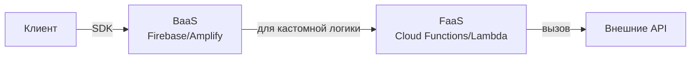

## Введение: Бэкенд как готовый конструктор

Если FaaS — это "вы пишете функции, а все остальное — провайдер", то BaaS (Backend as a Service) — это "вы вообще ничего не пишете, просто используете готовые сервисы".

Представьте, что вам нужно построить дом. Традиционный подход: вы сами заливаете фундамент, строите стены, проводите электричество, подключаете воду. FaaS: вы заказываете готовые блоки и собираете из них дом. BaaS: вы покупаете готовый дом с мебелью и просто въезжаете.

**Backend as a Service (BaaS)** — это модель облачных вычислений, где провайдер предоставляет готовые серверные компоненты, которые вы используете через API или SDK, не управляя инфраструктурой. Вы не пишете код для аутентификации, баз данных, хранения файлов, пуш-уведомлений — вы просто вызываете готовые сервисы.

Самый известный пример — Firebase от Google. Firebase дает: базу данных реального времени, аутентификацию (email/пароль, Google, Facebook, Apple), хранение файлов, функции, аналитику, push-уведомления. Разработчик мобильного приложения может вообще не писать бэкенд — все уже есть.

BaaS радикально ускоряет разработку, особенно для мобильных приложений и небольших проектов. Но плата за это — ограничения: вы используете только то, что предоставляет провайдер, и привязываетесь к его экосистеме.

## Что входит в BaaS

BaaS — это не один сервис, а целый набор готовых компонентов, которые закрывают типовые потребности бэкенда.



**Аутентификация и управление пользователями.** Готовый сервис для регистрации, входа, восстановления пароля. Поддерживает email/пароль, соцсети (Google, Facebook, Apple, GitHub), SSO, двухфакторную аутентификацию. Вызываете SDK — получаете пользователя.

**База данных.** Чаще всего NoSQL (Firebase Realtime Database, Firestore, AWS DynamoDB через Amplify). Данные синхронизируются в реальном времени между клиентами. Изменения в БД видны всем подключенным клиентам мгновенно.

**Хранилище файлов.** Загрузка и хранение изображений, видео, документов. Автоматическая обработка (thumbnail, оптимизация). CDN для быстрой доставки.

**Push-уведомления.** Отправка push на iOS (APNs) и Android (FCM) через единый API. Управление устройствами, сегментация пользователей.

**Cloud Functions.** Возможность добавить свою серверную логику (обычно на Node.js или Python) в экосистему BaaS. Вызываются по HTTP, из базы данных (триггеры), из аутентификации (при регистрации).

**Аналитика.** Готовые отчеты: активные пользователи (DAU/MAU), удержание, конверсии, краш-репорты, сессии.

**Удаленная конфигурация.** Изменять поведение приложения без обновления через магазин. A/B тестирование.

**Хостинг статики.** Размещение HTML, CSS, JS, React/Vue/Angular приложений с CDN и HTTPS.

## Как работает BaaS: Пример с Firebase

Вот как выглядит разработка приложения на Firebase (самый популярный BaaS).



**Шаг 1: Регистрация и настройка.** Создаете проект в Firebase Console. Добавляете приложение (iOS, Android, Web). Скачиваете конфигурационный файл (google-services.json, GoogleService-Info.plist).

**Шаг 2: Аутентификация.** Включаете нужные провайдеры (email/пароль, Google, Facebook). На клиенте вызываете:

```javascript
// Web SDK
const userCredential = await signInWithEmailAndPassword(auth, email, password);
console.log(userCredential.user.uid);
```

**Шаг 3: База данных.** Сохраняете и читаете данные без бэкенда:

```javascript
// Сохранение
await setDoc(doc(db, "users", userId), {
  name: "Иван",
  email: "ivan@example.com",
  createdAt: new Date()
});

// Чтение в реальном времени
onSnapshot(doc(db, "users", userId), (doc) => {
  console.log("Данные обновились:", doc.data());
});
```

**Шаг 4: Хранилище файлов.** Загружаете аватарку:

```javascript
const file = document.getElementById('avatar').files[0];
const storageRef = ref(storage, `avatars/${userId}`);
await uploadBytes(storageRef, file);
const url = await getDownloadURL(storageRef);
```

**Шаг 5: Cloud Functions.** Пишете серверную логику, которая реагирует на события:

```javascript
// Функция, запускаемая при создании пользователя
exports.sendWelcomeEmail = functions.auth.user().onCreate((user) => {
  // Отправить приветственное письмо через внешний API
  return sendEmail(user.email, "Добро пожаловать!");
});
```

**Весь бэкенд написан за пару часов.** Нет серверов, нет конфигурации, нет DevOps.

## BaaS vs традиционный бэкенд

| Аспект | Традиционный бэкенд | BaaS |
| :--- | :--- | :--- |
| Что нужно писать | Все: аутентификация, API, БД | Минимум: бизнес-логика (опционально) |
| Управление серверами | Да (или DevOps) | Нет |
| Масштабирование | Нужно настраивать | Автоматическое |
| База данных | Любая (PostgreSQL, MySQL) | Только предоставленная (обычно NoSQL) |
| Аутентификация | Пишете сами или библиотека | Готовая, с соцсетями |
| Push-уведомления | Нужно интегрировать APNs/FCM | Готовый API |
| Реальное время | Нужно реализовывать (WebSockets) | Из коробки |
| Цена | За серверы 24/7 | За использование (вызовы, хранение, трафик) |
| Скорость разработки | Недели-месяцы | Дни-недели |
| Vendor lock-in | Низкий | Высокий |

## Преимущества BaaS

### Скорость разработки

Это главное преимущество. Функции, которые занимают недели в традиционном бэкенде (аутентификация, база данных, push), в BaaS готовы сразу. Разработчик мобильного приложения может начать писать код через 10 минут после регистрации в Firebase.

### Нет управления инфраструктурой

BaaS полностью управляется провайдером. Не нужно настраивать серверы, базы данных, балансировщики, CDN. Не нужно обновлять ПО, настраивать репликацию, делать бэкапы. Все уже сделано.

### Автоматическое масштабирование

BaaS масштабируется автоматически от 0 до миллионов пользователей. Вы не думаете о capacity planning. Если приложение взлетело, база данных не ляжет. Платите только за реальное использование.

### Реальное время

Firebase Realtime Database и Firestore синхронизируют данные между клиентами в реальном времени. Изменение, сделанное одним пользователем, видно другим через миллисекунды. В традиционном бэкенде для этого нужно строить WebSocket сервер.

### Единая экосистема

Аутентификация, база данных, хранилище, функции, аналитика — все интегрировано. Пользователь, созданный в Auth, автоматически имеет ID, который можно использовать в базе данных. Функции триггерятся на события из других сервисов.

### Безопасность по умолчанию

BaaS предоставляет security rules — декларативный язык для описания, кто что может читать/писать. Например: "пользователь может читать только свой профиль" или "только авторизованные пользователи могут писать в коллекцию comments".

```
// Правила безопасности Firebase
rules_version = '2';
service cloud.firestore {
  match /databases/{database}/documents {
    match /users/{userId} {
      allow read, write: if request.auth.uid == userId;
    }
    match /public/posts/{postId} {
      allow read: if true;
      allow write: if request.auth != null;
    }
  }
}
```

## Недостатки и ограничения BaaS

### Vendor lock-in (привязка к провайдеру)

Это самый большой минус. Firebase — это не открытый стандарт. Перенести приложение с Firebase на другой BaaS или на свой бэкенд — это переписывание значительной части кода. Модели данных, API, правила безопасности — все уникально.

### Ограниченная модель данных

BaaS обычно предлагает NoSQL базы данных (документо-ориентированные). Это отлично для многих задач, но плохо для:
- Сложных запросов с несколькими JOIN
- Транзакций, затрагивающих много документов
- Агрегаций (группировки, суммы, средние)

Для аналитического отдела может потребоваться отдельный Data Warehouse.

### Нет ACID-транзакций в привычном смысле

Firebase поддерживает транзакции, но они ограничены. Нет multi-document ACID транзакций на уровне реляционных БД. Для финансовых систем это может быть проблемой.

### Сложность миграции данных

Когда данные накопились в BaaS, вырваться сложно. Нужно писать скрипты для экспорта, трансформации, импорта в новую систему. И пока вы мигрируете, приложение должно работать.

### Цена на больших объемах

BaaS дешев на старте (бесплатный тариф для небольших проектов). Но при росте цена может стать высокой. Firebase, например, берет за чтения/записи, за хранилище, за трафик. При большом количестве пользователей может быть дешевле арендовать сервер и написать свой бэкенд.

### Ограничения на серверную логику

Cloud Functions в BaaS обычно имеют ограничения (таймауты, память). Сложная бизнес-логика может не вписаться. Нет возможности использовать любые языки и библиотеки.

## BaaS и архитектура приложения

BaaS меняет способ мышления о приложении.

**Client-centric архитектура.** Традиционно клиент (мобильное приложение) — это "глупый" терминал, а вся логика на сервере. С BaaS клиент становится "умным": он сам пишет в базу данных, сам проверяет права через security rules. Это называется "client-first" или "serverless client".

**Security rules как основная защита.** Без бэкенда, который проверяет каждое действие, безопасность обеспечивается правилами. Они должны быть написаны правильно. Ошибка в правилах может привести к утечке данных.

**Синхронная и асинхронная работа.** BaaS хорошо поддерживает офлайн-режим. Клиент работает с локальной копией данных, изменения синхронизируются при подключении. Это требует другой ментальной модели, чем традиционный запрос-ответ.

## Популярные BaaS платформы

**Firebase (Google).** Самый популярный. Мощный, с большой экосистемой. Хорош для мобильных и веб-приложений. Но vendor lock-in высок, а цена на больших объемах может кусаться.

**AWS Amplify (Amazon).** Аналогичен Firebase, но в экосистеме AWS. Дает больше гибкости (можно смешивать с другими AWS сервисами). Сложнее в настройке.

**Supabase (Open Source).** Альтернатива Firebase, построенная на PostgreSQL. Дает реляционную базу данных, но с реальным временем через WebSockets. Меньше vendor lock-in (можно хостить самим). Быстро растет.

**Backendless.** Платформа с визуальным конструктором, базами данных, функциями. Меньше известна, но есть.

**Parse (Open Source, сейчас self-hosted).** Один из первых BaaS. Был куплен Facebook, закрыт, открыт как Open Source. Можно хостить у себя.



## Когда BaaS — правильный выбор

- **Мобильное приложение с нуля.** Вы хотите быстро запустить MVP, не тратя месяцы на бэкенд.
- **Маленькая команда без бэкенд-разработчиков.** У вас есть iOS/Android/Flutter/React разработчики, но нет серверных. BaaS позволяет им сделать все самим.
- **Прототип или хакатон.** Нужно работающее приложение за выходные.
- **Приложение с реальным временем.** Чат, совместное редактирование, live-табло. BaaS дает realtime из коробки.
- **Офлайн-синхронизация.** BaaS часто имеет встроенную поддержку офлайн-режима.
- **Небольшой или средний проект.** Пока вы не уперлись в ограничения BaaS.

## Когда BaaS НЕ подходит

- **Сложная бизнес-логика на сервере.** Если у вас много серверных вычислений, валидаций, интеграций с внешними системами, BaaS ограничивает.
- **Большой проект с миллионами пользователей.** Цена BaaS на таком масштабе может быть выше, чем свой бэкенд.
- **Строгие требования к консистентности.** Финансовые системы, инвентаризация с точным учетом. NoSQL и eventual consistency могут не подойти.
- **Сложные запросы и аналитика.** Если вам нужны JOIN, GROUP BY, сложные агрегации — BaaS не подходит.
- **Компания с существующей инфраструктурой.** Если у вас уже есть свой бэкенд на Java/Python/Go, BaaS будет чужеродным.
- **Требования к локализации данных (GDPR, ФЗ-152).** Некоторые BaaS хранят данные только в определенных регионах. Проверяйте.

## BaaS vs FaaS: в чем разница

И BaaS, и FaaS — формы serverless, но они решают разные задачи.

| Аспект | BaaS | FaaS |
| :--- | :--- | :--- |
| Что дает | Готовые серверные компоненты | Платформа для запуска своего кода |
| Код разработчика | Минимум (только правила и опционально функции) | Полная бизнес-логика |
| Гибкость | Низкая (что дали, то используете) | Высокая (пишете что хотите) |
| Скорость старта | Очень высокая (минуты) | Высокая (часы-дни) |
| Контроль | Низкий | Средний |
| Примеры | Firebase, Supabase, Amplify | AWS Lambda, Cloud Functions |

BaaS и FaaS хорошо сочетаются. В Firebase есть Cloud Functions (FaaS) для серверной логики. В AWS Amplify можно использовать Lambda (FaaS) для кастомных API.



## Реальные примеры использования BaaS

**Шаринговая поездка (аналог BlaBlaCar).** Мобильное приложение для поиска попутчиков. Используют Firebase: Auth (регистрация), Firestore (объявления о поездках, сообщения), Real-time Database (чат), Cloud Functions (расчет стоимости, отправка уведомлений). Команда из 2 разработчиков запустила MVP за 3 недели.

**Социальная сеть для фотографов.** React Native + Firebase. Пользователи загружают фото, ставят лайки, комментируют. Firestore для данных, Storage для фото, Cloud Functions для модерации (проверка фото на NSFW через внешнее API). 10 000 активных пользователей.

**Доска объявлений.** Flutter + Firebase. Бесплатный тариф до 50 000 объявлений. Потом перешли на свой бэкенд, когда выросли, но старт был быстрым.

## Резюме

Backend as a Service — это модель, где провайдер предоставляет готовые серверные компоненты (аутентификация, база данных, хранилище, push, аналитика), которые вы используете через SDK, не управляя инфраструктурой.

Преимущества BaaS:

- **Скорость разработки** — дни вместо недель
- **Нет управления серверами** — провайдер делает все
- **Автоматическое масштабирование** — от 0 до миллионов
- **Реальное время** — синхронизация данных между клиентами
- **Офлайн-режим** — встроенная поддержка
- **Безопасность по умолчанию** — security rules

Недостатки BaaS:

- **Vendor lock-in** — трудно уйти
- **Ограниченная модель данных** — обычно NoSQL, нет сложных JOIN
- **Ограниченные транзакции** — не ACID как в реляционных БД
- **Цена на больших объемах** — может быть выше своего бэкенда
- **Ограничения на серверную логику** — только через FaaS с ограничениями

BaaS — идеальный выбор для: мобильных приложений, стартапов, MVP, прототипов, приложений с реальным временем, маленьких команд без бэкенд-разработчиков.

BaaS не подходит для: систем со сложной бизнес-логикой, проектов с миллионами пользователей (по ценовым причинам), финансовых систем со строгой консистентностью, систем со сложными запросами.

Как и с другими архитектурными стилями, BaaS не обязан быть "все или ничего". Многие приложения используют BaaS для одних частей (аутентификация, push) и свой бэкенд для других (сложные вычисления). Это позволяет получить лучшее из двух миров: скорость разработки BaaS и гибкость своего кода.