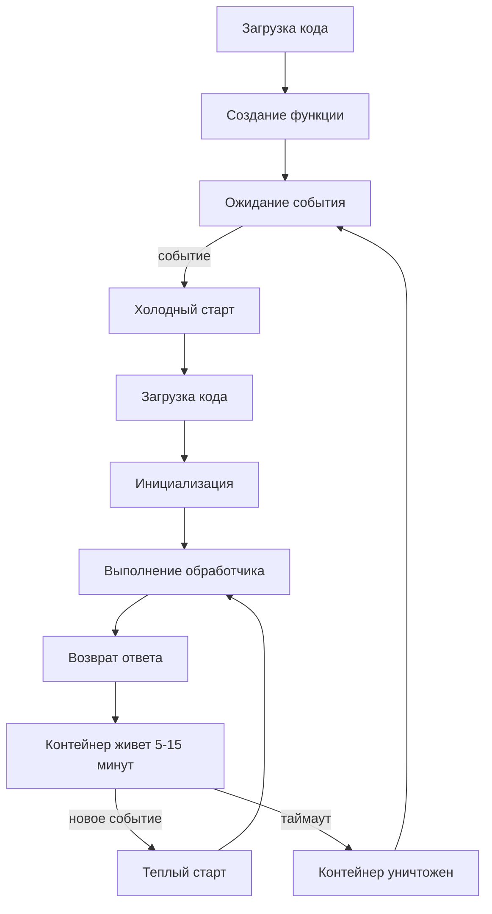
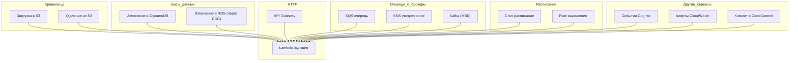
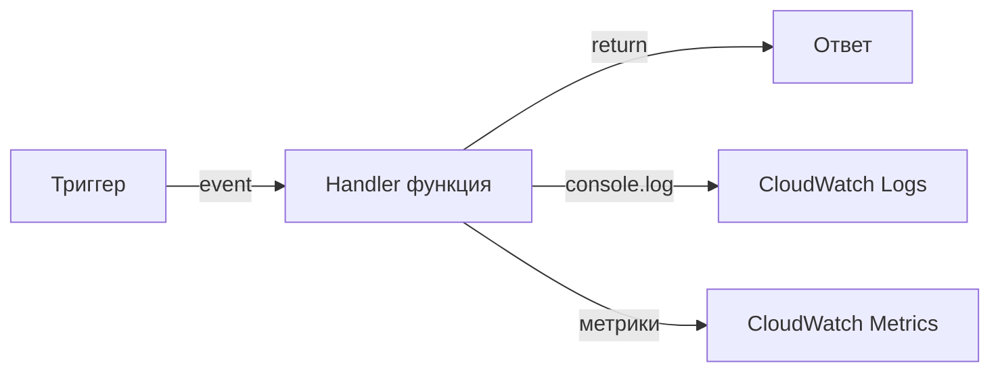
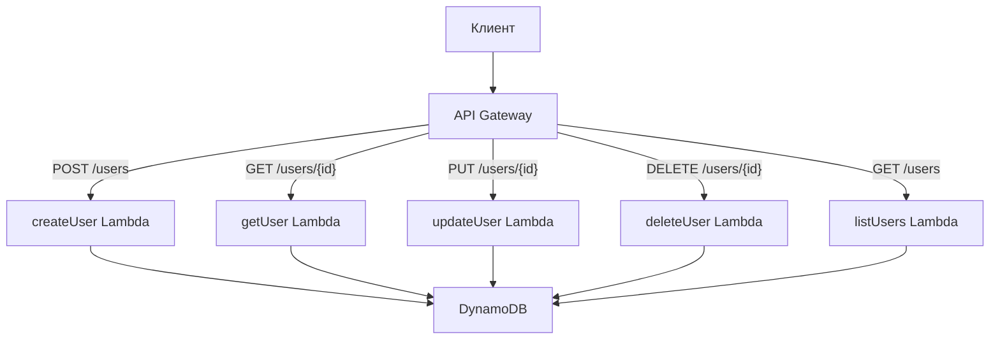

## Введение: Функция как единица развертывания

Если serverless — это "забудьте о серверах", то FaaS (Functions as a Service) — это "забудьте о серверах и забудьте о приложениях". Вы не развертываете монолит, не развертываете микросервис как процесс. Вы развертываете отдельные функции — маленькие кусочки кода, которые делают одну конкретную вещь.

Представьте, что вместо того чтобы арендовать цех с оборудованием (сервер) или даже арендовать станок (контейнер), вы просто приносите свою отвертку, когда она нужна, и платите только за минуты ее использования. Вам не нужно хранить отвертку, обслуживать ее, следить за тем, чтобы она не ржавела. Вы просто берете ее, делаете работу и возвращаете.

**Functions as a Service (FaaS)** — это модель облачных вычислений, где вы загружаете отдельные функции в облако, а провайдер запускает их в ответ на события, автоматически масштабирует и вы платите только за время выполнения. Самая популярная реализация — AWS Lambda, но есть также Google Cloud Functions, Azure Functions, Yandex Cloud Functions.

FaaS — это самая "чистая" форма serverless. Никаких серверов, никаких контейнеров (хотя внутри они, конечно, есть), никаких long-running процессов. Только функция, которая живет секунды или минуты, делает свою работу и исчезает.

## Что такое функция в контексте FaaS

В традиционной разработке "функция" — это единица кода внутри приложения. В FaaS "функция" — это единица развертывания. Она имеет четкую границу: входные данные (event), выходные данные (return value), ограниченное время жизни.

```python
# Пример функции на AWS Lambda (Python)
import json
import boto3

def handler(event, context):
    # event - входные данные (HTTP запрос, сообщение из очереди, событие из S3)
    # context - метаданные (время, memory limit, request id)
    
    body = json.loads(event.get('body', '{}'))
    name = body.get('name', 'World')
    
    # Здесь может быть любая логика
    # - вызовы других сервисов (HTTP, базы данных)
    # - вычисления
    # - работа с файлами
    
    return {
        'statusCode': 200,
        'headers': {'Content-Type': 'application/json'},
        'body': json.dumps({'message': f'Hello, {name}!'})
    }
```

Важные характеристики функции в FaaS:

**Она stateless.** Функция не должна хранить состояние между вызовами. Каждый вызов получает чистый контекст. Если нужно сохранить данные — используйте внешнее хранилище (DynamoDB, S3, Redis).

**Она имеет ограниченное время жизни.** Максимальное время выполнения — обычно 15-30 минут (зависит от провайдера). Функция не может работать вечно.

**Она имеет ограниченную память.** Обычно от 128 МБ до 10 ГБ. Вы выбираете количество памяти при конфигурации.

**Она вызывается событием.** Функция не запускается сама по себе. Она всегда реагирует на какое-то событие: HTTP-запрос, сообщение в очереди, загрузка файла, изменение в базе данных, срабатывание таймера.

## Жизненный цикл функции

Понимание жизненного цикла функции — ключ к эффективному использованию FaaS.



**Холодный старт** происходит, когда функция вызывается впервые после загрузки или после длительного простоя. Провайдер выделяет контейнер, загружает ваш код, инициализирует зависимости. Это занимает время: от 100 мс для легких функций на Python/Node.js до нескольких секунд для Java/.NET.

**Теплый старт** — когда контейнер уже существует и ждет вызовов. Время выполнения минимально: только время вашего обработчика.

**Продолжительность жизни контейнера** — после выполнения контейнер остается "теплым" на 5-15 минут (зависит от провайдера и нагрузки). Если в течение этого времени приходит новый вызов, он получает теплый старт. Если нет — контейнер уничтожается.

Для систем с низкой частотой вызовов холодные старты могут быть основной задержкой. Для высоконагруженных систем все вызовы будут теплыми.

## Триггеры: что может вызывать функцию

FaaS функции могут вызываться практически от чего угодно. Это делает их универсальным строительным блоком.



**HTTP через API Gateway.** Самый частый сценарий. Вы создаете REST API или WebSocket, и каждый запрос вызывает функцию. Полноценный бэкенд без серверов.

**Обработка файлов.** Пользователь загружает файл в S3. Функция запускается автоматически, обрабатывает файл (создает thumbnail, конвертирует формат, извлекает метаданные), сохраняет результат.

**Stream processing.** Данные из Kinesis или DynamoDB Streams порциями поступают в функцию. Функция обрабатывает каждую порцию.

**Асинхронная обработка очередей.** Сообщение попадает в SQS. Функция запускается, обрабатывает сообщение, удаляет из очереди. Идеально для фоновых задач.

**Запланированные задачи.** Функция запускается по cron расписанию: каждый час, каждый день в 3 утра. Заменяет cron на серверах.

**Ответ на события инфраструктуры.** Создали новый EC2 инстанс? Функция запустилась, настроила его. Упал CloudWatch алерт? Функция отправила SMS.

## Модель программирования

У каждого провайдера свой API, но общая модель похожа.

**Входные данные (event).** Структура, содержащая все данные о событии. Для HTTP-запроса — метод, заголовки, тело, параметры. Для S3 — имя бакета, ключ файла, тип события. Для SQS — массив сообщений.

**Контекст (context).** Метаданные о вызове: уникальный ID запроса, оставшееся время выполнения, memory limit, имя функции.

**Обработчик (handler).** Функция, которая принимает event и context и возвращает результат (синхронно или асинхронно).

**Логирование.** Все, что пишется в stdout/stderr, попадает в CloudWatch Logs (или аналоги). Структурированное логирование (JSON) очень помогает.



## Пример: Полноценный API на FaaS

Вот как выглядит простой CRUD API для управления пользователями на AWS Lambda + API Gateway + DynamoDB.



Каждая функция — отдельный кусочек кода, 20-100 строк. Их легко писать, тестировать, развертывать. Масштабирование происходит автоматически: при 1000 запросов в секунду Lambda запустит 1000 экземпляров функции. DynamoDB тоже масштабируется автоматически (если включен on-demand mode).

## FaaS vs контейнеры vs виртуальные машины

| Аспект | Виртуальные машины | Контейнеры (K8s) | FaaS |
| :--- | :--- | :--- | :--- |
| Единица развертывания | Образ ОС | Docker образ | Код функции |
| Время жизни | Дни/месяцы | Дни/часы | Секунды/минуты |
| Масштабирование | Минуты | Секунды | Миллисекунды (теплые) |
| Плата | За время работы (24/7) | За время работы (24/7) | За вызовы + время |
| Stateful/Stateless | Обычно stateful | Может быть stateful | Stateless |
| Холодный старт | Нет | Нет | Да (100 мс - 5 с) |
| Управление | Полное (ОС) | Частичное (ОС не нужно) | Минимальное |

## Ключевые концепции для работы с FaaS

### Идемпотентность

FaaS функции могут вызываться несколько раз с одним и тем же событием. Причины: ретраи при ошибках, дублирование сообщений в очередях, повторные попытки API Gateway.

Функция должна быть идемпотентной: повторный вызов с теми же входными данными не должен иметь побочных эффектов.

```python
# НЕ идемпотентно
def handler(event, context):
    user_id = event['user_id']
    # Каждый вызов добавит новую запись
    database.insert('processed_users', user_id)
    return 'OK'

# Идемпотентно
def handler(event, context):
    user_id = event['user_id']
    # Добавляем только если еще нет
    database.insert_if_not_exists('processed_users', user_id)
    return 'OK'
```

### Работа с соединениями

Создание соединений (к базе данных, к HTTP клиенту) должно происходить вне обработчика, в глобальной области функции. Тогда соединение переиспользуется между вызовами в одном контейнере.

```python
# Плохо: соединение создается при каждом вызове
def handler(event, context):
    conn = psycopg2.connect(...)  # Медленно!
    conn.execute(...)

# Хорошо: соединение создается один раз на контейнер
conn = None

def handler(event, context):
    global conn
    if conn is None:
        conn = psycopg2.connect(...)  # Только при холодном старте
    conn.execute(...)
```

### Управление памятью

Вы выбираете память для функции (например, 512 МБ, 1024 МБ, 3008 МБ). Провайдер выделяет пропорционально CPU: чем больше памяти, тем мощнее CPU. Правило: для CPU-интенсивных задач нужно больше памяти (чтобы получить более мощный CPU).

### Таймауты

Установите таймаут, соответствующий вашей задаче. Если функция может работать 30 секунд, не ставьте таймаут 5 секунд (функция будет обрезана). Но и не ставьте 15 минут, если функция всегда выполняется за 100 мс (слишком большой таймаут скрывает проблемы).

### Dead Letter Queue (DLQ)

Если функция постоянно падает или не успевает обработать сообщение, неплохо настроить DLQ — очередь, куда попадают "битые" сообщения для ручного анализа.

## Сложности FaaS на практике

**Холодные старты для Java и .NET.** Java-функции страдают от длительных холодных стартов (2-5 секунд). Для пользовательских API это критично. Решения: использовать Python/Node.js/Go, держать функции теплыми через периодические вызовы, увеличить память (больше памяти → быстрее старт).

**Ограничение на количество одновременных выполнений.** У каждого провайдера есть лимит на concurrent executions (обычно 1000 по умолчанию, можно увеличить). При резком всплеске выше лимита вызовы будут throttled.

**Сложность локального тестирования.** Локально можно запустить функцию (через SAM CLI или Serverless Framework), но полноценно протестировать триггеры (S3, SQS, API Gateway) сложно. Нужны интеграционные тесты в облаке.

**Проблемы с идемпотентностью и дублями.** Даже при идемпотентной функции дубликаты могут создавать лишнюю нагрузку. Нужно проектировать с учетом возможности дублей.

**Vendor lock-in.** API Lambda, Cloud Functions, Azure Functions различаются. Перенос между провайдерами требует переписывания кода и конфигурации.

## Примеры успешного использования FaaS

**Обработка изображений.** Пользователи загружают фото в S3. Lambda создает thumbnail, оптимизирует размер, извлекает EXIF данные. Работает отлично: нагрузка неравномерная, время обработки секунды.

**Чат-боты.** Вебхук от Telegram/Viber/WhatsApp приходит на API Gateway, Lambda обрабатывает сообщение, вызывает внешние API, отправляет ответ. Просто, дешево, масштабируется.

**ETL pipelines.** Каждый час Lambda запускается, читает новые данные из S3, трансформирует, сохраняет в Redshift. Для средних объемов (не терабайт) — идеально.

**Backend для мобильных приложений.** API Gateway + Lambda + DynamoDB. Полноценный бэкенд без управления серверами. Подходит для тысяч и миллионов пользователей.

**Вебхуки для SaaS.** Ваш сервис предоставляет вебхуки клиентам. Lambda обрабатывает входящие вебхуки, валидирует, сохраняет.

## Когда FaaS — отличный выбор

- **Неравномерная нагрузка.** От 0 до 1000 запросов в секунду и обратно. FaaS экономит деньги.
- **Короткие задачи.** Время выполнения от миллисекунд до минут. Не часов.
- **Stateless обработка.** Каждый запрос независим.
- **Маленькая команда.** Нет DevOps, нет времени на управление серверами.
- **Событийно-ориентированная архитектура.** Много триггеров из разных источников.

## Когда FaaS НЕ подходит

- **Постоянная высокая нагрузка.** 1000 запросов/сек 24/7. Свой сервер обойдется дешевле.
- **Долгие задачи.** Обработка видео, обучение моделей, генерация больших отчетов (дольше 15 минут).
- **Stateful приложения.** WebSocket соединения с сохранением состояния, long-polling.
- **Низкие задержки (единицы миллисекунд).** Холодные старты добавят десятки-сотни миллисекунд.
- **Тяжелые зависимости.** Размер кода > 250 МБ или библиотеки, требующие специфических native расширений.

## Резюме

Functions as a Service — это модель, где вы развертываете отдельные функции, которые запускаются в ответ на события. Провайдер управляет всем остальным: серверами, контейнерами, масштабированием.

Ключевые характеристики FaaS:

- **Stateless** — функция не хранит состояние между вызовами
- **Событийно-управляемая** — запускается только в ответ на событие
- **Автоматическое масштабирование** — от 0 до тысяч параллельных выполнений
- **Плата за использование** — за количество вызовов и время выполнения
- **Ограниченное время жизни** — обычно до 15-30 минут

Главные плюсы: нет управления серверами, масштабируется автоматически, дешево при неравномерной нагрузке.

Главные минусы: холодные старты (особенно на Java/.NET), ограничения по времени и памяти, сложность локальной отладки, vendor lock-in.

FaaS — идеальный инструмент для задач с неравномерной нагрузкой, коротких операций, событийно-ориентированных систем. Он не подходит для постоянной высокой нагрузки, долгих операций и приложений с жесткими требованиями к задержкам.

FaaS — не замена контейнерам и виртуальным машинам, а дополнение. Используйте функции там, где они сильны, и не пытайтесь впихнуть в них то, для чего они не предназначены. В гибридной архитектуре можно сочетать: традиционные серверы для тяжелых задач, контейнеры для микросервисов со средней нагрузкой, функции для вспомогательных, эпизодических задач.