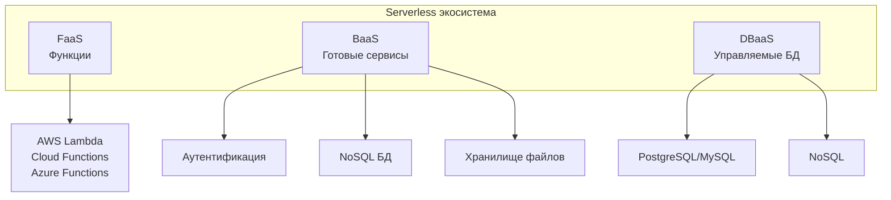
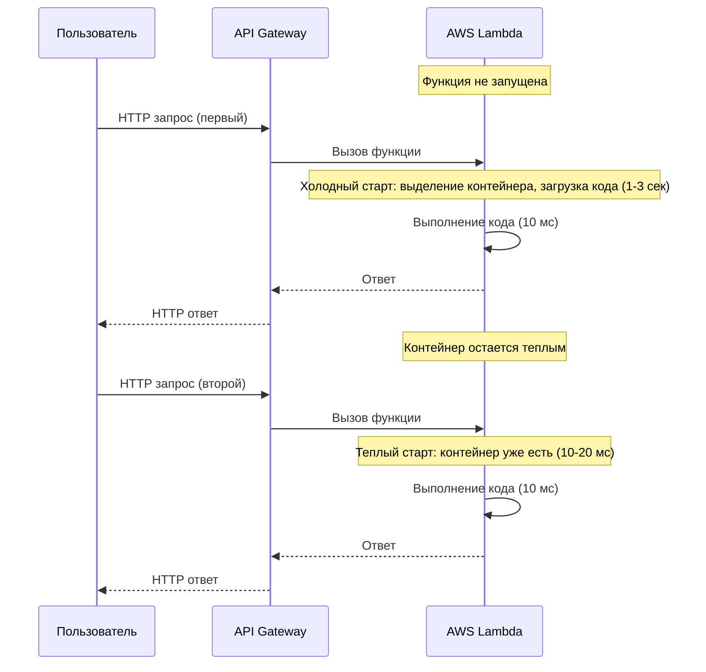
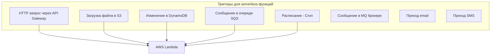
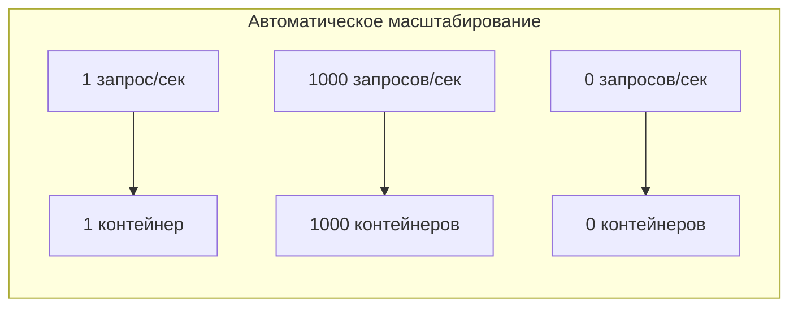
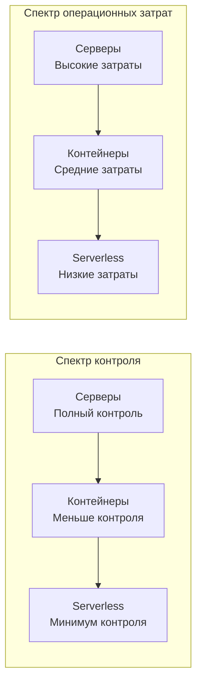

## Введение: Забудьте о серверах

Представьте, что вам нужно арендовать офис для компании. Традиционный подход: вы арендуете помещение, платите за аренду каждый месяц, независимо от того, сколько сотрудников там работает. Если сотрудников стало больше — ищете офис побольше. Если меньше — офис все равно стоит. Вы платите за "пустое место" в выходные и праздники.

А теперь другой подход: вы приходите в коворкинг и платите только за то время, которое реально проводите за столом. Пришли на час — заплатили за час. Ушли — не платите. Причем стол всегда есть, когда он вам нужен. И если вам нужно одновременно 50 столов — коворкинг может предоставить их на время презентации, а потом они снова исчезнут.

**Serverless (бессерверные вычисления)** — это подход, при котором вы пишете код, а облачный провайдер берет на себя все вопросы управления серверами. Вы не арендуете сервер, не настраиваете операционную систему, не думаете о масштабировании. Вы просто загружаете код, указываете, при каких условиях он должен выполняться (по HTTP-запросу, по событию из очереди, по расписанию), и платите только за фактическое время выполнения кода и количество вызовов.

Название "serverless" обманчиво. Серверы, конечно, есть. Но вы о них не думаете. Провайдер (Amazon AWS, Google Cloud, Microsoft Azure, Yandex Cloud) управляет серверами за вас. Ваша задача — только бизнес-логика.

Serverless радикально меняет экономику и операционную модель разработки. Вы перестаете платить за простаивающие серверы. Вы перестаете нанимать DevOps-инженеров для управления инфраструктурой. Но платите за это ограничениями: функции не могут выполняться дольше определенного времени (обычно 15-30 минут), имеют ограничения по памяти (обычно 512 МБ - 10 ГБ), "холодный старт" может добавлять задержки.

## Что скрывается за названием "Serverless"

Serverless — это не одна технология, а целая экосистема сервисов. Обычно говорят о трех основных категориях:

**Functions as a Service (FaaS)** — самый известный вид serverless. Вы пишете небольшую функцию (например, на Python, Node.js, Go, Java). Она выполняется в ответ на событие: HTTP-запрос, сообщение из очереди, загрузка файла в S3, изменение записи в базе данных. Когда вызовов нет — функция не запущена и не потребляет ресурсы. AWS Lambda, Google Cloud Functions, Azure Functions, Yandex Cloud Functions.

**Backend as a Service (BaaS)** — готовые серверные компоненты, которыми вы пользуетесь как услугой. Вам не нужно развертывать свой сервер аутентификации, свою базу данных, свою систему хранения файлов. Вы просто используете готовые сервисы: Firebase Authentication, Auth0, AWS Cognito (для пользователей); AWS DynamoDB, Firebase Realtime Database (для баз данных); AWS S3, Google Cloud Storage (для файлов).

**Database as a Service (DBaaS)** — управляемые базы данных. Вы не устанавливаете PostgreSQL на сервер, не настраиваете репликацию, не делаете бэкапы. Вы просто создаете инстанс базы данных в облаке, и провайдер всем управляет. Это "серверный" сервис, но его часто включают в экосистему serverless, потому что он не требует управления серверами. AWS RDS, Google Cloud SQL, Azure SQL Database.



## Как работает FaaS (Functions as a Service)

Это самое интересное в serverless. Давайте разберем, как работает AWS Lambda (аналогично у других провайдеров).

**Шаг 1: Вы пишете функцию.** Вы создаете файл с кодом. Например, функция на Python, которая обрабатывает HTTP-запрос.

```python
def handler(event, context):
    name = event.get('name', 'World')
    return {
        'statusCode': 200,
        'body': f'Hello, {name}!'
    }
```

**Шаг 2: Вы загружаете функцию в облако.** Вы упаковываете код (вместе с зависимостями) и загружаете в AWS Lambda. Указываете триггер — например, HTTP-запрос через API Gateway.

**Шаг 3: Провайдер хранит код и ждет вызовов.** Ваша функция не запущена. Она просто хранится в готовности.

**Шаг 4: Приходит первый запрос.** Провайдер выделяет контейнер, загружает туда вашу функцию, выполняет обработчик, возвращает ответ. Контейнер остается живым на некоторое время (обычно 5-15 минут) на случай новых запросов. Это называется "теплый старт" — ответ быстрый.

**Шаг 5: Нет запросов — нет контейнера.** Если в течение некоторого времени нет вызовов, контейнер уничтожается. Ресурсы освобождаются.



**Холодный старт** — это плата за serverless. Если функция вызывается редко, каждый раз происходит холодный старт, который может занимать от нескольких сотен миллисекунд до нескольких секунд. Для пользовательских запросов это может быть заметно.

## Триггеры: что запускает serverless-функции

Serverless-функции могут запускаться от множества событий. Это делает их универсальным инструментом.



Примеры использования разных триггеров:

- **HTTP запрос.** API Gateway принимает запрос, вызывает Lambda, возвращает ответ. Полноценный бэкенд без управления серверами.

- **Загрузка файла.** Пользователь загружает изображение в S3. Lambda автоматически запускается, создает thumbnail, сохраняет его обратно. Без серверов.

- **Изменение базы данных.** В DynamoDB изменилась запись. Lambda запускается, чтобы обновить поисковый индекс или отправить уведомление.

- **Очередь сообщений.** В SQS пришло сообщение. Lambda запускается, обрабатывает, удаляет сообщение. Очередь как буфер.

- **Расписание.** Каждый час по cron Lambda запускается, чтобы сгенерировать отчет или очистить устаревшие данные.

## Преимущества serverless

### Нет управления серверами

Самое очевидное преимущество. Вы не настраиваете Linux, не обновляете пакеты, не мониторите CPU, не думаете о дисковом пространстве, не настраиваете балансировщики. Провайдер делает все это за вас. Ваша команда может состоять только из разработчиков, без DevOps-инженеров.

### Автоматическое масштабирование

Когда на вашу функцию приходит 1 запрос в секунду — работает один контейнер. Когда приходит 1000 запросов в секунду — провайдер автоматически запускает 1000 контейнеров (с учетом ограничений аккаунта). Вам не нужно настраивать auto-scaling, не нужно думать о capacity planning. Система масштабируется мгновенно (в пределах секунд) до огромных нагрузок.



### Платите только за использование

Это революционная экономическая модель. Вы не платите за простаивающие серверы. Платите только за:

- **Количество вызовов.** Обычно первые 1-2 миллиона вызовов в месяц бесплатно, потом доли цента за миллион.
- **Время выполнения.** В гигабайт-секундах (память × время). Чем больше памяти выделено функции, тем дороже секунда.
- **Исходящий трафик.** Как и у обычных серверов.

Пример: функция на 512 МБ памяти, выполняющаяся 100 мс, обрабатывающая 1 миллион запросов в месяц, может стоить меньше доллара. Это на порядки дешевле, чем круглосуточно работающий сервер.

### Быстрая разработка и деплой

Вы пишете функцию, загружаете ее (обычно через CLI или CI/CD), и она готова к работе. Нет конфигурации серверов, нет Dockerfile, нет Kubernetes манифестов. Деплой занимает секунды или минуты.

### Идеально для событийно-ориентированных систем

Serverless и EDA — идеальная пара. События из очередей, брокеров, баз данных, хранилищ могут напрямую запускать функции. Это естественная, слабо связанная архитектура.

## Недостатки и ограничения serverless

### Холодные старты

Это главная боль serverless. Если функция вызывается редко, при каждом вызове происходит холодный старт — выделение контейнера, загрузка кода, инициализация. Для языков с быстрым стартом (Node.js, Python) это 100-500 мс. Для Java или .NET — 1-5 секунд.

Для пользовательских API холодные старты могут быть заметны. Решения: keep-warm пинги (периодические вызовы, чтобы держать функцию теплой), выбор языка с быстрым стартом, перепроектирование так, чтобы холодный старт происходил редко.

### Ограничения по времени и ресурсам

Serverless-функции не предназначены для долгих операций. Максимальное время выполнения:

- AWS Lambda: 15 минут
- Google Cloud Functions: 60 минут (для некоторых типов)
- Azure Functions: 10 минут (можно увеличить до 60)

Максимальная память:

- AWS Lambda: 10 ГБ
- Google Cloud Functions: 8 ГБ
- Azure Functions: 14 ГБ

Если ваша задача требует большего — serverless не подходит. Долгие ETL-процессы, сложные вычисления, обработка больших файлов — лучше делать на обычных серверах.

### Ограничения на зависимости и размер пакета

У вас есть лимит на размер загружаемого кода (обычно 50-250 МБ после распаковки). Если ваша функция использует тяжелые библиотеки (например, машинное обучение с PyTorch), вы можете не уложиться в лимит.

### Сложность локальной разработки и отладки

Вы можете запускать функции локально (например, AWS SAM, Serverless Framework), но полная экосистема (API Gateway, S3 триггеры, очереди) не воспроизводится полностью. Отладка распределенных serverless-приложений сложнее, чем отладка монолита.

### Привязка к вендору (Vendor lock-in)

Serverless-функции — это не стандарт. AWS Lambda, Google Cloud Functions, Azure Functions — все они имеют разные API, разные модели ограничений, разные способы конфигурации. Перейти с AWS на Google будет трудно. Есть абстракции (например, Serverless Framework, Terraform), но они скрывают не все различия.

### Сложные распределенные транзакции

Serverless часто сочетается с микросервисами и EDA. Это значит, что распределенные транзакции (Saga) становятся еще сложнее. Функции могут выполняться недолго и иметь идемпотентность, но координация остается сложной.

### Проблемы с холодными стартами для баз данных

Если функция создает новое соединение с базой данных при каждом вызове (особенно при холодном старте), это может создавать большую нагрузку на БД. Нужно пулить соединения вне обработчика (в глобальной области функции), чтобы они переиспользовались между вызовами.

## Serverless vs традиционные серверы vs контейнеры

| Аспект | Традиционные серверы | Контейнеры (Kubernetes) | Serverless (FaaS) |
| :--- | :--- | :--- | :--- |
| Управление серверами | Вы сами | Вы сами (или managed K8s) | Провайдер |
| Масштабирование | Ручное или авто, но медленно | Авто (HPA), секунды-минуты | Авто, мгновенно (в пределах секунд) |
| Плата | За сервер 24/7 | За серверы 24/7 | За вызовы + время выполнения |
| Холодные старты | Нет | Нет (контейнеры всегда работают) | Да |
| Максимальное время | Неограниченно | Неограниченно | 15-60 минут |
| Управление зависимостями | Через образ ОС | Через Dockerfile | Через пакеты функции |
| Сложность | Высокая | Очень высокая | Низкая (для простых задач) |
| Vendor lock-in | Низкий | Низкий (K8s везде) | Высокий |



## Реальные примеры использования serverless

### Обработка загруженных файлов

Пользователь загружает фото. API Gateway принимает запрос, Lambda сохраняет фото в S3, Lambda генерирует thumbnail, сохраняет его, обновляет запись в DynamoDB. Все это без единого сервера.

### Чат-боты и вебхуки

Telegram бот. Вебхук от Telegram приходит на API Gateway, Lambda обрабатывает сообщение, вызывает Telegram API. Просто, дешево, масштабируется до миллионов сообщений.

### ETL и обработка данных

Каждый час запускается Lambda по расписанию, читает новые записи из S3, трансформирует, записывает в Redshift. Если данных много — Lambda не подойдет (15 минут ограничение), но для средних объемов — отлично.

### Backend для мобильного приложения

Мобильное приложение вызывает API Gateway, тот запускает Lambda, которая работает с DynamoDB. Полноценный бэкенд без управления серверами. Тысячи приложений так и работают.

### Обработка событий IoT

Устройства IoT отправляют телеметрию в облако. Каждое сообщение запускает Lambda, которая анализирует данные, сохраняет в базу, отправляет алерты. Масштабируется до миллионов устройств.

## Когда serverless — правильный выбор

- **Неравномерная нагрузка.** Если ваша система имеет пики и простои (например, внутренние инструменты, чат-боты, обработка файлов), serverless экономит деньги.

- **Маленькая команда без DevOps.** Если у вас 2-3 разработчика и нет возможности нанимать DevOps, serverless позволяет запустить систему без управления серверами.

- **Событийно-ориентированные системы.** Если ваша архитектура построена на событиях (очереди, брокеры, S3), serverless — естественный выбор.

- **Микросервисы с низкой нагрузкой.** Много маленьких сервисов, каждый из которых вызывается нечасто. Держать для каждого сервер дорого. Serverless — дешево.

- **Прототипирование и MVP.** Быстро проверить гипотезу, не тратя время на инфраструктуру.

## Когда serverless НЕ подходит

- **Высоконагруженные системы с постоянной нагрузкой.** Если у вас 1000 запросов в секунду 24/7, держать сервер дешевле, чем платить за миллиарды вызовов Lambda.

- **Долгие операции.** Если функция работает больше 15 минут — serverless не подходит.

- **Требования к низкой задержке.** Если холодный старт (даже 200 мс) неприемлем, serverless не подходит.

- **Сложные распределенные транзакции.** Координация нескольких функций с гарантиями консистентности сложна.

- **Тяжелые вычисления (ML, видеообработка).** Требуют много ресурсов и времени, не вписываются в лимиты.

- **Приложения с состоянием.** Serverless функции stateless (хотя могут использовать внешнее хранилище). Если вашему приложению нужно хранить состояние в памяти между вызовами — serverless не подходит.

## Serverless и архитектура: что нужно знать

Serverless меняет способ мышления о системе. Вот ключевые концепции:

**Stateless функции.** Функции не должны хранить состояние между вызовами. Любое состояние — во внешних сервисах (DynamoDB, S3, Redis). Если функция упала и перезапустилась, состояние не теряется.

**Идемпотентность.** Одна и та же функция может быть вызвана несколько раз (из-за ретраев, дублей событий). Она должна давать одинаковый результат при повторных вызовах.

**Разделение на маленькие функции.** Одна функция — одна ответственность. Не пишите монолитную функцию на 10 000 строк. Разбивайте.

**Инфраструктура как код.** Настройки функций (память, таймаут, триггеры) должны быть описаны в коде (Terraform, CloudFormation, Serverless Framework). Не настраивайте вручную через веб-консоль.

## Резюме

Serverless — это подход, при котором вы пишете код, а облачный провайдер управляет серверами. Вы платите только за фактическое использование (вызовы × время выполнения) и не платите за простой.

Ключевые компоненты serverless экосистемы:

- **FaaS (Functions as a Service)** — выполнение кода в ответ на события
- **BaaS (Backend as a Service)** — готовые сервисы (аутентификация, базы данных, хранилища)
- **DBaaS (Database as a Service)** — управляемые базы данных

Преимущества serverless:

- Нет управления серверами
- Автоматическое масштабирование от 0 до бесконечности
- Плата только за использование (экономия на простоях)
- Быстрая разработка и деплой

Недостатки и ограничения:

- Холодные старты (задержка при редких вызовах)
- Ограничения по времени (15-60 минут) и памяти (до 10 ГБ)
- Vendor lock-in (привязка к облачному провайдеру)
- Сложность локальной отладки
- Не подходит для долгих операций и высоких постоянных нагрузок

Serverless — отличный выбор для: систем с неравномерной нагрузкой, маленьких команд без DevOps, событийно-ориентированных архитектур, прототипов и MVP.

Serverless — плохой выбор для: высоконагруженных 24/7 систем, долгих операций, приложений с требованиями к низкой задержке, тяжелых вычислений.

Как и с другими архитектурными стилями, serverless — это не "все или ничего". Можно построить гибридную систему: ядро на традиционных серверах (для высоких постоянных нагрузок), а вспомогательные функции (обработка изображений, отправка email, ночные задачи) — на serverless. Используйте сильные стороны каждого подхода.