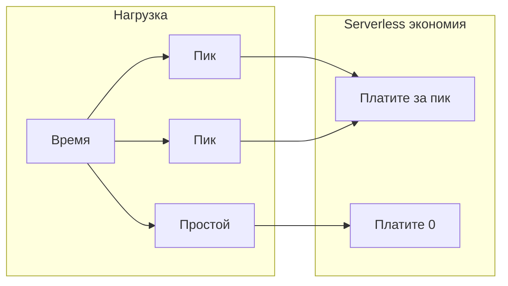
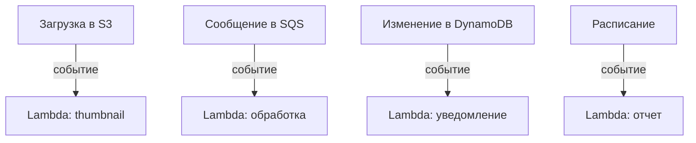
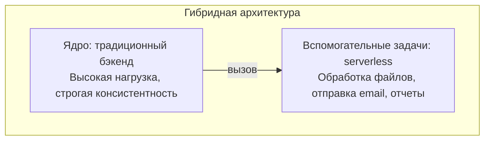
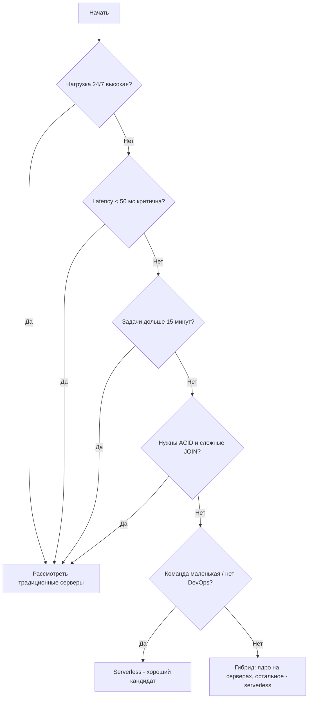

## Введение: Не панацея, а инструмент

Serverless часто продают как "серебряную пулю" — решение всех проблем. Не нужно управлять серверами, масштабируется само, платите только за использование. Звучит как мечта.

Но как и любой инструмент, serverless хорош для одних задач и плох для других. Выбор serverless — это компромисс между скоростью разработки, операционной простотой и контролем. Для маленького стартапа serverless может быть идеален. Для крупного банка с тысячами транзакций в секунду и строгими требованиями к задержкам — катастрофой.

Перед выбором serverless нужно честно ответить на вопросы: "Какая у нас нагрузка?", "Какие требования к задержкам?", "Какой у команды опыт?", "Готовы ли мы к vendor lock-in?". Ответы на эти вопросы определят, подходит ли вам serverless.

## Когда serverless — отличный выбор

### Неравномерная нагрузка (bursty traffic)

Это самый сильный кейс для serverless. Если ваша система имеет пики и простои, serverless экономит деньги.

Примеры:

- **Внутренние инструменты.** Отчет для бухгалтерии, который запускают 2 раза в день. Остальное время система простаивает. На сервере вы платите 24/7. На serverless — только 30 минут в день.
- **Обработка файлов.** Пользователи загружают фото, вы генерируете thumbnail. В будни днем — 100 загрузок в час. Ночью — 0. Выходные — 500. Serverless масштабируется под нагрузку и не тратит ресурсы в простое.
- **Чат-боты.** Вебхуки приходят от Telegram/Viber. Нагрузка неравномерная: иногда 10 сообщений в минуту, иногда 0. Serverless идеален.
- **Вебхуки от внешних систем.** Ваш сервис получает вебхуки от партнеров. Они могут прийти в любой момент, но в среднем редко. Держать сервер ради редких вызовов дорого.

**Признак:** Ваш график нагрузки похож на "зубья пилы" — есть пики и длинные периоды почти нулевой активности.

### Маленькая команда без DevOps

Если у вас 2-5 разработчиков и нет возможности нанимать DevOps-инженера, serverless позволяет запустить систему без управления серверами.

Вы не настраиваете Kubernetes, не обновляете Linux, не настраиваете балансировщики, не делаете бэкапы баз данных (BaaS делает за вас). Ваша команда может сфокусироваться на бизнес-логике, а не на инфраструктуре.

**Признак:** В команде нет человека, который умеет настраивать серверы, контейнеры, оркестрацию. И нет бюджета на найм такого человека.

### Прототипирование и MVP

Вам нужно быстро проверить гипотезу, показать продукт инвесторам, запустить бета-тест. Serverless позволяет сделать это за дни, а не за недели.

Firebase + Cloud Functions — и у вас есть аутентификация, база данных, API, аналитика. Если гипотеза не подтвердится, вы не потратили месяцы на бэкенд. Если подтвердится — можно будет переписать на что-то более подходящее.

**Признак:** У вас нет готового продукта. Вы проверяете, нужно ли это кому-то вообще. Скорость важнее всего, архитектурное совершенство — не важно.

### Событийно-ориентированные и асинхронные системы

Serverless и EDA — идеальная пара. События из очередей, брокеров, баз данных, хранилищ могут напрямую запускать функции.

**Признак:** Ваша архитектура естественно событийная. Много фоновых задач, асинхронной обработки, интеграций через очереди.

### Обработка медиафайлов (изображения, видео)

Пользователи загружают изображения, видео, документы. Нужно создать thumbnail, оптимизировать размер, извлечь метаданные, конвертировать формат.

Serverless отлично подходит: загрузка файла в S3 запускает Lambda, Lambda обрабатывает файл (обычно несколько секунд), сохраняет результат. Масштабируется автоматически под количество загрузок.

**Признак:** Ваше приложение работает с файлами. Время обработки одного файла — секунды или десятки секунд.

### API с низкой ожидаемой нагрузкой

Внутреннее API для нескольких клиентов. Админка для 10 менеджеров. API для партнера, который делает 100 запросов в день.

Держать сервер 24/7 для 100 запросов в день — дорого. Serverless позволит платить копейки.

**Признак:** Ожидаемая нагрузка на API — менее 1 запроса в секунду в среднем. Пики редкие.

### Запланированные задачи (cron jobs)

Каждый час нужно генерировать отчет. Каждую ночь — очищать устаревшие данные. Раз в неделю — отправлять дайджест.

Вместо того чтобы держать сервер с cron, вы создаете функцию, которая запускается по расписанию. Serverless запускает ее, выполняет, останавливает. Платите только за время выполнения.

**Признак:** У вас есть периодические задачи, которые не требуют круглосуточного сервера.

### Команда уже использует managed-сервисы

Если вы уже используете AWS (или Google Cloud, или Azure), добавление serverless — естественный шаг. Вы не создаете нового вендора, не учитесь новой консоли. Lambda (или Cloud Functions) интегрируется с вашими существующими сервисами.

**Признак:** Ваша инфраструктура уже в облаке. Команда знает экосистему.

## Когда serverless — плохой выбор

### Постоянная высокая нагрузка 24/7

Если у вас 1000 запросов в секунду круглосуточно, serverless обойдется дороже, чем свой сервер (или даже Kubernetes).

Почему: serverless тарифицируется за вызовы и время. При постоянной высокой нагрузке вы платите за миллиарды вызовов и за миллионы гигабайт-секунд. Аренда выделенных серверов или reserved instances в EC2 будет значительно дешевле.

**Признак:** Ваш график нагрузки — это прямая линия на 24/7. Нет выраженных пиков и простоев.

### Требования к низкой задержке (single-digit milliseconds)

Serverless функции имеют холодные старты (100 мс - 5 секунд). Даже теплые вызовы добавляют накладные расходы (10-50 мс поверх времени вашей функции).

Если ваш API должен отвечать за 10 мс (включая все: сеть, базу данных, бизнес-логику), serverless не подходит. Нужен выделенный сервер с предзагруженным приложением.

**Признак:** Требования к latency — менее 50 мс (или даже 20 мс). Холодный старт неприемлем.

### Долгие операции (minutes to hours)

Serverless функции имеют ограничение по времени: обычно 15-30 минут (зависит от провайдера). Если ваша задача требует часа или нескольких часов — serverless не подходит.

Примеры: обработка больших видео, обучение ML моделей, сложные ETL процессы над терабайтами данных.

**Признак:** Время выполнения вашей задачи — больше 15 минут. Иногда — часы.

### Требования к строгой консистентности (ACID)

BaaS обычно предлагают NoSQL базы данных с eventual consistency. FaaS не предоставляет распределенных транзакций.

Если вашему приложению нужны ACID-транзакции, сложные JOIN, внешние ключи — serverless (особенно BaaS) не подходит. Нужна реляционная база данных, управляемая вами или через DBaaS, но с более традиционной моделью.

**Признак:** Финансовые операции, инвентаризация с точным учетом, системы бронирования — везде, где "почти правильно" недопустимо.

### Тяжелые вычисления (machine learning, video encoding)

ML модели требуют много памяти, CPU/GPU, времени. Video encoding — часы работы. Это не вписывается в ограничения serverless (память до 10 ГБ, время до 15-30 минут).

**Признак:** Ваша задача требует выделенного GPU, сотен ГБ памяти, нескольких часов вычислений.

### Приложение с состоянием (stateful)

Serverless функции stateless. Они не должны хранить состояние между вызовами. Если вашему приложению нужно поддерживать долгоживущие соединения (WebSocket с состоянием), in-memory кэши, сессии пользователей — serverless не подходит.

(Технически можно вынести состояние в Redis или DynamoDB, но это добавляет сложности и задержки.)

**Признак:** Вы храните данные в памяти между запросами одного пользователя. Используете in-memory кэш.

### Высокие требования к безопасности и изоляции

Некоторые регуляторные требования (финансы, медицина, государственные системы) могут требовать выделенных серверов, физической изоляции, определенных сертификатов. Serverless (особенно мультитенантный, как Lambda) может не проходить по этим требованиям.

**Признак:** У вас есть compliance требования (PCI DSS, HIPAA, SOC2 с определенными условиями). Аудиторы могут не принять мультитенантную среду.

## Гибридный подход: не все или ничего

Serverless не обязан быть "все или ничего". Многие системы используют гибридный подход.

**Ядро на традиционных серверах/контейнерах.** Часть, которая имеет постоянную нагрузку, требует строгой консистентности, низких задержек.

**Вспомогательные задачи на serverless.** Обработка изображений, отправка email и push, генерация отчетов по расписанию, вебхуки, фоновые задачи.

Такой подход дает лучшее из двух миров: контроль и производительность для критических частей, экономичность и простоту для вспомогательных.

## Процесс принятия решения

Вот вопросы, которые помогут принять решение о serverless.

**Вопросы о нагрузке:**
- Нагрузка постоянная 24/7 или есть пики и простои?
- Какой ожидаемый RPS (requests per second)?
- Есть ли долгие операции (дольше 15 минут)?

**Вопросы о latency:**
- Какие требования к задержке ответа?
- Допустим ли холодный старт (200-500 мс для Python/Node.js, 2-5 секунд для Java)?

**Вопросы о консистентности:**
- Нужны ли ACID-транзакции?
- Нужны ли сложные JOIN?
- Допустима ли eventual consistency?

**Вопросы о команде:**
- Есть ли в команде DevOps-инженеры?
- Какой опыт у команды с облаками и serverless?
- Сколько человек в команде?

**Вопросы о бизнесе:**
- Это MVP или production система на годы?
- Бюджет на инфраструктуру?
- Готовы ли к vendor lock-in?

## Примеры из практики

### Пример 1: Стартап с мобильным приложением для фото

**Ситуация:** 2 разработчика. Мобильное приложение: пользователи загружают фото, накладывают фильтры, делятся. Нагрузка неравномерная. Нет DevOps. Нужно быстро запустить MVP.

**Решение:** Firebase (BaaS) для аутентификации, базы данных, хранения файлов. Cloud Functions для наложения фильтров (легкая обработка). API Gateway + Lambda для кастомных API.

**Почему подходит:** маленькая команда, неравномерная нагрузка, обработка файлов (секунды), скорость важна. Ограничения (NoSQL, eventual consistency) приемлемы.

### Пример 2: Платежный шлюз

**Ситуация:** Обработка платежей. 1000 транзакций в секунду 24/7. Строгие требования к консистентности (ACID). Низкие задержки критичны.

**Решение:** Традиционный бэкенд на Java/Go с PostgreSQL (управляемый через RDS). Выделенные серверы или reserved instances.

**Почему не подходит:** постоянная высокая нагрузка, строгая консистентность, низкие задержки. Serverless не подходит.

### Пример 3: B2B платформа с API для партнеров

**Ситуация:** API для партнеров. 100 партнеров, каждый делает 10 000 запросов в месяц (в среднем 0.4 запроса в секунду). Пики в часы работы (9-18). Внутренняя админка на 50 менеджеров.

**Решение:** API Gateway + Lambda + DynamoDB. Админка — традиционный бэкенд (постоянная нагрузка от менеджеров).

**Почему гибрид:** API партнеров — низкая нагрузка, serverless экономичен. Админка — небольшая, но постоянная нагрузка, проще на традиционном бэкенде.

## Резюме

Serverless — мощный инструмент, но не универсальный.

**Serverless подходит, когда:**

- Нагрузка неравномерная (пики и простои)
- Маленькая команда, нет DevOps
- Прототип или MVP (скорость важна)
- Событийно-ориентированная архитектура
- Обработка файлов (изображения, видео)
- API с низкой нагрузкой
- Запланированные задачи (cron)
- Команда уже в облаке

**Serverless НЕ подходит, когда:**

- Постоянная высокая нагрузка 24/7
- Требования к низкой задержке (< 50 мс)
- Долгие операции (> 15 минут)
- Строгая консистентность (ACID, сложные JOIN)
- Тяжелые вычисления (ML, video encoding)
- Приложение с состоянием (stateful)
- Высокие требования к безопасности/изоляции

**Оптимальный подход — гибридный:**

- Критическое ядро с постоянной нагрузкой, строгой консистентностью, низкими задержками — на традиционных серверах/контейнерах
- Вспомогательные задачи (обработка файлов, отправка уведомлений, отчеты, вебхуки) — на serverless

Serverless не должен быть религией. Это прагматичный выбор. Используйте его там, где он дает преимущества, и не используйте там, где его ограничения перевешивают выгоды. Многие успешные системы — гибридные, сочетающие традиционные серверы для одних задач и serverless для других.