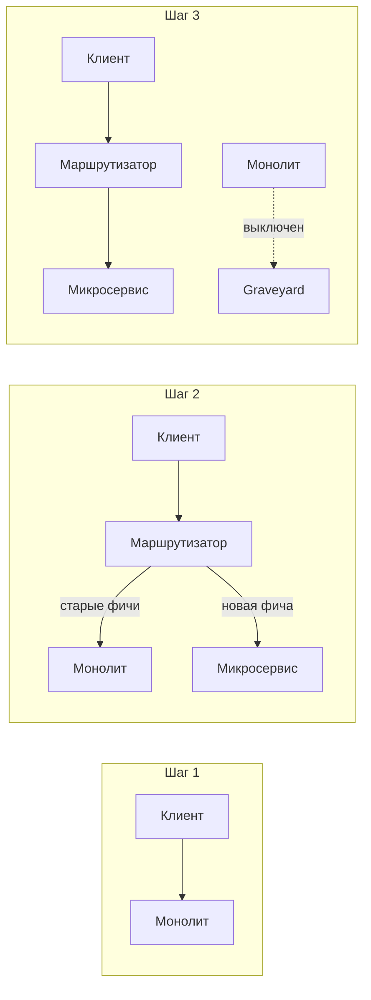
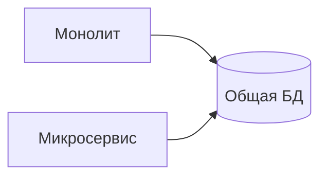
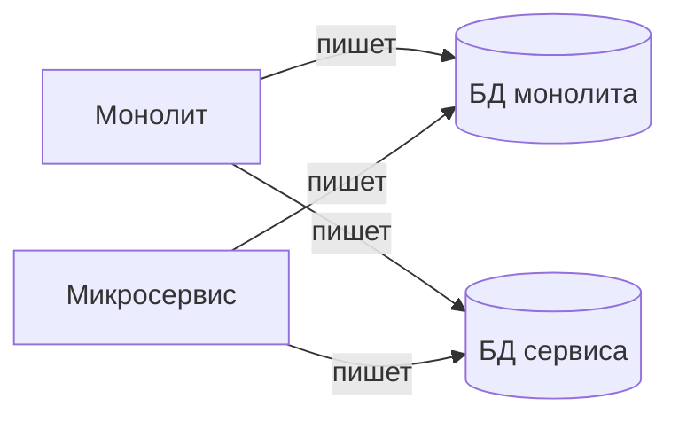
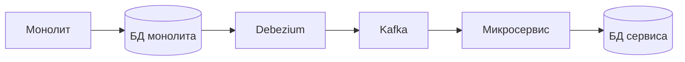

## Как распилить монолит на микросервисы: стратегии для аналитика

Переход от монолита к микросервисам — это не техническое упражнение "как нарезать код". Это бизнес-решение, которое должно решать конкретные проблемы: медленная разработка, частые конфликты в команде, неспособность масштабировать критический компонент. Большинство проектов, которые пытались "распилить монолит" без четкого плана, заканчивали распределенным монолитом — худшим из двух миров.

## Прежде чем начать: зачем вам это нужно

Микросервисы — это не мода. Это инструмент для решения конкретных проблем. Прежде чем пилить монолит, ответьте на вопросы:

- Какая именно боль от монолита? (Долгая сборка? Конфликты при слиянии? Невозможность масштабировать часть системы? Разные команды хотят разные технологии?)
- Микросервисы — лучшее решение этой боли? (Иногда достаточно модульного монолита с четкими границами.)
- Готова ли команда к распределенной сложности? (Сеть, задержки, распределенные транзакции, сложность отладки?)

Если монолит еще терпим, а команда маленькая — не спешите. Микросервисы — это компромисс: вы получаете независимость, но платите сложностью.

## Стратегия 1. Strangler Fig (удушение фикусом)

Это самый безопасный и распространенный паттерн. Вы не переписываете монолит целиком, а постепенно вырезаете из него функциональность, заменяя её микросервисами. Монолит остается жить, пока его части не будут полностью заменены.

**Пошаговый процесс:**

1. **Поставить маршрутизатор (API Gateway) перед монолитом.** Все запросы идут через него, но пока он просто проксирует их в монолит.
2. **Выбрать один модуль для выноса.** Лучше всего — тот, который:
   - Часто меняется (отдельная команда или высокая частота релизов).
   - Создает высокую нагрузку (можно масштабировать отдельно).
   - Имеет четкие внешние API (меньше связей с монолитом).
3. **Реализовать микросервис и настроить маршрутизатор:** запросы к этому модулю направляются в новый сервис, остальные — в монолит.
4. **Верифицировать:** работает ли новая функциональность? Не упал ли монолит?
5. **Повторить для следующего модуля.**

**Какой модуль выносить первым:**

- **Не критический.** Если ошибка в новом сервисе не остановит бизнес.
- **С четкими API.** Минимум связей с другими модулями.
- **С высокой нагрузкой.** Сможете масштабировать его отдельно и быстро увидеть эффект.

**Сложность:** миграция данных. Пока монолит и новый сервис сосуществуют, данные могут быть в двух местах. Нужна стратегия синхронизации (dual-write, CDC).

## Стратегия 2. Вынос по доменам (Bounded Context)

Это более аналитический подход. Сначала вы определяете ограниченные контексты (Bounded Context по DDD), а затем каждый контекст становится микросервисом.

**Шаги:**

1. **Проведите Event Storming** с бизнесом и разработкой. Выделите агрегаты, события, команды.
2. **Сгруппируйте в контексты.** Где одни и те же термины имеют разный смысл? Там граница.
3. **Спроектируйте API между контекстами.** Явные, документированные, версионируемые.
4. **Реализуйте контексты как независимые сервисы.**

**Преимущества:** Микросервисы получаются осмысленными, с четкой ответственностью. Границы совпадают с бизнес-границами, а не с техническими.

**Недостатки:** Процесс требует времени и вовлечения бизнеса. Не быстрый.

## Стратегия 3. Вынос по сценариям использования (Use Cases)

Если у вас нет четкой доменной модели, можно начать с выноса конкретных сценариев, которые чаще всего меняются или создают нагрузку.

**Пример:** Монолит интернет-магазина. Вы выносите сначала "поиск товаров" (отдельный сервис на Elasticsearch). Затем — "генерацию отчетов" (отдельный воркер). Затем — "отправку уведомлений" (отдельный сервис + Kafka). Остальное пока остается в монолите.

Это стратегия "низко висящих фруктов". Быстро дает результат, но может привести к "лоскутной" архитектуре, если не продумать общую картину.

## Миграция данных: самая сложная часть

При выносе микросервиса данные, которые принадлежали монолиту, должны быть мигрированы в новую БД микросервиса. Это нетривиально, потому что монолит продолжает работать и данные могут меняться во время миграции.

**Варианты:**

### 1. Общая БД на время миграции (Shared Database)

Новый микросервис и монолит читают и пишут в одну БД (или в одну схему). Это самый простой способ, но он временный. При этом микросервис не получает независимости — он все еще связан схемой БД монолита.

**Когда использовать:** На короткое время (недели), чтобы не блокировать вынос.

### 2. Dual-write (запись в два места)

Микросервис и монолит пишут данные и в свою БД, и в БД друг друга (или в общую БД). Это гарантирует, что данные остаются синхронизированными во время миграции.

**Проблемы:** Сложность (две записи), возможные конфликты (race condition).

### 3. CDC (Change Data Capture)

Используйте Debezium или аналоги, чтобы читать изменения из БД монолита и воспроизводить их в БД микросервиса. Это асинхронно и надежно. Микросервис сначала работает в read-only режиме, потом переключается на запись.

**Преимущества:** Не требует изменения кода монолита. **Недостатки:** Сложность инфраструктуры.

### 4. Однократная миграция с остановкой на час (big bang copy)

Остановить монолит (или поставить его в read-only), скопировать данные в новую БД, запустить микросервис, включить запись. Это самый простой вариант, но требует downtime.

**Когда использовать:** Некритичные системы, где downtime допустим.

## Антипаттерны "распила" (чего делать не надо)

**1. Начать с выноса ядра (core domain).** Ядро банковской системы, платежей, заказов — самое сложное, с наибольшим количеством связей. Начните с него — увязните в зависимостях. Выносите сначала периферийные функции: уведомления, отчеты, поиск.

**2. Создать распределенный монолит (distributed monolith).** Формально нарезали на микросервисы, но они:

- Используют общую БД (или общие таблицы).
- Вызывают друг друга синхронно в длинных цепочках.
- Не могут быть развернуты независимо — изменение в сервисе А требует изменения в Б.

Это худшее из двух миров: сложность распределенной системы + отсутствие преимуществ микросервисов.

**3. Игнорировать миграцию данных.** Оставили данные в монолите, а микросервис пытается их читать оттуда. Получается связанность через БД.

**4. Резать по техническим слоям (UI, бизнес-логика, данные).** Это не микросервисы, а распределенный монолит с самым сильным связыванием. Каждый запрос пройдет через три сервиса, задержка вырастет, отказоустойчивость упадет.

## Как измерить успех миграции

Недостаточно "вынести сервис". Нужно, чтобы микросервисная архитектура приносила пользу.

**Метрики успеха:**

- **Время развертывания (deployment time).** Сервис можно развернуть независимо за минуты, а не часы (как монолит).
- **Время восстановления (MTTR).** Падение одного сервиса не убивает всю систему. Остальные продолжают работать.
- **Частота релизов.** Команда может выпускать изменения в своем сервисе ежедневно, не координируя с другими.
- **Масштабируемость.** Можно масштабировать только нагруженный сервис, а не весь монолит.
- **Конфликты при слиянии.** Резко снизились, потому что команды работают в разных репозиториях.

Если через полгода после миграции этих улучшений нет — скорее всего, вы получили распределенный монолит.

## Вывод для аналитика

Как аналитик, вы не будете писать код миграции. Но вы будете:

- **Определять кандидатов на вынос** (по частоте изменений, нагрузке, бизнес-важности).
- **Проектировать границы между сервисами** (API, события, общие данные).
- **Участвовать в миграции данных** (какие поля нужны новому сервису, как синхронизировать).
- **Согласовывать API** между командами (контракты, версионирование, обратная совместимость).

Запомните главное правило: не пытайтесь переписать монолит за один раз. Strangler Fig — ваш друг. Начинайте с малого, с периферии, с низко висящих фруктов. И всегда имейте возможность откатить (monolith все еще работает). Миграция на микросервисы — это марафон, а не спринт. И далеко не всем проектам он нужен. Иногда достаточно хорошо структурированного модульного монолита.