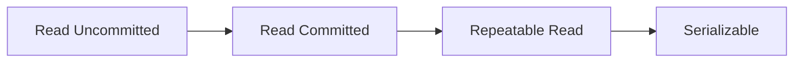
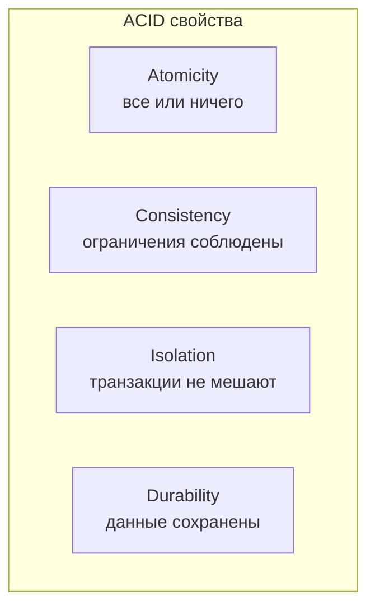
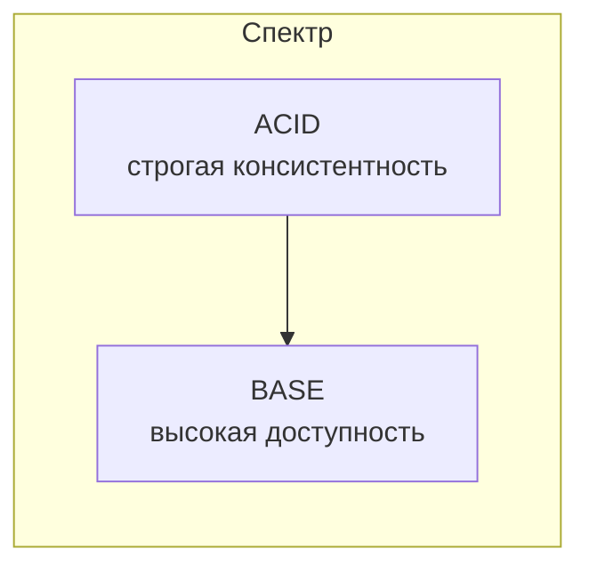
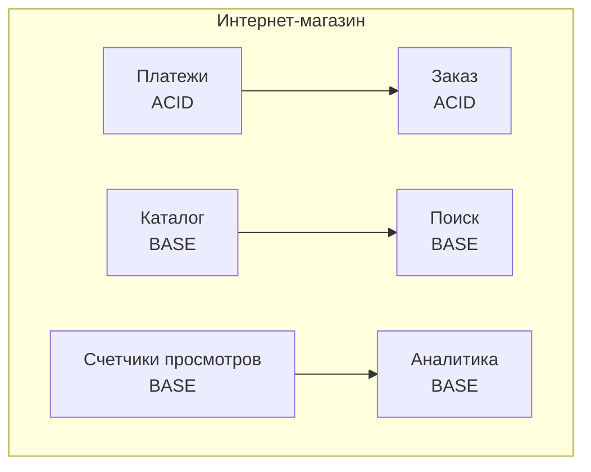

## Введение: Две философии работы с данными

Представьте двух кассиров в супермаркете.

**Первый кассир (ACID)** работает так: он блокирует кассу, пока обслуживает покупателя. Никто другой не может пробить товары, пока он не закончит. Он проверяет каждую позицию, сверяет с базой, убеждается, что все точно. Покупатель получает чек, только когда все проверено. Система надежная, но медленная. В час пик образуются очереди.

**Второй кассир (BASE)** работает иначе: он быстро принимает заказ, говорит "спасибо, ваш заказ принят", а потом в фоне обрабатывает его. Возможно, через минуту выяснится, что товара нет на складе, и придет смс "извините, товара нет, деньги вернем". Но покупатель не стоял в очереди. Система быстрая, но не мгновенно точная.

**ACID** и **BASE** — это две модели обеспечения согласованности данных в базах данных и распределенных системах.

**ACID** (Atomicity, Consistency, Isolation, Durability) — строгая модель. Транзакции либо выполняются полностью, либо откатываются. Данные всегда согласованы. Это стандарт для реляционных баз данных (PostgreSQL, MySQL, Oracle). Плата — производительность и масштабируемость.

**BASE** (Basically Available, Soft state, Eventual consistency) — гибкая модель. Система всегда доступна, но данные могут быть временно несогласованы. В конечном счете они придут к согласованному состоянию. Это стандарт для многих NoSQL баз (Cassandra, DynamoDB, MongoDB) и распределенных систем. Плата — строгая согласованность.

Выбор между ACID и BASE — это компромисс между консистентностью (данные всегда правильные) и доступностью/производительностью (система быстрая и всегда отвечает).

## ACID: Кислотная строгость

**ACID** — это акроним из четырех свойств транзакций.

### Atomicity (Атомарность)

Транзакция либо выполняется полностью, либо не выполняется вообще. Нет состояния "наполовину сделано".

Пример: перевод денег со счета А на счет Б. Атомарность гарантирует, что либо обе операции (списание с А и зачисление на Б) выполнены, либо ни одна. Не может быть так, что деньги списались с А, но не зачислились на Б.

```sql
BEGIN TRANSACTION;
UPDATE accounts SET balance = balance - 100 WHERE id = 'A';
UPDATE accounts SET balance = balance + 100 WHERE id = 'B';
COMMIT; -- либо все, либо ничего
```

### Consistency (Согласованность)

Транзакция переводит базу данных из одного согласованного состояния в другое. Все ограничения (внешние ключи, уникальность, проверки) соблюдаются.

Пример: если в таблице есть ограничение "balance >= 0", то транзакция, пытающаяся уйти в минус, будет отклонена. База данных не позволит нарушить правила.

### Isolation (Изоляция)

Параллельные транзакции не влияют друг на друга. Кажется, что они выполняются последовательно, хотя физически могут идти параллельно.

Уровни изоляции (от слабого к сильному):

- **Read Uncommitted.** Можно читать незафиксированные данные других транзакций ("грязное чтение"). Почти не используется.
- **Read Committed.** Читаются только зафиксированные данные. Стандарт в PostgreSQL.
- **Repeatable Read.** В рамках транзакции данные не меняются. Защита от "неповторяемого чтения".
- **Serializable.** Самый строгий уровень. Транзакции выполняются так, как будто они последовательные.



### Durability (Долговечность)

После фиксации транзакции данные сохраняются даже при сбое питания, падении сервера, ошибке. Записали на диск — не потеряется.



## BASE: Гибкость распределенных систем

Термин **BASE** придуман как противоположность ACID. Это не столько строгий стандарт, сколько описание свойств многих NoSQL и распределенных систем.

### Basically Available (Базовая доступность)

Система всегда отвечает на запросы. Даже если часть узлов упала, система продолжает работать (возможно, с ухудшенной функциональностью). В отличие от ACID, где при проблемах система может отказаться отвечать, чтобы сохранить согласованность.

Пример: в социальной сети при падении одного сервера вы все еще можете смотреть ленту (возможно, без фото). Система доступна, но не полностью.

### Soft state (Мягкое состояние)

Состояние системы может меняться со временем даже без внешних воздействий. Данные могут быть временно несогласованы, и это нормально.

Пример: после того как вы поставили лайк, счетчик лайков может показывать старое значение несколько секунд, пока не обновится. Состояние "мягкое" — оно придет в норму позже.

### Eventual consistency (Согласованность в конечном счете)

Система гарантирует, что при отсутствии новых изменений данные станут согласованными через некоторое время. Но не мгновенно. Через секунду, через 5 секунд, через минуту — но станут.


Пример: в распределенной базе данных вы обновили запись на одном узле. Другие узлы узнают об этом не мгновенно, а через репликацию. Через 100 мс все узлы будут иметь одинаковые данные.

## ACID vs BASE: Сравнение

| Аспект | ACID | BASE |
| :--- | :--- | :--- |
| **Акцент** | Согласованность | Доступность |
| **Согласованность** | Строгая (мгновенная) | Eventual (в конечном счете) |
| **Доступность** | Может быть недоступна (при проблемах с консистентностью) | Всегда доступна (basically available) |
| **Производительность** | Ниже (блокировки, изоляция) | Выше (меньше блокировок) |
| **Масштабируемость** | Трудно (вертикальная) | Легко (горизонтальная) |
| **Транзакции** | ACID-транзакции | Нет транзакций (или ограниченные) |
| **Где используется** | Реляционные БД (PostgreSQL, MySQL) | NoSQL (Cassandra, DynamoDB, MongoDB) |
| **Пример** | Банковский перевод | Счетчик лайков в соцсети |



## Когда выбирать ACID

**Банковские системы.** Перевод денег. Не может быть "деньги списались, но не зачислились через 5 секунд". Нужна строгая атомарность и согласованность.

**Системы бронирования.** Билеты на самолет, места в отеле. Нельзя продать одно место двум людям из-за eventual consistency.

**Инвентаризация с точным учетом.** Складской учет. Нельзя допустить, чтобы один и тот же товар был зарезервирован дважды.

**Медицинские записи.** Ошибки в данных могут иметь серьезные последствия.

**Законодательные требования.** Некоторые регуляторы требуют ACID-гарантий для определенных типов данных.

**Признаки:** "У нас не может быть расхождений даже на секунду", "Каждая транзакция должна быть атомарной", "Нам нужны сложные JOIN и внешние ключи".

## Когда выбирать BASE

**Социальные сети.** Лайки, просмотры, комментарии. Если счетчик лайков обновится через 2 секунды — никто не заметит. Но система должна быть доступна миллионам пользователей.

**Аналитика и логи.** Счетчики посещений, метрики. Несколько потерянных событий не критичны, но система должна принимать огромные объемы данных.

**Каталоги товаров (не инвентаризация).** Название, описание, цена товара. Если новое описание появится через 5 секунд — не страшно. Но каталог должен быть доступен всегда.

**Рекомендательные системы.** Рекомендации могут быть не идеально актуальными, но система должна отвечать быстро.

**Системы реального времени (с большими объемами).** IoT, игровые лидерборды. Скорость и доступность важнее абсолютной точности.

**Признаки:** "У нас миллионы пользователей", "Система должна быть всегда доступна", "Мы можем жить с eventual consistency", "Нам нужно горизонтальное масштабирование".

## Компромисс: Гибридный подход

В реальных системах часто используют и ACID, и BASE в разных частях. Одна система может использовать ACID для критических данных и BASE для некритических.

**Пример: Интернет-магазин**

- **Заказы и платежи** — ACID. Нельзя допустить двойного списания.
- **Счетчик просмотров товара** — BASE. Потеря нескольких просмотров не критична.
- **Поиск и рекомендации** — BASE. Данные могут быть не мгновенно свежими.
- **Каталог товаров** — BASE (или ACID, в зависимости от требований).



## ACID в распределенных системах (микросервисы)

В микросервисной архитектуре с Database per Service ACID-транзакции между сервисами невозможны. Нужны компромиссы.

**Варианты:**

- **Saga** (распределенная транзакция с компенсациями) — приближается к ACID, но с eventual consistency.
- **Двухфазный коммит (2PC)** — дает ACID, но плохо масштабируется и редко используется в микросервисах.
- **Перепроектирование границ** — чтобы операции, требующие ACID, не пересекали границы сервисов.

**Вывод:** в распределенных системах приходится жертвовать строгой ACID в пользу BASE или компромиссных решений (Saga).

## Реальные примеры

### Пример 1: Банковский перевод (ACID)

Пользователь переводит 1000 рублей со счета на счет. Транзакция:

1. Проверить, что на счете А есть 1000 рублей
2. Списать 1000 рублей со счета А
3. Зачислить 1000 рублей на счет Б
4. Записать в историю операций

ACID гарантирует: либо все 4 шага выполнены, либо ни одного. Нет состояния "деньги списались, но не зачислились". Нет "грязного чтения" (другой пользователь не увидит промежуточное состояние).

### Пример 2: Лайк в Instagram (BASE)

Пользователь ставит лайк под фото. Что происходит:

1. Запрос "поставить лайк" принят → пользователь видит, что лайк засчитан (сердце красное)
2. В фоне система обновляет счетчик лайков на всех репликах
3. Возможно, через 1-2 секунды счетчик покажет старое значение, потом обновится

BASE гарантирует: система всегда доступна, лайк в конечном счете будет учтен на всех серверах. Но если вы обновите страницу через 100 мс, счетчик может показать неактуальное значение.

## Резюме

ACID и BASE — это две философии работы с данными.

**ACID (Atomicity, Consistency, Isolation, Durability):**

- Атомарность: все или ничего
- Согласованность: ограничения соблюдены
- Изоляция: транзакции не мешают друг другу
- Долговечность: данные сохранены

Плюсы: строгая согласованность, надежность. Минусы: ниже производительность, сложнее масштабирование.

Где используется: реляционные БД (PostgreSQL, MySQL), банки, бронирование, инвентаризация.

**BASE (Basically Available, Soft state, Eventual consistency):**

- Базовая доступность: система всегда отвечает
- Мягкое состояние: данные могут быть временно несогласованы
- Согласованность в конечном счете

Плюсы: высокая доступность, масштабируемость, производительность. Минусы: eventual consistency (данные могут быть не свежими).

Где используется: NoSQL (Cassandra, DynamoDB, MongoDB), соцсети, аналитика, IoT.

**Что выбрать?**

- Нужна строгая согласованность, небольшие объемы, вертикальное масштабирование → ACID
- Нужна высокая доступность, большие объемы, горизонтальное масштабирование → BASE
- Реальность: гибрид. Критические данные на ACID, некритические — на BASE.

В распределенных системах (микросервисах) строгая ACID между сервисами невозможна. Приходится использовать компромиссы: Saga, eventual consistency, перепроектирование границ. ACID и BASE — не "хорошо" и "плохо", а разные инструменты для разных задач. Выбор зависит от требований бизнеса: что важнее — чтобы данные всегда были точными (ACID) или чтобы система всегда была доступна и быстра (BASE).