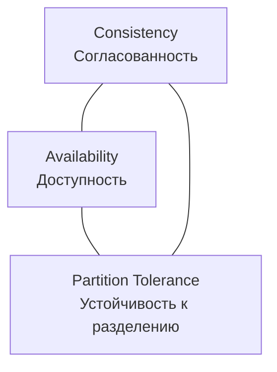
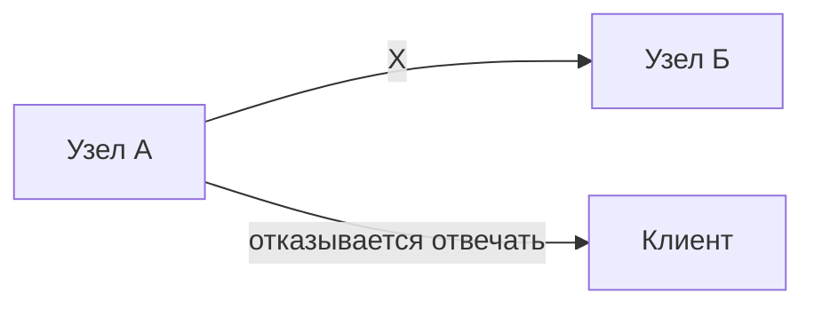
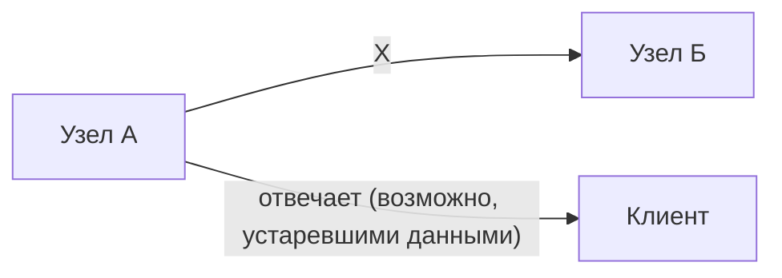
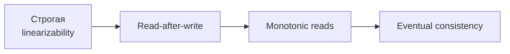
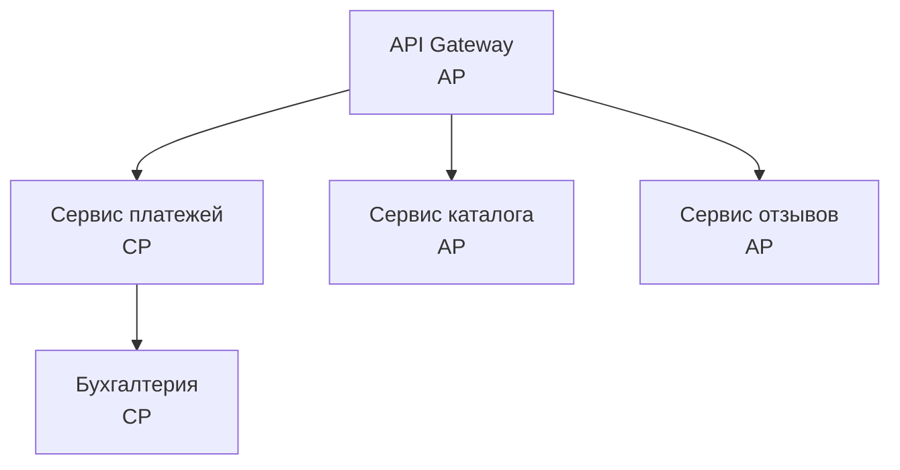

## Введение: Нельзя иметь все сразу

Представьте, что вы управляете сетью банкоматов по всему городу. Клиенты снимают деньги, кладут на счета, проверяют баланс.

Однажды связь между банкоматами и центральным сервером прервалась. Клиент подходит к банкомату и хочет снять 5000 рублей. На счету у него 10 000 рублей, но банкомат не может проверить баланс из-за обрыва связи. Что делать?

**Выбор А (Consistency):** Банкомат говорит: "Извините, связь недоступна, приходите позже". Клиент не может снять деньги, но система остается согласованной — нет риска, что клиент снимет больше, чем у него есть.

**Выбор Б (Availability):** Банкомат выдает деньги, доверяя тому, что клиент честен (или используя локальный кэш). Клиент счастлив, но есть риск: если у клиента на счету меньше 5000, банкомат ошибся. Система стала несогласованной (баланс в банкомате и на сервере разошелся), но доступной.

**Consistency vs Availability** — это фундаментальный компромисс в распределенных системах. Вы не можете иметь и строгую согласованность, и 100% доступность одновременно при разделении сети (network partition). Этот компромисс описывается **CAP-теоремой** (теоремой Брюера).

## CAP-теорема: Только два из трех

CAP-теорема гласит: в распределенной системе невозможно одновременно обеспечить все три свойства:

- **Consistency (Согласованность)** — все узлы видят одни и те же данные в одно и то же время. Если вы обновили данные на одном узле, все последующие чтения с любого узла увидят это обновление.
- **Availability (Доступность)** — каждый запрос к системе получает ответ (успешный или неудачный). Система всегда отвечает, не зависает, не отказывает.
- **Partition tolerance (Устойчивость к разделению)** — система продолжает работать даже при потере связи между узлами (network partition).



**Выбирать нужно только два из трех.** На практике network partition неизбежна (сети ненадежны), поэтому выбор сводится к CP (согласованность + устойчивость к разделению) или AP (доступность + устойчивость к разделению).

## Три варианта выбора

### CP (Consistency + Partition tolerance) — жертвуем доступностью

При разделении сети система предпочитает согласованность доступности. Если узлы не могут общаться, система отказывается отвечать (или отвечает ошибкой), чтобы не нарушить согласованность.



**Примеры:** HBase, MongoDB (в конфигурации по умолчанию), Zookeeper, etcd, Consul.

**Когда использовать:** финансовые системы, системы бронирования, инвентаризация — везде, где неверные данные дороже недоступности.

### AP (Availability + Partition tolerance) — жертвуем согласованностью

При разделении сети система предпочитает доступность согласованности. Каждый узел отвечает на запросы, даже если данные могут быть устаревшими или несогласованными.



**Примеры:** Cassandra, DynamoDB, CouchDB, Amazon S3, DNS.

**Когда использовать:** социальные сети, аналитика, IoT, системы с eventual consistency — везде, где доступность важнее абсолютной точности.

### CA (Consistency + Availability) — невозможно в распределенной системе

Теоретически возможна только в системах без сетевых разделений (одноузловые базы данных). Как только у вас больше одного узла и есть сеть — partition tolerance нужна.


**Примеры:** традиционные одноузловые базы данных (PostgreSQL, MySQL в режиме одного сервера).

## Consistency: Строгая vs Eventual

Важно понимать, что "consistency" в CAP — это строгая согласованность (linearizability). Все узлы видят одни и те же данные в один момент времени.

Существуют более слабые формы согласованности:

- **Eventual consistency.** Данные станут согласованными через некоторое время (но не мгновенно).
- **Read-after-write consistency.** Клиент видит свои собственные записи сразу, но чужие — может быть, нет.
- **Monotonic reads.** Если клиент прочитал значение, он не увидит более старую версию позже.



Системы, которые выбирают AP, обычно предлагают eventual consistency или другие слабые модели.

## Availability: Что значит "доступна"

В CAP "доступность" означает, что каждый запрос получает ответ (необязательно правильный, но ответ). Система не зависает и не отказывает.

Но есть нюансы:

- **Ответ может быть ошибкой.** Если узел не может гарантировать согласованность, он может вернуть ошибку (например, 500 Internal Server Error). Формально это ответ, но пользователь недоволен.
- **Ответ может быть устаревшим.** Система может вернуть старые данные (из кэша, из локальной реплики), но ответить быстро.

На практике "доступность" часто означает: система отвечает в течение таймаута, даже если данные не свежие.

## Примеры из реальной жизни

### Банкомат (CP)

Вы приходите в банкомат, но связь с сервером прервана. Банкомат говорит: "Сервис недоступен, попробуйте позже". Это выбор CP: согласованность важнее доступности. Банк не рискует выдать деньги, не проверив баланс.

### Социальная сеть (AP)

Вы ставите лайк под фото. Сервер временно недоступен, но приложение показывает, что лайк поставлен (локально). Через несколько секунд, когда связь восстановится, лайк синхронизируется. Это выбор AP: доступность важнее строгой согласованности. Пользователь не ждет, система отвечает.

### DNS (AP)

Вы вводите google.com в браузере. DNS-сервер отвечает IP-адресом, даже если данные немного устарели (TTL). DNS жертвует строгой согласованностью ради доступности.

### Рекомендательная система (AP)

Вы смотрите фильмы на Netflix. Рекомендации могут быть не идеально актуальными (вы уже посмотрели фильм, но он все еще в рекомендациях), но система должна отвечать быстро. Доступность важнее точности.

## CAP на практике: Компромиссы

В реальных распределенных системах вы редко выбираете "чистый CP" или "чистый AP". Часто используются гибридные подходы:

**Tunable consistency (настраиваемая согласованность).** Cassandra позволяет выбрать для каждой операции: сколько узлов должны подтвердить запись, сколько узлов должны подтвердить чтение.

```yaml
# Cassandra: настраиваемая согласованность
CONSISTENCY QUORUM;  # баланс между C и A
CONSISTENCY ALL;     # строгая C, но ниже A
CONSISTENCY ONE;     # высокая A, но слабая C
```

**CRDT (Conflict-free replicated data types).** Специальные структуры данных, которые автоматически разрешают конфликты без координации. Позволяют получить и высокую доступность, и в конечном счете согласованность.

**Leader-follower репликация.** В PostgreSQL, MySQL: мастер принимает запись, реплики читают. При разделении сети реплики могут быть недоступны для записи (выбор CP) или продолжать работу (выбор AP с eventual consistency).

## Consistency vs Availability: Как выбрать

**Вопросы, которые нужно задать бизнесу:**

- Что случится, если клиент увидит устаревшие данные на 5 секунд?
- Что случится, если система будет недоступна 1 минуту?
- Что дороже: неверные данные или недоступность?

**Выбирайте Consistency (CP), если:**

- Финансовые операции (перевод денег, списание)
- Бронирование (билеты, места в отеле)
- Инвентаризация (учет товаров на складе)
- Медицинские записи
- Законодательные требования

**Выбирайте Availability (AP), если:**

- Социальные сети (лайки, комментарии)
- Аналитика и логи (потеря нескольких событий не критична)
- Поиск и рекомендации
- Системы реального времени (IoT, игры)
- Кэши и CDN

## CAP и микросервисы

В микросервисной архитектуре каждый сервис может делать свой выбор между C и A в зависимости от его роли.



- **Сервис платежей** — CP. Согласованность критична.
- **Сервис каталога** — AP. Каталог должен быть доступен всегда, устаревшие цены на несколько секунд допустимы.
- **Сервис отзывов** — AP. Отзывы могут загружаться асинхронно.

## CAP и базы данных

| База данных | CAP выбор | Комментарий |
| :--- | :--- | :--- |
| PostgreSQL (одноузловая) | CA | Нет распределенности |
| PostgreSQL (репликация) | CP (обычно) | Мастер-реплика, при разделении реплики не принимают запись |
| MySQL (группа репликации) | CP | Аналогично |
| MongoDB (по умолчанию) | CP | Читает с мастера, при разделении может не отвечать |
| MongoDB (настроенная) | AP | Можно ослабить согласованность |
| Cassandra | AP | Высокая доступность, eventual consistency |
| DynamoDB | AP | По умолчанию AP, но можно усилить C (увеличив consistency level) |
| CockroachDB | CP | Распределенная SQL с сильной согласованностью |
| Redis (кластер) | AP | При разделении может вернуть устаревшие данные |

## Распространенные заблуждения

**"CAP означает, что нужно выбрать два из трех, и это навсегда".** Нет. Вы можете динамически менять баланс между C и A в зависимости от ситуации. Например, в нормальных условиях система дает сильную согласованность, при разделении сети переключается в режим высокой доступности с eventual consistency.

**"AP системы не гарантируют согласованность вообще".** Нет. AP системы гарантируют eventual consistency. Данные станут согласованными, но не мгновенно.

**"CA системы возможны в распределенных системах".** Нет. Как только у вас больше одного узла и есть сеть, partition tolerance нужна. CA возможна только в одноузловых системах.

**"CAP — это все, что нужно знать о распределенных системах".** Нет. CAP описывает только один компромисс (согласованность vs доступность при разделении сети). Есть и другие компромиссы (латентность, производительность, стоимость).

## Резюме

Consistency vs Availability — это фундаментальный компромисс в распределенных системах, описываемый CAP-теоремой.

**CAP-теорема:** В распределенной системе невозможно одновременно обеспечить:

- **Consistency (C)** — все узлы видят одни и те же данные
- **Availability (A)** — каждый запрос получает ответ
- **Partition tolerance (P)** — система работает при разделении сети

На практике выбирают:

- **CP (Consistency + Partition tolerance)** — жертвуют доступностью. Система отказывается отвечать, если не может гарантировать согласованность.
- **AP (Availability + Partition tolerance)** — жертвуют строгой согласованностью. Система всегда отвечает, но данные могут быть устаревшими.

**Что выбрать?**

- **CP** — банки, бронирование, инвентаризация (неверные данные дороже недоступности)
- **AP** — соцсети, аналитика, рекомендации, IoT (доступность важнее абсолютной точности)

**Важно:**

- CAP не означает "навсегда". Баланс между C и A можно менять динамически.
- AP системы гарантируют eventual consistency, а не "никакой согласованности".
- CAP — только один из компромиссов. Есть также латентность, производительность, стоимость.

В реальных системах часто используют гибридные подходы: CP для критических данных, AP для некритических. CAP-теорема не говорит, что выбрать, а показывает, что вы должны сделать выбор осознанно, понимая последствия.