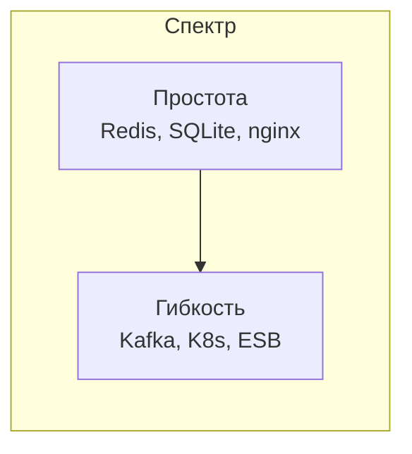
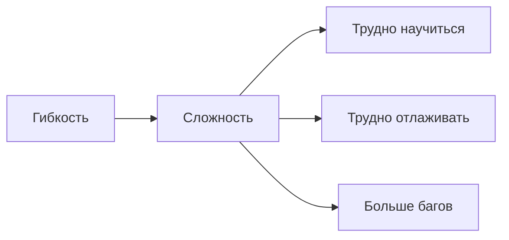
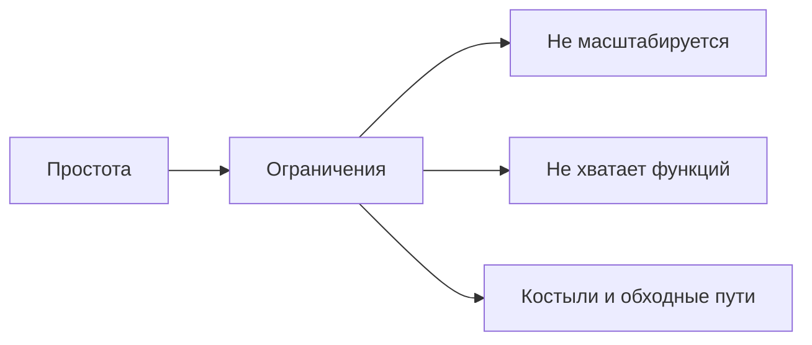
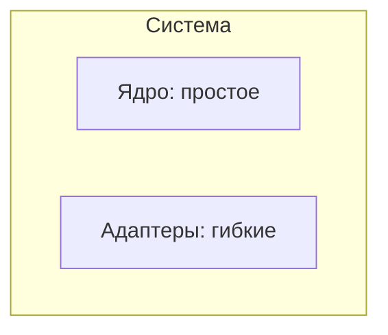

## Введение: Универсальный инструмент vs специализированный

Представьте, что вам нужно забить гвоздь. У вас есть два инструмента. Первый — швейцарский нож. В нем есть отвертка, пилка, ножницы, открывалка и даже маленькая пила. Но забить гвоздь им неудобно. Второй — обычный молоток. Он умеет только одно — забивать гвозди. Но делает это отлично.

Швейцарский нож — гибкий. Он подходит для многих ситуаций. Молоток — простой. Он не умеет ничего, кроме своего дела, но свое дело делает идеально.

**Flexibility vs Simplicity** — это компромисс между гибкостью (способностью системы адаптироваться к разным сценариям, поддерживать разные форматы, расширяться) и простотой (легкостью понимания, разработки, поддержки).

Гибкая система может делать много вещей, но она сложная. Простая система делает одну вещь, но делает ее хорошо. Выбор между ними — один из ключевых архитектурных компромиссов.

## Что такое гибкость (Flexibility)

Гибкость — это способность системы легко адаптироваться к новым требованиям, поддерживать разные сценарии использования, работать с разными форматами данных, интегрироваться с разными системами.

**Признаки гибкой системы:**

- Много параметров конфигурации
- Поддержка множества форматов (JSON, XML, CSV, Protobuf)
- Возможность расширения через плагины или модули
- Поддержка разных протоколов (HTTP, gRPC, WebSocket)
- Абстракции и интерфейсы вместо конкретных реализаций

**Примеры гибких систем:**

- **Apache Kafka.** Может использоваться как очередь, как хранилище событий, как streaming platform. Множество конфигураций. Мощная, но сложная.

- **Kubernetes.** Поддерживает разные типы приложений, разные способы развертывания, разные облака. Чрезвычайно гибкий, но очень сложный.

- **Enterprise Service Bus (ESB).** Может интегрировать любые системы, трансформировать любые данные, маршрутизировать сложным образом. Но ESB часто становятся монстрами.

## Что такое простота (Simplicity)

Простота — это легкость понимания, разработки, поддержки и эксплуатации системы. Простая система делает одну вещь и делает ее хорошо (Unix-философия).

**Признаки простой системы:**

- Мало движущихся частей
- Очевидное поведение (без сюрпризов)
- Легко понять, как она работает, за 15 минут
- Минимум конфигурации (часто "convention over configuration")
- Сфокусированность на одной задаче

**Примеры простых систем:**

- **Redis.** Хранилище ключ-значение в памяти. Делает одну вещь и делает ее очень хорошо. Прост в использовании.

- **SQLite.** Легковесная встраиваемая база данных. Один файл, одна библиотека. Чрезвычайно проста.

- **nginx (в базовой конфигурации).** Веб-сервер и reverse proxy. Конфигурация проста и декларативна.

## Компромисс в деталях

### Гибкость → Сложность

Каждая новая возможность, каждый параметр конфигурации, каждая абстракция добавляет сложность.

**Пример:** Kubernetes гибок — можно запускать любые приложения, на любых облаках, с любыми сетевыми политиками. Но выучить Kubernetes — месяцы. Настроить production-кластер — еще месяцы. Отладить проблему — нужен опытный специалист.

### Простота → Ограничения

Простая система не умеет многого. Когда потребности вырастают, она может стать узким местом.

**Пример:** SQLite прост — один файл, библиотека, нет сервера. Но он не подходит для высоконагруженных систем с тысячами одновременных записей. Приходится переходить на PostgreSQL (сложнее, но гибче).

## Примеры из архитектуры

### Монолит vs Микросервисы

- **Монолит** — проще. Одна кодовая база, один деплой, один процесс. Легко понять, легко отлаживать. Но негибкий: нельзя масштабировать части независимо, нельзя использовать разные технологии.

- **Микросервисы** — гибче. Можно масштабировать каждый сервис отдельно, использовать разные языки, развертывать независимо. Но сложность огромна: распределенные транзакции, сетевая задержка, сложный мониторинг.

### SQL vs NoSQL

- **SQL (реляционные БД)** — простые в понимании (таблицы, строки, столбцы), строгие (схема, типы, внешние ключи). Но негибкие: сложно масштабировать горизонтально, схемы менять трудно.

- **NoSQL** — гибкие: нет фиксированной схемы, легко масштабируются горизонтально, поддерживают разные модели данных (документы, ключ-значение, графы). Но сложнее в понимании, нет ACID, сложные запросы труднее.

### REST vs GraphQL

- **REST** — простой. Четкие эндпоинты, понятные HTTP-методы, легко кэшировать. Но негибкий: клиент получает все поля, даже если не нужны; много запросов для сложных данных.

- **GraphQL** — гибкий. Клиент запрашивает именно те поля, которые нужны, один запрос может получить сложные данные. Но сложнее в реализации, сложнее кэширование, сложнее защита от сложных запросов.

## Когда выбирать гибкость

- **Вы не знаете будущих требований.** Если домен плохо изучен, требования будут меняться. Гибкая система позволит адаптироваться.

- **Разные клиенты с разными потребностями.** Например, API, которое используют разные мобильные приложения, веб-приложение, партнеры. Каждому нужны разные данные.

- **Платформа или продукт для многих пользователей.** Если вы продаете продукт разным компаниям, он должен быть гибким, чтобы подстроиться под каждого.

- **Интеграция с множеством систем.** Если ваша система должна общаться с десятками разных систем с разными форматами и протоколами.

- **Долгосрочный проект с большим бюджетом.** Если у вас есть время и ресурсы на сложность, гибкость может окупиться в будущем.

## Когда выбирать простоту

- **Вы точно знаете требования.** Домен хорошо изучен, требования стабильны. Простая система будет работать годами.

- **Один клиент с одними потребностями.** Внутренний инструмент для конкретного отдела. Им не нужна гибкость.

- **MVP или прототип.** Главное — быстро проверить гипотезу. Простота даст скорость.

- **Ограниченные ресурсы.** Маленькая команда, маленький бюджет. Простую систему проще поддерживать.

- **Критичность к надежности.** Чем проще система, тем меньше в ней багов. Для критических систем простота — преимущество.

- **Unix-философия:** "Делай одну вещь и делай ее хорошо". Комбинируйте простые инструменты для сложных задач.

## Стратегии управления компромиссом

### Стратегия 1: Простота сначала, гибкость потом

Начинайте с простого решения. Когда оно перестанет справляться — добавляйте гибкость. Большинство проектов никогда не перерастают простую архитектуру.

### Стратегия 2: Гибкость только там, где нужна

Не делайте всю систему гибкой. Выделите части, которые действительно требуют гибкости (например, интеграционный слой), и сделайте их гибкими. Остальное оставьте простым.

### Стратегия 3: Конфигурация вместо кода

Вместо того чтобы делать систему гибкой через код (абстракции, плагины), сделайте ее настраиваемой через конфигурацию. Проще менять конфиг, чем писать код.

### Стратегия 4: Стандарты и конвенции

"Convention over configuration" — выбирайте разумные значения по умолчанию. Пользователь меняет конфиг только когда нужно отклониться от стандарта.

## Реальные примеры

### Пример 1: API для погоды

**Простое решение:** Один эндпоинт GET /weather?city=Moscow возвращает JSON с температурой. Просто, понятно, легко поддерживать.

**Гибкое решение:** GraphQL API, где клиент выбирает поля (temperature, humidity, wind, forecast), временной диапазон, единицы измерения (Celsius/Fahrenheit). Гибко, но сложно.

**Что выбрать?** Если API используют 2-3 мобильных приложения вашей компании — простое. Если API продается десяткам партнеров с разными потребностями — гибкое.

### Пример 2: Система логирования

**Простое решение:** Приложение пишет логи в файл. Администратор смотрит файл через tail. Просто, но не масштабируется.

**Гибкое решение:** ELK стек (Elasticsearch, Logstash, Kibana) + Filebeat. Может обрабатывать терабайты логов, строить дашборды, искать. Но сложно настраивать.

**Что выбрать?** Для команды из 3 человек — простое решение. Для крупного SaaS с тысячами серверов — гибкое.

### Пример 3: Форма обратной связи на сайте

**Простое решение:** HTML-форма + PHP-скрипт, отправляющий email. Просто, надежно, 20 строк кода.

**Гибкое решение:** Микросервис на Node.js, Kafka для очереди, отдельный сервис для отправки email, Redis для rate limiting. Гибко, можно масштабировать, но сложно.

**Что выбрать?** Для сайта с 100 обращениями в день — простое. Для платформы с миллионом обращений — гибкое.

## Признаки перегиба

### Слишком много гибкости (over-engineering)

- У вас есть параметры конфигурации, которые никто никогда не менял
- Вы поддерживаете форматы данных, которые никто не использует
- Код полон абстракций "на будущее", которое не наступило
- Разработчики тратят больше времени на понимание архитектуры, чем на написание кода

**Лекарство:** YAGNI (You Aren't Gonna Need It). Не добавляйте гибкость, пока она не понадобилась.

### Слишком много простоты (under-engineering)

- Вы постоянно делаете "костыли", потому что простая система не умеет нужного
- Каждое новое требование требует переписывания больших кусков
- Система не масштабируется, хотя нагрузка выросла
- Разработчики тратят время на обходные пути вместо прямой реализации

**Лекарство:** Рефакторинг в сторону гибкости, когда простота начинает мешать.

## Резюме

Flexibility vs Simplicity — это компромисс между способностью системы адаптироваться к разным сценариям и легкостью ее понимания и поддержки.

**Гибкость (Flexibility):**

- Плюсы: адаптивность, поддержка разных сценариев, расширяемость
- Минусы: сложность, трудно научиться, трудно отлаживать, больше багов
- Когда выбирать: неизвестные требования, разные клиенты, платформы, долгосрочные проекты с бюджетом

**Простота (Simplicity):**

- Плюсы: легко понять, легко разрабатывать, легко поддерживать, меньше багов
- Минусы: ограничения, может не хватить возможностей, костыли при росте
- Когда выбирать: известные требования, один клиент, MVP, ограниченные ресурсы, критическая надежность

**Стратегии:**

- Простота сначала, гибкость потом (большинству проектов простота не перерастает)
- Гибкость только там, где нужна (ядро простое, адаптеры гибкие)
- Конфигурация вместо кода
- Convention over configuration

**Предупреждения:**

- Не добавляйте гибкость "на будущее" (YAGNI) — скорее всего, оно не наступит
- Не упрощайте до такой степени, что каждое изменение требует переписывания

Гибкость и простота — не враги. Хорошая архитектура находит баланс: простая в основе, но с четко выделенными гибкими точками расширения. Unix-философия "делай одну вещь и делай ее хорошо" — это не про отказ от гибкости, а про создание простых инструментов, которые можно комбинировать для решения сложных задач.