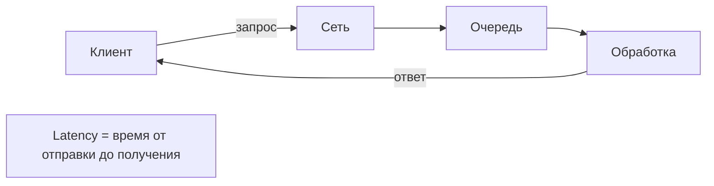
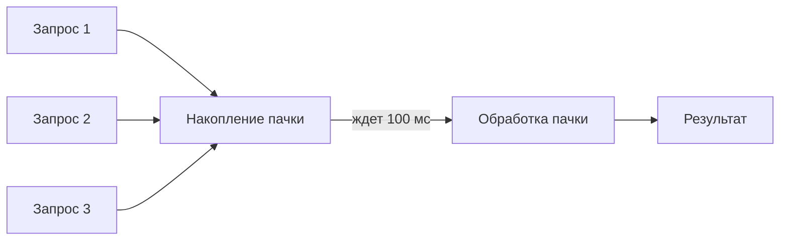
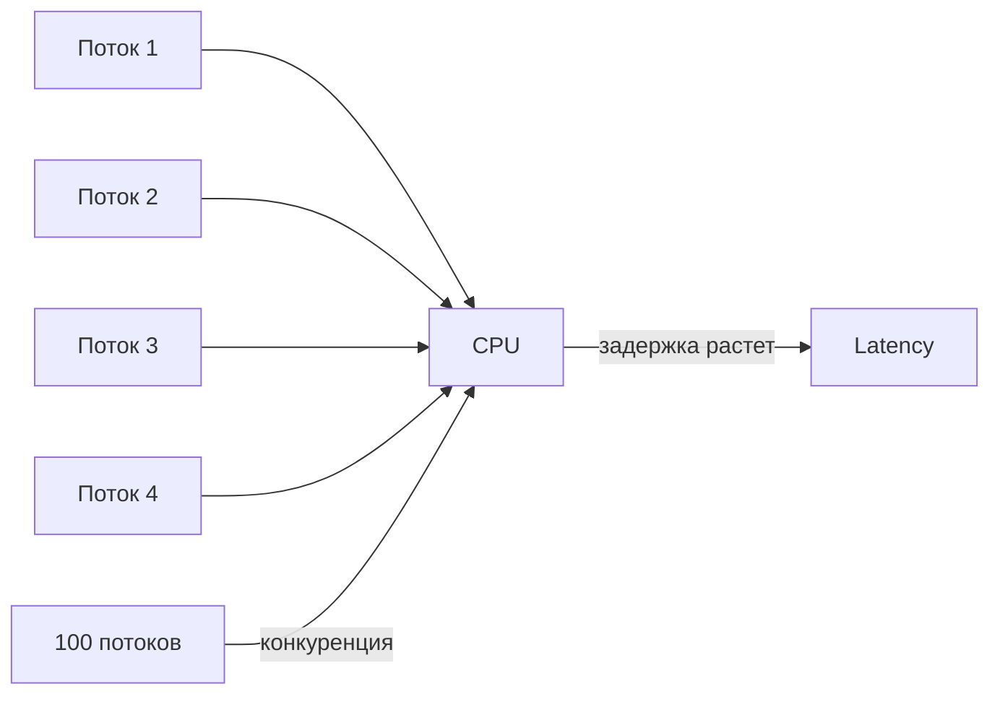
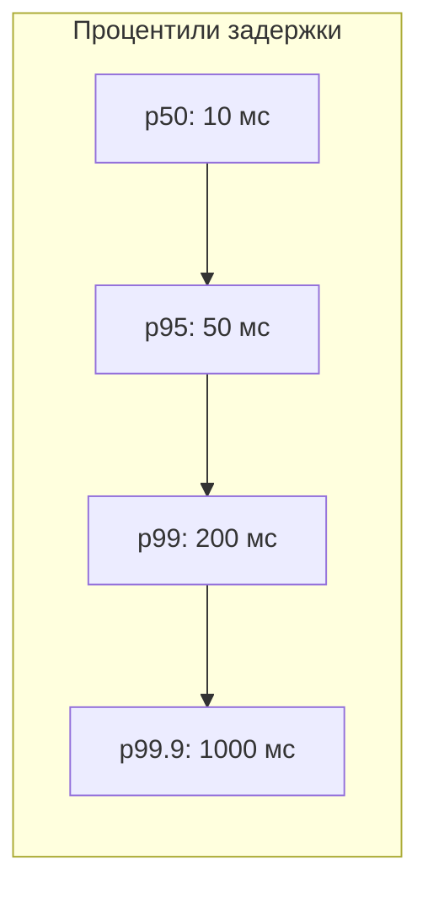
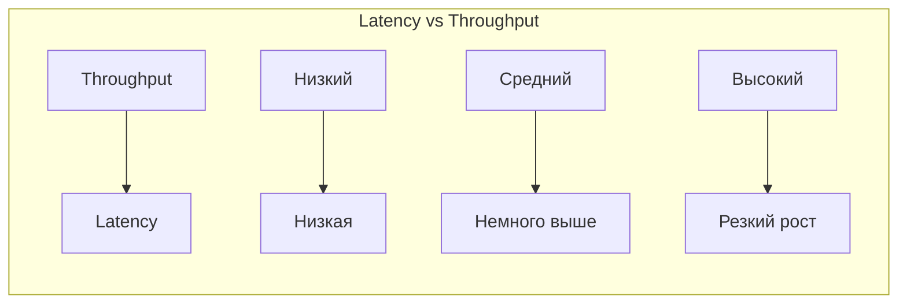

## Введение: Скорость vs Количество

Представьте два ресторана.

**Первый ресторан** готовит каждое блюдо с душой. Шеф-повар лично проверяет каждую тарелку. Время ожидания — 20 минут, но еда великолепна. Это ресторан с низкой пропускной способностью (throughput), но с низкой задержкой (latency) для каждого клиента? Нет. Здесь задержка высокая — 20 минут.

**Второй ресторан** — фастфуд. Бургер готов за 2 минуты. Но в час пик очередь из 100 человек. Каждый получает бургер быстро (низкая задержка), но в целом за час ресторан обслуживает 50 человек (средний throughput). А если ресторан оптимизирован на throughput, он может готовить бургеры партиями по 10 штук. Первый бургер из партии будет готов через 5 минут (высокая задержка), но за час ресторан обслуживает 200 человек (высокий throughput).

**Latency (задержка)** — время от отправки запроса до получения ответа. Измеряется в миллисекундах, секундах. Маленькая задержка — хорошо.

**Throughput (пропускная способность)** — количество операций, которые система может обработать за единицу времени. Измеряется в запросах в секунду (RPS), транзакциях в секунду (TPS). Большой throughput — хорошо.

Проблема в том, что оптимизация под низкую задержку и под высокую пропускную способность часто противоречат друг другу. Вы не можете одновременно иметь и самую низкую задержку, и самую высокую пропускную способность. Нужно выбирать приоритет.

## Latency и Throughput: Определения

**Latency (задержка).** Время, которое проходит от момента, когда клиент отправил запрос, до момента, когда клиент получил ответ. Включает: время в сети, время обработки на сервере, время в очередях.

Примеры:

- 1 мс — очень быстро (кэш в памяти)
- 10 мс — быстро (хорошая сеть, оптимизированный сервер)
- 100 мс — приемлемо для пользователя (но уже заметно)
- 1 секунда — уже долго, пользователь заметит
- 10 секунд — пользователь уйдет

**Throughput (пропускная способность).** Количество запросов, которые система может обработать за единицу времени (обычно секунду).

Примеры:

- 10 RPS — низкий throughput
- 1000 RPS — средний
- 100 000 RPS — высокий (крупные системы)

## Почему Latency и Throughput конфликтуют

### Батчинг (Batching)

Чтобы увеличить throughput, системы часто собирают запросы в пачки (batch) и обрабатывают их вместе. Это эффективно (меньше накладных расходов на каждый запрос), но увеличивает задержку — первый запрос в пачке ждет, пока наберется достаточно других запросов.

**Пример:** База данных, которая группирует INSERT-запросы. Throughput растет, но каждый запрос ждет накопления пачки.

### Конкуренция за ресурсы

Чтобы увеличить throughput, вы добавляете больше потоков (concurrency). Но слишком много потоков создают конкуренцию за CPU, память, блокировки. Это увеличивает задержку каждого отдельного запроса.

**Пример:** Веб-сервер, обрабатывающий 10 000 одновременных соединений. Throughput высокий, но каждый запрос ждет в очереди дольше.

### Очереди

Очереди помогают сгладить пики и увеличить throughput (система никогда не простаивает). Но чем длиннее очередь, тем больше время ожидания (задержка).

**Закон Литтла:** L = λ × W, где L — средняя длина очереди, λ — интенсивность поступления, W — среднее время ожидания. Длинная очередь → большая задержка.

### Кэширование

Кэширование уменьшает задержку (ответ из кэша быстрее) и увеличивает throughput (меньше нагрузки на основную БД). Но кэширование требует места и инвалидации, что добавляет сложность. Идеальный случай, когда оптимизация и latency, и throughput совпадают — кэширование полезно для обоих.

## Измерение Latency и Throughput

### Процентили (Percentiles)

Средняя задержка (average) обманчива. Один очень медленный запрос может испортить среднее, но большинство пользователей не пострадают. Лучше использовать процентили:

- **p50 (медиана).** 50% запросов быстрее этого значения. Типичный пользователь.
- **p95.** 95% запросов быстрее. Почти все пользователи.
- **p99.** 99% запросов быстрее. "Хвост" — самые медленные запросы.
- **p99.9.** 99.9% запросов. Самые критичные пользователи (или проблемы).

**Пример:** Система с p50 = 10 мс (быстро для большинства), но p99 = 5 секунд (каждый сотый запрос очень медленный). Средняя задержка может быть низкой, но 1% пользователей страдают.

### График Latency vs Throughput

При увеличении нагрузки (throughput) задержка сначала остается низкой, потом начинает расти (система насыщается). В какой-то момент задержка резко взлетает — система перегружена.

**Точка перегиба** — максимальный throughput, при котором задержка еще приемлема. Дальше увеличивать throughput бесполезно — задержка становится неприемлемой.

## Как улучшить Latency

- **Кэширование.** Храните часто используемые данные в быстром доступе (Redis, CDN, in-memory cache).
- **Сокращение сетевых прыжков.** Держите данные ближе к клиенту (CDN, edge computing).
- **Уменьшение очередей.** Меньше очередь → меньше время ожидания. Можно уменьшить размер очереди (но тогда выше риск потери запросов).
- **Улучшение алгоритмов.** O(n) → O(log n).
- **Асинхронность (для пользователя).** Если операция долгая, делайте ее асинхронно. Пользователь получает "принято" быстро, результат придет позже (это уменьшает воспринимаемую задержку).

## Как улучшить Throughput

- **Параллелизм.** Обрабатывайте несколько запросов одновременно (больше потоков, больше воркеров).
- **Батчинг.** Группируйте запросы для эффективной обработки.
- **Горизонтальное масштабирование.** Добавляйте больше серверов (шардирование, реплики).
- **Асинхронная обработка.** Используйте очереди, чтобы сгладить пики.
- **Уменьшение накладных расходов.** Меньше аллокаций памяти, меньше блокировок, быстрее сериализация.

## Примеры компромиссов

### База данных: Индексы

**Индексы** ускоряют чтение (лучше latency и throughput для SELECT), но замедляют запись (хуже throughput для INSERT/UPDATE). Выбор: индексировать часто читаемые поля, жертвуя скоростью записи.

### Сеть: TCP vs UDP

**TCP** надежный, с контролем перегрузки, но с большей задержкой (handshake, ack). **UDP** быстрее (низкая задержка), но ненадежный. Игры и голос выбирают UDP (низкая задержка), финансовые системы — TCP (надежность).

### Сжатие данных

**Сжатие** уменьшает размер данных (лучше throughput — больше данных в единицу времени), но увеличивает задержку (время на сжатие/распаковку).

### Сервер: Thread pool

**Маленький пул потоков** — низкая конкуренция, хорошая задержка, но низкий throughput (не могут обработать много одновременных запросов). **Большой пул** — высокий throughput, но задержка растет из-за конкуренции за CPU.

### Микросервисы vs Монолит

**Монолит** — вызовы внутри процесса (низкая задержка), но ограниченный throughput (трудно масштабировать). **Микросервисы** — сетевые вызовы (высокая задержка), но высокий throughput (горизонтальное масштабирование).

## Реальные примеры

### Пример 1: Поиск Google

Пользователь вводит запрос, хочет ответ мгновенно (низкая задержка). Google оптимизирует поиск под p99 < 200 мс. Но throughput при этом огромен — миллионы запросов в секунду. Google достигает этого за счет огромного количества серверов и кэширования.

### Пример 2: YouTube загрузка видео

Пользователь загружает видео. Задержка не критична — можно подождать несколько секунд. Но throughput важен — система должна принимать гигабайты данных в секунду. YouTube оптимизирует загрузку под высокий throughput, даже если задержка выше.

### Пример 3: Онлайн-игра (CS:GO)

Задержка критична — 50 мс vs 150 мс решает исход боя. Throughput невысокий — каждый игрок отправляет ~20 пакетов в секунду. Игры выбирают UDP и оптимизируют задержку, жертвуя надежностью (иногда пакеты теряются).

### Пример 4: Банковский процессинг

Обработка тысяч транзакций в секунду (throughput важен). Но каждая транзакция должна быть обработана за несколько секунд (задержка не должна быть слишком высокой, но и не критична до миллисекунд). Компромисс: средний.

## Как выбирать приоритет

**Вопросы для анализа:**

- Что чувствительнее для пользователя: скорость одного действия или количество одновременно выполняемых действий?
- Какой процент запросов должен укладываться в какой таймаут? (SLA: 99% запросов за 200 мс)
- Будет ли система расти за счет увеличения количества пользователей (throughput) или за счет усложнения каждого запроса (latency)?

**Latency важнее, если:**

- Интерактивные системы (поиск, API для мобильных приложений)
- Пользователь ждет ответа синхронно
- Онлайн-игры, видеозвонки
- Финансовые транзакции (пользователь хочет знать результат быстро)

**Throughput важнее, если:**

- Фоновая обработка (ETL, отчеты, бэкапы)
- Системы с огромным количеством событий (IoT, логи, аналитика)
- Пакетная обработка
- Системы, где важнее "сколько обработаем за час", а не "как быстро один запрос"

## Резюме

Latency и Throughput — две ключевые метрики производительности.

**Latency (задержка)** — время одного запроса. Низкая latency = быстро для пользователя.

**Throughput (пропускная способность)** — количество запросов в секунду. Высокий throughput = система выдерживает нагрузку.

**Компромисс:**

- Оптимизация под низкую задержку часто снижает throughput (меньше батчинга, меньше параллелизма)
- Оптимизация под высокий throughput увеличивает задержку (батчинг, очереди, конкуренция за ресурсы)

**Измерение:**

- Используйте процентили (p50, p95, p99), а не среднее
- Смотрите на точку перегиба: при каком throughput задержка становится неприемлемой

**Как улучшить latency:**

- Кэширование
- Меньше сетевых прыжков
- Меньше очередей
- Быстрые алгоритмы
- Асинхронность для пользователя

**Как улучшить throughput:**

- Параллелизм (больше потоков)
- Батчинг
- Горизонтальное масштабирование
- Асинхронная обработка (очереди)
- Меньше накладных расходов

**Когда что выбирать:**

- Latency важнее: интерактивные системы, поиск, игры, API
- Throughput важнее: фоновая обработка, ETL, аналитика, IoT

Хорошая архитектура находит баланс. Часто компромисс решается через SLA (Service Level Agreement): "99% запросов должны отвечать за 200 мс". Это задает и целевой latency (200 мс), и косвенно throughput (сколько запросов можно обработать, не превышая этот лимит).