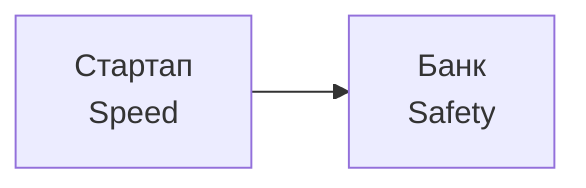
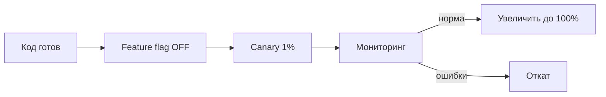

## Введение: Быстрое и опасное vs медленное и надежное

Представьте две автомобильные компании.

**Первая компания (Speed)** выпускает спорткары. Они разгоняются до 100 км/ч за 2 секунды, ездят 300 км/ч. Но у них нет подушек безопасности, ABS, ремней. Каждая поездка — риск.

**Вторая компания (Safety)** выпускает танки. Они медленные, тяжелые, неповоротливые. Но в них не страшны ни аварии, ни обстрелы. Вы доедете, но очень медленно.

**Speed vs Safety** — это компромисс между скоростью изменений (быстрота разработки, частота релизов, скорость выхода на рынок) и безопасностью (стабильность, надежность, защита от ошибок, соответствие регуляторам).

В программной архитектуре этот компромисс проявляется везде: в выборе процессов (Agile vs Waterfall), в выборе технологий (динамическая типизация vs статическая), в архитектурных решениях (микросервисы vs монолит), в практиках безопасности (автоматические обновления vs ручное одобрение).

Нет правильного ответа. Для стартапа скорость может быть важнее безопасности — если вы не выпустите фичу быстро, конкуренты вас обойдут. Для банка безопасность важнее скорости — ошибка может стоить миллионов и привести к тюрьме для руководителей.

## Что такое "скорость" (Speed) в архитектуре

**Speed** — это способность системы и команды быстро реагировать на изменения, быстро выпускать новые фичи, быстро фиксить баги, быстро адаптироваться к рынку.

**Проявления скорости:**

- **Частота релизов.** Релизы каждый час (vs раз в месяц).
- **Time-to-market.** Время от идеи до продакшена.
- **Lead time.** Время от коммита до деплоя.
- **Скорость разработки.** Как быстро инженеры пишут код.

**Что дает высокую скорость:**

- **Автоматизация.** CI/CD, автоматические тесты, автоматический деплой.
- **Микросервисы.** Можно развертывать сервисы независимо.
- **Feature flags.** Включать фичи без деплоя.
- **Динамическая типизация (Python, JS).** Меньше кода, быстрее писать.
- **Agile, DevOps культура.** Быстрые итерации, ответственность за деплой.

## Что такое "безопасность" (Safety) в архитектуре

**Safety** — это способность системы избегать ошибок, защищать данные, соответствовать требованиям, оставаться стабильной при изменениях.

**Проявления безопасности:**

- **Надежность (reliability).** Система не падает, данные не теряются.
- **Безопасность (security).** Защита от атак, утечек данных.
- **Соответствие регуляторам.** GDPR, PCI DSS, HIPAA, ФЗ-152.
- **Стабильность.** Обновления не ломают существующую функциональность.

**Что дает высокую безопасность:**

- **Ручные процессы.** Code review, QA, approval перед деплоем.
- **Статическая типизация (Java, Go, Rust).** Ошибки ловятся на этапе компиляции.
- **Монолит (или модульный монолит).** Меньше движущихся частей.
- **Waterfall (или гибрид).** Долгое планирование, много документации.
- **Изоляция.** Строгие разрешения, аудит, шифрование.

## Компромисс в деталях

### Частота релизов vs Стабильность

**Частые релизы (Speed):** Релизы каждый час. Баги фиксятся быстро. Новые фичи выходят быстро. Но риск: ошибка может попасть в продакшен быстрее.

**Редкие релизы (Safety):** Релизы раз в месяц. Много тестирования, code review, ручное QA. Стабильность выше. Но медленная реакция на рынок.

**Решение:** баланс через canary deployment, feature flags, автоматические откаты. Релизы частые, но с защитой.

### Динамическая vs Статическая типизация

**Динамическая типизация (Python, Ruby, JavaScript):**

- Speed: быстрее писать, меньше кода, прототипирование за часы
- Safety: ошибки типов ловятся только в runtime, сложнее рефакторинг

**Статическая типизация (Java, Go, Rust, TypeScript):**

- Safety: ошибки типов на этапе компиляции, безопасный рефакторинг, самодокументированный код
- Speed: медленнее писать (больше кода), компиляция занимает время

**Решение:** TypeScript (надстройка над JS) дает статическую типизацию с относительной простотой написания. Компромисс.

### Монолит vs Микросервисы (для скорости изменений)

**Монолит (Safety):**

- Меньше движущихся частей, проще отладка
- Но изменение требует деплоя всего приложения (медленно)

**Микросервисы (Speed):**

- Можно развернуть один сервис независимо (быстро)
- Но сложность распределенной системы выше, больше шансов на ошибку

**Парадокс:** Микросервисы дают скорость изменений (можно быстро развернуть), но уменьшают безопасность (сложнее обеспечить стабильность распределенной системы). Монолит дает безопасность (проще), но скорость изменений низкая.

### Автоматическое vs Ручное тестирование

**Автоматическое тестирование (Speed):**

- Тесты проходят за минуты, можно часто запускать
- Но не ловят все (UI, UX, нестандартные сценарии)

**Ручное тестирование (Safety):**

- Ловит то, что не ловят автотесты (визуальные баги, UX)
- Но медленно (дни или недели), дорого

**Решение:** большинство тестов — автоматические (быстро). Ключевые сценарии — ручное тестирование перед релизом (безопасно). CI/CD + QA gate.

## Примеры компромисса

### Пример 1: Стартап vs Банк

**Стартап:** Деньги на счету заканчиваются. Нужно быстро выпустить продукт, найти пользователей, получить инвестиции. Скорость важнее безопасности. Даже если будут баги, пользователи простят — это стартап.

**Банк:** Ошибка в системе может привести к потере миллионов, регуляторным штрафам, тюрьме для CIO. Безопасность важнее скорости. Лучше выпустить фичу на месяц позже, чем с багом.

### Пример 2: Обновление мобильного приложения

**Facebook (Speed):** Могут выпустить обновление с багом, быстро откатить или исправить через день. Пользователи привыкли.

**Авиационное ПО (Safety):** Обновления проходят сертификацию годами. Баг может убить людей.

### Пример 3: Feature flags

**Без feature flags (Safety):** Новая фича включается только после полного тестирования и релиза. Безопасно, но медленно.

**С feature flags (Speed + Safety):** Код новой фичи в продакшене, но отключен (disabled). Можно включить для 1% пользователей (canary), потом для 10%, потом для всех. Если баг — отключаем. Быстро (релиз кода произошел) и безопасно (можно откатить без деплоя).

### Пример 4: База данных: schema migration

**Миграция в одном коммите (Speed):** Изменение схемы БД и кода в одном релизе. Быстро, но риск: если код упал, БД уже изменена, откат сложен.

**Миграция в два этапа (Safety):**

- Шаг 1: добавить новое поле (nullable), код работает и со старым, и с новым
- Шаг 2: переписать код на новое поле, удалить старое

Медленнее, но безопаснее (можно откатить на любом этапе).

## Стратегии баланса

### Стратегия 1: Быстрые релизы с защитой (Speed with Guardrails)

Выпускайте быстро, но с механизмами защиты:

- **Feature flags.** Новая фича отключена по умолчанию.
- **Canary deployment.** Сначала на 1% пользователей.
- **Blue-green deployment.** Можно быстро откатить.
- **Автоматические откаты.** При росте ошибок — откат автоматически.
- **Мониторинг и алерты.** Видите проблему раньше пользователей.

### Стратегия 2: Разделение на критичный и некритичный код

**Критичный код (платежи, аутентификация):** Безопасность важнее. Медленные, тщательные релизы, много тестов, ручное QA.

**Некритичный код (UI, отчеты, рекомендации):** Скорость важнее. Можно релизить быстро, с feature flags, canary.

### Стратегия 3: Инвестиции в автоматизацию безопасности

Чем больше автоматизации, тем меньше конфликт между скоростью и безопасностью.

- **Автоматические тесты (unit, integration, e2e).** Ловят баги до релиза.
- **Статический анализ кода (linters, SAST).** Ловят уязвимости на этапе CI.
- **Автоматическое сканирование зависимостей (Snyk, Dependabot).** Ловит уязвимости в библиотеках.
- **Автоматические откаты.** При росте ошибок — откат без человека.

### Стратегия 4: Культура "Blameless post-mortems"

Когда происходит инцидент, не ищут виноватого (он не будет в следующий раз быстро релизить). Ищут причину и улучшают процессы, чтобы подобное не повторилось. Это позволяет сохранять скорость, повышая безопасность.

## Когда скорость важнее безопасности

- **Стартап на ранней стадии.** Деньги на счету заканчиваются. Нужно найти product-market fit. Баги простят, медленная разработка убьет.

- **Внутренние инструменты.** Если система для 10 человек, последствия бага невелики.

- **Некритичные функции.** Косметические изменения, рекомендации, аналитика — ошибка не остановит бизнес.

- **Конкурентный рынок.** Если вы не выпустите фичу быстро, конкуренты выпустят и заберут пользователей.

- **Культура "move fast and break things" (Facebook в ранние годы).** Сознательный выбор скорости.

## Когда безопасность важнее скорости

- **Финансовые системы.** Ошибка может привести к потере денег, регуляторным штрафам, тюрьме.

- **Медицинские системы.** Ошибка может убить пациента.

- **Авиация, автомобили (софт).** Ошибка может убить людей.

- **Системы с персональными данными (GDPR, HIPAA).** Утечка данных — многомиллионные штрафы.

- **Критическая инфраструктура.** Электростанции, водоснабжение, связь.

- **Устоявшийся продукт с миллионами пользователей.** Баг может привести к миллионным убыткам и потере репутации.

## Реальные примеры

### Пример 1: Knight Capital (2012)

**Что случилось:** Ошибка в коде при развертывании нового сервиса. За 45 минут алгоритм потерял $460 миллионов. Компания обанкротилась.

**Урок:** в финансовой системе безопасность критична. Релиз без должного тестирования и canary deployment привел к катастрофе.

### Пример 2: Facebook (2014)

**Что случилось:** Баг в системе "move fast and break things". Facebook лег на несколько часов. Пользователи не могли зайти.

**Урок:** даже для социальной сети, где безопасность не так критична, длительный простой неприемлем. Facebook внедрил canary deployment и автоматические откаты.

### Пример 3: Toyota (2010)

**Что случилось:** Ошибка в программном обеспечении (unintended acceleration) привела к отзыву 9 миллионов автомобилей и многомиллиардным потерям.

**Урок:** в автомобильном софте безопасность превыше всего. Каждая строчка кода должна быть проверена.

## Резюме

Speed vs Safety — это компромисс между быстротой изменений и стабильностью/безопасностью системы.

**Что такое скорость (Speed):**

- Частые релизы
- Быстрый time-to-market
- Короткий lead time
- Agile, DevOps, микросервисы, feature flags

**Что такое безопасность (Safety):**

- Надежность (система не падает)
- Безопасность (нет утечек)
- Соответствие регуляторам
- Стабильность (обновления не ломают)
- Ручные процессы, статическая типизация, монолит

**Компромиссы:**

- Частые релизы (speed) vs редкие релизы с QA (safety)
- Динамическая типизация (speed) vs статическая (safety)
- Микросервисы (speed) vs монолит (safety)
- Один коммит миграции БД (speed) vs два этапа (safety)

**Стратегии баланса:**

- Быстрые релизы с защитой (feature flags, canary, auto-rollback)
- Разделение на критичный и некритичный код
- Инвестиции в автоматизацию безопасности (тесты, SAST, сканирование)
- Blameless post-mortems (учимся на ошибках, а не ищем виноватых)

**Когда скорость важнее:**

- Стартап, внутренние инструменты, некритичные функции, конкурентный рынок

**Когда безопасность важнее:**

- Финансы, медицина, авиация, критические системы, персональные данные

В идеале, зрелая организация может иметь и высокую скорость, и высокую безопасность — за счет инвестиций в автоматизацию, культуры и правильных процессов. Feature flags, canary deployment, автоматическое тестирование, мониторинг — это инструменты, которые позволяют "двигаться быстро, но не ломать вещи". Но даже с лучшими инструментами фундаментальный компромисс остается: где-то на спектре между стартапом (скорость любой ценой) и банком (безопасность любой ценой) вы должны выбрать свою позицию.