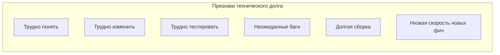
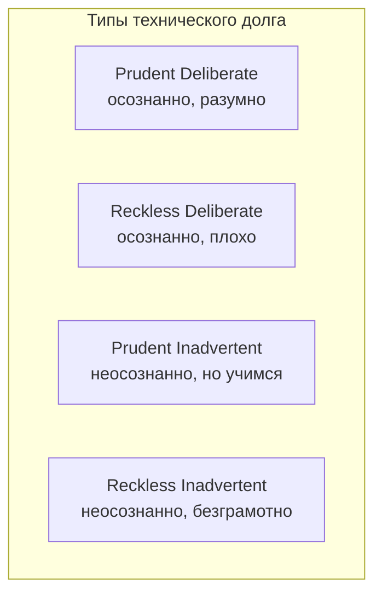
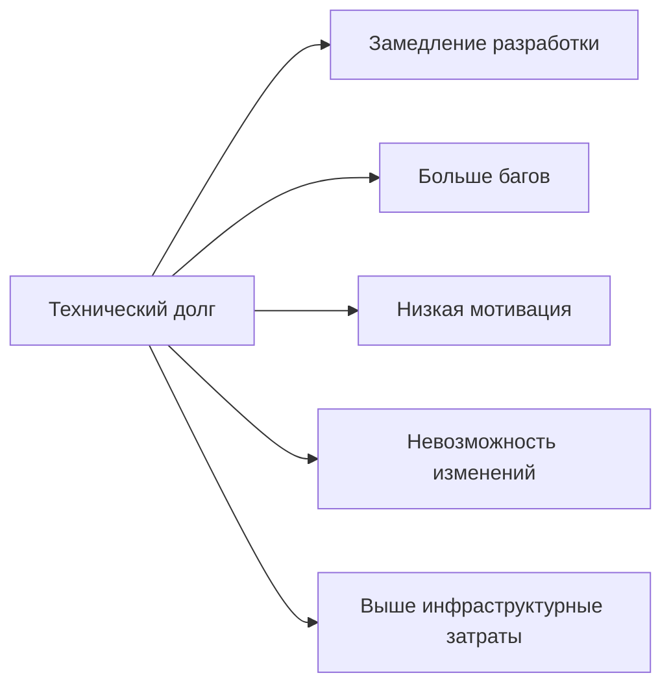
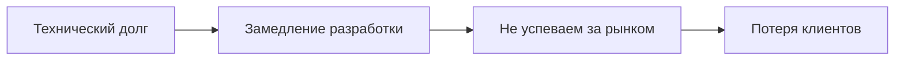
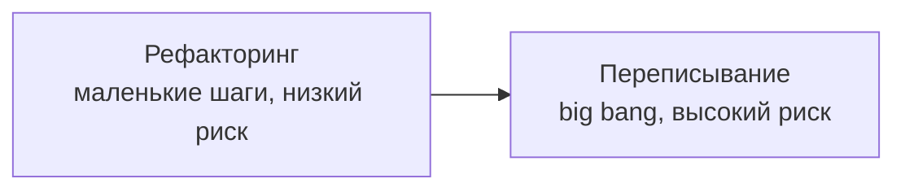

## Введение: Долг в разработке

Представьте, что вам нужно срочно починить кран в ванной. У вас нет подходящего инструмента, но вы берете скотч и кое-как заматываете течь. Кран перестал капать. Ура, проблема решена быстро.

Но через месяц скотч разматывается, течь возобновляется, и теперь вода заливает соседей снизу. Приходит сантехник, срезает скотч, обнаруживает, что старый вентиль сломан окончательно, и меняет весь кран. Работа занимает день, а счет в 10 раз больше, чем если бы вы сразу поменяли вентиль.

**Technical Debt (Технический долг)** — это метафора, введенная Уордом Каннингемом в 1992 году. Она описывает последствия принятия быстрых, но неоптимальных решений в разработке программного обеспечения. Вы берете "долг", чтобы сэкономить время сейчас, но потом вы платите "проценты" в виде замедления разработки, багов, сложности внесения изменений.

Technical Debt неизбежен. В реальном мире нет времени делать все идеально. Но важно понимать, когда долг оправдан, а когда нет, и как им управлять.

## Что такое Technical Debt

**Технический долг** — это разница между текущим состоянием кода/архитектуры и идеальным (или достаточно хорошим) состоянием. Это компромисс между качеством и скоростью.

**Признаки технического долга:**

- Код, который трудно понять ("что здесь происходит?")
- Код, который трудно изменить (малейшее изменение ломает много мест)
- Код, который трудно тестировать
- Баги, которые всплывают в неожиданных местах
- Долгое время сборки и развертывания
- Низкая скорость добавления новых фич

## Типы технического долга (по Мартину Фаулеру)

### Преднамеренный (Prudent) vs Непреднамеренный (Reckless)

**Преднамеренный, но разумный (Prudent Deliberate):** Вы сознательно берете долг, понимая последствия. "Сейчас у нас нет времени на рефакторинг, сделаем так, а через месяц исправим". Это бизнес-решение.

**Преднамеренный, но безрассудный (Reckless Deliberate):** Вы сознательно делаете плохо, не понимая последствий. "Напишем как попало, потом разберемся". Никто не планирует исправлять.

**Непреднамеренный, но разумный (Prudent Inadvertent):** Вы сделали как лучше, но потом узнали, что можно было лучше. "Мы не знали, что будет такая нагрузка, и выбрали не ту архитектуру". Это ошибка, но не по глупости.

**Непреднамеренный и безрассудный (Reckless Inadvertent):** Вы даже не знаете, что такое хороший код. "Почему мы должны писать тесты? Нам же платят за фичи". Это некомпетентность.

### Краткосрочный vs Долгосрочный

**Краткосрочный долг:** Мы берем его, чтобы быстро выпустить MVP или фичу к дедлайну. Планируем исправить в ближайшие недели.

**Долгосрочный долг:** Мы годами откладываем рефакторинг. Проценты накапливаются, разработка замедляется. В конце концов система становится неуправляемой.

## Причины возникновения технического долга

**Бизнес-давление.** "Нужно выпустить фичу к пятнице, иначе клиент уйдет". Команда срезает углы, чтобы успеть.

**Непонимание последствий.** "Что значит 'рефакторинг'? Зачем тратить время, если и так работает?"

**Отсутствие дисциплины.** "Мы знаем, что так плохо, но сделаем сейчас, а потом... (никогда)".

**Накопление.** Отдельно каждая "грязная" правка не страшна. Но 1000 таких правок делают систему неуправляемой.

**Изменение требований.** "Когда мы начинали, мы не знали, что система должна обрабатывать 10 000 RPS". Архитектура не выдерживает новой нагрузки.

**Текучесть команды.** Опытные разработчики уходят, новые не понимают, почему код написан так, и боятся менять.

## Последствия (проценты по долгу)

**Замедление разработки.** Каждая новая фича требует все больше времени. То, что раньше делалось за день, теперь занимает неделю.

**Увеличение количества багов.** Изменение в одном месте ломает другое, потому что код связан плохо.

**Снижение мотивации команды.** Разработчики ненавидят работать с "грязным" кодом. Хорошие инженеры уходят.

**Техническая невозможность изменений.** В какой-то момент систему становится невозможно изменить без полной переписки. Вы заперты.

**Рост затрат на инфраструктуру.** Плохо написанный код потребляет больше ресурсов (CPU, память). Приходится покупать более мощные серверы.

## Управление техническим долгом

### Осознанный долг (Prudent Deliberate)

Это нормально. Бизнес иногда требует скорости в ущерб качеству. Главное:

- **Фиксировать долг.** Завести тикет (issue) в трекере. Описать, что именно нужно исправить.
- **Планировать погашение.** Не "когда-нибудь", а конкретный спринт через месяц.
- **Понимать проценты.** Оценить, сколько времени теряется из-за долга.

### Процентирование долга

Не весь долг одинаково важен. Нужно приоритезировать:

- **Критический долг.** Блокирует разработку, приводит к частым багам. Гасить немедленно.
- **Важный долг.** Замедляет разработку, но не блокирует. Гасить в ближайшие спринты.
- **Некритичный долг.** Косметические проблемы, не влияющие на скорость. Можно отложить.

### Стратегии погашения

**Рефакторинг.** Переписываем плохой код на хороший, не меняя функциональность. Медленно, но надежно.

**Переписывание модуля.** Заменяем один проблемный модуль целиком. Рискованно, но иногда быстрее.

**Strangler Fig (паттерн).** Постепенно заменяем старую систему новой. Описано в отдельном разделе.

**Полная переписка (big bang).** Рискованно, не рекомендуется. Но иногда неизбежно (система совсем мертва).

### Профилактика: как не накапливать долг

- **Code review.** Как минимум один разработчик смотрит код перед merge. Ловит очевидные проблемы.
- **Автоматические тесты.** Меняете код → тесты падают → не выпускаете баг.
- **Статический анализ (линтеры).** Ловят стилистические ошибки и потенциальные баги.
- **Рефакторинг по правилу бойскаута.** "Оставляй код чище, чем он был".
- **Автоматизация CI/CD.** Быстрая обратная связь.

## Примеры технического долга

### Пример 1: Copy-paste программирование

Вместо того чтобы вынести общую логику в функцию, разработчик копирует блок кода в 10 мест.

**Проценты:** Баг в этой логике нужно исправлять в 10 местах. Добавление новой фичи требует изменений в 10 местах.

**Погашение:** Вынести в функцию. Заменить 10 копий на вызовы.

### Пример 2: Отсутствие тестов

Команда не пишет тесты (unit, integration), потому что "это долго". Все тестируется вручную перед релизом.

**Проценты:** Каждый релиз — стресс. Частые баги в продакшене. Разработчики боятся менять код.

**Погашение:** Постепенно покрывать тестами критичный код. Добавить CI, который запускает тесты.

### Пример 3: Огромная таблица в БД (one table to rule them all)

Вместо нормализованной схемы (несколько таблиц с foreign keys) все поля в одной таблице. "Зачем нам JOIN? Это сложно".

**Проценты:** Данные дублируются (update anomaly). Медленные запросы (сканируется вся таблица). Трудно добавлять новые поля.

**Погашение:** Нормализовать схему. Разделить на несколько таблиц. Написать миграцию данных.

### Пример 4: "Временный" костыль

"Сейчас мы просто захардкодим этот ключ API, а потом вынесем в конфиг". Потом не наступило. Ключ API захардкожен в 50 местах.

**Проценты:** Смена ключа API требует изменения 50 файлов и передеплоя всей системы. Безопасность (ключ в коде, который в Git).

**Погашение:** Вынести в конфиг (переменные окружения, Vault). Заменить все хардкоды на чтение из конфига.

### Пример 5: Архитектурный долг (монолит на 100 разработчиков)

Система проектировалась как монолит для 5 разработчиков. Теперь 100 разработчиков коммитят в один репозиторий. Сборка 40 минут.

**Проценты:** Конфликты при merge. Долгая сборка. Страх перед изменениями. Разработка тормозит.

**Погашение:** Переход на микросервисы (Strangler Fig). Выделение модулей. Улучшение CI/CD.

## Технический долг как стратегия

Важно понимать: **технический долг не всегда плох**. Это инструмент. Как финансовый долг позволяет купить дом сейчас, а платить потом, технический долг позволяет выпустить продукт на рынок сейчас, а исправлять потом.

**Когда долг оправдан:**

- **MVP (Minimum Viable Product).** Главное — быстро проверить гипотезу. Долг можно взять, если потом переписать.
- **Deadline.** Если клиент уйдет без фичи к пятнице, лучше сделать костыль, чем потерять клиента.
- **Proof of concept (прототип).** Прототип не обязан быть качественным.
- **Эксперимент.** "А будет ли эта фича работать?" Сделать быстро, протестировать на пользователях, потом переписать.

**Когда долг не оправдан:**

- **Ядро системы.** Долг в критическом коде (платежи, аутентификация) приведет к катастрофам.
- **Долгосрочный проект.** Если система будет жить годами, проценты накопятся и убьют разработку.
- **Команда не планирует погашать долг.** Если вы не выделяете время на рефакторинг, долг будет расти бесконечно.

## Технический долг и бизнес

Бизнес часто не понимает технический долг. Для них "чистый код" — это "почему вы тратите время, если и так работает?".

**Как говорить с бизнесом:**

- Не используйте слово "рефакторинг". Говорите "снижение скорости разработки".
- Покажите цифры: "Сейчас новая фича занимает 2 недели. Если мы потратим 1 неделю на рефакторинг, каждая следующая фича будет занимать 3 дня".
- Свяжите долг с бизнес-рисками: "Из-за долга мы не можем быстро реагировать на требования рынка. Конкуренты нас обгонят".
- Приоритезируйте: "Вот три самых критичных долга. Если мы их не погасим, через квартал разработка замедлится на 50%".

## Рефакторинг vs Переписывание

**Рефакторинг:** Улучшение внутренней структуры кода без изменения внешнего поведения. Делается маленькими шагами. Система всегда работает. Низкий риск.

**Переписывание (rewrite):** Создание новой системы с нуля, которая заменит старую. Высокий риск. Долго. Часто проваливается.

**Правило:** Переписывайте только если:

- Система настолько мертва, что рефакторинг невозможен (нет тестов, нет документации, никто не понимает код)
- Технология устарела безнадежно (например, COBOL на мейнфрейме)
- Бизнес готов к риску и длительному простою

В остальных случаях — рефакторинг.

## Резюме

Technical Debt (Технический долг) — это метафора, описывающая последствия быстрых, но неоптимальных решений в разработке. Вы экономите время сейчас, но платите "процентами" позже (замедление разработки, баги, сложность изменений).

**Типы долга (по Фаулеру):**

- Prudent Deliberate — осознанный, разумный (нормально)
- Reckless Deliberate — осознанный, плохой (плохо)
- Prudent Inadvertent — неосознанный, но учимся (извинительно)
- Reckless Inadvertent — неосознанный, безграмотно (катастрофа)

**Причины:**

- Бизнес-давление (дедлайны)
- Непонимание последствий
- Отсутствие дисциплины
- Накопление
- Изменение требований
- Текучесть команды

**Проценты:**

- Замедление разработки
- Больше багов
- Низкая мотивация команды
- Невозможность изменений
- Выше инфраструктурные затраты

**Управление долгом:**

- Фиксировать долг (тикеты)
- Планировать погашение (не "когда-нибудь")
- Приоритезировать (критичный vs важный vs некритичный)
- Рефакторинг (маленькие шаги)
- Профилактика (code review, тесты, статический анализ)

**Когда долг оправдан:**

- MVP, прототип, эксперимент, жесткий дедлайн

**Когда долг не оправдан:**

- Ядро системы, долгосрочный проект, нет плана погашения

**Как говорить с бизнесом:**

- Не "рефакторинг", а "скорость разработки"
- Показывать цифры и риски
- Приоритезировать

Технический долг — это инструмент, а не зло. Осознанный, контролируемый долг позволяет бизнесу двигаться быстрее. Неконтролируемый долг убивает продукты и компании. Разница между ними — в осознанности и управлении.