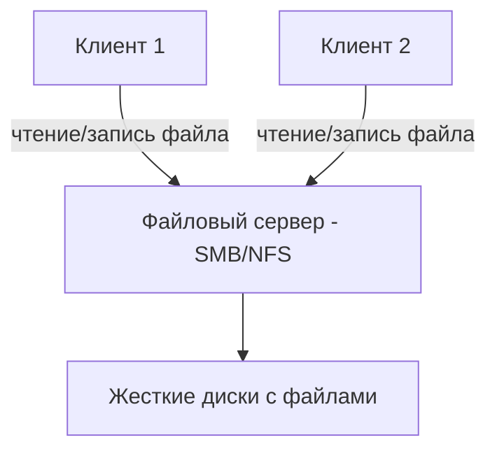
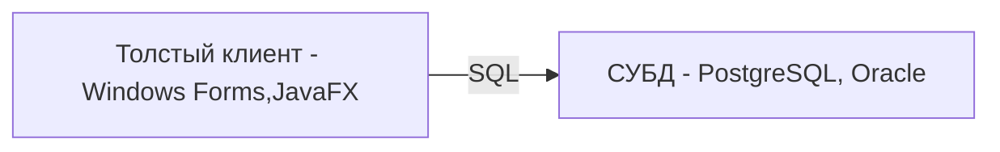
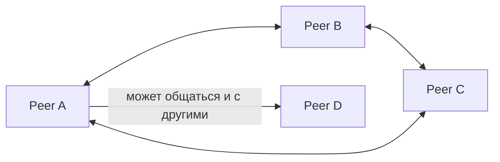

## Файл-серверная архитектура (File‑Server Architecture)

Файл-серверная архитектура — исторически одна из первых. В ней есть центральный сервер, который хранит файлы (документы, базы данных в виде файлов, изображения), а клиенты обращаются к этим файлам напрямую по сети, используя сетевые протоколы (SMB/CIFS в Windows, NFS в Unix).

Как это работает:
1. Клиент (приложение на ПК) запрашивает файл по сети, указывая путь.
2. Сервер (файловый сервер) передаёт весь файл (или его часть) клиенту.
3. Клиент сам открывает файл, интерпретирует его структуру и производит изменения.
4. Если клиент модифицирует файл, он отправляет обратно либо весь файл целиком, либо заблокированную область (в зависимости от протокола).

### Принцип работы
Вся логика обработки данных сосредоточена на клиенте. Сервер — это просто хранилище с сетевым доступом.

Если клиент — это приложение "1С:Предприятие" в файловом режиме, то оно само парсит файлы базы данных (1CD), само ищет записи, само применяет блокировки.

### Преимущества
- Предельная простота реализации.
- Нет необходимости устанавливать и поддерживать серверную СУБД или сервер приложений.
- Низкий порог входа — файловый сервер можно поднять на любом компьютере.

### Недостатки
- Колоссальный сетевой трафик — при чтении одной записи передаётся целый файл или его большой блок.
- Блокировки на уровне файлов — если клиент А открыл файл, клиент Б часто не может его изменить.
- Отсутствие транзакций, согласованности и изоляции уровня БД.
- Невозможность масштабирования — файловый сервер становится узким местом.
- Низкая безопасность — учётные записи управляются средствами файловой системы, нет тонкой авторизации.

### Где встречается сегодня
- Небольшие офисы (до 5–10 пользователей), где используется файловый режим 1С.
- Домашние сетевые папки (NAS).
- Хранилища документов (например, внутренние вики, которые хранят файлы на общей шаре).

### Что делать аналитику, если предлагают файл‑сервер
Почти всегда можно сказать уверенное "нет" для production систем с более чем 5 пользователями. Альтернатива — клиент-серверная архитектура с СУБД.

## Клиент-серверная архитектура (Client‑Server Architecture)

Это самая распространённая архитектура для корпоративных информационных систем. В ней есть отдельный сервер (или несколько серверов), который выполняет основную работу: хранит данные, обрабатывает запросы, обеспечивает целостность и безопасность. Клиенты — это тонкие приложения, которые только отправляют запросы и отображают результаты.

**Двухзвенная модель (2‑tier):**
Клиент (например, приложение на C# или JavaFX) напрямую обращается к серверу баз данных (СУБД) и выполняет SQL-запросы. Это простейший вариант клиент-сервера.

**Трёхзвенная модель (3‑tier):**
Более современная. Между клиентом и БД появляется **сервер приложений**, который содержит бизнес-логику. Клиент общается с сервером приложений по высокоуровневому протоколу (HTTP, gRPC), а сервер приложений — с БД.

### Принцип работы
- **Сервер** (БД или сервер приложений) обрабатывает запросы и возвращает только результат.
- **Клиент** не содержит бизнес-логики (в тонком клиенте) или содержит минимальную логику представления (в толстом клиенте с 2‑tier, что не рекомендуется).
- Данные не передаются целиком — только ответы на запросы.

### Преимущества
- Низкий сетевой трафик.
- Централизованные данные (единый источник истины).
- Поддержка транзакций (ACID) на уровне БД.
- Масштабируемость (можно добавить несколько серверов приложений или реплик БД).
- Безопасность (авторизация на уровне сервера, шифрование каналов).

### Недостатки
- Сложнее в реализации.
- Требует администрирования СУБД и сервера приложений.
- При 2‑tier толстый клиент всё ещё может содержать SQL‑код, что усложняет обновление схемы БД.

### Где встречается сегодня
- Веб-приложения (весь современный интернет — браузер ↔ сервер приложений ↔ БД).
- Мобильные приложения, которые общаются с бэкендом по HTTP.
- Корпоративные системы (ERP, CRM), построенные на Java/.NET с сервером приложений.

### Когда выбирать
Клиент-сервер — выбор по умолчанию для большинства приложений. Если требуется централизованное хранение, масштабирование, поддержка многих пользователей — начинайте с него.

## Peer‑to‑Peer (P2P) архитектура

Peer‑to‑Peer (P2P) — это отказ от центрального сервера. Все участники (пиры) равноправны. Каждый пир может выступать и клиентом, и сервером: запрашивать данные у других пиров и предоставлять свои данные.

Как это работает:
- В сети нет единого центра (или центр используется только для координации при старте — трекер или распределённая хеш-таблица DHT).
- Каждый пир хранит свою часть данных (или, в некоторых системах, все данные).
- Поиск ресурсов осуществляется распределённо: пир обращается к другим пирам, те передают запрос дальше (gossip / flooding) или используется DHT для быстрого нахождения, у кого есть нужный блок.

### Принцип работы (на примере BitTorrent)
1. Клиент получает `.torrent`-файл или magnet‑ссылку, содержащую хеш контента и адрес трекера (или информацию из DHT).
2. Клиент подключается к трекеру (или DHT) и узнаёт адреса других пиров, у которых есть нужные фрагменты.
3. Клиент одновременно скачивает разные фрагменты с нескольких пиров и одновременно отдаёт уже скачанные фрагменты другим.

### Преимущества
- Отсутствие единой точки отказа (нет центрального сервера).
- Горизонтальная масштабируемость: чем больше пиров, тем выше общая пропускная способность.
- Дешевизна: затраты на серверы ложатся на участников сети.
- Живучесть: даже если часть узлов отключилась, сеть продолжает работу.

### Недостатки
- Сложность координации (нужны распределённые алгоритмы — DHT, консенсус, gossip).
- Сложность обеспечения безопасности (как доверять данным от другого пира?).
- Нет единого владельца данных, проблемы с авторскими правами.
- Трудно применять там, где нужна строгая консистенция (финансы, заказы).

### Где встречается сегодня
- Файлообменные сети (BitTorrent, eMule).
- Блокчейн (Bitcoin, Ethereum) — тоже P2P с элементами консенсуса.
- Мессенджеры с децентрализованной архитектурой (Matrix, Tox).
- Корпоративные системы кэширования (в некоторых CDN пиры обмениваются контентом).

### Когда рассматривать P2P
- Распространение больших объёмов данных (обновления ПО, дистрибутивы Linux).
- Децентрализованные приложения (dApps), где нужна устойчивость к цензуре.
- Локальные сети в офисах для быстрого обмена большими файлами.

Однако для классических транзакционных систем (интернет-магазин, банк, CRM) P2P не подходит из‑за сложности обеспечения консистенции и авторизации.

## Сравнение архитектур

| Характеристика | Файл-сервер | Клиент-сервер (2‑tier) | Клиент-сервер (3‑tier) | Peer‑to‑Peer |
| :--- | :--- | :--- | :--- | :--- |
| **Распределение логики** | Вся логика на клиенте | Бизнес-логика в клиенте (или в хранимых процедурах) | Бизнес-логика на сервере приложений | Логика распределена по всем пирам |
| **Сетевой трафик** | Огромный | Средний | Низкий (только результат) | Средний (обмен блоками) |
| **Единая точка отказа** | Файловый сервер | СУБД | СУБД или сервер приложений | Нет (теоретически) |
| **Транзакции / консистенция** | Нет (блокировки файлов) | Да (ACID на уровне СУБД) | Да | Сложно (нужны распределённые протоколы) |
| **Масштабируемость** | Низкая | Вертикальная | Горизонтальная (сервер приложений) | Высокая (горизонтальная) |
| **Безопасность** | Низкая | Средняя | Высокая | Низкая (сложно авторизовать) |
| **Сфера применения** | Локальные офисы (1–10 ПК) | Настольные приложения с БД | Веб-сервисы, микросервисы | Файлообмен, блокчейн |
## Вывод для аналитика

1. **Файл-сервер** — наследие прошлого. Используйте его только для очень маленьких рабочих групп, где нет выбора (например, устаревшая 1С). При росте нагрузки или количества пользователей сразу упираетесь в ограничения.

2. **Клиент-сервер (2‑tier)** — исторически важный этап, но сейчас почти всегда выбирают 3‑tier. Толстый клиент с прямой связью с БД создаёт проблемы с развёртыванием, безопасностью и масштабированием.

3. **Клиент-сервер (3‑tier)** — архитектурный стандарт для современных веб‑приложений, мобильных приложений и корпоративных сервисов. Сервер приложений (бэкенд) отделяет бизнес-логику от клиента и базы данных, что даёт гибкость, масштабируемость и безопасность.

4. **Peer‑to‑Peer** — нишевая архитектура для распределённых систем, где важен отказ от центра и горизонтальная масштабируемость за счёт участников. Не пытайтесь построить на P2P обычный интернет-магазин.