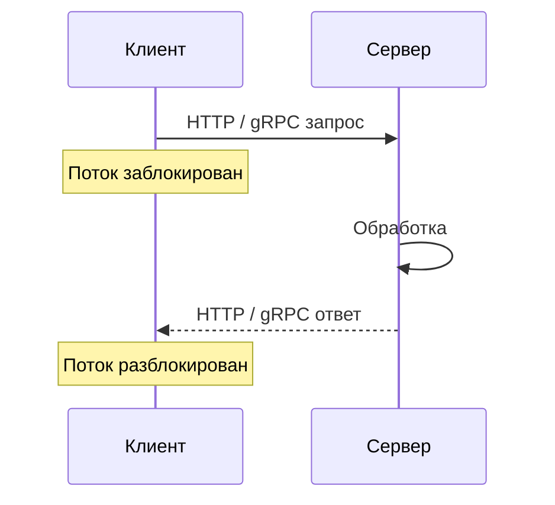
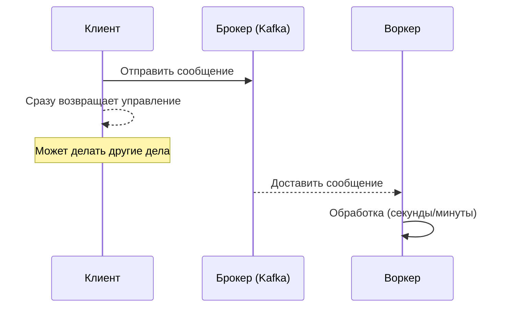

## Основные свойства информационных систем

Когда аналитик проектирует или оценивает информационную систему (ИС), он оперирует не только функциональными требованиями ("система должна отправлять email"), но и фундаментальными свойствами, которые определяют, как система будет вести себя под нагрузкой, на каких принципах строить её архитектуру и где скрыты риски.

Эти свойства не являются взаимоисключающими — любая система обладает всеми ими в той или иной степени. Понимание каждого помогает принимать осознанные архитектурные решения.

## Синхронное vs асинхронное взаимодействие

Способ, которым компоненты системы обмениваются данными, фундаментально влияет на её производительность, отказоустойчивость и связанность.

### Синхронное взаимодействие (RPC)

**RPC (Remote Procedure Call)** — это вызов удалённой процедуры, при котором вызывающий поток блокируется и ждёт ответа. В современных системах это чаще всего реализовано через HTTP/REST или gRPC.

Как это работает:
- Клиент отправляет запрос.
- Клиент ждёт ответа, занимая ресурсы (поток, сетевое соединение).
- Сервер обрабатывает запрос.
- Сервер возвращает ответ.
- Клиент продолжает работу.

#### Преимущества синхронного подхода
- Простая ментальная модель (как вызов обычной функции).
- Легко отлаживать, легко понять последовательность действий.
- Нет дополнительной инфраструктуры (очередей, брокеров).

#### Недостатки синхронного подхода
- Каскадные отказы: если сервер Б упал, то и сервер А, который его вызывает, тоже падает.
- Сетевые задержки суммируются.
- Клиент занимает ресурс на всё время ожидания, что ограничивает масштабируемость.
- Тесная связанность: вызывающий сервис знает о вызываемом сервисе.

### Асинхронное взаимодействие (очереди, события)

Асинхронное взаимодействие использует брокер сообщений (Kafka, RabbitMQ) или шину событий. Клиент отправляет сообщение и не ждёт ответа; обработка происходит отдельно, часто в фоновом процессе.

#### Преимущества асинхронного подхода
- Слабая связанность: отправитель не знает о получателе.
- Устойчивость к сбоям: если воркер упал, сообщение остаётся в очереди и будет обработано позже (persistent queue).
- Сглаживание пиков: очередь может накапливать сообщения во время всплеска нагрузки.
- Параллелизм: можно запустить несколько воркеров для обработки очереди.

> Воркер  — приложение, которое выполняет задачи или обрабатывает данные в фоновом режиме без прямого взаимодействия с пользователем.

#### Недостатки асинхронного подхода
- Сложнее отлаживать (нужна распределённая трассировка, correlation ID).
- Eventual consistency: данные могут быть согласованы не мгновенно.
- Дополнительная инфраструктура (брокер) и операции (сборка пайплайнов).
- Retry и идемпотентность обязательны.

### Что выбрать аналитику

| Сценарий | Предпочтительный подход |
| :--- | :--- |
| Операции, требующие мгновенного ответа (проверить баланс, оформить заказ) | Синхронный (RPC) |
| Долгие фоновые задачи (отправка email, генерация отчёта) | Асинхронный (очередь) |
| Потоковая обработка событий (метрики, логи) | Асинхронный (Kafka) |
| Внешняя интеграция, где надёжность важнее скорости | Асинхронный (гарантия доставки) |
| Простые CRUD-приложения | Синхронный (хватит HTTP) |

На практике часто используют оба подхода. Например, запрос на оформление заказа обрабатывается синхронно, а уведомления и обновление склада — асинхронно.

## Data-intensive vs Compute-intensive приложения

Это различие определяет, где главные затраты в системе: на передачу и хранение данных или на вычисления.

### Data-intensive applications

**Data-intensive** приложения — это те, где главная проблема — объём, сложность или скорость изменения данных. Типичные примеры: социальные сети, интернет-магазины, банковские системы, аналитика (Data Warehouse).

Что для них важно:
- Объём данных (терабайты, петабайты).
- Скорость поступления данных (сколько записей в секунду).
- Сложность запросов (агрегации, аналитика).
- consistency и изоляция транзакций.

**Архитектурные акценты:**
- Выбор базы данных (SQL vs NoSQL, колоночная vs строковая).
- Шардирование, репликация.
- Кэширование (Redis, CDN).
- ETL/CDC пайплайны.

### Compute-intensive applications

**Compute-intensive** приложения — это те, где главный ресурс — вычислительная мощность CPU, GPU или время работы сложных алгоритмов. Примеры: машинное обучение (обучение моделей), геномика, симуляции физических процессов, рендеринг видео, криптография.

Что для них важно:
- Скорость выполнения одного алгоритма.
- Эффективность распараллеливания.
- Доступ к GPU, специализированным инструкциям.

**Архитектурные акценты:**
- Распараллеливание (MPI, OpenMP).
- Использование GPU (CUDA, OpenCL).
- Горизонтальное масштабирование вычислений (Hadoop, Spark).
- Передача данных на вычислители ближе к месту хранения (data locality).

### Гибриды: оба типа одновременно

Многие современные системы сочетают оба типа. Например, обучение нейросети — compute-intensive, а хранение и предобработка датасета — data-intensive. Система рекомендаций должна и быстро читать данные (data-intensive), и применять сложную модель (compute-intensive).

Для аналитика это различие полезно, чтобы понимать, где искать узкое место. Если система тормозит, но CPU простаивает — скорее всего, проблема в данных (сетевой I/O, медленные запросы к БД). Если CPU на 100% — проблема в вычислениях.

## Read ratio vs Write ratio

Соотношение операций чтения и записи — один из самых простых, но важных показателей. Он определяет выбор базы данных, стратегию масштабирования и даже архитектурный стиль.

### Что это

- **Read ratio** — доля операций чтения (SELECT, GET).
- **Write ratio** — доля операций записи (INSERT, UPDATE, DELETE).

Сумма 100%. Например, 90% чтения и 10% записи.

### Почему это важно

Разные СУБД оптимизированы под разные паттерны.

- **Больше чтений, мало записей.** Типично для каталогов, поиска, отчётов.
  - Решение: репликация БД (один мастер на запись, много реплик на чтение).
  - Кэширование (Redis, CDN).
  - Денормализация схемы.

- **Больше записей, мало чтений.** Типично для систем логирования, телеметрии, аудита.
  - Решение: колоночные или распределённые AP-базы (Cassandra, ClickHouse).
  - Append-only структуры (без UPDATE).
  - Отказ от сложных индексов.

- **Баланс чтения и записи.** Типично для финансовых систем, заказов.
  - ACID транзакции, нормализованная схема.
  - Тяжёлое масштабирование — скорее вертикальное или шардирование.

### Примеры архитектурных решений

| Соотношение | Что выбрать | Что не подойдёт |
| :--- | :--- | :--- |
| 90% чтения, 10% записи | Реплики БД, Redis, CDN | Высоконагруженный master с ACID |
| 90% записи, 10% чтения | Cassandra, Kafka, ClickHouse | Тяжёлая реляционная БД без шардирования |
| 50/50 | PostgreSQL с вертикальным масштабированием или шардированием | Cassandra (плохо с JOIN и транзакциями) |

## RPC в деталях (Remote Procedure Call)

RPC — это не технология, а концепция. Клиент вызывает функцию на удалённом сервере так же, как локальную. Задача RPC-фреймворка — сделать сетевой вызов прозрачным.

### Как устроен RPC

1. Клиент вызывает заглушку (stub) — локальный объект с тем же интерфейсом, что и удалённый сервис.
2. Заглушка сериализует параметры вызова (marshalling) и отправляет их серверу.
3. Сервер принимает вызов, десериализует параметры.
4. Выполняется реальный метод.
5. Результат сериализуется и отправляется обратно клиенту.
6. Заглушка клиента десериализует ответ и возвращает результат.

### Популярные RPC-фреймворки

- **gRPC** (Google) — использует Protocol Buffers, бинарный протокол, высокопроизводительный, поддерживает потоковую передачу.
- **JSON-RPC** (прост) — легковесный, поверх HTTP или TCP.
- **BJSON-RPC** (вариант для бинарной сериализации).
- **XML-RPC** (старый, в новых проектах не используют).
- **RMI (Java)** — только для Java-to-Java, устарел.

### RPC vs REST

| Аспект | RPC (gRPC) | REST |
| :--- | :--- | :--- |
| Семантика | Вызов метода | Работа с ресурсами (GET, POST, PUT, DELETE) |
| Протокол | HTTP/2 (бинарный) | HTTP/1.1 (текстовый) обычно |
| Идемпотентность | Не заложена (кроме особых методов) | Есть (GET, PUT, DELETE — идемпотентны) |
| Кеширование на клиенте | Нет | Да (HTTP cache headers) |
| Скорость (сериализация) | Высокая (Protobuf) | Низкая (JSON/XML) |
| SDK | Генерируется автоматически | Часто нужны сторонние генераторы (OpenAPI) |

Что выбрать:

- **RPC (gRPC)** — для высоконагруженных внутренних микросервисов, где важна производительность.
- **REST** — для публичных API, которые будут использоваться разными клиентами (браузеры, мобильные приложения) — из-за встроенного кеширования, идемпотентности и понятности.

## Резюме для аналитика

При проектировании или анализе системы обязательно пройдитесь по трём описанным осям:

1. **Синхронный vs асинхронный.** Определите, какие операции требуют мгновенного ответа, а какие могут быть отложены. Синхронные вызовы — REST или gRPC. Асинхронные — очереди (RabbitMQ, Kafka), + идемпотентность и outbox.

2. **Data-intensive vs Compute-intensive.** Если в системе данные измеряются терабайтами и главная проблема — объём, выбирайте БД, шардирование, кэширование. Если узкое место — CPU и время выполнения алгоритмов, может потребоваться GPU, распараллеливание или переписывание кода на более эффективном языке.

3. **Read/write ratio.** Соотношение определяет выбор репликации, кэшей, денормализации. Не спросив об этом, архитектор может заложить в дизайн неправильную базу данных.