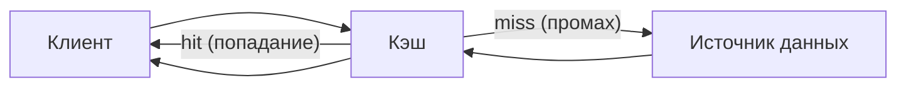
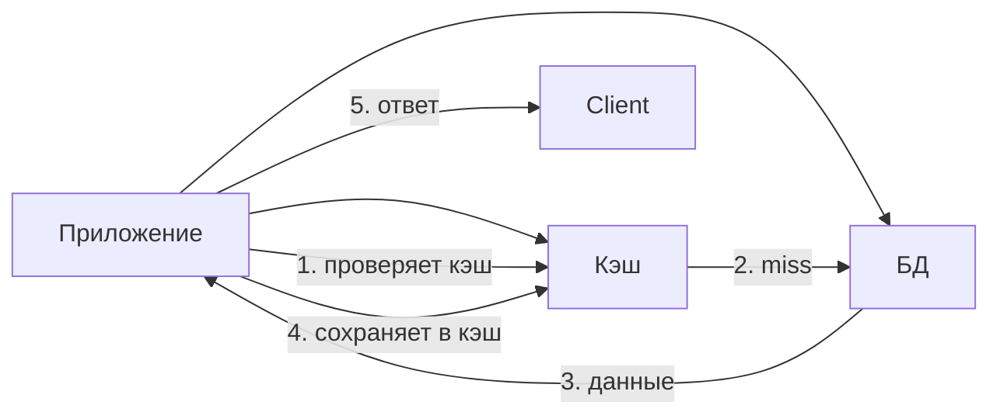

## Кэширование

Представьте, что вы каждый день заказываете один и тот же кофе в одной и той же кофейне. Бариста каждый раз заново мелет зёрна, варит напиток, моет посуду. А мог бы просто помнить ваш заказ и выдавать готовый кофе за секунду. Кэширование делает то же самое в цифровом мире: сохраняет результат дорогой операции, чтобы при повторном запросе отдавать его мгновенно, не выполняя работу заново.

**Кэширование** — это техника временного хранения копии данных в быстром (но дорогом) хранилище, чтобы избежать повторных обращений к медленному (но дёшевому) источнику: диску, базе данных, внешнему API.

## Принципы работы кэширования

Кэш — это промежуточный слой между клиентом и источником данных (медленным хранилищем), который хранит копии часто запрашиваемых данных.



Два исхода запроса к кэшу:

- **Cache hit (попадание).** Данные есть в кэше. Кэш мгновенно возвращает их клиенту. Время ответа — единицы микросекунд (если кэш в памяти) или миллисекунды (если кэш на SSD). Источник данных не трогается.
- **Cache miss (промах).** Данных в кэше нет (или они уже удалены). Кэш обращается к исходному источнику (БД, диск, API), забирает данные, сохраняет их в кэш (на время TTL) и возвращает клиенту.

Коэффициент попаданий (hit ratio) — процент запросов, обслуженных из кэша. Хороший hit ratio — обычно 80-95% и выше, в зависимости от характера данных.

### Ключевые идеи

- Кэш всегда **быстрее** источника (иначе он бесполезен).
- Кэш всегда **меньше** источника (нельзя сохранить все данные).
- Кэш хранит данные **ограниченное время** (TTL — Time to Live), потому что данные в источнике могут измениться.

## Виды кэша по расположению

### 1. Браузерный кэш (Client‑side cache)

Браузер сохраняет статические ресурсы (HTML, CSS, JS, изображения) на диске пользователя. При повторном визите страница загружается с диска, а не из интернета.

**Механизм:** HTTP-заголовки `Cache-Control: max-age=3600`, `ETag`, `Last-Modified`. Сервер говорит браузеру, как долго можно хранить файл.

**Плюсы:** Не нагружает сервер и сеть, мгновенный повторный просмотр страницы.

**Минусы:** При обновлении сайта пользователь может некоторое время видеть старую версию (пока кэш не протухнет или не принудительно обновится).

### 2. Кэш на уровне сервера (Application / Server cache)

Данные хранятся в памяти или на диске того же сервера, где работает приложение (in‑process cache) или в соседнем процессе (out‑of‑process cache).

**In‑process кэш:** использует память самого приложения (например, Caffeine в Java, LRU cache в Python). Очень быстрый, но не разделяется между разными экземплярами приложения.

**Out‑of‑process кэш:** отдельный сервис, например, Redis или Memcached. Доступен всем экземплярам приложения, но требует сетевого вызова.

### 3. Кэш в базе данных (Database cache)

Сама СУБД имеет внутренний кэш (буферный пул страниц — data buffer cache). Например, PostgreSQL кэширует часто используемые страницы в памяти, чтобы не читать с диска. Аналитик может управлять им через выделение памяти (`shared_buffers`, `effective_cache_size`).

Также существуют внешние кэши для БД, например, для MySQL — ProxySQL с кэшем результатов запросов.

### 4. CDN (Content Delivery Network)

CDN — это географически распределённый кэш статических (и иногда динамических) ресурсов. Ресурс кэшируется на серверах CDN по всему миру, и пользователь получает его из ближайшей точки присутствия.

**Пример:** Загрузка картинки, библиотеки Bootstrap, видео. CDN берёт ресурс с origin‑сервера, сохраняет у себя, а затем отдаёт пользователям.

**Плюсы:** Огромное ускорение для глобальной аудитории, снижение нагрузки на origin.

**Минусы:** Инвалидация кэша на всех точках присутствия может занимать минуты.

## Какие данные кэшировать

Не любые данные выигрывают от кэширования. Кэшировать имеет смысл, когда:

1. **Данные читаются многократно**, а записываются редко (read‑heavy). Хороший кандидат: каталог товаров, профили пользователей, статические страницы.
2. **Чтение дешёвое?** Нет, чтение на самом деле дорогое: сложный SQL-запрос, внешний API с задержками, чтение с диска.
3. **Данные не меняются или меняются предсказуемо.** Идеально — reference data (коды валют, страны).
4. **Допустима eventual consistency (нестрогая свежесть).** Пользователь может увидеть не самую новую цену товара в течение нескольких секунд.

**Категорически не подходят для кэширования:**

- Данные, которые меняются каждую секунду (котировки, показатели датчиков, чаты).
- Данные, требующие строгой актуальности (проверка баланса, статус платежа, остатки на складе — обычно).

## Стратегии взаимодействия с кэшем (механизмы чтения-записи)

### Look‑aside / Cache‑aside (самый распространённый)

Приложение сначала обращается к кэшу. Если данных нет, читает из основного хранилища, кладёт в кэш (с TTL) и возвращает клиенту. При записи сначала записывает в хранилище, потом удаляет (или обновляет) запись в кэше.

**Плюсы:** Просто, адаптируется к разным паттернам доступа. Минусы: первый запрос после записи всегда будет промахом (но это нормально).



### Read‑through

Приложение работает только с кэшем. Кэш сам при промахе обращается к хранилищу, загружает данные, сохраняет их и возвращает. Приложение не знает о промахе.

**Плюсы:** Приложение ещё проще, логика выноса в кэш.

**Минусы:** Меньше контроля над тем, когда загружать данные.

### Write‑through

При записи приложение пишет и в кэш, и в хранилище (синхронно). Данные в кэше всегда актуальны.

**Плюсы:** Кэш всегда тёплый (свежий). Минусы: Задержка на запись увеличивается (ждём оба хранилища).

### Write‑behind / Write‑back

Приложение пишет только в кэш, а кэш асинхронно (с задержкой, пачкой) сбрасывает данные в основное хранилище.

**Плюсы:** Очень быстрая запись. Минусы: При падении кэша (до сброса) данные теряются. Сложность реализации. Используется редко, в основном в специализированных системах.

### Refresh‑ahead

Кэш автоматически подгружает данные до того, как они истекут, предполагая, что они скоро понадобятся (например, на основе статистики). Используется в продвинутых кэшах, редко в стандартных конфигурациях.

## Очистка кэша (инвалидация)

Инвалидация — это процесс удаления устаревших данных из кэша. Одна из самых сложных проблем в компьютерных науках.

### По времени (TTL)

Самый простой метод. Данные удаляются через фиксированное время после помещения в кэш (TTL). Подходит, если допустима eventual consistency.

Примеры: `expire` в Redis, `Cache-Control: max-age` в HTTP.

### По событию (event‑based)

При изменении данных в источнике приложение (или триггер в БД) отправляет сигнал, по которому кэш удаляет соответствующий ключ.

**Шаблоны:**

- **Сброс по команде.** При обновлении записи в БД приложение удаляет ключ из кэша.
- **CDC (Change Data Capture).** Специальный сервис (Debezium) читает лог изменений БД и отправляет события в кэш (или в шину), которые инвалидируют устаревшие записи.

### По алгоритму вытеснения (eviction)

Когда кэш заполнен, он должен вытеснять какие‑то данные, чтобы освободить место.

## Алгоритмы вытеснения данных (Eviction policies)

### LRU (Least Recently Used)

Удаляется элемент, который дольше всего не запрашивался. Самый популярный алгоритм в кэшах общего назначения. Хорошо работает, когда доступ к данным имеет временную локальность (недавно востребованные данные снова понадобятся).

### LFU (Least Frequently Used)

Удаляется элемент, который реже всего запрашивался за всё время. Требует подсчёта частоты. Есть недостаток: данные, часто используемые в прошлом, могут навсегда остаться в кэше, даже если перестали быть нужными.

### FIFO (First In, First Out)

Удаляются самые старые данные (по времени помещения). Просто, но не учитывает популярность.

### TTL (время жизни)

Данные удаляются по истечении заданного интервала времени после помещения в кэш (не путать с вытеснением, это способ инвалидации, а не реакция на переполнение).

### По размеру (Size‑based)

Удаляются самые большие по размеру объекты, чтобы освободить место для маленьких. Применяется нечасто, но иногда полезно для хранения изображений.

Redis поддерживает `maxmemory-policy volatile-lru`, `allkeys-lfu` и другие комбинации.

## Виды кэша: внутренний и внешний

### Внутренний кэш (In‑memory cache)

Размещается в памяти того же процесса, что и приложение. Например, кэш на основе `ConcurrentHashMap` в Java.

**Плюсы:** Минимальная задержка (нет сетевого вызова), простота.

**Минусы:** Память ограничена, кэш не разделяется между экземплярами приложения; при перезапуске приложения кэш теряется.

**Применение:** Маленькие приложения (один экземпляр), супер‑быстрая обработка, статистика, настройки (которые меняются редко).

### Внешний кэш (External cache)

Выделенный сервис, доступный по сети: Redis, Memcached, Hazelcast.

**Плюсы:** Общий для множества экземпляров приложения, бо́льшая ёмкость (можно наращивать), может кластеризоваться и быть отказоустойчивым (Replica, Sharding).

**Минусы:** Сетевой вызов (дополнительные миллисекунды), сложность эксплуатации.

## Кэширование ошибок (Error caching)

Важная, но часто игнорируемая тема: при ошибке в исходном источнике (БД недоступна, API вернул 5xx) можно кэшировать сам факт ошибки, чтобы не бомбить проблемный ресурс.

**Простой пример:** Внешний API часто падает с таймаутом. После трёх ошибок кэшируем результат "ошибка" на 10 секунд, чтобы не вызывать API каждую миллисекунду и дать ему восстановиться.

```python
if cache.get(key) == "error":
    return fallback_value
else:
    try:
        result = remote_api.call()
        cache.set(key, result, ttl=60)
    except Exception:
        cache.set(key, "error", ttl=10)
        raise
```

**Когда полезно:** Защита внешних зависимостей от перегрузки при их сбое, снижение нагрузки на логгеры и мониторинг.

## Что такое CDN (уже упомянули, но добавим детали)

CDN (Content Delivery Network) — это распределённый кэш, размещённый в точках присутствия (PoP) по всему миру. Идеален для статического контента (изображения, видео, CSS, JS, шрифты). Некоторые CDN умеют кэшировать и динамический HTML (при этом используется подход: динамический запрос идёт до origin, а статика отдаётся из кэша).

**Пример работы CDN:**
- Пользователь в Москве запрашивает `https://cdn.example.com/logo.png`.
- DNS направляет его на ближайший PoP (Edge сервер).
- Если на Edge есть `logo.png` — отдаётся мгновенно.
- Если нет — Edge сервер идёт к origin (ваш сервер), забирает файл, сохраняет у себя (на несколько часов/дней) и отдаёт пользователю. Следующие пользователи получат файл из кэша Edge.

**Плюсы CDN:** Огромное ускорение для глобальной аудитории, снижение нагрузки на origin, защита от DDoS.

**Минусы CDN:** Инвалидация кэша по всему миру может занимать минуты (пока запрос на инвалидацию дойдёт до всех PoP). Стоимость может быть высокой при больших объёмах трафика.

## Кэширование в базах данных (кэш БД)

СУБД сами активно кэшируют данные:

- **Buffer Pool** (PostgreSQL, MySQL, Oracle) — кэш страниц данных. Когда приложение читает строку, СУБД загружает страницу целиком (обычно 8 КБ) в буферный пул. Следующие чтения с той же страницы происходят из памяти.
- **Кэш планов запросов (query plan cache).** «Подготовленный» план запроса хранится в памяти, чтобы не парсить и не оптимизировать повторный запрос заново.
- **Кэш результатов** (некоторые системы, например, Oracle Exadata). Промежуточные результаты.

Аналитик может влиять на размер и политику этих кэшей через конфигурационные параметры (например, `shared_buffers` в PostgreSQL или `innodb_buffer_pool_size` в MySQL).

## Сравнение стратегий взаимодействия с кэшем

| Стратегия | Чтение | Запись | Консистентность | Сложность |
| :--- | :--- | :--- | :--- | :--- |
| **Cache‑aside** | Приложение управляет кэшем | Приложение удаляет/обновляет кэш | Ручная инвалидация | Средняя |
| **Read‑through** | Кэш сам загружает данные | Приложение пишет через кэш (write‑through) или напрямую | Согласованность при write‑through | Выше |
| **Write‑behind** | Через кэш | Кэш пишет асинхронно | Eventual | Высокая |
| **Refresh‑ahead** | Автоматическая предзагрузка | Не влияет | Eventual | Высокая (продвинутый) |

## Резюме

Кэширование — это мощнейший инструмент для снижения задержки и нагрузки на систему. Но оно требует дисциплины: нужно понимать, какие данные кэшировать, сколько времени их хранить, как инвалидировать и какую стратегию вытеснения выбрать.

**Что должен знать аналитик:**

- Кэшировать имеет смысл данные, которые часто читаются и редко пишутся (read‑heavy).
- Кэш всегда должен иметь TTL (максимальное время жизни), иначе рискуете получить устаревшие данные навсегда.
- Нужно различать внутренний (in‑process) кэш и внешний (Redis, Memcached) — они решают разные задачи (связность vs разделение между экземплярами).
- Стратегия взаимодействия с кэшем (look‑aside, read‑through, write‑through) зависит от требований к консистентности и производительности записи.
- Инвалидация кэша — это самая сложная часть; избегайте сложных схем, отдавайте предпочтение простым TTL или явным сбросам по событиям.
- CDN — это тоже кэш, он критически важен для глобальных приложений.
- Кэширование ошибок защищает внешние зависимости от перегрузки и ускоряет восстановление.

При проектировании системы всегда ищите возможности добавить кэш там, где это разумно, но помните: добавление любого кэша увеличивает сложность и требует мониторинга (hit ratio, размер кэша, количество ошибок инвалидации). Не кэшируйте всё подряд — кэшируйте только то, что даст максимальный выигрыш.