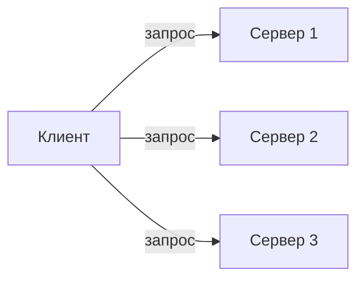
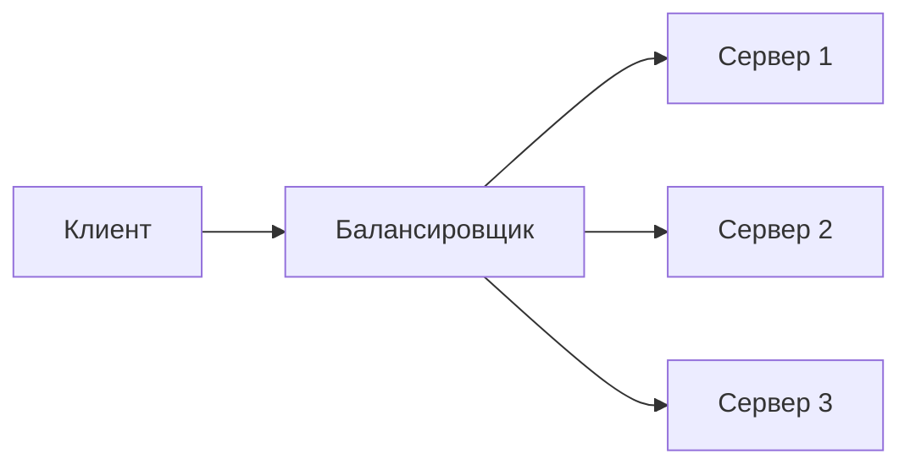

## Балансировка нагрузки

Представьте, что вы открыли несколько касс в супермаркете. Если покупатели будут сами выбирать, к какой кассе идти, одни кассиры будут перегружены, а другие — простаивать. Нужен администратор, который направляет покупателей к свободной кассе.

**Балансировка нагрузки** делает то же самое в цифровом мире: распределяет входящие запросы между несколькими серверами, чтобы ни один сервер не был перегружен, а пользователи получали быстрый и надёжный ответ.

Балансировка нагрузки — это фундаментальный компонент горизонтального масштабирования и обеспечения отказоустойчивости. Без неё добавление второго сервера не имеет смысла, потому что все запросы всё равно пойдут на один из них (обычно на первый в списке конфигурации). Хорошо спроектированная балансировка помогает системе расти плавно, оставаться доступной при падении отдельных узлов и доставлять запросы пользователям с минимальной задержкой.

## Клиентская vs серверная балансировка

Существует два принципиально разных подхода: когда решение о том, какой сервер вызвать, принимает сам клиент, и когда это делает выделенный компонент (балансировщик).

### Клиентская балансировка

Клиентской балансировкой называют ситуацию, когда сам клиент (или библиотека внутри него) знает список доступных серверов и выбирает один из них для отправки запроса.



**Как работает:**
- Клиент периодически получает от службы Service Discovery (например, Consul, etcd, база данных) актуальный список адресов и портов серверов.
- При каждом вызове клиент применяет один из алгоритмов балансировки (Round Robin, Random и т.д.) и отправляет запрос на выбранный адрес.
- При недоступности сервера клиент сам переключается на другой.

**Преимущества:**
- Нет дополнительного сетевого прыжка через центральный балансировщик — задержка минимальна.
- Балансировщик не является единой точкой отказа.
- Отлично масштабируется (клиентов может быть очень много, и это не нагружает инфраструктуру).

**Недостатки:**
- Клиент должен быть "умным" (поддерживать Service Discovery и алгоритмы балансировки).
- В разных языках (Go, Python, Java) логику нужно перереализовывать или подключать библиотеки.
- Сложнее контролировать распределение трафика централизованно.

**Где используется:** В микросервисной архитектуре, особенно внутри дата-центра, например, gRPC с балансировкой на стороне клиента, библиотека Finagle (Twitter), Kubernetes Service (в режиме client IP).

### Серверная балансировка

Серверная балансировка — это классический подход, при котором все запросы клиентов идут на выделенный балансировщик (или группу балансировщиков), а он уже перенаправляет их на серверы.



**Преимущества:**
- Клиенту не нужна логика балансировки — он просто обращается к одному адресу.
- Балансировщик может централизованно собирать метрики, логировать запросы, останавливать вредоносный трафик.
- Простота для клиента (браузер, мобильное приложение, внешний API).

**Недостатки:**
- Балансировщик — дополнительный сетевой прыжок (небольшая задержка).
- Балансировщик — единая точка отказа (требуется резервирование).
- При очень высоком трафике балансировщик может стать узким местом.

**Где используется:** Веб-приложения, API Gateway, вход для внешнего трафика (интернет). Самые популярные реализации: Nginx, HAProxy, AWS Application Load Balancer (ALB).

На практике часто комбинируют оба подхода:
- На входе во внешнюю сеть (Internet) ставится серверный балансировщик (Nginx, ALB).
- Внутри дата-центра микросервисы общаются через клиентскую балансировку (gRPC, Kubernetes Service), чтобы избежать лишних прыжков и точек отказа.

## Алгоритмы балансировки

Выбор алгоритма балансировки определяет, насколько равномерно нагрузка распределяется между серверами, как быстро система реагирует на отказы и насколько предсказуемо ведут себя пользователи (сохранение сессий).

### Random (случайный выбор)

Балансировщик выбирает сервер случайным образом (с равной вероятностью).

**Преимущество:** Простота; при большом количестве запросов распределение становится близким к равномерному.

**Недостаток:** Не учитывает загруженность серверов; при малом количестве запросов могут быть большие перекосы.

**Когда использовать:** В тестовых средах, или когда нагрузка очень высокая, и случайность гарантирует равномерность за счёт закона больших чисел.

### Round Robin (RR)

**Round Robin** — это алгоритм, при котором запросы распределяются по кругу по очереди: первый запрос на сервер 1, второй на сервер 2, третий на сервер 3, четвёртый снова на сервер 1 и так далее.

**Преимущество:** Простота и предсказуемость. Запросы распределяются равномерно, если все серверы одинаковой мощности и все запросы требуют примерно одинакового времени обработки.

**Недостаток:** Не учитывает разную мощность серверов и разную сложность запросов. Если один запрос выполняется 10 секунд, а другой 10 мс, алгоритм Round Robin всё равно будет чередовать их, и сервер, получивший "тяжёлый" запрос, может надолго зависнуть.

**Когда использовать:** По умолчанию. Опытные инженеры говорят, что Round Robin закрывает 80–90% потребностей в балансировке, особенно когда серверы примерно одинаковы и запросы лёгкие. Его можно смело выбирать на старте.

### Weighted Round Robin

Этот алгоритм — усовершенствование Round Robin, позволяющее задать вес (weight) для каждого сервера. Сервер с весом 2 получает в два раза больше запросов, чем сервер с весом 1.

**Пример:**
- Сервер А (вес 5)
- Сервер Б (вес 1)
- Заказы распределяются в пропорции 5:1.

**Преимущество:** Учитывает разную мощность серверов (например, старого и нового поколения).

**Недостаток:** Всё ещё не учитывает реальную загруженность серверов (один из них может обрабатывать долгие запросы, но вес останется прежним).

### Dynamic Round Robin / Least Load

Алгоритмы динамической балансировки учитывают реальную загруженность сервера (процент CPU, использование памяти, количество активных соединений или пользовательские метрики). Решение о направлении запроса принимается на основе текущей метрики.

**Примеры:**
- **Least Connections** — запрос направляется на сервер с наименьшим количеством активных соединений. Хорошо работает, когда запросы имеют сильно разную длительность.
- **Least Time** (быстрый ответ) — выбирается сервер не только с наименьшим числом соединений, но и с наименьшим средним временем ответа.

**Преимущество:** Наиболее равномерное распределение нагрузки в реальном времени.

**Недостаток:** Требует дополнительного мониторинга метрик и бóльших вычислительных затрат на балансировщике.

### Sticky Session (сессионная привязка)

Sticky Session не является алгоритмом балансировки в чистом виде, а скорее дополнением: пользователь "приклеивается" к одному серверу на всё время сессии. Балансировщик запоминает, какой сервер обслужил первый запрос пользователя, и все последующие запросы того же пользователя направляет на тот же сервер.

**Как привязывается:**
- По IP-адресу (ненадёжно, когда много пользователей за одним NAT).
- По cookie (балансировщик устанавливает специальную cookie, по которой идентифицирует сервер).

**Преимущество:** Позволяет хранить состояние сессии на сервере (локальная память) без необходимости синхронизации с Redis или другими общими хранилищами.

**Недостаток:** Нарушает равномерность распределения нагрузки — один активный пользователь может нагружать свой сервер, в то время как другие простаивают. При отказе сервера сессия теряется.

**Рекомендация:** По возможности избегайте Sticky Sessions. Современный подход — выносить состояние (сессии, корзины) в общее хранилище (Redis, memcached). Тогда любой сервер может обслужить любого пользователя, а балансировка остаётся равномерной.

### Power of Two Choices

Это вероятностный алгоритм, который сочетает простоту с хорошей равномерностью. Балансировщик случайно выбирает два сервера из пула и направляет запрос на тот, у которого меньше нагрузка (например, меньше активных соединений или ниже средняя задержка).

**Преимущество:** При очень больших нагрузках распределение получается значительно равномернее, чем при чистом Random, но алгоритм остаётся очень простым и быстрым.

**Где используется:** В распределённых системах, например, в библиотеке Finagle (Twitter), в некоторых реализациях gRPC.

## L4 и L7 балансировка

Балансировщики могут работать на разных уровнях сетевой модели OSI: транспортном (L4) и прикладном (L7). От этого зависят их возможности и производительность.

### L4 балансировка (TCP/UDP)

Балансировщик принимает TCP-соединение, устанавливает соединение с выбранным сервером и пересылает байты без анализа содержимого. Он не знает, что за протокол (HTTP, gRPC, WebSocket, PostgreSQL) и тем более не смотрит на URL или заголовки.

**Преимущества:**
- Высокая производительность (балансировщик не парсит данные).
- Работает с любым протоколом поверх TCP/UDP (базы данных, очереди, не только HTTP).

**Недостатки:**
- Не может маршрутизировать запросы по URL, заголовкам или кукам.

**Где используется:**
- AWS Network Load Balancer (NLB)
- HAProxy в режиме TCP
- Балансировка баз данных (например, PostgreSQL, MySQL с несколькими репликами)

### L7 балансировка (HTTP/HTTPS)

Балансировщик работает на уровне HTTP: разбирает запросы, читает заголовки, URL, cookies и может принимать решения на основе этого.

**Преимущества:**
- Возможность маршрутизации по пути (`/api/*` → один бэкенд, `/static/*` → другой).
- Поддержка Sticky Sessions на основе cookies.
- Терминация SSL/TLS (расшифровка трафика) на балансировщике.

**Недостатки:**
- Немного медленнее (требует разбора HTTP).
- Ограничен HTTP/HTTPS (для других протоколов не подходит).

**Где используется:**
- Nginx, HAProxy (в режиме HTTP), AWS Application Load Balancer (ALB).

## DNS балансировка

DNS-балансировка — самый простой и дешёвый способ распределить трафик на несколько серверов, но и самый ограниченный. DNS-сервер при запросе имени возвращает список IP-адресов (A-записей) и может менять их порядок.

**Как работает:**
- В DNS-зоне прописывается несколько A-записей для одного домена (например, `api.example.com` → 192.168.1.1, 192.168.1.2, 192.168.1.3).
- DNS-сервер возвращает их в случайном порядке (Round Robin на уровне DNS) или в фиксированном, но с учётом "географии" (GeoDNS).
- Клиент (браузер, библиотека) выбирает один из адресов (обычно первый) и подключается к нему.

**Преимущества:**
- Дешевизна, простота.
- Работает для любых протоколов (не только HTTP).
- Может распределять трафик по географическим регионам (GeoDNS).

**Недостатки:**
- DNS-записи кэшируются клиентами на уровне операционной системы, браузера, провайдера. При отказе сервера клиенты могут продолжать ходить на него минуты и даже часы (TTL).
- Нет учёта загруженности серверов.
- Нет возможности тонкой маршрутизации (L7).

**Когда использовать:** 
- Как географическое распределение (GeoDNS) для перенаправления пользователей в ближайший дата-центр.
- В сочетании с аппаратными или программными балансировщиками — DNS отдаёт IP-адреса балансировщиков, а уже они распределяют запросы внутри дата-центра.

## Инструменты балансировки: Nginx

Nginx — один из самых популярных программных балансировщиков (L7). Изначально он создавался как веб-сервер, но благодаря мощному модулю `upstream` стал стандартом де-факто для балансировки HTTP-трафика.

**Пример минимальной конфигурации (Round Robin):**

```nginx
http {
    upstream backend {
        server backend1.example.com;
        server backend2.example.com;
        server backend3.example.com;
    }

    server {
        listen 80;
        location / {
            proxy_pass http://backend;
        }
    }
}
```

**Weighted Round Robin:**

```nginx
upstream backend {
    server backend1.example.com weight=3;  # получает в 3 раза больше запросов
    server backend2.example.com weight=1;
    server backend3.example.com weight=1;
}
```

**Least Connections:**

```nginx
upstream backend {
    least_conn;
    server backend1.example.com;
    server backend2.example.com;
}
```

**Sticky Session с cookie:**

```nginx
upstream backend {
    server backend1.example.com;
    server backend2.example.com;
    sticky cookie srv_id expires=1h;
}
```

**Health checks (активные проверки):**

```nginx
upstream backend {
    server backend1.example.com max_fails=3 fail_timeout=30s;
    server backend2.example.com;
}
```

Nginx подходит для большинства сценариев L7-балансировки: микросервисные шлюзы (API Gateway), frontend-приложения, статические сайты, проксирование различных HTTP-сервисов. При очень высоких нагрузках (десятки тысяч запросов в секунду) дополнительно рассматривают HAProxy (более производительный L4/L7) или облачные балансировщики (AWS ALB, Google Cloud Load Balancing).

## Резюме

| Алгоритм / метод | Краткое описание | Основной плюс | Основной минус |
| :--- | :--- | :--- | :--- |
| Random | Случайный выбор сервера | Простота, равномерность при большом трафике | Перекосы при малом трафике |
| Round Robin (RR) | По очереди | Идеален для одинаковых серверов и запросов | Не учитывает разную нагрузку |
| Weighted Round Robin | RR с весами | Учитывает мощность серверов | Не учитывает реальную загруженность |
| Dynamic RR (Least Connections) | Выбор сервера с наименьшим числом соединений | Быстро адаптируется к разной длительности запросов | Требует метрик |
| Power of Two Choices | Случайный выбор двух серверов, отправка на менее загруженный | Ровнее Random при малой вычислительной сложности | Слегка сложнее Random |
| Sticky Session | "Приклеивание" пользователя к одному серверу | Позволяет хранить сессии локально | Нарушает равномерность, риск потери данных |
| L4 балансировка (TCP) | Работа на транспортном уровне | Высокая производительность, любой протокол | Не смотрит на URL/заголовки |
| L7 балансировка (HTTP) | Работа на прикладном уровне | Гибкая маршрутизация (URL, headers) | Медленнее, только HTTP/HTTPS |
| DNS балансировка | DNS возвращает несколько IP (Round Robin) | Очень дёшево, географическая маршрутизация | Кэширование DNS, нет отказоустойчивости |

### Что выбрать аналитику

- Для большинства веб-приложений (80–90% задач) подойдёт связка:
  - Round Robin (обычный или weighted) — если серверы одинаковые.
  - Least Connections — если запросы разной длительности.
  - L7-балансировка (Nginx/ALB) для гибкой маршрутизации и SSL termination.
- Sticky Sessions рекомендуется избегать в пользу общего хранилища сессий (Redis).
- Клиентскую балансировку используйте внутри дата-центра для микросервисов, чтобы убрать лишний прыжок и единую точку отказа.
- DNS-балансировка полезна для географического распределения и начальной маршрутизации, но не должна быть единственным средством отказоустойчивости.

Понимание этих механизмов поможет аналитику задавать правильные вопросы о масштабировании и отказоустойчивости, выбирать подходящие алгоритмы и инструменты и, когда потребуется, подключать команду инфраструктуры для настройки балансировки на раннем этапе проектирования, а не в момент аварии.