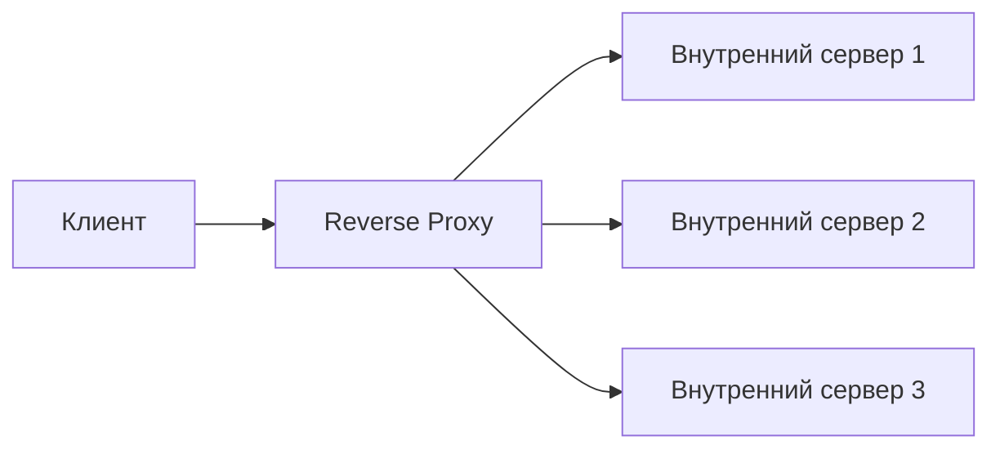

## Проксирование

Проксирование (от англ. proxy — «посредник») — это техника, при которой клиент обращается не напрямую к целевому серверу, а через промежуточный компонент — прокси-сервер. Прокси получает запрос, может его изменить, может принять решение о пересылке, может закэшировать ответ, может ограничить доступ или скрыть клиента от конечного сервера.

Проксирование — фундаментальный строительный блок многих архитектур: от корпоративных шлюзов до CDN и API Gateway. Понимание типов прокси и их возможностей помогает аналитику проектировать безопасные, масштабируемые и наблюдаемые системы, не вторгаясь в код клиента и сервера.

## Forward Proxy (Прямой прокси)

Forward Proxy — это прокси, который находится **перед клиентами**. Клиенты (браузеры, приложения) знают о существовании прокси и явно перенаправляют через него свои запросы во внешний мир (например, в интернет). С точки зрения сервера запрос выглядит так, как будто он пришёл от IP-адреса прокси, а не от реального клиента.


### Основные задачи Forward Proxy

1. **Анонимизация клиента.** Целевой сервер видит IP-адрес прокси, а не клиента. Это используется для обхода блокировок (но учтите, что это может нарушать законодательство) или для скрытия внутренней сети компании.

2. **Контроль доступа и фильтрация контента.** Прокси может блокировать запросы к определённым сайтам (социальные сети, порно, торренты) по корпоративной политике. Он также может проверять трафик на вирусы или вредоносные скрипты.

3. **Кэширование ответов.** Если несколько клиентов запрашивают один и тот же ресурс (например, популярный образ Docker), Forward Proxy может сохранить ответ и отдавать его из кэша, экономя трафик и ускоряя доступ.

4. **Аутентификация клиентов.** Перед выдачей доступа в интернет прокси может потребовать логин и пароль сотрудника.

5. **Обход географических ограничений.** Подключившись к прокси в другой стране, клиент может получить доступ к контенту, заблокированному в его регионе.

### Кому нужен Forward Proxy

- Корпоративные сети (прокси-сервер для выхода сотрудников в интернет, с фильтрацией и логированием).
- Провайдеры интернет-услуг (принудительный прокси с кэшированием).
- Технические специалисты и разработчики для отладки (например, Charles Proxy или Fiddler) — эти инструменты позволяют перехватывать, модифицировать и анализировать трафик между клиентом и внешним миром.

### Пример использования (для аналитика)

Если ваш проект предполагает доступ сотрудников к внешним API, а в компании принята политика фильтрации трафика — значит, на пути клиентских запросов стоит Forward Proxy (явно указанный в настройках или настроенный через PAC-файл). При отладке интеграции важно знать его наличие, чтобы правильно настраивать прокси-окружение для приложений.

## Reverse Proxy (Обратный прокси)

Reverse Proxy — это прокси, который находится **перед серверами**. Клиент ничего не знает о Reverse Proxy; он просто обращается к внешнему адресу (например, `https://api.example.com`). За этим адресом скрывается прокси, который перенаправляет запросы к одному или нескольким внутренним серверам.



### Основные задачи Reverse Proxy

1. **Балансировка нагрузки.** Reverse Proxy может распределять входящие запросы между несколькими бэкенд-серверами (Round Robin, Least Connections и другие алгоритмы), обеспечивая горизонтальную масштабируемость.

2. **Терминация SSL/TLS.** Прокси расшифровывает HTTPS-трафик (несёт дорогостоящую операцию), а внутренние серверы работают по незашифрованному HTTP, что разгружает их от криптографических вычислений. Также прокси централизованно управляет сертификатами.

3. **Кэширование ответов.** Reverse Proxy может кэшировать часто запрашиваемые страницы (например, главная страница сайта) и отдавать их без обращения к бэкенду, снижая нагрузку и время ответа.

4. **Защита бэкендов (скрытие инфраструктуры).** Клиент не знает реальных IP-адресов серверов. Все запросы идут на прокси, а тот решает, куда их направить. Это усложняет DDoS-атаки и проникновения.

5. **Сжатие и оптимизация трафика.** Прокси может сжимать ответы (gzip, Brotli), добавлять заголовки безопасности, объединять запросы.

6. **Обслуживание статики.** Прокси может отдавать статические файлы (изображения, CSS, JavaScript) напрямую, не трогая динамическое приложение.

7. **A/B тестирование и canary deployments.** Прокси может перенаправлять часть трафика на новую версию приложения (canary) или разным пользователям на разные версии (A/B‑тесты).

### Где используется Reverse Proxy

- Вход в любое веб-приложение (Nginx, HAProxy, AWS ALB, Cloudflare).
- API Gateway (как частный случай Reverse Proxy с маршрутизацией, аутентификацией и ограничением частоты запросов).
- Микросервисная архитектура (Reverse Proxy скрывает внутреннюю топологию сервисов).

### Пример конфигурации (Nginx как Reverse Proxy)

```nginx
server {
    listen 80;
    server_name api.example.com;

    location / {
        proxy_pass http://backend_servers;
        proxy_set_header Host $host;
        proxy_set_header X-Real-IP $remote_addr;
    }
}

upstream backend_servers {
    server 192.168.1.10:8080 weight=3;
    server 192.168.1.11:8080;
}
```

## Сравнение Forward Proxy и Reverse Proxy

| Характеристика | Forward Proxy | Reverse Proxy |
| :--- | :--- | :--- |
| **Расположение** | Перед клиентами (со стороны клиента) | Перед серверами (со стороны сервера) |
| **Кто его настраивает** | Клиент (браузер, приложение) или администратор сети | Администратор серверов (владелец ресурса) |
| **Знает ли клиент о прокси** | Да (явная настройка) | Нет (прозрачен для клиента) |
| **Цель** | Анонимность, фильтрация, кэш для клиентов | Балансировка, безопасность, кэш для серверов |
| **Для сервера отправитель** | IP-адрес прокси, а не реального клиента | IP-адрес клиента (если прокси передаёт заголовок X-Forwarded-For) или IP-адрес прокси |
| **Примеры** | Squid, Charles Proxy, корпоративные шлюзы | Nginx, HAProxy, AWS ALB, Cloudflare |

## Другие виды прокси и смежные понятия

### Рroxy для баз данных (прокси БД)

Специализированный reverse proxy для СУБД, который умеет пулить соединения, маршрутизировать запросы к нужному шарду или реплике, обнаруживать отказавшие мастер-ноды. Примеры: ProxySQL (для MySQL), PgBouncer (пул соединений PostgreSQL), Pgpool.

### API Gateway

Специализированный reverse proxy для микросервисов, который добавляет к базовому проксированию аутентификацию, rate limiting, маршрутизацию по путям API (например, `/orders/*` → сервис заказов, `/users/*` → сервис пользователей), агрегацию ответов и метрики. API Gateway часто называют "умным Reverse Proxy".

### CDN (Content Delivery Network)

CDN — это географически распределённая сеть reverse proxy-серверов, которые кэшируют статический (и иногда динамический) контент близко к пользователям. Первый запрос идёт на CDN, и если контент есть в кэше, отдаётся оттуда; если нет — CDN проксирует запрос к origin-серверу (обычно тоже через Reverse Proxy).

### SSL/TLS Termination

Reverse Proxy может принимать HTTPS-соединение (с сертификатом домена), расшифровывать его и передавать внутренним серверам по HTTP. Это особенно важно для контроля корпоративного трафика (Forward Proxy также может выполнять SSL Termination для проверки внутреннего трафика сотрудников).

### Load Balancer (балансировщик нагрузки)

Load Balancer — это Reverse Proxy с фокусом на распределение трафика между серверами (балансировка). Он делает то же, что и Reverse Proxy, но часто дополнительно умеет health checks, алгоритмы взвешивания и поддержку липких сессий.

## Как аналитику использовать понимание прокси

- **При проектировании интеграций.** Если внешний API требует фиксированного IP-адреса, через Reverse Proxy можно добавить NAT или выделенный выходной IP. Если клиент внутри компании, но должен обращаться к вашему API, убедитесь, что корпоративный Forward Proxy не блокирует запросы (иногда требуется исключение из фильтрации).

- **При рассмотрении вопросов безопасности.** Reverse Proxy позволяет скрыть реальные IP серверов и централизовать защиту от DDoS. Не обнажайте бэкенды напрямую в интернет.

- **Для отладки сетевых проблем.** Если запрос не доходит до сервера, возможно, на пути стоит Forward Proxy (корпоративный) и отфильтровывает его. Если ответ приходит странный, возможно, Reverse Proxy кэширует старые данные.

- **При обсуждении масштабирования.** Reverse Proxy — ключевой компонент горизонтального масштабирования. Без него вы добавите второй сервер, но не сможете распределять нагрузку. Именно прокси (и балансировщик) распределяет трафик и скрывает внутреннюю топологию от клиентов.

- **Для расчёта ёмкости.** Reverse Proxy обрабатывает взаимодействие с клиентами и шифрование (TLS). При большой нагрузке прокси может стать узким местом, поэтому его нужно масштабировать горизонтально (несколько экземпляров за DNS-балансировкой).

## Резюме

- **Forward Proxy** стоит перед клиентами. Клиент знает о нём, настраивает его явно. Используется для фильтрации трафика, анонимизации, кэширования на стороне клиента и разгрузки внешнего канала.

- **Reverse Proxy** стоит перед серверами. Клиент о нём не догадывается. Используется для балансировки нагрузки, кэширования ответов, терминирования TLS, защиты бэкендов и реализации canary-развертываний.

- Выбор между ними зависит от того, что вы хотите контролировать: исходящий трафик (Forward Proxy) или входящий трафик к вашим серверам (Reverse Proxy).

- Знание проксирования помогает аналитику задавать правильные вопросы о безопасности, масштабируемости и наблюдаемости ещё на этапе проектирования, а не после провала в нагрузочном тестировании.