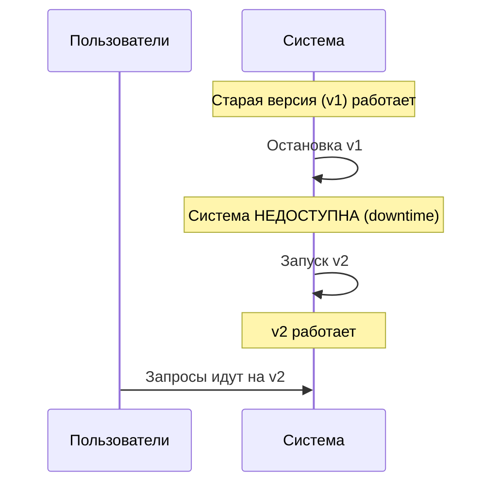
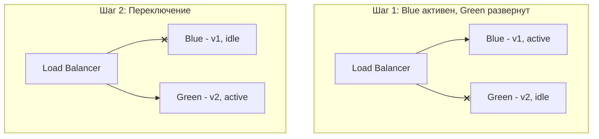
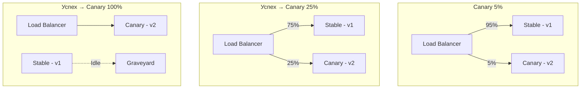
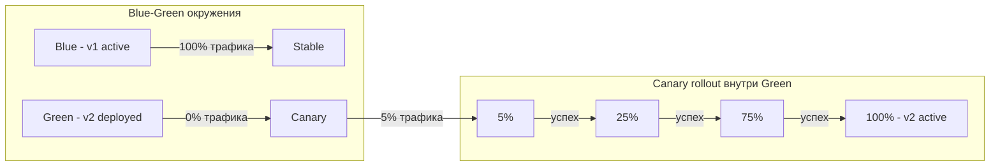

## Blue-Green / Canary Deployment: стратегии безопасных релизов

Долгое время стандартным способом обновления программного обеспечения был "big bang": остановить систему, установить новую версию, запустить. Этот подход несет в себе огромные риски: если в новой версии есть критическая ошибка, пользователи не получат сервис до отката, а откат — это повторная остановка. В современном мире, где системы должны быть доступны 24/7, такой метод неприемлем.

**Blue-Green Deployment** и **Canary Deployment** — это стратегии, которые позволяют обновлять систему без простоя (zero-downtime) и с минимальным риском. Они не исключают ошибок, но ограничивают их влияние: в Blue-Green ошибку можно обнаружить до того, как она затронет пользователей, а в Canary — сначала показать новую версию небольшой группе пользователей.

## Проблема: релизы с остановкой (downtime)

Как обычно обновляют систему без специальных стратегий:

1. Остановить старую версию (kill process).
2. Установить новую версию (скопировать файлы, собрать бинарник).
3. Запустить новую версию (start process).

**Минусы:**

- **Downtime.** Пока процесс не запущен, система недоступна. Для критичных сервисов секунды простоя — это деньги.
- **Риск.** Если новая версия падает при старте, простой увеличивается. Если в новой версии баг, все пользователи его увидят.
- **Сложный откат.** Чтобы вернуться к старой версии, нужно снова остановить систему и запустить старый бинарник. Снова downtime.

Эти проблемы решают Blue-Green и Canary деплои. Оба требуют дополнительной инфраструктуры (балансировщики, маршрутизация трафика), но окупаются снижением рисков и простоев.

## Blue-Green Deployment (синий-зеленый)

**У вас есть два окружения: Blue (текущая версия) и Green (новая версия).** В любой момент времени только одно окружение активно и обслуживает трафик пользователей. Второе простаивает или используется для тестирования.

**Процесс репозитория (деплоя):**

1. **Green (staging).** Разверните новую версию в Green окружение (пока активен Blue).
2. **Тестирование.** Проверяйте Green окружение в изоляции (без пользовательского трафика). Автотесты, smoke-тесты, ручное QA.
3. **Переключение трафика.** Переключите балансировщик (или DNS) с Blue на Green. Теперь Green активен.
4. **Blue становится резервным.** Если в Green найдена ошибка, переключитесь обратно на Blue (rollback за секунды).
5. **(Опционально) Обновите Blue.** После успешной работы Green можно развернуть следующую версию в Blue окружение.

**Как это выглядит для пользователя:** Никак. Переключение обычно занимает миллисекунды (смена маршрутизации). Пользователь может потерять одну сессию, если переключение происходит в момент запроса, но это редкость.

**Преимущества Blue-Green:**

- **Zero-downtime деплой.** Переключение — это фактически мгновенное изменение маршрута.
- **Быстрый откат.** Просто переключиться обратно, не пересобирая и не восстанавливая данные.
- **Staging окружение с реальной конфигурацией.** Green окружение идентично production (БД, сеть, конфиги), что снижает риск "работает на стейджинге, падает в проде".

**Ограничения:**

- **Нужны двойные ресурсы.** Два окружения (Blue и Green) требуют вдвое больше серверов (или контейнеров, или виртуалок). В облаке можно разворачивать окружение на время деплоя, а потом удалять, это дешевле.
- **Разделяемые ресурсы (например, база данных).** Если Blue и Green используют одну БД, миграции схемы могут сломать одну из версий. Решение: миграции совместимы и с v1, и с v2 (например, добавлять столбцы только nullable, не удалять старые).
- **Долгий деплой (если создаем окружение с нуля).** Если Green требует долгой инициализации, переключение откладывается.

**Когда Blue-Green не подходит:** Приложения с долгими миграциями БД, которые несовместимы между версиями. Приложения, где состояние (сессии) хранится локально, а не в Redis (тогда пользователь потеряет сессию при переключении).

## Canary Deployment (канарейка)

Название происходит от "канарейки в угольной шахте": раньше шахтеры брали с собой клетку с канарейкой — если птица падала, значит, в воздухе ядовитые газы.

**Вы направляете небольшой процент трафика на новую версию (canary) и смотрите, не падает ли она.** Если новая версия работает стабильно, вы постепенно увеличиваете процент трафика до 100%.

**Процесс:**

1. **Разверните новую версию (canary) на отдельные инстансы.**
2. **Балансировщик направляет 1-5% трафика на canary, остальное на stable.**
3. **Мониторинг:** отслеживайте ошибки, задержки, метрики бизнеса (конверсию). Если ошибки не превышают порог — увеличивайте процент (10% -> 25% -> 50% -> 100%).
4. **Если ошибки растут — откатываете canary (убираете процент до 0).** Откат мгновенный.

**Преимущества Canary:**

- **Минимизация blast radius.** Ошибка в новой версии затронет только 1% пользователей, а не всех.
- **Реальное A/B тестирование.** Можно сравнить метрики: конверсия на canary vs stable, задержки, ошибки. Принимать решение о запуске на основе данных.
- **Не нужны двойные ресурсы** (можно развернуть canary на 1 инстанс, stable — на 99).
- **Работает с плавными миграциями БД.** Поскольку старый код еще работает, он может писать в старые поля, новый — в новые.

**Ограничения:**

- **Сложность настройки маршрутизации.** Балансировщик должен уметь маршрутизировать трафик по весу (weighted routing). Не все балансировщики умеют канареечный деплой.
- **Сессии (sticky sessions).** Если вы используете липкие сессии, пользователь, попавший на canary, застрянет там. Это может исказить метрики. Лучше использовать shared state (Redis).
- **Длительное время полного деплоя.** Если вы увеличиваете процент постепенно (5% -> 100% за час), релиз занимает больше времени.

**Когда канарейка особенно полезна:** Когда вы не уверены в новой версии (крупный рефакторинг, смена БД, новый алгоритм). Когда вы хотите A/B тестировать фичи. Когда у вас большой трафик, можно быстро обнаружить проблемы на малом проценте.

## Сравнение Blue-Green и Canary

| Аспект | Blue-Green | Canary |
| :--- | :--- | :--- |
| **Дополнительные ресурсы** | Нужны два окружения (часто 2x) | Минимальные (1 инстанс canary) |
| **Время деплоя** | Мгновенное переключение | Постепенное (минуты/часы) |
| **Риск для пользователей** | При переключении — все пользователи переходят на новую версию сразу. Ошибка затронет всех. | Ошибка затронет только % трафика (например, 1%). |
| **Rollback** | Мгновенный (переключить обратно) | Мгновенный (убрать canary из ротации) |
| **Тестирование перед релизом** | Можно тестировать Green изолированно (без трафика) | Тестирование только на маленьком проценте трафика |
| **A/B тестирование** | Не поддерживает (сразу весь трафик) | Поддерживает (можно сравнить конверсию на canary vs stable) |
| **Сложность инфраструктуры** | Низкая (нужен балансировщик, умеющий переключать) | Высокая (weighted routing, сбор метрик для принятия решений) |

## Что выбрать: Blue-Green, Canary или комбинацию?

**Blue-Green подходит для:**

- Крупных релизов с высокими рисками (например, миграция БД, смена ядра системы).
- Когда нужно протестировать версию в изоляции, без пользователей.
- Когда мгновенный откат важнее минимизации blast radius.

**Canary подходит для:**

- Регулярных релизов (несколько раз в день).
- Когда вы доверяете автоматическому анализу метрик (ошибки, latency).
- Когда хотите A/B тестировать фичи на реальных пользователях.

**Комбинация (лучшая практика).** Внутри Blue-Green используйте Canary: разверните Green окружение, затем постепенно направляйте трафик на него (5% -> 100%). При проблемах — откат на Blue. Это дает тестирование в изоляции и плавное переключение.

## Практические аспекты для аналитика

Как аналитик, вы не будете настраивать балансировщики, но вам нужно:

- **Требовать от команды Zero-downtime деплой.** Если релиз с остановкой — это риск для бизнеса.
- **Понимать, когда нужна канарейка.** Если есть история проблем с релизами, если метрики критичны — настаивайте.
- **Определять критерии успеха канарейки.** При каком уровне ошибок нужно откатиться? Какую метрику смотреть (latency p99, конверсия, 5xx ошибки)?
- **Согласовывать миграции БД.** Убедиться, что новая и старая версии могут работать с одной схемой (или схема обновляется совместимо).

## Резюме

Blue-Green и Canary Deployment — это стратегии, позволяющие обновлять систему с нулевым временем простоя и низким риском.

**Blue-Green:**

- Два окружения: Blue (старая версия) и Green (новая).
- Мгновенное переключение трафика (zero-downtime).
- Требует двойных ресурсов.
- Риск: при переключении все пользователи переходят на новую версию. Если ошибка — все затронуты.

**Canary:**

- Постепенный rollout: 1% -> 100%.
- Минимизирует blast radius (ошибка затронет только % трафика).
- Требует weighted routing и мониторинга.
- Долгий rollout (минуты/часы).

**Лучшая практика:** Blue-Green окружения с Canary rollout внутри Green.

**Для аналитика:** важно понимать, как релизы влияют на доступность и бизнес-метрики. Требуйте zero-downtime деплоев, особенно для критичных систем. Определяйте критерии успеха канарейки (SLO метрики). Не позволяйте командам деплоить "big bang" там, где риск неприемлем. Помните: архитектура деплоя — это не только техническое решение, но и способ защиты бизнеса от собственных ошибок.