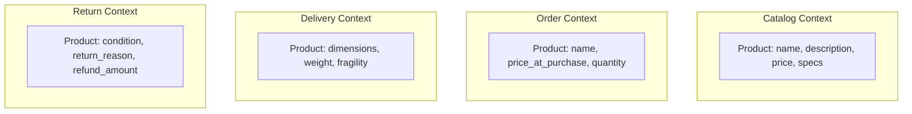
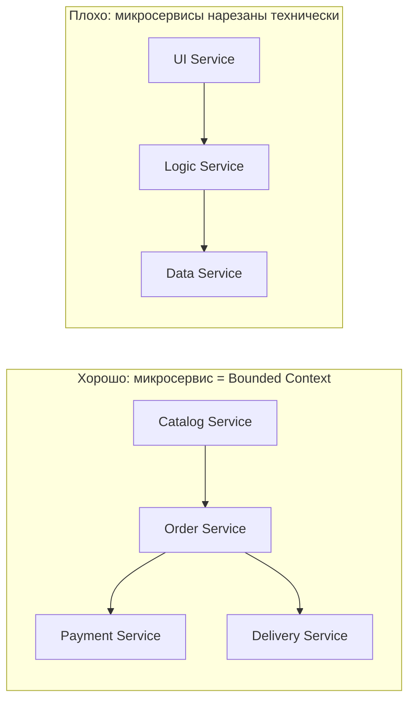

## Bounded Context: основа DDD для аналитика

В любой достаточно крупной системе одно и то же понятие — "клиент", "заказ", "продукт" — означает разное для разных отделов. Для отдела продаж "клиент" — это юридическое лицо с контрактом. Для службы поддержки "клиент" — это человек, который звонит с вопросом. Для отдела доставки "клиент" — это адрес и время, когда можно привезти товар.

Если попытаться создать единую модель "клиента", которая устроит всех, она станет громоздкой, противоречивой и неподдерживаемой. **Bounded Context (Ограниченный контекст)** — это концепция из Domain-Driven Design (DDD), которая решает эту проблему. Она говорит: не пытайтесь создать одну модель на весь мир. Вместо этого явно разделите систему на контексты, внутри которых термины имеют четкое, недвусмысленное значение.

## Что такое Bounded Context (простыми словами)

**Bounded Context** — это граница, внутри которой определение термина (модели) имеет один и тот же смысл и не противоречит само себе. За пределами границы тот же термин может означать другое, и это нормально.

Пример: интернет-магазин. У него есть несколько контекстов:

- **Контекст каталога (Catalog Context).** "Товар" — это название, описание, цена, фото, технические характеристики. Товар существует независимо от того, купил его кто-то или нет.
- **Контекст заказа (Order Context).** "Товар" — это позиция в заказе: название, цена на момент покупки, количество. Здесь не нужны технические характеристики.
- **Контекст доставки (Delivery Context).** "Товар" — это габариты, вес, хрупкость. Адрес доставки.
- **Контекст возврата (Return Context).** "Товар" — это состояние (новый, использованный, брак), причина возврата, сумма возврата.

Обратите внимание: "Товар" в каждом контексте выглядит по-разному. У него разные атрибуты, разные поведения, разные требования к консистентности. Попытка сделать один класс "Product" для всех контекстов привела бы к монструозной сущности со 100 полями, половина из которых не используются в большинстве случаев и путают разработчиков и аналитиков.

## Почему Bounded Context важен для аналитика

Аналитик работает на стыке бизнеса и разработки. Он переводит слова бизнеса в модели данных, сценарии использования и ограничения. Именно аналитик лучше всех понимает, что для отдела продаж "клиент" — это одно, а для маркетинга — другое. Именно аналитик должен провести эти границы и зафиксировать их в требованиях.

**Задачи аналитика, связанные с Bounded Context:**

- Выделить контексты в предметной области.
- Для каждого контекста описать Ubiquitous Language (вездесущий язык) — термины и их значения.
- Определить, как контексты взаимодействуют (интеграция, маппинг).
- Зафиксировать, какие данные и операции принадлежат какому контексту.
- Разрешить конфликты, когда один и тот же термин используется по-разному в разных контекстах.

Без Bounded Context аналитик рискует создать противоречивую модель, которая никого не устраивает. С Bounded Context — он получает карту предметной области, по которой можно строить микросервисы, модули монолита, API.

## Как выделить Bounded Context: практический метод

Выделение контекстов — это не точная наука, но есть проверенные методики.

### Метод 1: Event Storming (популярный в DDD)

Event Storming — это воркшоп, где за несколько часов вся команда (бизнес, аналитики, разработчики) наклеивает стикеры на стену.

**Шаги:**

1. **Domain Events.** Что происходит в системе? (Заказ создан, Платеж выполнен, Товар отгружен).
2. **Commands.** Что вызывает события? (Создать заказ, Выполнить платеж).
3. **Actors.** Кто или что инициирует команды? (Покупатель, Менеджер, Таймер).
4. **Aggregates.** Какие сущности изменяются? (Заказ, Платеж).
5. **Bounded Contexts.** Группируем агрегаты в контексты по смыслу. Где термины меняют значение? Где разные бизнес-правила? Там и граница.

### Метод 2: Анализ существительных (для аналитика, когда нет воркшопа)

1. Выпишите все существительные из требований, спецификаций, user stories: "клиент", "заказ", "товар", "платеж", "доставка", "отзыв", "рекомендация".
2. Для каждого существительного опишите, в каких контекстах оно используется. Группируйте по смысловым областям.
3. Там, где одно существительное появляется в нескольких контекстах с разными атрибутами или жизненным циклом — это признак разных контекстов.

**Пример: существительное "Заказ".**

- В контексте корзины и оформления: "Заказ" имеет статусы "черновик", "оформлен", "оплачен". Важно время блокировки товара.
- В контексте доставки: "Заказ" имеет статусы "передан в доставку", "в пути", "доставлен". Важен адрес и трек-номер.
- В контексте возврата: "Заказ" имеет статусы "возврат запрошен", "возврат одобрен", "деньги возвращены". Важна причина возврата.

Три разных контекста.

### Метод 3: Анализ изменений (почему это важно для масштабирования команд)

Границы контекстов часто совпадают с границами между командами. Если две команды часто конфликтуют при изменении одной модели — значит, граница проведена не там. Пересмотрите контексты.

## Типы взаимоотношений между Bounded Contexts

Контексты не изолированы полностью — они взаимодействуют. Способ взаимодействия — это тоже архитектурное решение.

| Тип отношений | Описание | Когда использовать |
| :--- | :--- | :--- |
| **Shared Kernel (общее ядро)** | Два контекста разделяют часть модели. Изменения требуют синхронизации. | Команды тесно сотрудничают, изменения редки и согласовываются. |
| **Customer-Supplier** | Контекст-поставщик предоставляет API. Контекст-потребитель (customer) подстраивается. | Один контекст (например, каталог) снабжает другие данными. |
| **Conformist (конформист)** | Потребитель полностью принимает модель поставщика (даже если она неудобна). | Поставщик — внешняя система, которую нельзя изменить (CRM, ERP). |
| **Anti-Corruption Layer (ACL)** | Прокладка между контекстами, которая транслирует модель поставщика в модель потребителя. | Нужно изолировать потребителя от изменений поставщика или от чужеродной модели. |
| **Separate Ways** | Контексты не взаимодействуют (или взаимодействуют через ручной обмен данными). | Полностью независимые подсистемы. |

**Пример: интернет-магазин и платежный шлюз.**

- Платежный шлюз — внешняя система (Conformist: мы вынуждены подстраиваться под его API).
- Между шлюзом и нашим платежным контекстом — Anti-Corruption Layer, который транслирует их модель "Transaction", "Refund" в нашу модель "Payment", "Chargeback".

## Bounded Context и микросервисы

Один из самых распространенных способов реализации Bounded Context — микросервисная архитектура. Каждый микросервис реализует один контекст (иногда несколько, если контекст маленький).

**Почему это хорошо:**

- Каждая команда владеет своим контекстом и развивает его независимо.
- Язык и модель внутри сервиса единообразны и не противоречивы.
- Границы сервисов совпадают с границами контекстов.

**Но не наоборот:** Не каждый микросервис — это bounded context. Микросервис, созданный "нарезанием" монолита по техническому признаку (UI, Business Logic, DB), не является bounded context. Он не имеет осмысленной границы в предметной области.

## Bounded Context и монолит

Bounded Context не требует микросервисов. Даже в монолите можно выделить контексты внутри кода (модули, пакеты). Это называется **модульный монолит**. Главное — соблюдать границы на уровне кода: модули не должны напрямую заглядывать в модели других модулей. Взаимодействие — через четкие API.

## Как Bounded Context связан с Ubiquitous Language (вездесущий язык)

**Ubiquitous Language** — это единый, недвусмысленный язык, который используется и бизнесом, и аналитиками, и разработчиками внутри одного контекста. Он записан в коде (названия классов, методов), в документации, в обсуждениях.

**Пример для контекста заказов:**

- "Заказ" может быть "черновиком", "подтвержденным", "отмененным".
- "Позиция заказа" имеет "количество", "цену на момент заказа".
- "Сумма заказа" вычисляется как сумма позиций минус скидка.

Эти термины имеют смысл только внутри контекста заказов. В контексте доставки термин "заказ" может означать совсем другое.

Аналитик должен способствовать формированию Ubiquitous Language для каждого контекста и следить, чтобы он не размывался.

## Антипаттерны: чего не надо делать

**1. Большой грязный шар (Big Ball of Mud).** Все модели свалены вместе, границ нет. Термины противоречивы. Код понять невозможно.

**2. Контекст, включающий всю систему (God Context).** Один контекст на все. Обычно возникает из-за нежелания делить ответственность.

**3. Игнорирование взаимодействия контекстов.** Контексты не интегрированы, хотя должны обмениваться данными. Данные дублируются вручную (excel-выгрузки, email). Это не архитектура, это хаос.

**4. Жесткое копирование модели (Shared Kernel без синхронизации).** Два контекста используют одну и ту же таблицу в БД напрямую. Изменения ломают оба контекста.

## Пример: Bounded Context для системы бронирования билетов

**Контекст поиска (Search Context).** Пользователь ищет билеты: дата, направление, цена. Модель: Flight (номер, дата, время, цена, наличие мест). Не нужны детали о пассажире или оплате. AP, eventual consistency. Elasticsearch.

**Контекст бронирования (Booking Context).** Пользователь выбирает место и бронирует. Модель: Booking (id, flightId, seat, passengerName, status). Строгая консистенция (нельзя дважды забронировать место). CP, PostgreSQL.

**Контекст оплаты (Payment Context).** Пользователь оплачивает бронь. Модель: Payment (id, bookingId, amount, status). Строгая консистенция, интеграция с внешним шлюзом.

**Контекст регистрации (Check-in Context).** Пользователь регистрируется на рейс, получает посадочный талон. Модель: BoardingPass (passengerName, seat, gate, barсode).

Эти контексты общаются через API (синхронно) или через асинхронные события (Kafka). Например, после оплаты событие `PaymentSuccess` запускает в контексте бронирования смену статуса и в контексте регистрации создание записи.

## Резюме

Bounded Context — это фундаментальный концепт DDD, который помогает управлять сложностью предметной области. Он определяет границы, внутри которых модель имеет один и тот же смысл.

**Что дает Bounded Context аналитику:**

- **Управление сложностью.** Вместо одной огромной модели — набор маленьких, понятных и непротиворечивых.
- **Явные границы.** Знаем, где ответственность одного контекста заканчивается и начинается другой.
- **Язык для коммуникации.** Ubiquitous Language внутри контекста.
- **Помощь в разделении на микросервисы.** Микросервисы = контексты. А не наоборот.
- **Снятие противоречий.** "Заказ" для продавца и "заказ" для доставки — две разные модели.

**Как выделить контексты:** Event Storming, анализ существительных, анализ изменений и команд.

**Как контексты взаимодействуют:** Shared Kernel, Customer-Supplier, Conformist, Anti-Corruption Layer, Separate Ways.

**Антипаттерны:** Big Ball of Mud, God Context, игнорирование взаимодействия, жесткое копирование схем.

**Главное:** Bounded Context — это не только про код. Это про мышление. Как аналитик, научитесь видеть границы в, казалось бы, единой предметной области. Проведите их. Зафиксируйте. Это будет самая ценная ваша работа, без которой любая архитектура превратится в хаос.