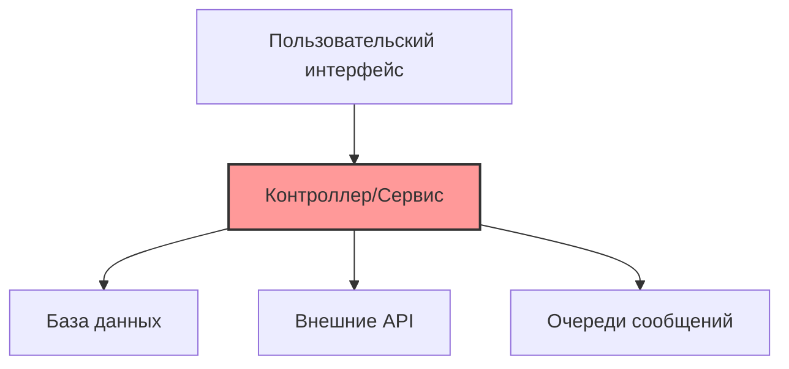
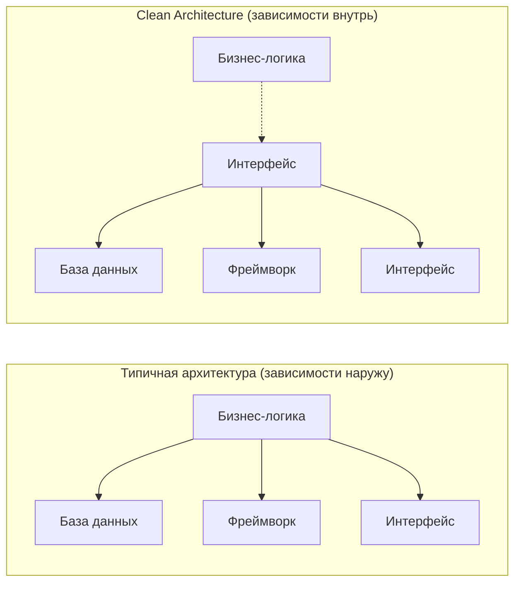
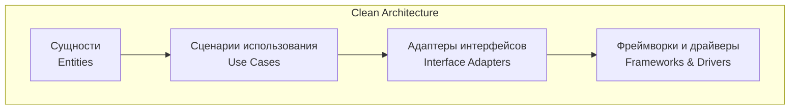
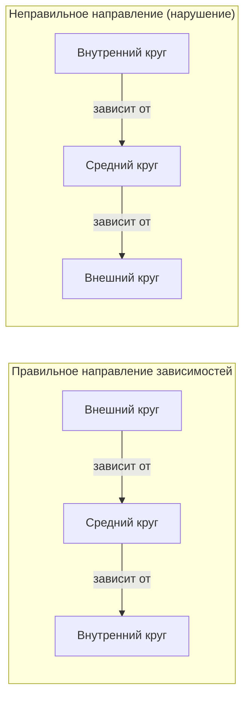
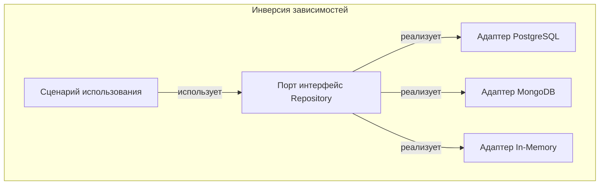
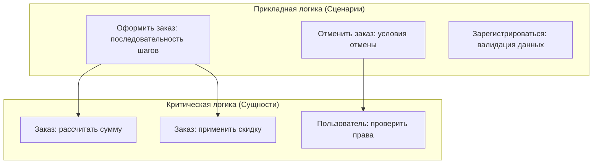
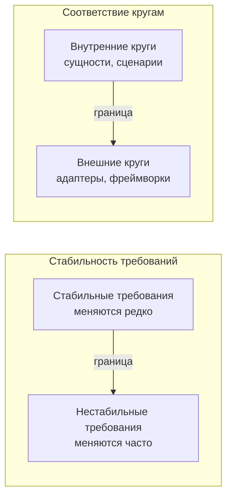
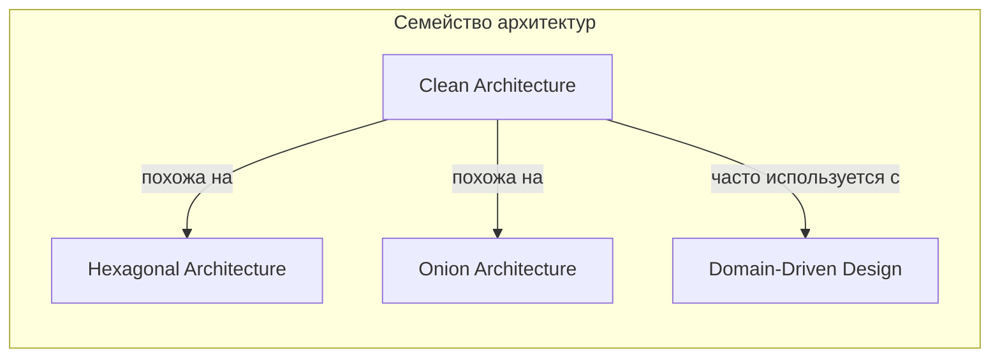
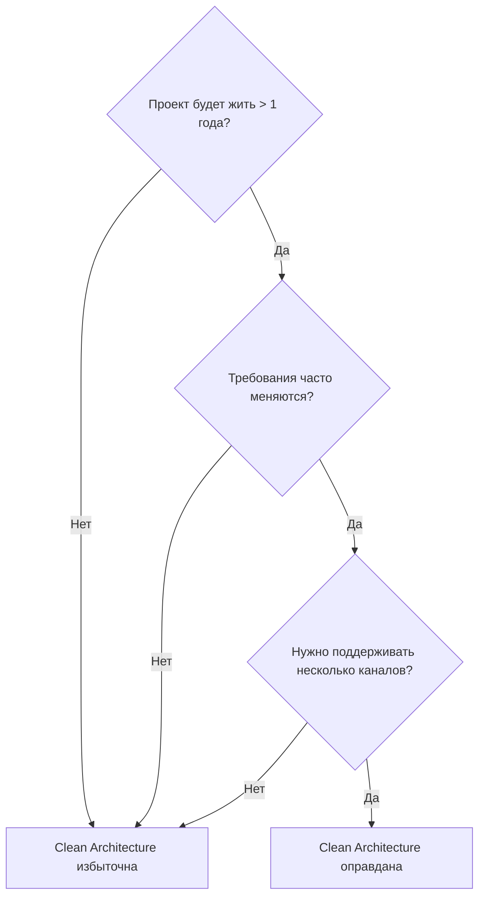

## Введение: Почему код превращается в спагетти

Каждый проект начинается хорошо. В начале все просто: несколько классов, понятная логика, быстрое внесение изменений. Но проходит полгода, и что-то идет не так. Чтобы добавить новое поле в заказ, нужно изменить десять файлов. Изменение в одном месте ломает функциональность в другом, совершенно не связанном. Разработчики боятся что-то трогать, потому что "все завязано на всем".

Это не потому, что программисты плохие. Это потому, что в системе не было четких границ между разными уровнями ответственности. Бизнес-логика (как рассчитать скидку) перемешана с деталями базы данных (как сохранить заказ) и деталями интерфейса (как показать кнопку). Когда все перемешано, любое изменение требует правок во всех слоях.

**Clean Architecture** (Чистая архитектура) — это подход к организации системы, который разделяет ее на концентрические круги. В центре — самая важная часть: бизнес-правила и сущности предметной области. На внешних кругах — детали реализации: базы данных, веб-фреймворки, внешние API, пользовательский интерфейс. Главный принцип: зависимости направлены внутрь. Внешние круги знают о внутренних, но внутренние ничего не знают о внешних.

Для системного аналитика Clean Architecture — это не про код. Это про понимание того, какие требования являются "ядром" системы, а какие — "деталями". Это помогает отвечать на вопросы: "Можем ли мы сменить базу данных с PostgreSQL на MongoDB без переписывания всей логики?" или "Насколько сложно будет добавить новый способ оплаты?"

## Проблема, которую решает Clean Architecture

Чтобы понять Clean Architecture, нужно сначала понять проблему. Типичное приложение часто строится так: есть пользовательский интерфейс, который вызывает "сервисы" или "контроллеры", те напрямую работают с базой данных. Бизнес-логика оказывается размазанной между этими слоями.

Что происходит при таком подходе. Если вы решите сменить базу данных (например, перейти с MySQL на PostgreSQL), вам придется переписывать не только код доступа к данным, но и бизнес-логику, потому что она знает, как именно данные сохранены. Если вы решите добавить мобильное приложение, вам придется дублировать бизнес-логику, потому что она сейчас живет внутри веб-контроллеров. Если вы захотите изменить способ расчета налогов, вы будете искать этот код в десятке разных мест.

Главная проблема — смешение ответственности. Бизнес-правила ("заказ со скидкой 10% при сумме больше 1000 рублей") не должны зависеть от того, как эти правила вызываются (через REST API или через консольную команду) и где хранятся данные (в PostgreSQL или в Redis). Но в реальных проектах эта зависимость часто возникает, и чем дольше проект живет, тем сильнее она становится.

Clean Architecture предлагает четкое разделение. Бизнес-правила находятся в центре и ничего не знают о внешнем мире. А все внешние механизмы (базы данных, веб-серверы, очереди сообщений) подключаются как "плагины" к этому ядру.

## Четыре круга Clean Architecture

Clean Architecture обычно изображают как четыре концентрических круга. Чем ближе к центру, тем выше уровень абстракции и тем меньше зависимостей.

**Сущности (Entities)** — самый внутренний круг. Это бизнес-сущности системы, которые содержат критически важные правила. Сущность "Заказ" знает, как рассчитать итоговую сумму, применить скидку, проверить, можно ли отменить заказ. Сущность "Пользователь" знает, как проверить пароль, сменить email, заблокировать аккаунт. У сущностей нет зависимостей от внешнего мира. Они не знают, как сохраняются в базу, как отображаются на экране, как передаются по сети.

Пример. В интернет-магазине сущность "Заказ" содержит правило: "Сумма заказа не может быть отрицательной". Это правило не зависит от того, пришел заказ с веб-сайта, из мобильного приложения или через API. Оно всегда истинно. Поэтому оно живет в сущности.

**Сценарии использования (Use Cases)** — второй круг. Здесь описываются конкретные действия, которые может выполнить пользователь системы. "Оформить заказ", "Зарегистрироваться", "Добавить товар в корзину". Сценарий использования координирует работу сущностей и определяет поток данных. Он знает, что для оформления заказа нужно проверить корзину, рассчитать сумму, создать заказ, отправить уведомление. Но сценарий не знает, как именно отправляется уведомление (через email, SMS или push) и как именно сохраняется заказ (в реляционную базу или NoSQL). Сценарии знают о сущностях, но не знают о внешних деталях.

Пример. Сценарий "Оформить заказ" содержит последовательность шагов: проверить остатки на складе, зарезервировать товары, списать деньги, создать заказ, отправить подтверждение. Но он не знает, как именно проверяются остатки — через прямой запрос к складу или через кэш. Он работает через абстрактный интерфейс "Складской сервис".

**Адаптеры интерфейсов (Interface Adapters)** — третий круг. Здесь находятся адаптеры, которые преобразуют данные из формата, удобного для сценариев использования, в формат, удобный для внешних систем, и наоборот. Контроллеры, презентеры, репозитории — все это живет здесь. Репозиторий предоставляет интерфейс "сохранить заказ", а конкретная реализация знает, как выполнить SQL-запрос. Презентер берет данные от сценария использования и преобразует их в формат, который может отобразить веб-страница или мобильное приложение.

Пример. Адаптер "PostgresOrderRepository" реализует интерфейс "OrderRepository". Внутри него написаны SQL-запросы для сохранения заказа. Если вы решите перейти на MongoDB, вы создадите новый адаптер "MongoOrderRepository", а сценарий использования даже не узнает об этом.

**Фреймворки и драйверы (Frameworks and Drivers)** — самый внешний круг. Здесь находятся конкретные инструменты: веб-фреймворк (Spring, Django, Express), база данных (PostgreSQL, MongoDB), драйверы для очередей сообщений, HTTP-клиенты. Этот слой — самый "технический" и самый изменчивый. Именно здесь принимаются решения "какую технологию использовать". Идея в том, что эти решения можно менять, не затрагивая внутренние круги.

Пример. Вы используете Django для веб-интерфейса. Весь код, специфичный для Django (URL-роутинг, middleware, шаблоны), живет во внешнем круге. Если вы решите перейти на FastAPI, вы переписываете только внешний круг. Сценарии использования, сущности, адаптеры — все остается без изменений.

Важно понять: круги — это не слои в приложении, а правила зависимости. Внутренний круг не знает о внешнем. Внешний круг может знать о внутреннем. И чем глубже круг, тем стабильнее должен быть код. Сущности меняются редко (только когда меняются фундаментальные бизнес-правила). А фреймворки могут меняться каждый год.

## Правило зависимости

Самый важный принцип Clean Architecture формулируется просто: зависимости направлены внутрь. То есть код внешних кругов может ссылаться на код внутренних кругов, но не наоборот.

Что это означает на практике. Сценарий использования (второй круг) может вызывать методы сущностей (первый круг). Адаптер интерфейсов (третий круг) может вызывать сценарии использования. Фреймворк (четвертый круг) может вызывать адаптеры. Но сущность не может вызвать сценарий использования. Сценарий не может напрямую обратиться к базе данных. Адаптер не может напрямую использовать конкретный фреймворк (он должен использовать абстракцию).

Как это достигается технически. Через механизм, который называется "инверсия зависимостей". Внутренний круг определяет интерфейс (например, "порт" для сохранения данных). Внешний круг реализует этот интерфейс (например, "адаптер" для PostgreSQL). Внутренний код работает через интерфейс и не знает о конкретной реализации. Если нужно сменить базу данных, вы пишете новую реализацию того же интерфейса, и внутренний код даже не замечает замены.

Для системного аналитика это означает следующее. Когда вы слышите от разработчиков, что "смена базы данных займет две недели", это сигнал, что архитектура чистая. Когда вы слышите "смена базы данных потребует переписывания половины приложения", это сигнал, что зависимости направлены наружу, бизнес-логика знает о деталях хранения.

## Что такое "бизнес-логика" с точки зрения Clean Architecture

В Clean Architecture есть важное различие, которое часто упускают: различие между "критической" и "прикладной" бизнес-логикой.

**Критическая бизнес-логика** (domain logic, сущности) — это правила, которые не меняются от сценария к сценарию. "Заказ не может быть отменен после отправки", "Скидка не может превышать 50%", "Пользователь должен подтвердить email перед первым входом". Эти правила живут в сущностях. Они не зависят от того, как пользователь взаимодействует с системой — через веб-интерфейс, мобильное приложение или API для партнеров.

Как распознать критическую логику при анализе требований. Задайте вопрос: "Это правило будет одинаковым для всех способов взаимодействия с системой?" Если да — это кандидат в сущности. Если правило может отличаться для веб-версии и мобильного приложения — это, скорее всего, не критическая логика.

**Прикладная бизнес-логика** (use case logic, сценарии) — это правила, которые определяют конкретный сценарий использования. "При оформлении заказа нужно проверить остатки на складе, зарезервировать товар, списать деньги, отправить уведомление". Эти правила живут в сценариях использования. Они могут меняться от сценария к сценарию (например, для обычного пользователя и для премиум-пользователя могут быть разные сценарии оформления заказа).

Для системного аналитика это различие помогает при сборе требований. Когда бизнес говорит "нужно добавить новое правило расчета скидки", вы должны понять: это критическое правило (живет в сущности "Заказ") или это правило конкретного сценария (живет в сценарии "Оформить заказ")? Ответ влияет на то, насколько сложным будет изменение и где именно его нужно реализовывать.

Также это различие помогает при анализе существующей системы. Если вы видите, что одна и та же критическая логика размазана по разным сценариям использования, это признак проблемы — нарушение принципа DRY (Don't Repeat Yourself). Если вы видите, что критическая логика зависит от конкретного фреймворка, это признак нарушения Clean Architecture.

## Границы (Boundaries) в архитектуре

Ключевое понятие в Clean Architecture — это границы. Границы отделяют разные уровни абстракции друг от друга. И границы — это то место, где системный аналитик может внести наибольший вклад.

Граница между внутренним и внешним кругом — это не просто техническая деталь. Это отражение стабильности требований. Внутренние круги содержат то, что меняется редко или меняется дорого. Внешние круги содержат то, что меняется часто или может быть заменено.

Как системный аналитик определяет, где проходят границы. Вы задаете вопросы: "Что изменится, если мы сменим способ оплаты? А если сменим базу данных? А если добавим мобильное приложение?" То, что не меняется или меняется редко, должно быть внутри. То, что меняется часто или может быть заменено, должно быть снаружи.

Например, в интернет-магазине правило "сумма заказа не может быть отрицательной" — это внутреннее. Оно не изменится никогда. А способ оплаты (банковская карта, PayPal, криптовалюта) — это внешнее. Он может меняться каждый квартал. Поэтому в чистой архитектуре способ оплаты будет реализован во внешнем круге, а правило проверки суммы — во внутреннем.

Границы могут быть разной "толщины". Иногда граница — это просто интерфейс в коде. Иногда — отдельный модуль или библиотека. Иногда — отдельный сервис в микросервисной архитектуре. Но принцип остается тем же: внутреннее не знает о внешнем.

## Почему Clean Architecture — это не про технологии

Важно понимать: Clean Architecture не говорит, какую базу данных использовать или какой веб-фреймворк выбрать. Она говорит о том, как организовать зависимости, чтобы эти технологические решения можно было менять без боли.

Системный аналитик часто оказывается между двух огней. С одной стороны — бизнес, который хочет дешево и быстро. С другой стороны — разработчики, которые хотят использовать новые технологии. Clean Architecture дает язык для обсуждения этих противоречий.

Вы можете сказать бизнесу: "Если мы сейчас не отделим бизнес-логику от базы данных, то через год смена БД будет стоить как разработка всей системы заново". И бизнес поймет, потому что это про деньги и риски.

Вы можете сказать разработчикам: "Давайте используем абстракции, чтобы мы могли менять технологии независимо. Сейчас мы используем PostgreSQL, но через год, возможно, захотим перейти на CockroachDB. Давайте спроектируем границы так, чтобы этот переход не был катастрофой". И разработчики поймут, потому что это про гибкость и технический долг.

## Clean Architecture в контексте других подходов

Clean Architecture — не единственный подход. Есть еще "Гексагональная архитектура" (Hexagonal Architecture, также известная как Ports and Adapters), "Луковая архитектура" (Onion Architecture), "Архитектура, управляемая доменом" (Domain-Driven Design). Все они очень похожи.

Главная идея везде одна: бизнес-логика в центре, детали по краям. Clean Architecture — это скорее обобщение и систематизация этих подходов. Автор Роберт Мартин (Uncle Bob) собрал лучшие практики в одну схему.

Для системного аналитика важно не запоминать названия, а понимать принцип. Когда вы слышите "порты и адаптеры", "инверсия зависимостей", "гексагональная архитектура" — это все про одно и то же. Система должна быть организована так, чтобы ее можно было менять, не ломая все вокруг.

## Когда Clean Architecture избыточна

Clean Architecture — это не панацея и не всегда правильный выбор. У нее есть стоимость. Чистая архитектура требует больше кода (интерфейсы, адаптеры, преобразователи данных). Она требует больше дисциплины от команды. Она может быть избыточной для маленьких проектов.

Для чего Clean Architecture не подходит:

- Прототип, который будет выброшен через месяц
- Внутренний инструмент для трех пользователей
- Скрипт для разовой миграции данных
- Простая форма обратной связи на сайте

Во всех этих случаях затраты на архитектуру не окупятся.

Для чего Clean Architecture подходит:

- Проекты, которые будут жить годами
- Системы, где требования часто меняются
- Проекты, где нужно поддерживать несколько каналов доступа (веб, мобильное приложение, API)
- Системы, где возможна замена технологий (баз данных, очередей, фреймворков)

Системный аналитик должен уметь оценивать, когда сложность архитектуры оправдана. Если проект — это MVP (минимально жизнеспособный продукт) на три месяца, то чистая архитектура будет только мешать. Если проект — это ядро бизнеса на ближайшие пять лет, то инвестиции в архитектуру окупятся многократно.

## Clean Architecture и требования: практические вопросы аналитика

Для системного аналитика работа с Clean Architecture начинается не на этапе написания кода, а на этапе сбора и анализа требований. Вот набор вопросов, которые помогают выявить, где должны проходить границы.

**Выявление сущностей (что в центре).** Какие бизнес-понятия являются фундаментальными? Заказ, Пользователь, Товар, Платеж. Что они умеют делать? Какие инварианты (правила, которые всегда должны соблюдаться) у них есть? "Заказ не может быть отменен после отправки" — это инвариант. "Скидка не может превышать 50%" — это инвариант. Все, что является инвариантом, должно жить в сущностях.

**Выявление сценариев использования (второй круг).** Какие действия выполняют пользователи? Зарегистрироваться, Оформить заказ, Отменить заказ, Добавить отзыв. Какие шаги в каждом сценарии? Какие альтернативные потоки? Какие ошибки могут возникнуть? Сценарий использования — это ответ на вопрос "что делает пользователь", но без привязки к конкретному интерфейсу.

**Выявление внешних систем (внешние круги).** С чем взаимодействует наша система? Платежный шлюз, Складская система, Почтовый сервис, CRM. Какие данные мы отправляем и получаем? Какие протоколы используются? Это все — кандидаты на внешние адаптеры.

**Выявление точек изменений.** Что в требованиях скорее всего изменится? Способ оплаты, Правила расчета скидки, Внешний вид интерфейса, Формат экспорта данных. То, что будет меняться часто, должно быть изолировано во внешних кругах. То, что стабильно, должно быть в центре.

**Документирование границ.** Какие интерфейсы нужны между кругами? Что один круг ожидает от другого? Какие данные передаются? Это помогает разработчикам понять, где проходят границы и какие абстракции нужно создавать.

## Распространенные ошибки при внедрении Clean Architecture

**Ошибка 1: Все в одном круге.** Команда формально разделила код на папки "entities", "usecases", "adapters", но зависимости все равно идут в обе стороны. Бизнес-логика вызывает методы репозиториев напрямую. Это не чистая архитектура, это просто разложенные по папкам файлы.

Признак для аналитика: Когда вы просите изменить способ хранения данных, разработчики говорят, что это потребует изменений в бизнес-логике. Значит, границы не работают.

**Ошибка 2: Избыточное дробление.** Каждая сущность, каждый сценарий вынесены в отдельные файлы/модули. Кода в десять раз больше, чем нужно. Простые изменения требуют правок в десятке мест.

Признак для аналитика: Когда вы описываете новое требование, разработчики вздыхают и говорят "придется создать еще один use case, еще один порт, еще один адаптер...". Это признак того, что архитектура переусложнена.

**Ошибка 3: Игнорирование слоя сущностей.** Вся логика помещена в сценарии использования, сущности остаются пустыми (просто структуры с геттерами и сеттерами). Критическая бизнес-логика размазана по разным сценариям и дублируется.

Признак для аналитика: Когда одно и то же правило (например, "скидка не более 50%") встречается в описании нескольких сценариев, и при изменении правила нужно менять все эти сценарии. Правило должно быть в одном месте — в сущности.

**Ошибка 4: Зависимости через данные.** Даже если зависимости в коде направлены правильно, данные, передаваемые через границы, нарушают изоляцию. Например, сущность "Заказ" передается через все слои вплоть до базы данных, и слой базы данных начинает зависеть от внутреннего формата сущности.

Признак для аналитика: Когда изменение структуры сущности (добавление поля) требует изменений в слое базы данных, даже если база данных это поле не использует. Значит, граница не изолирует слои.

## Clean Architecture и нефункциональные требования

Чистая архитектура влияет на нефункциональные требования, и не всегда положительно.

**Производительность.** Чистая архитектура добавляет дополнительные слои абстракции и преобразования данных. Каждый вызов проходит через несколько границ. Это может снизить производительность по сравнению с "прямым" кодом. Для большинства систем это не критично, но для высоконагруженных (тысячи запросов в секунду) может быть проблемой.

**Сопровождаемость.** Это главное преимущество. Четкие границы, изолированные слои, понятные зависимости делают систему легкой для изменений. Разработчики могут менять один слой, не опасаясь сломать другие. Для системного аналитика это означает, что требования можно реализовывать быстрее и с меньшими рисками.

**Тестируемость.** Бизнес-логика, отделенная от внешних систем, легко тестируется в изоляции. Вы можете протестировать сценарий использования, подставив "заглушку" для базы данных или внешнего API. Не нужно поднимать всю инфраструктуру для каждого теста. Это снижает время на тестирование и повышает качество.

**Масштабируемость.** Чистая архитектура сама по себе не дает горизонтального масштабирования. Но она помогает изолировать компоненты, которые нужно масштабировать по-разному. Например, сценарий "оформить заказ" может быть вынесен в отдельный сервис, потому что он не знает о деталях хранения.

**Безопасность.** Разделение на слои помогает контролировать, какие данные попадают в каждый слой. Например, слой представления получает только те данные, которые нужны для отображения, и не имеет доступа к внутренним структурам. Это снижает риск утечки чувствительных данных.

Системный аналитик должен учитывать эти эффекты при принятии решений. Если для проекта критична производительность на уровне миллисекунд, возможно, чистая архитектура — не лучший выбор. Если критична сопровождаемость (а это почти всегда так для долгоживущих систем), то инвестиции в чистую архитектуру оправданы.

## Резюме

Clean Architecture — это способ организации системы, при котором бизнес-логика находится в центре и не зависит от внешних деталей (баз данных, фреймворков, интерфейсов). Внешние детали подключаются как "плагины" через механизм инверсии зависимостей.

Для системного аналитика Clean Architecture дает:

- **Понимание стабильности требований.** Внутренние круги — то, что редко меняется. Внешние — то, что часто меняется. Вы можете предсказать, где изменения будут дорогими, а где дешевыми.

- **Язык для коммуникации с разработчиками.** Вы говорите о "сущностях" и "сценариях использования", а не о "таблицах в базе" и "REST-эндпоинтах". Это правильный уровень абстракции для анализа требований.

- **Критерии для оценки архитектуры.** Вы можете задавать вопросы: "А где проходит граница между бизнес-логикой и деталями хранения?", "Сможем ли мы сменить базу данных без изменения сценариев использования?"

- **Понимание компромиссов.** Чистая архитектура требует больше кода и дисциплины. Она может снижать производительность. Но она дает сопровождаемость и тестируемость. Вы можете помочь команде взвесить эти компромиссы.