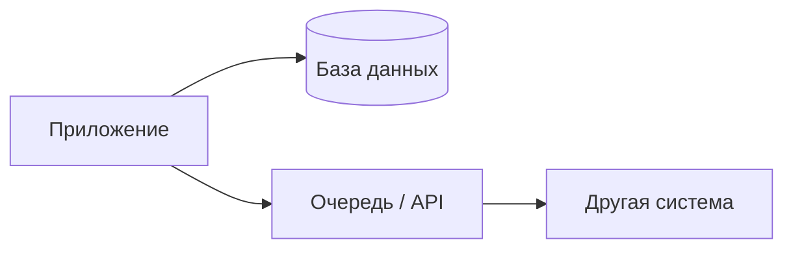
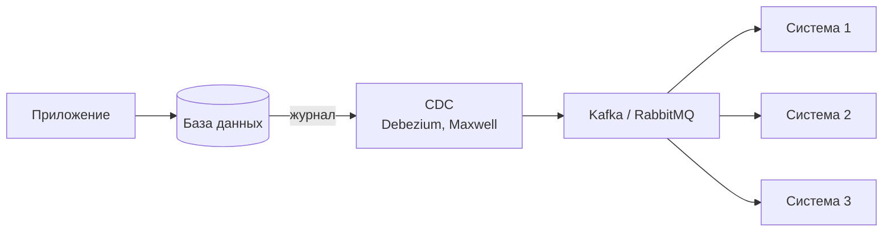
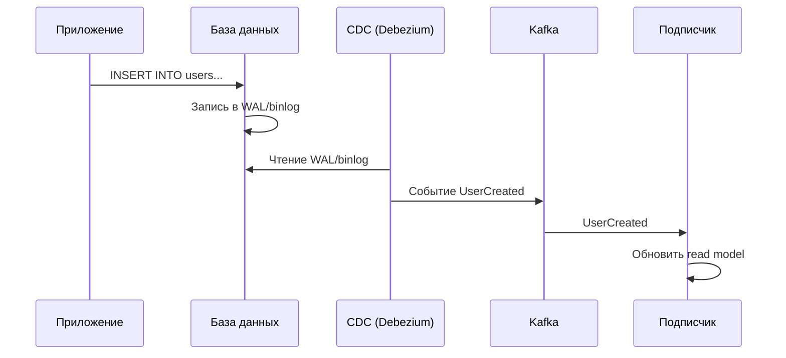
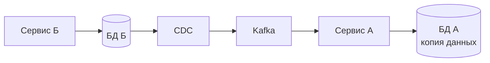
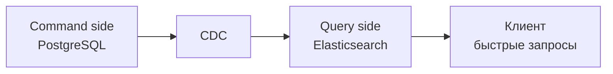
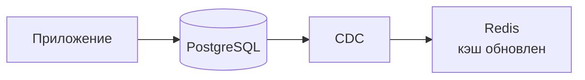
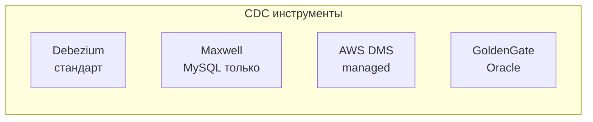
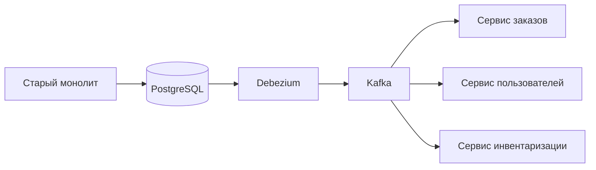

## Введение: Наблюдатель за изменениями в базе данных

Представьте, что у вас есть складской журнал. Кладовщик записывает в него каждое поступление и выдачу товара: "Пришло 10 ящиков яблок", "Выдано 2 ящика яблок", "Пришло 5 ящиков груш". Это журнал операций.

Теперь представьте, что у вас есть несколько систем, которым нужно знать об изменениях на складе. Система бухгалтерии должна обновить остатки. Система анализа должна посчитать, какие фрукты чаще заказывают. Витрина магазина должна показать актуальное наличие.

Вместо того чтобы каждая система постоянно опрашивала склад ("А что изменилось?"), вы можете поставить "наблюдателя", который читает журнал склада и отправляет уведомления всем заинтересованным системам.

**CDC (Change Data Capture)** — это технология, которая отслеживает изменения в базе данных (вставки, обновления, удаления) и передает эти изменения в другие системы в реальном времени. CDC читает журнал транзакций базы данных (binlog, WAL, redo log) и публикует события о каждом изменении.

CDC позволяет синхронизировать данные между разными системами, строить read-модели (CQRS), обновлять кэши, отправлять уведомления, наполнять Data Warehouse, без необходимости менять исходное приложение.

## Проблема, которую решает CDC

В традиционных системах, когда нужно синхронизировать данные между несколькими системами, часто используют **dual-write**: приложение пишет в базу данных, а потом отправляет сообщение в очередь или вызывает API другой системы.



Проблемы dual-write:

- **Нет атомарности.** Что, если приложение записало в БД, но не отправило сообщение (сбой)? Данные разошлись.
- **Нагрузка на приложение.** Приложение должно знать обо всех подписчиках.
- **Связанность.** Приложение связано с логикой синхронизации.

CDC решает эти проблемы:

- **Атомарность.** Изменение в БД и его захват — единая транзакция (читаем журнал БД).
- **Низкая связанность.** Приложение не знает о подписчиках. Оно просто работает с БД.
- **Надежность.** CDC гарантирует доставку (at-least-once, exactly-once с идемпотентностью).



## Как работает CDC

### Логический уровень

1. Приложение выполняет INSERT, UPDATE, DELETE в базе данных.
2. База данных записывает это изменение в журнал транзакций (WAL в PostgreSQL, binlog в MySQL, redo log в Oracle).
3. CDC-коннектор (например, Debezium) читает журнал транзакций.
4. CDC-коннектор преобразует изменение в событие (обычно JSON) и отправляет в брокер сообщений (Kafka).
5. Другие системы подписываются на события и реагируют (обновляют свои данные, отправляют уведомления, строят отчеты).



### Пример события (из Debezium для PostgreSQL)

```json
{
  "before": null,
  "after": {
    "id": 123,
    "name": "Иван Петров",
    "email": "ivan@example.com"
  },
  "source": {
    "db": "mydb",
    "table": "users",
    "ts_ms": 1705315200000
  },
  "op": "c",
  "ts_ms": 1705315201000
}
```

- **before** — данные до изменения (для UPDATE, DELETE)
- **after** — данные после изменения (для INSERT, UPDATE)
- **op** — операция: "c" (create), "u" (update), "d" (delete)
- **source** — метаданные (какая БД, таблица, время)

## CDC и базы данных: особенности

### PostgreSQL (WAL - Write-Ahead Log)

- Логическая репликация (native logical replication) с версии 10.
- Debezium использует logical decoding plugin (pgoutput, wal2json).
- Требует настройки: wal_level = logical, replication slots.

### MySQL (binlog)

- Binlog должен быть в формате ROW (не STATEMENT).
- Debezium читает binlog как реплика MySQL.
- Требует права на репликацию.

### MongoDB

- Change streams (начиная с версии 3.6).
- Debezium подключается к replica set.

### SQL Server

- Change Data Capture (встроенная функция) или Change Tracking.
- Debezium использует CDC таблицы.

## CDC vs другие подходы

### Polling (периодический опрос)

**Как работает:** Приложение каждые N секунд выполняет SELECT * FROM table WHERE updated_at > last_check.

**Плюсы:** просто, не требует специальных инструментов.

**Минусы:** высокая задержка (N секунд), нагрузка на БД, не видит удаления (если нет soft delete).

**CDC:** события в реальном времени, низкая задержка (миллисекунды), видит все операции.

### Триггеры (database triggers)

**Как работает:** На таблице висит триггер, который при изменении записывает событие в служебную таблицу. Отдельный процесс читает эту таблицу.

**Плюсы:** работает на любой БД, не требует внешних инструментов.

**Минусы:** триггеры замедляют транзакции (синхронно), сложно масштабировать, риск влияния на основную БД.

**CDC:** асинхронно (читает журнал, не замедляет транзакции), легче масштабировать.

### Dual-write (приложение отправляет события)

**Как работает:** Приложение пишет в БД и отправляет событие в очередь.

**Плюсы:** просто, полный контроль над форматом события.

**Минусы:** нет атомарности (может быть, что БД обновлена, а событие нет), связанность (приложение знает о подписчиках).

**CDC:** атомарно (журнал БД), слабая связанность (приложение не знает о CDC).

## Применения CDC

### Синхронизация между микросервисами (Database per Service)

В микросервисной архитектуре каждый сервис имеет свою БД. Если сервису А нужны данные из сервиса Б, есть варианты:

- API вызовы (синхронно, задержка)
- CDC: сервис Б публикует события об изменениях через CDC. Сервис А подписывается и обновляет свою локальную копию данных.



### CQRS (Command Query Responsibility Segregation)

Command side (запись) работает с нормализованной БД. CDC читает изменения и строит денормализованные read-модели (query side) для быстрых запросов.



### Обновление кэша (Redis, Memcached)

При изменении данных в БД, CDC инвалидирует или обновляет кэш.



### Создание Data Lake / Data Warehouse

CDC передает изменения в реальном времени в Data Lake (S3, HDFS) или Data Warehouse (Snowflake, BigQuery, Redshift). Аналитики видят актуальные данные без ETL-задач по расписанию.

### Аудит и логирование

CDC отправляет все изменения в систему аудита (ELK, Splunk). Можно ответить на вопрос: "кто и когда изменил поле X?".

### Поиск (Elasticsearch)

CDC синхронизирует данные из реляционной БД в поисковый движок (Elasticsearch) в реальном времени.

## Популярные CDC инструменты

**Debezium** (Open Source, Red Hat). Самый популярный. Поддерживает PostgreSQL, MySQL, MongoDB, SQL Server, Oracle, DB2. Интегрируется с Kafka. Стандарт де-факто.

**Maxwell** (Open Source, Zendesk). Только MySQL. Проще Debezium. Отправляет события в Kafka, Kinesis, RabbitMQ, Redis.

**AWS DMS (Database Migration Service)**. Платный, managed. Поддерживает многие БД. Может синхронизировать в S3, Kinesis, Kafka.

**GoldenGate (Oracle)**. Платный, мощный. Стандарт в мире Oracle.

**Debezium Server**. Облегченная версия Debezium без Kafka (может отправлять в Pub/Sub, Kinesis, Pulsar).



## Сложности и проблемы CDC

### Ordering (порядок событий)

CDC должен сохранять порядок изменений. Если INSERT, потом UPDATE, события должны идти в том же порядке. Kafka с partition по ключу (например, по ID записи) гарантирует порядок.

### Exactly-once vs At-least-once

CDC обычно гарантирует at-least-once (каждое событие будет доставлено минимум один раз). Это означает, что подписчик должен быть идемпотентным (повторная обработка не должна навредить).

### Схема и эволюция данных

Если схема БД изменилась (добавили поле), CDC события тоже изменятся. Подписчики должны быть готовы к этому. Хорошая практика: использовать schema registry (например, Confluent Schema Registry).

### Нагрузка на базу данных

CDC читает журнал транзакций, что создает дополнительную нагрузку (IO, CPU). Обычно не критично, но на очень нагруженных системах нужно тестировать.

### Задержка при больших транзакциях

Если транзакция обновила миллион строк, CDC прочитает миллион событий. Подписчики могут не успеть обрабатывать. Нужна архитектура с бэкпрешуром.

### Репликация и CDC

CDC читает журнал транзакций. Если БД использует репликацию, CDC может работать на реплике (чтобы не нагружать мастер).

## CDC и микросервисы: альтернативы

В микросервисной архитектуре CDC — один из способов синхронизации данных между сервисами.

**Альтернатива 1: API вызовы (синхронные).** Сервис А вызывает API сервиса Б. Плюс: просто. Минус: связанность, задержка, каскадные отказы.

**Альтернатива 2: События из приложения (dual-write).** Сервис Б после записи в БД отправляет событие. Плюс: полный контроль. Минус: нет атомарности.

**Альтернатива 3: CDC.** Сервис Б ничего не знает о CDC. CDC читает журнал БД. Плюс: атомарность, слабая связанность. Минус: сложность настройки.

**Выбор:** CDC хорош, когда сервис-источник не может быть изменен (legacy) или когда важна атомарность. Или когда несколько подписчиков.

## Реальный пример: Интернет-магазин

**Ситуация:** Монолит на PostgreSQL. 3 сервиса: заказы, пользователи, инвентаризация. Нужно переходить на микросервисы с Database per Service.

**Решение с CDC:**

1. Оставляем старый монолит работать (пока).
2. Запускаем Debezium для PostgreSQL, отправляем события в Kafka.
3. Новые сервисы (заказы, пользователи) подписываются на события из Kafka и наполняют свои БД.
4. Постепенно переключаем запись на новые сервисы.
5. Когда все данные синхронизированы, выключаем старый монолит.



## Резюме

CDC (Change Data Capture) — это технология отслеживания изменений в базе данных и передачи их в другие системы в реальном времени.

**Как работает:**

- База данных пишет журнал транзакций (WAL, binlog)
- CDC-коннектор (Debezium) читает журнал
- Преобразует изменения в события (JSON)
- Отправляет в брокер сообщений (Kafka)

**Преимущества:**

- Атомарность (изменение и захват — единая транзакция)
- Низкая связанность (приложение не знает о подписчиках)
- Реальное время (миллисекунды)
- Не требует изменения исходного приложения
- Поддерживает многие БД (PostgreSQL, MySQL, MongoDB, SQL Server, Oracle)

**Недостатки и сложности:**

- Сложность настройки
- Порядок событий (должен сохраняться)
- At-least-once (нужна идемпотентность подписчиков)
- Эволюция схемы (schema registry)
- Нагрузка на БД (обычно небольшая)

**Применения:**

- Синхронизация между микросервисами (Database per Service)
- CQRS (построение read models)
- Обновление кэша (Redis)
- Data Lake / Data Warehouse в реальном времени
- Аудит и логирование
- Поиск (Elasticsearch)

**Инструменты:**

- Debezium (стандарт, Open Source)
- Maxwell (только MySQL)
- AWS DMS (managed)
- GoldenGate (Oracle)

**Когда использовать CDC:**

- Legacy систему нельзя изменить, но нужно синхронизировать данные
- Нужна атомарность (изменение БД и событие как единое целое)
- Несколько подписчиков на изменения
- Реальное время важно

**Когда CDC не нужен:**

- Один подписчик, можно использовать триггеры или polling
- Высокая нагрузка на БД (тестируйте)
- Команда не имеет опыта с Kafka и CDC

CDC — мощный инструмент для построения событийно-ориентированных архитектур и синхронизации данных в реальном времени. Особенно ценен при миграции с монолита на микросервисы и при реализации CQRS. Но он добавляет сложность: Kafka, Debezium, schema registry, идемпотентность. Используйте, когда выгоды перевешивают сложность.