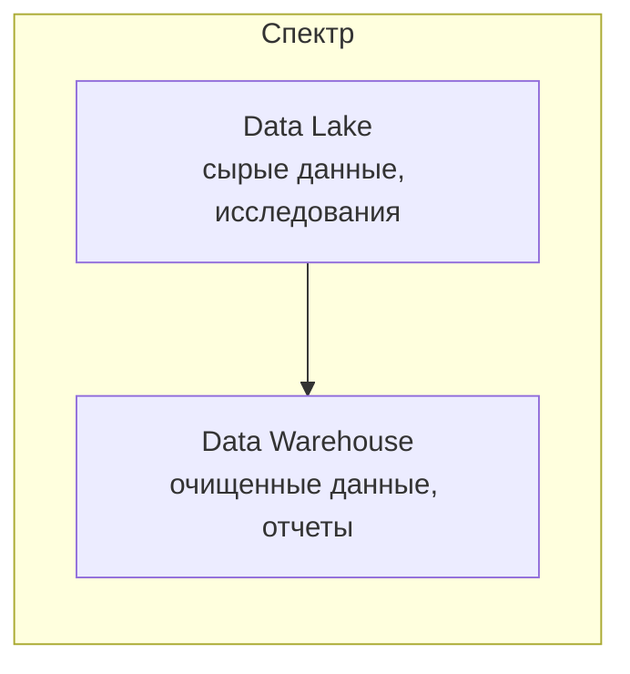

## Введение: Склад сырья vs Магазин готовой продукции

Представьте два места хранения.

**Первое — склад сырья.** Сюда привозят все подряд: доски, гвозди, краску, лампочки, провода. Ничего не обработано, не упаковано. Хочешь построить стол — бери доски, пили, строгай, краси. Хочешь сделать лампу — бери провода, лампочку, паяй. Склад огромный, дешевый, может хранить что угодно. Но чтобы получить результат, нужно много работать.

**Второе — магазин готовой продукции.** Здесь все обработано, упаковано, лежит на полках: столы, лампы, стулья. Пришел, взял готовый стол — и сразу можно использовать. Но магазин дороже, и ты не можешь купить там доски, чтобы сделать свой уникальный стол.

**Data Lake** — это "склад сырья". Хранилище необработанных, сырых данных в原始ном формате (JSON, CSV, Parquet, изображения, видео, логи). Данные загружаются как есть, без предварительной обработки и схемы. Подходит для исследований, машинного обучения, анализа "что у нас есть".

**Data Warehouse** — это "магазин готовой продукции". Хранилище обработанных, структурированных, очищенных данных, готовых для отчетов и аналитики. Данные проходят ETL-процесс (извлечение, трансформация, загрузка), имеют четкую схему (звезда, снежинка). Подходит для бизнес-отчетов, дашбордов, стандартных запросов.

## Data Lake: Определение и характеристики

**Data Lake** — это хранилище данных в原始ном, необработанном виде. Данные загружаются "как есть", без трансформации. Может хранить структурированные (таблицы), полуструктурированные (JSON, XML) и неструктурированные (изображения, видео, аудио, логи) данные.

**Ключевые характеристики:**

- **Схема при чтении (schema-on-read).** Данные не имеют предопределенной схемы при записи. Схема накладывается при чтении.
- **Хранит все данные.** Не фильтрует, не очищает. Даже если данные "грязные" или пока не нужны.
- **Дешевое хранение.** Использует недорогие хранилища (S3, HDFS, Azure Data Lake). Объектное хранилище.
- **Поддерживает любые форматы.** JSON, CSV, Avro, Parquet, ORC, изображения, видео.
- **Цель — исследование и ML.** Data Lake для Data Scientists, машинного обучения, ad-hoc анализа.

**Примеры технологий:** Amazon S3, Azure Data Lake Storage, Google Cloud Storage, HDFS (Hadoop), Delta Lake.

## Data Warehouse: Определение и характеристики

**Data Warehouse** — это хранилище структурированных, очищенных, агрегированных данных, готовых для аналитики и отчетов. Данные проходят ETL/ELT-процесс, имеют строгую схему (обычно звезда или снежинка).

**Ключевые характеристики:**

- **Схема при записи (schema-on-write).** Данные должны соответствовать схеме при загрузке. Нет данных — нет записи.
- **Очищенные данные.** Данные проходят валидацию, дедупликацию, исправление ошибок.
- **Дорогое хранилище.** Использует колоночные БД, оптимизированные для запросов (Redshift, BigQuery, Snowflake).
- **Структурированные данные.** Только табличные данные (строки, столбцы). Изображения, видео — не хранит.
- **Цель — бизнес-аналитика (BI).** Дашборды, отчеты, KPI, стандартные запросы.

**Примеры технологий:** Amazon Redshift, Google BigQuery, Snowflake, Azure Synapse, ClickHouse.

## Ключевые различия

| Аспект | Data Lake | Data Warehouse |
| :--- | :--- | :--- |
| **Тип данных** | Любые (структурированные, полуструктурированные, неструктурированные) | Только структурированные (таблицы) |
| **Схема** | Схема при чтении (schema-on-read) | Схема при записи (schema-on-write) |
| **Обработка** | Данные загружаются сырыми | ETL/ELT перед загрузкой |
| **Цель** | Исследования, ML, ad-hoc анализ | Бизнес-отчеты, дашборды, KPI |
| **Пользователи** | Data Scientists, Data Engineers | Бизнес-аналитики, менеджеры |
| **Хранилище** | Дешевое (объектное, S3) | Дорогое (колоночные БД) |
| **Производительность запросов** | Низкая (требуется обработка) | Высокая (оптимизировано) |
| **Качество данных** | Низкое ("грязные" данные) | Высокое (очищенные, проверенные) |
| **История** | Хранит все, что угодно | Хранит только то, что нужно для отчетов |

## Когда использовать Data Lake

- **Вы не знаете, какие вопросы будете задавать.** Исследовательский анализ: "А что у нас есть? Может, найдем закономерности?".
- **Данные приходят в разных форматах.** Логи, JSON, изображения, видео, аудио.
- **Машинное обучение.** ML требует больших объемов необработанных данных. Data Lake — идеальный источник.
- **Вы хотите хранить все данные "на всякий случай".** Бюджет позволяет, и вы не хотите ничего потерять.
- **Данные еще не готовы для очистки.** Нет понимания, какие данные нужны. Data Lake — временное хранение до выяснения.

**Примеры:**

- Хранилище всех логов веб-сервера за 5 лет в S3. Data Scientist потом может искать аномалии.
- Коллекция изображений для обучения нейросети.
- Сырые JSON-события из Kafka (тысячи в секунду) перед обработкой.

## Когда использовать Data Warehouse

- **У вас есть стандартные отчеты.** "Продажи по регионам за месяц", "Топ-10 товаров", "DAU/MAU".
- **Пользователи — бизнес-аналитики.** Они хотят дашборды в Tableau/Power BI, а не писать Spark-джобы.
- **Данные структурированы и стабильны.** Схема известна, данные проходят ETL.
- **Нужна высокая производительность запросов.** Аналитик не будет ждать 5 минут — нужны секунды.
- **Качество данных критично.** Отчеты для руководства не могут содержать ошибки из-за дублей или "грязных" данных.

**Примеры:**

- Хранилище продаж интернет-магазина. Таблицы: продукты, заказы, клиенты, продажи.
- Финансовая отчетность для CFO.
- Аналитика мобильного приложения (DAU, retention, LTV).

## Архитектура: Data Lake и Data Warehouse вместе (Lakehouse)

В реальности многие компании используют и Data Lake, и Data Warehouse. Данные приходят в Data Lake (дешево, все подряд), затем ETL-процесс очищает и трансформирует данные в Data Warehouse (для отчетов).

**Lakehouse** — новый паттерн, который пытается объединить лучшее из двух миров. Хранилище как Data Lake (дешевое, любые форматы), но с возможностью делать SQL-запросы, ACID-транзакции, управление схемой. Примеры: Delta Lake, Apache Iceberg, Apache Hudi.

## Реальные примеры

### Пример 1: Netflix

**Data Lake:** Все события просмотра, лог-файлы, метаданные фильмов в S3. Петабайты данных. Используется для рекомендательных систем, A/B тестирования, ML.

**Data Warehouse:** Агрегированные данные для бизнес-отчетов (сколько часов смотрели, retention, подписки) в Redshift / Snowflake.

### Пример 2: Uber

**Data Lake:** Все поездки, GPS-треки, логи мобильных приложений в HDFS / S3. Используется для оптимизации маршрутов, ML-моделей.

**Data Warehouse:** Агрегированные данные о поездках для дашбордов менеджеров в Google BigQuery.

### Пример 3: Стартап (100k пользователей)

**Data Warehouse:** PostgreSQL + Metabase. Все отчеты из операционной БД. Data Lake не нужен — мало данных, все структурировано.

## Что выбрать: Data Lake, Data Warehouse или оба?

**Вопросы для принятия решения:**

- Какие данные у вас есть? (структурированные, неструктурированные, оба?)
- Кто пользователи? (BI аналитики, Data Scientists, оба?)
- Какие запросы? (стандартные отчеты, ad-hoc анализ, ML, оба?)
- Бюджет? (Data Warehouse дорогой, Data Lake дешевый)
- Качество данных? (нужна очистка или можно работать с сырыми?)

**Только Data Warehouse:**

- Маленький объем данных (< 10 TB)
- Только структурированные данные
- Пользователи — BI аналитики
- Нет ML
- Бюджет позволяет (или не позволяет, но Data Warehouse и так недорогой на малых объемах)

**Только Data Lake:**

- Огромные объемы (> 100 TB)
- Неструктурированные данные (логи, изображения)
- Пользователи — Data Scientists
- ML — основной use case
- Нет требований к быстрым SQL-запросам

**Оба (Lake + Warehouse):**

- Есть и структурированные, и неструктурированные данные
- Есть и BI аналитики, и Data Scientists
- Нужны и отчеты, и ML
- Бюджет позволяет
- Стандартный паттерн для крупных компаний

## Резюме

Data Lake и Data Warehouse — это разные подходы к хранению данных для аналитики.

**Data Lake (склад сырья):**

- Хранит сырые, необработанные данные
- Любые форматы (JSON, CSV, изображения, видео)
- Схема при чтении (schema-on-read)
- Дешевое хранение (S3, HDFS)
- Цель: исследования, ML, ad-hoc анализ
- Пользователи: Data Scientists, Data Engineers

**Data Warehouse (магазин готовой продукции):**

- Хранит очищенные, структурированные данные
- Только табличные данные
- Схема при записи (schema-on-write)
- Дорогое хранение (Redshift, BigQuery, Snowflake)
- Цель: бизнес-отчеты, дашборды, KPI
- Пользователи: BI аналитики, менеджеры

**Ключевые различия:**

| Аспект | Data Lake | Data Warehouse |
| :--- | :--- | :--- |
| Тип данных | Любые | Только таблицы |
| Схема | При чтении | При записи |
| Обработка | Нет (сырые) | ETL/ELT |
| Цель | Исследования | Отчеты |
| Пользователи | Data Scientists | BI аналитики |
| Стоимость | Дешево | Дорого |

**Lakehouse** — новый паттерн, объединяющий лучшее из двух миров: дешевое хранение Data Lake + SQL-запросы и управление схемой Data Warehouse.

**Что выбрать:**

- Только Data Warehouse: маленькие данные, только структурированные, BI отчеты
- Только Data Lake: огромные данные, неструктурированные, ML
- Оба: стандартный паттерн для крупных компаний (Netflix, Uber, Airbnb)

На практике многие компании начинают с Data Warehouse (проще, понятнее), а по мере роста добавляют Data Lake для хранения сырых данных и ML. Data Lake и Data Warehouse не конкуренты, а взаимодополняющие инструменты для разных задач.