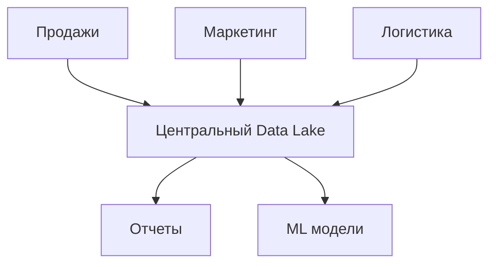
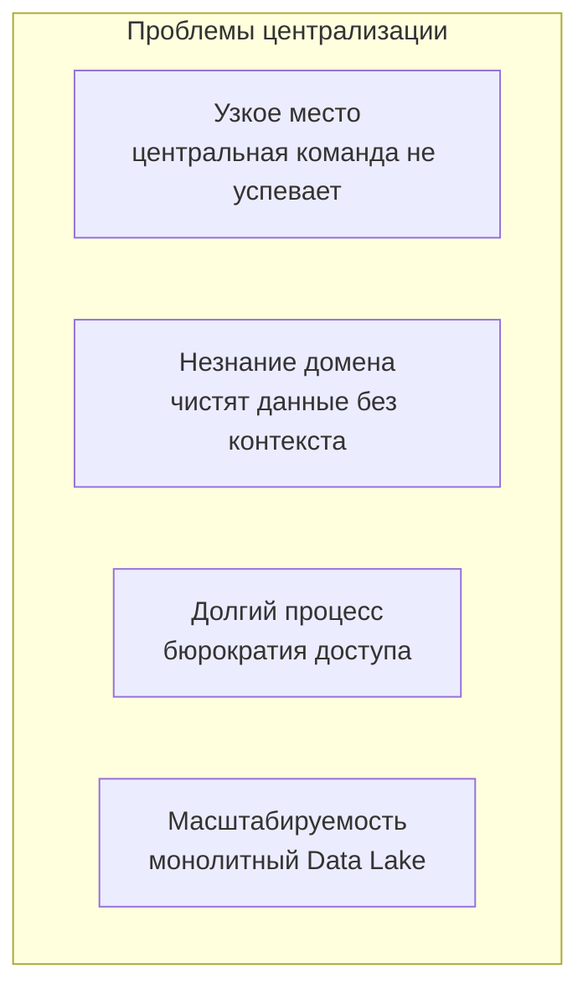
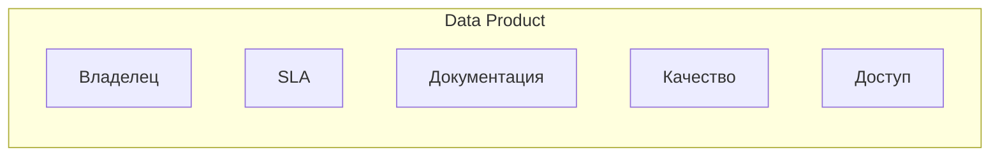
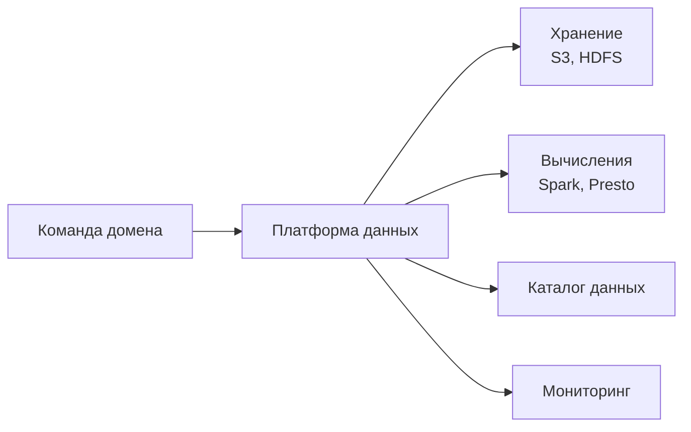
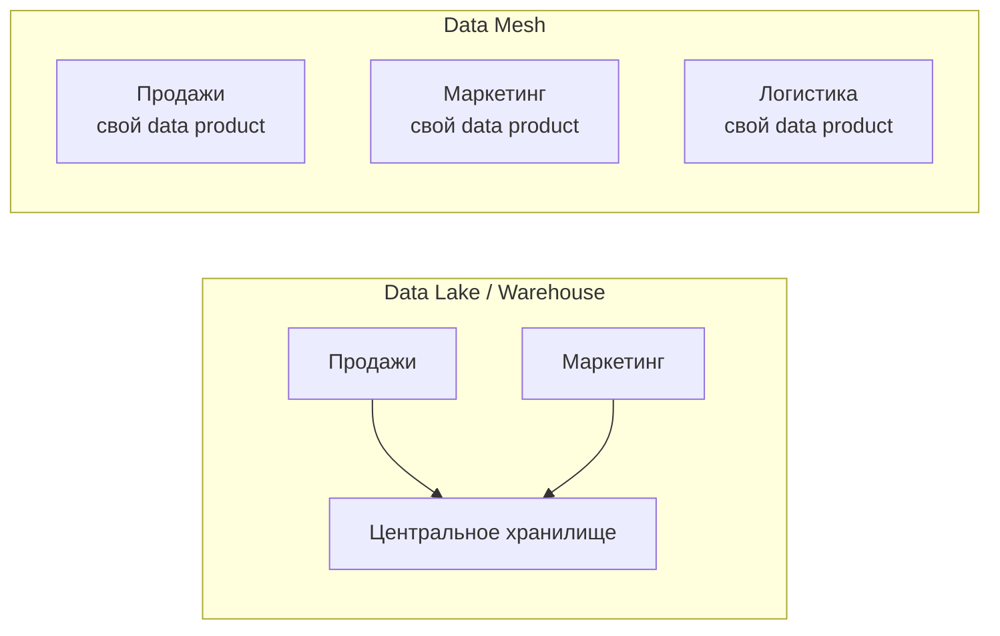
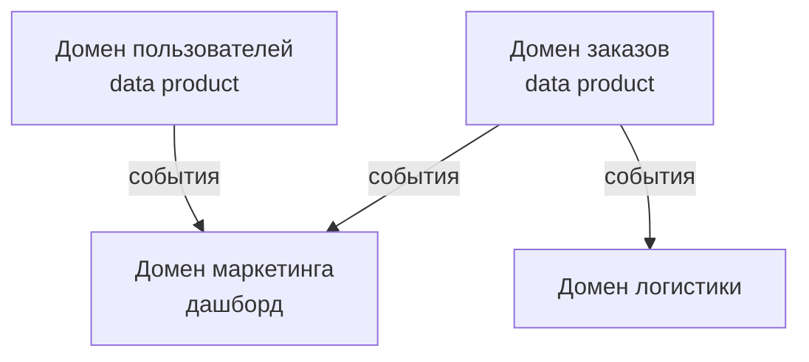

## Введение: Централизованное озеро vs децентрализованные острова

Представьте большую корпорацию, у которой есть один центральный склад всех данных. Все отделы: продажи, маркетинг, логистика, производство — отправляют свои данные на этот склад. Там работает центральная команда аналитиков, которая чистит данные, строит отчеты и рассылает их отделам.

Проблема: продажам нужны данные по продажам сегодня, а центральная команда делает отчет раз в неделю. Маркетинг хочет экспериментировать с данными, но центральная команда не успевает. Производство хочет подключить свои данные к новой ML-модели, но центральная команда не дает доступ. Склад превращается в узкое место.

**Data Mesh** — это новый подход к управлению данными, предложенный Замой Дегхгани (Zhamak Dehghani) в 2019 году. Он переносит идеи микросервисов (децентрализация, владение доменами) в мир данных.

Data Mesh предлагает: вместо одного централизованного Data Lake/Data Warehouse, данные децентрализуются по доменам (продажи, маркетинг, логистика). Каждый домен владеет своими данными, публикует их как продукты, и другие домены могут их потреблять. Есть общая инфраструктура и стандарты, но нет центральной команды, которая контролирует все данные.

## Проблема, которую решает Data Mesh

Традиционный подход к управлению данными в крупных компаниях — централизованный Data Lake или Data Warehouse. Все данные стекаются в одно место. Центральная команда (Data Engineering) отвечает за ETL, очистку, доступ.

**Проблемы централизованного подхода:**

- **Узкое место.** Центральная команда не успевает обрабатывать запросы всех доменов. Отчеты задерживаются.
- **Незнание домена.** Центральная команда не знает тонкостей данных продаж или маркетинга. Они чистят данные, не понимая контекста.
- **Долгий процесс.** Чтобы получить доступ к данным, нужно пройти бюрократию. Аналитики теряют время.
- **Масштабируемость.** С ростом компании центральный Data Lake становится монолитом — долгие запросы, сложность изменений.

**Data Mesh** решает эти проблемы, децентрализуя данные по доменам, аналогично тому, как микросервисы децентрализуют код.

## Четыре принципа Data Mesh

### 1. Децентрализация по доменам (Domain Ownership)

Данные принадлежат доменам, которые их создают. Команда продаж владеет данными продаж. Команда маркетинга — данными маркетинга. Нет центрального "владельца всех данных".

**Аналогия с микросервисами:** Каждый микросервис владеет своей БД (Database per Service). Так и здесь: каждый домен владеет своими данными.

### 2. Данные как продукт (Data as a Product)

Каждый домен публикует свои данные как продукт. У продукта есть:

- **Владелец.** Команда, отвечающая за качество данных.
- **SLA (Service Level Agreement).** Какая свежесть данных? (real-time, hourly, daily)
- **Документация.** Что означают поля? Откуда данные?
- **Качество.** Метрики качества (полнота, точность, свежесть).
- **Доступность.** API, SQL, события — как потреблять данные.

**Пример:** Команда продаж публикует data product "Продажи". Включает: API для получения продаж по датам, документацию, гарантию свежести 1 час.

### 3. Самообслуживаемая инфраструктура (Self-Serve Data Infrastructure)

Инфраструктура (хранение, вычисления, каталог, мониторинг) предоставляется как платформа. Команды доменов могут сами публиковать свои data products, не дожидаясь центральной команды.

### 4. Федеративное управление (Federated Governance)

Нет одного центрального "короля данных". Есть общие стандарты (форматы, метаданные, безопасность), но каждый домен сам решает, как их реализовывать.

**Что централизовано:** стандарты безопасности, метаданных, API. **Что децентрализовано:** конкретные данные, ETL-процессы, внутренние форматы.

## Data Mesh vs Data Lake / Warehouse

| Аспект | Data Lake / Warehouse | Data Mesh |
| :--- | :--- | :--- |
| **Архитектура** | Централизованная | Децентрализованная |
| **Владелец данных** | Центральная команда | Команды доменов |
| **Масштабируемость** | Проблемы при росте | Горизонтальная |
| **Скорость доступа** | Медленно (бюрократия) | Быстро (самообслуживание) |
| **Качество данных** | Ответственность центральной команды (часто низкое) | Ответственность домена (выше) |
| **Сложность** | Ниже (один Data Lake) | Выше (много data products) |
| **Подход** | Монолит данных | Микросервисы данных |

## Как потребляются данные в Data Mesh

Домен А хочет использовать данные домена Б. Он не копирует их без спроса. Вместо этого:

1. **Через API.** Домен Б предоставляет API для запросов данных.
2. **Через события (CDC).** Домен Б публикует события об изменениях (Kafka). Домен А подписывается.
3. **Через SQL (децентрализованный запрос).** Используя联邦тивные引擎 (Presto, Trino), домен А может делать SQL-запросы к данным домена Б (без копирования).
4. **Копирование (materialized view).** Домен А может подписаться на события и построить свою локальную копию данных домена Б (с eventual consistency).

## Пример: E-commerce компания

**Традиционный подход (Data Lake):** Все данные (заказы, пользователи, товары, логи) стекаются в центральный S3. Центральная команда чистит и строит отчеты. Маркетинг хочет данные о заказах для своего дашборда — ждет 2 недели, пока центральная команда сделает ETL.

**Data Mesh:**

- **Домен заказов** публикует data product "Заказы" с API (gRPC) и событиями (Kafka). Свежесть — real-time.
- **Домен пользователей** публикует data product "Пользователи" (API, события).
- **Домен маркетинга** подписывается на события заказов и пользователей, строит свой дашборд. Не ждет центральную команду.
- **Домен логистики** подписывается на события заказов для планирования доставок.

## Преимущества Data Mesh

**Масштабируемость.** Компания растет, добавляются новые домены. Нет центрального узкого места.

**Качество данных.** Домен владеет своими данными, ему не все равно на их качество. Улучшается документация, свежесть, точность.

**Скорость.** Команды сами публикуют и потребляют данные, не дожидаясь центральной команды. Аналитики не теряют время.

**Автономность.** Каждый домен сам выбирает технологии (база данных, форматы) для своих data products.

**Слабая связанность.** Изменение данных в домене Б не ломает домен А, если API не меняется (аналогично микросервисам).

## Недостатки и сложности Data Mesh

**Сложность.** Data Mesh значительно сложнее централизованного Data Lake. Нужно управлять множеством data products, обеспечивать федеративное управление.

**Культурные изменения.** Команды должны принять ответственность за свои данные. Раньше была центральная команда — виноваты они. Теперь каждый домен отвечает за качество.

**Инфраструктура.** Нужна платформа для самообслуживания: каталог данных, федеративные запросы, мониторинг, управление доступом. Это требует инвестиций.

**Дублирование данных.** Один и тот же data product может потребляться многими доменами. Это приводит к дублированию данных (каждый подписчик строит свою копию). Нужны механизмы управления.

**Сложность федеративных запросов.** Запрос, объединяющий данные из 5 доменов, может быть медленным (запросы через API, а не JOIN в одной БД).

**Не для маленьких компаний.** Data Mesh окупается только при масштабе: много доменов, много данных, центральный Data Lake уже трещит.

## Data Mesh и микросервисы: параллели

Data Mesh часто называют "микросервисами для данных". Параллели:

| Микросервисы | Data Mesh |
| :--- | :--- |
| Децентрализация кода | Децентрализация данных |
| Каждый сервис владеет своей БД | Каждый домен владеет своими данными |
| API для общения | Data products (API, события) |
| Самообслуживаемая инфраструктура (K8s) | Платформа данных (каталог, федеративные запросы) |
| Команды владеют сервисами | Команды владеют data products |

**Но есть отличие:** в микросервисах стараются избегать копирования данных (один источник истины). В Data Mesh копирование данных через события — обычная практика (для повышения доступности и скорости).

## Когда Data Mesh — правильный выбор

- **Крупная компания (500+ сотрудников).** Много доменов (продажи, маркетинг, логистика, производство, HR). Центральный Data Lake уже не справляется.
- **Высокие требования к скорости.** Аналитикам нужны данные сегодня, а не через неделю.
- **Разные требования к данным.** Продажам нужны real-time данные, маркетингу — hourly, производству — daily.
- **Команды готовы к ответственности.** Культура позволяет делегировать владение данными доменам.
- **Есть инвестиции в платформу.** Готовы построить инфраструктуру для самообслуживания.

## Когда Data Mesh не нужен

- **Маленькая компания (до 100 сотрудников).** Центральный Data Lake проще и дешевле. Data Mesh — оверинжиниринг.
- **Один-два домена.** Если у вас только продажи и маркетинг, децентрализация не даст выгоды.
- **Нет культуры владения данными.** Команды не хотят отвечать за качество данных.
- **Нет ресурсов на платформу.** Data Mesh требует инвестиций в инфраструктуру.

## Реальные примеры

**Пример 1: Netflix.** Netflix использует Data Mesh. Множество доменов (рекомендации, контент, платежи, поддержка) публикуют свои data products через Kafka. Платформа данных предоставляет каталог (Metacat), федеративные запросы (Presto), мониторинг.

**Пример 2: JPMorgan Chase.** Банк с тысячами доменов. Переход от централизованных Data Warehouse к Data Mesh. Каждый бизнес-домен (торговля, риск, комплаенс) владеет своими данными.

**Пример 3: Стартап с 50 сотрудниками.** Один Data Lake в S3, одна команда данных. Data Mesh не нужен.

## Резюме

Data Mesh — это децентрализованный подход к управлению данными, вдохновленный микросервисами. Вместо одного централизованного Data Lake/Data Warehouse, данные децентрализуются по доменам.

**Четыре принципа Data Mesh:**

1. **Децентрализация по доменам** — команды владеют своими данными
2. **Данные как продукт** — каждый домен публикует data product (API, события, документация, SLA)
3. **Самообслуживаемая инфраструктура** — платформа для публикации и потребления данных
4. **Федеративное управление** — общие стандарты, но децентрализованная реализация

**Преимущества:**

- Масштабируемость (нет центрального узкого места)
- Качество данных (домен отвечает за свои данные)
- Скорость (самообслуживание, нет бюрократии)
- Автономность (выбор технологий)
- Слабая связанность

**Недостатки и сложности:**

- Сложность (много data products)
- Культурные изменения (ответственность за данные)
- Инфраструктура (платформа данных)
- Дублирование данных
- Сложность федеративных запросов

**Когда использовать:**

- Крупная компания (500+ сотрудников)
- Много доменов
- Высокие требования к скорости
- Культура владения данными
- Инвестиции в платформу

**Когда не использовать:**

- Маленькая компания
- Один-два домена
- Нет культуры владения данными
- Нет ресурсов на платформу

Data Mesh — это эволюционный шаг после Data Lake. Сначала компании строят централизованный Data Lake (просто). Когда он перестает справляться (медленно, низкое качество, бюрократия), переходят к Data Mesh. Но Data Mesh не панацея. Он требует зрелой культуры, инвестиций и правильного масштаба. Для маленьких компаний Data Mesh — оверинжиниринг. Для крупных — путь к масштабируемому управлению данными.