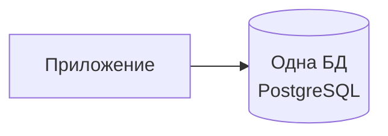
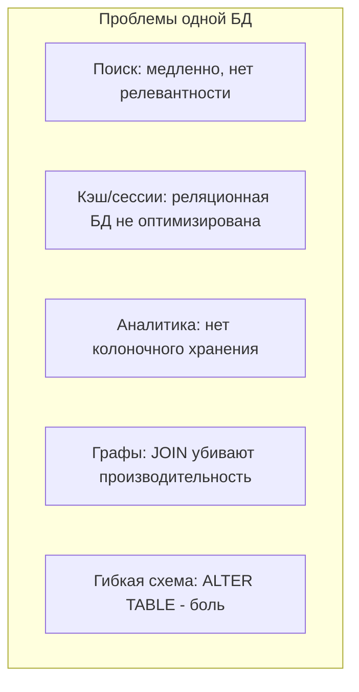
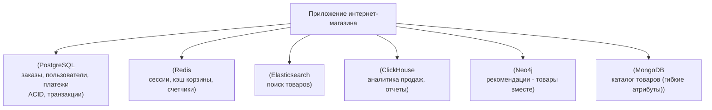
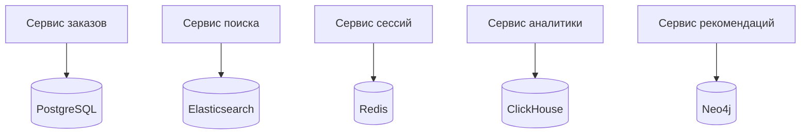
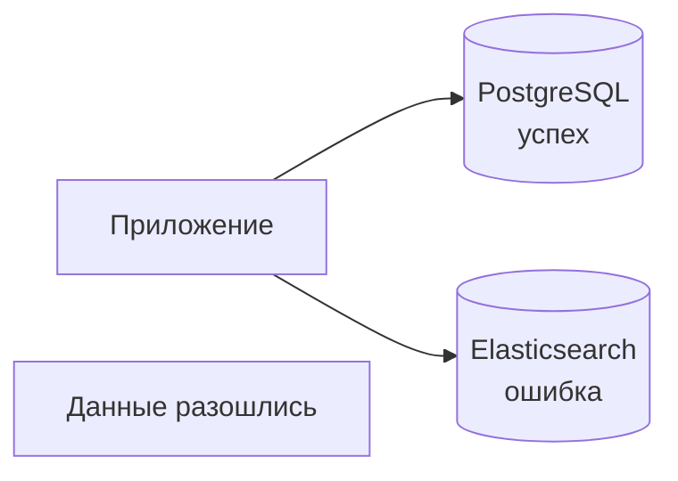
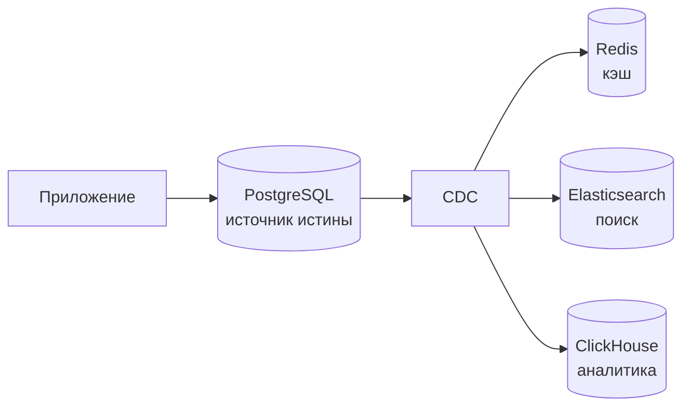

## Введение: Не одна база данных, а много

Представьте, что у вас есть задача хранить разные вещи. Инструменты для ремонта. Фотографии. Документы. Музыку. Продукты.

Вы не станете хранить молоко в том же ящике, где лежат гвозди. И фотографии не положите в морозилку. Для каждой вещи — свое место: инструменты в ящике, продукты в холодильнике, документы в папке, музыка на полке.

**Polyglot Persistence** делает то же самое с базами данных. Вместо того чтобы использовать одну базу данных для всех задач (например, PostgreSQL), вы выбираете разные базы данных для разных задач. Каждая база данных лучше всего подходит для своего типа данных и паттерна доступа.

Термин ввел Ниал Форд (Neal Ford) в 2006 году. "Polyglot" означает "многоязычный". Persistence — "хранение данных". Идея: как разработчики могут использовать несколько языков программирования в одном проекте (polyglot programming), так и система может использовать несколько баз данных.

## Проблема, которую решает Polyglot Persistence

В традиционных системах часто использовали одну реляционную базу данных (PostgreSQL, MySQL, Oracle) для всего. Заказы, пользователи, логи, сессии, поиск — все в одной БД.

**Проблемы одного типа БД для всех задач:**

- **Поиск.** PostgreSQL не оптимизирован для полнотекстового поиска (медленно, нет релевантности, fuzzy search). Нужен Elasticsearch.

- **Сессии и кэш.** Реляционная БД медленная для key-value доступа (много операций в секунду, высокая нагрузка). Нужен Redis.

- **Аналитика и агрегации.** Реляционная БД не оптимизирована для колоночного хранения и сложных агрегаций (медленно). Нужна колоночная БД (ClickHouse, Druid).

- **Графовые данные (соцсети, рекомендации).** JOIN в реляционной БД для графов — это сотни JOIN, очень медленно. Нужна графовая БД (Neo4j).

- **Гибкая схема (JSON, разнородные данные).** Реляционная БД требует фиксированной схемы (ALTER TABLE). Для часто меняющихся данных — боль. Нужна документная БД (MongoDB, Firestore).

Polyglot Persistence решает эти проблемы, позволяя выбрать лучшую БД для каждой задачи.

## Какие бывают типы баз данных

### Реляционные (SQL)

**Примеры:** PostgreSQL, MySQL, Oracle, SQL Server.

**Хороши для:** Данные с четкой схемой, ACID-транзакции, сложные JOIN, внешние ключи, отчеты.

**Плохи для:** Горизонтального масштабирования (шардирование сложно), гибкой схемы, полнотекстового поиска, графов.

### Документные (Document)

**Примеры:** MongoDB, Couchbase, Firestore.

**Хороши для:** JSON-документы, гибкая схема (схема меняется часто), иерархические данные, быстрое прототипирование.

**Плохи для:** Сложных JOIN (нет), ACID-транзакций (ограничены), сложных агрегаций.

### Ключ-значение (Key-Value)

**Примеры:** Redis, Memcached, DynamoDB (режим KV).

**Хороши для:** Кэширование, сессии, очереди, лидерборды, pub/sub, счетчики.

**Плохи для:** Сложных запросов, JOIN, агрегаций, полнотекстового поиска.

### Колоночные (Columnar)

**Примеры:** ClickHouse, Apache Druid, Vertica, BigQuery (колоночное хранение).

**Хороши для:** Аналитики, агрегаций (SUM, COUNT, AVG), временных рядов, больших объемов данных.

**Плохи для:** Точечных запросов (SELECT * WHERE id = x), частых UPDATE/DELETE, транзакций.

### Графовые (Graph)

**Примеры:** Neo4j, Amazon Neptune, ArangoDB.

**Хороши для:** Социальные сети (друзья, подписки), рекомендательные системы, маршрутизация, графы знаний.

**Плохи для:** Простых CRUD, горизонтального масштабирования (сложно), агрегаций.

### Поисковые (Search engine)

**Примеры:** Elasticsearch, Solr, Meilisearch.

**Хороши для:** Полнотекстовый поиск, fuzzy search, релевантность, автодополнение, лог-аналитика.

**Плохи для:** Транзакций, JOIN, сложных обновлений.

### Временных рядов (Time Series)

**Примеры:** InfluxDB, TimescaleDB, Prometheus.

**Хороши для:** IoT, метрики, мониторинг, телеметрия, downsampling.

**Плохи для:** JSON-документов, сложных JOIN.

## Пример: Polyglot Persistence в интернет-магазине

**Зачем каждая БД:**

- **PostgreSQL:** Заказы и платежи требуют ACID. Нельзя потерять транзакцию или допустить двойное списание. JOIN между заказами и пользователями.

- **Redis:** Сессии пользователей — key-value доступ. Высокий RPS, низкая задержка. Кэш корзины, чтобы не бить в PostgreSQL.

- **Elasticsearch:** Поиск товаров. Полнотекстовый поиск, релевантность, fuzzy search (ошибки в запросе).

- **ClickHouse:** Аналитика продаж (агрегации по дням, товарам, регионам). Колоночное хранение ускоряет SUM/COUNT.

- **Neo4j:** Рекомендации "кто купил этот товар, также купили". Графовая БД эффективно находит связи.

- **MongoDB:** Каталог товаров. У разных категорий разные атрибуты (у телефона — диагональ, у футболки — размер). Гибкая схема MongoDB идеальна.

## Polyglot Persistence и микросервисы

Polyglot Persistence и микросервисы — естественная пара. В микросервисной архитектуре с Database per Service каждый сервис может выбирать свою БД.

**Преимущества:**

- Каждый сервис выбирает БД, которая лучше всего подходит для его задач.
- Нет конфликтов требований (один сервис хочет ACID, другой — высокую доступность).
- Сервисы независимы, могут менять БД без влияния на другие.

## Проблемы и сложности Polyglot Persistence

### Сложность операций

Вместо одной БД — несколько. Нужно уметь администрировать PostgreSQL, Redis, Elasticsearch, ClickHouse, Neo4j. Нужны специалисты по каждой БД.

### Сложность приложений

Приложение должно подключаться к нескольким БД. Нужны пулы соединений, обработка ошибок, транзакции между БД? (Сложно, почти невозможно).

### Распределенные транзакции

Операция, затрагивающая PostgreSQL и Elasticsearch, не может быть атомарной. Если запись в PostgreSQL успешна, а в Elasticsearch упала — данные разошлись. Нужны паттерны вроде Saga, eventual consistency.

### Дорого

Несколько БД → несколько серверов → выше затраты на инфраструктуру.

### Сложность аналитики (JOIN между БД)

Если нужен отчет, объединяющий данные из PostgreSQL (заказы) и ClickHouse (аналитика), сделать JOIN напрямую нельзя. Нужно выгружать данные в одно место (Data Warehouse) или использовать федеративные запросы (Presto, Trino).

## Стратегии управления Polyglot Persistence

### Стратегия 1: Одна БД для всего, пока не станет больно

Начинайте с одной БД (например, PostgreSQL). Добавляйте другие БД только когда это действительно нужно:

- Когда поиск стал медленным → добавьте Elasticsearch.
- Когда сессии нагружают PostgreSQL → добавьте Redis.
- Когда аналитика тормозит → добавьте ClickHouse.

**YAGNI (You Aren't Gonna Need It):** Не добавляйте MongoDB, Elasticsearch, Redis "на всякий случай". Добавляйте, когда они реально нужны.

### Стратегия 2: Одна основная БД + специализированные для ускорения

Основная БД (PostgreSQL) — источник истины. Специализированные БД (Elasticsearch, Redis, ClickHouse) — это read-модели (кэш, индексы, поиск). Обновляются через CDC (Debezium) или двойную запись.

### Стратегия 3: Одна БД на микросервис

В микросервисной архитектуре каждый сервис выбирает свою БД. Нет проблемы "одно приложение подключается к 5 БД". Каждый сервис подключается к 1-2 БД.

## Когда Polyglot Persistence — правильный выбор

- **Разные требования к данным.** Вам нужны и ACID-транзакции (финансы), и быстрый поиск, и аналитика, и кэш. Одна БД не может быть лучшей для всего.

- **Микросервисная архитектура.** Естественно для Database per Service.

- **Высокая нагрузка.** Redis для сессий, ClickHouse для аналитики, Elasticsearch для поиска — каждая БД оптимизирована под свою нагрузку.

- **Команда имеет опыт.** Есть специалисты по разным БД.

## Когда Polyglot Persistence не нужен

- **Небольшой проект.** Одна PostgreSQL справится с поиском, сессиями, аналитикой, если данных мало (до 10-20 GB). Добавление Redis, Elasticsearch — оверинжиниринг.

- **Один тип данных.** Если все ваши данные — таблицы с четкой схемой и транзакциями, зачем вам MongoDB?

- **Маленькая команда.** Администрировать 5 БД сложно. Если у вас 2 разработчика, им не до этого.

- **Нет реальной проблемы.** "А давайте добавим Elasticsearch, вдруг поиск станет медленным, когда у нас будет миллион товаров". Сейчас 1000 товаров. Не нужно.

## Реальные примеры

**Пример 1: Netflix.** Использует разные БД: Cassandra (для метаданных), Elasticsearch (для поиска), Redis (кэш), PostgreSQL (финансы), S3 (Data Lake).

**Пример 2: Uber.** Использует PostgreSQL (финансы, заказы), Cassandra (поездки в реальном времени), Redis (кэш), Elasticsearch (поиск), ClickHouse (аналитика).

**Пример 3: Небольшой стартап (20k пользователей).** Использует только PostgreSQL. Поиск — через LIKE (пока работает). Сессии — в PostgreSQL. Аналитика — отчеты из PostgreSQL. Polyglot Persistence не нужен.

## Резюме

Polyglot Persistence — это подход, при котором система использует несколько типов баз данных, каждая из которых лучше всего подходит для своих задач.

**Типы баз данных и их применение:**

- **Реляционные (PostgreSQL):** ACID, JOIN, транзакции
- **Документные (MongoDB):** гибкая схема, JSON
- **Ключ-значение (Redis):** кэш, сессии, счетчики
- **Колоночные (ClickHouse):** аналитика, агрегации
- **Графовые (Neo4j):** соцсети, рекомендации
- **Поисковые (Elasticsearch):** полнотекстовый поиск
- **Временных рядов (InfluxDB):** IoT, метрики

**Преимущества:**

- Каждая задача решается лучшим инструментом
- Производительность выше (оптимизировано под паттерн доступа)
- Гибкость

**Недостатки и сложности:**

- Сложность операций (администрирование многих БД)
- Сложность приложений (подключение к нескольким БД)
- Распределенные транзакции (Saga, eventual consistency)
- Дорого (больше серверов)
- Сложность аналитики (JOIN между БД)

**Когда использовать:**

- Разные требования к данным
- Микросервисная архитектура
- Высокая нагрузка
- Команда имеет опыт

**Когда не использовать:**

- Небольшой проект
- Один тип данных
- Маленькая команда
- Нет реальной проблемы (преждевременная оптимизация)

**Стратегия:** Начинайте с одной БД (PostgreSQL). Добавляйте специализированные БД только когда они реально нужны: поиск → Elasticsearch, кэш → Redis, аналитика → ClickHouse. Не добавляйте БД "на всякий случай". Polyglot Persistence — это решение проблем роста, а не стартовая позиция.