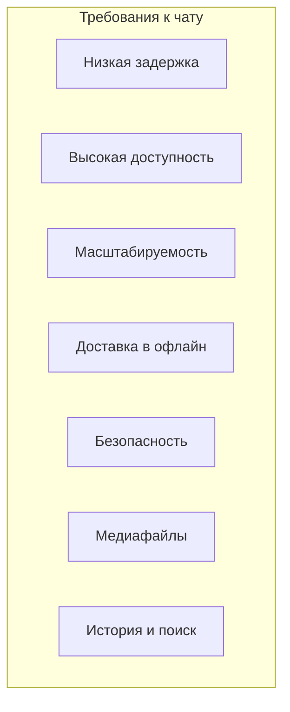
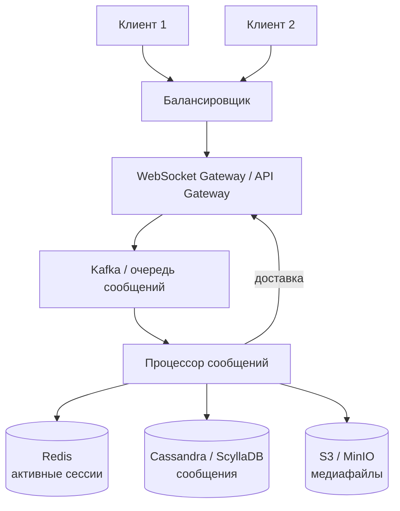
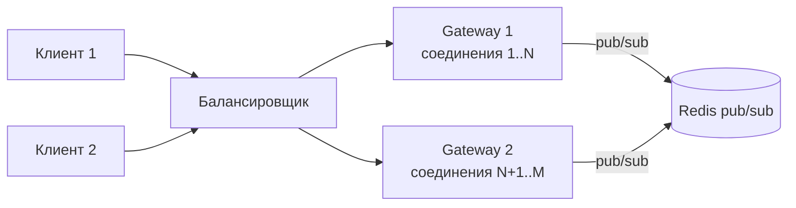
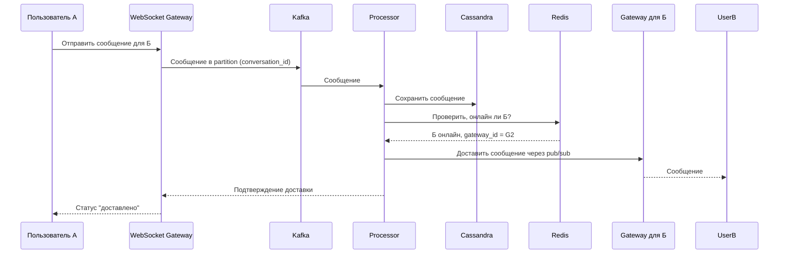

## Введение: Мгновенные сообщения в реальном времени

Чат или мессенджер — одно из самых требовательных приложений с точки зрения архитектуры. Пользователи ожидают, что сообщения будут доставляться мгновенно (задержка в доли секунды), даже при одновременной работе миллионов пользователей. Система должна быть всегда доступна (люди хотят общаться 24/7), должна поддерживать разные типы контента (текст, изображения, видео, голосовые сообщения) и должна обеспечивать безопасность и приватность.

Чат — это классический пример системы, где требования к производительности, доступности и масштабируемости сталкиваются друг с другом. Архитектура чата должна учитывать, что большинство сообщений маленькие, но их очень много; соединения должны быть постоянными (не закрываться после каждого сообщения); а сообщения, отправленные в офлайн, должны быть доставлены при появлении пользователя в сети.

## Ключевые требования к архитектуре чата

**Низкая задержка (low latency).** Сообщение должно доставляться за десятки или сотни миллисекунд. Пользователь не должен ждать. Задержка более 1 секунды уже заметна и раздражает.

**Высокая доступность (high availability).** Чат должен работать 99.99% времени. Люди расстраиваются, если мессенджер недоступен. Отказоустойчивость критична.

**Масштабируемость (scalability).** Система должна выдерживать миллионы одновременных пользователей, каждый из которых может отправлять сообщения. Пиковые нагрузки (праздники, вечерние часы) должны обрабатываться без деградации.

**Доставка в офлайн.** Если пользователь не в сети, сообщения должны быть сохранены и доставлены при его подключении. Порядок сообщений должен сохраняться.

**Безопасность и приватность.** Сообщения должны быть зашифрованы (в пути и часто в покое). Только участники чата должны иметь доступ к сообщениям. Сквозное шифрование (end-to-end encryption) — требование для многих мессенджеров.

**Поддержка разных типов контента.** Текст, изображения, видео, аудио, файлы, реакции, стикеры. Медиафайлы требуют отдельной обработки и хранения.

**История сообщений.** Сообщения должны храниться и быть доступными для просмотра истории (часто за ограниченный период или все время). Поиск по истории — дополнительное требование.



## Типовая архитектура чата



## Компоненты архитектуры чата

### WebSocket Gateway (шлюз для реального времени)

Это компонент, который поддерживает постоянные соединения с клиентами. В отличие от HTTP (запрос-ответ), WebSocket позволяет серверу отправлять сообщения клиенту без запроса (push). Это критически важно для мгновенной доставки сообщений.

Gateway должен обрабатывать десятки тысяч одновременных WebSocket-соединений. Для этого он должен быть асинхронным (не блокировать поток на каждое соединение) и хорошо масштабироваться горизонтально.

**Требования:** Асинхронный I/O (Netty, Node.js, Go), высокая пропускная способность, управление памятью.

**Балансировка соединений:** WebSocket соединения — это не stateless HTTP-запросы. Если у вас несколько Gateway, нужно, чтобы сообщения для пользователя доставлялись на тот Gateway, к которому он подключен. Решения:

- **Sticky sessions (балансировка на уровне IP).** Балансировщик запоминает, какой Gateway обслуживает пользователя.
- **Pub/Sub между Gateway.** При получении сообщения Gateway публикует его в брокер (Redis pub/sub, Kafka), и все Gateway получают уведомление. Каждый Gateway проверяет, подключен ли пользователь к нему, и если да — отправляет сообщение.



### Очередь сообщений (Kafka)

Все входящие сообщения проходят через очередь (брокер сообщений). Это дает:

- **Сглаживание пиков (buffer).** При резком всплеске сообщений очередь накапливает их, и процессор обрабатывает в своем темпе. Система не падает.
- **Надежность.** Если процессор упал, сообщения сохраняются в очереди и будут обработаны позже.
- **Масштабируемость.** Можно добавить несколько процессоров (consumer groups) для параллельной обработки.

**Важно:** Сообщения в очереди должны быть распределены по partition. Для чата partition key — обычно `conversation_id` (или `user_id`). Это гарантирует, что сообщения одного диалога попадают в один partition и обрабатываются последовательно (сохраняется порядок).

### Процессор сообщений (Message Processor)

Сервис, который читает сообщения из очереди и:

- Сохраняет сообщение в базу данных (для истории)
- Обновляет статус доставки (sent, delivered, read)
- Если получатель онлайн — отправляет сообщение через Gateway
- Если получатель офлайн — сохраняет в очередь офлайн-сообщений
- Обрабатывает медиафайлы (сохраняет в S3, генерирует thumbnail)

Процессор должен быть идемпотентным (повторная обработка того же сообщения не создает дубликатов). Это важно, потому что очереди обычно гарантируют at-least-once доставку.

### База данных сообщений (Cassandra / ScyllaDB)

Хранение сообщений — одна из самых сложных частей. Сообщений может быть миллиарды. Нужна база данных, которая:

- **Хорошо масштабируется горизонтально (no single master).** Cassandra, ScyllaDB (совместимы с Cassandra), HBase.
- **Поддерживает высокую нагрузку на запись.** Миллионы сообщений в секунду.
- **Поддерживает запросы по времени (диапазоны).** "Показать последние 50 сообщений в чате" — это запрос по partition key (conversation_id) и sort by timestamp.
- **Обеспечивает eventual consistency (CAP: AP).** Для чата допустимо, что сообщение может появиться с задержкой на разных репликах, но недопустимо, чтобы система была недоступна.

**Схема в Cassandra (пример):**

```sql
CREATE TABLE messages_by_conversation (
    conversation_id uuid,
    message_id timeuuid,  -- время + уникальность
    sender_id uuid,
    text text,
    media_urls list<text>,
    created_at timestamp,
    PRIMARY KEY (conversation_id, message_id)
) WITH CLUSTERING ORDER BY (message_id DESC);
```

Этот запрос `SELECT * FROM messages_by_conversation WHERE conversation_id = ? LIMIT 50` вернет последние 50 сообщений (порядок по убыванию message_id). Очень быстро.

### Кэш сессий и онлайн-статус (Redis)

Нужно знать, какие пользователи онлайн, к какому Gateway подключены. Это состояние часто меняется (пользователь заходит, выходит). Redis идеально подходит:

- **Хранение онлайн-статуса:** ключ `user:online:{user_id}` → `true/false`.
- **Хранение mapping user → gateway:** ключ `user:gateway:{user_id}` → `gateway_id`.
- **Pub/Sub для уведомлений между Gateway.** При получении сообщения для пользователя, который подключен к другому Gateway, нужно уведомить этот Gateway.

**Важно:** Redis — это in-memory база. При падении данные теряются. Это приемлемо для онлайн-статуса (пользователи переподключатся). Но для очередей сообщений между Gateway нужно использовать более надежный брокер (Kafka).

### Хранилище медиафайлов (S3, MinIO)

Изображения, видео, файлы не хранятся в основной базе (это было бы неэффективно). Вместо этого:

- Клиент загружает файл в S3 (через presigned URL)
- Получает URL файла
- Отправляет в чат сообщение с URL

**Для уменьшения размера:** генерация thumbnails, сжатие изображений, конвертация видео.

**Для безопасности:** presigned URLs с ограниченным временем жизни.

## Поток сообщения в чате



## Ключевые архитектурные решения для чата

### Выбор протокола: WebSocket vs HTTP/2 Server-Sent Events (SSE) vs gRPC

- **WebSocket.** Самый распространенный. Полнодуплексный (сервер и клиент могут отправлять сообщения в любой момент). Поддерживается всеми браузерами. Для мобильных приложений — библиотеки.
- **SSE (Server-Sent Events).** Только от сервера к клиенту (однонаправленный). Проще, но клиент не может отправить сообщение через то же соединение. Использует HTTP, легко с балансировкой.
- **gRPC (с бидирекциональным streaming).** Более эффективный (бинарный протокол), но требует поддержки в клиентах.

**Выбор:** WebSocket для большинства чатов. gRPC для высоконагруженных систем, где важна производительность.

### Гарантия порядка сообщений

Сообщения в одном диалоге должны отображаться в порядке отправки. В распределенной системе это сложно.

**Решение:** Использовать partition key в Kafka по `conversation_id`. Все сообщения одного диалога попадают в один partition и обрабатываются последовательно. Номер сообщения (sequence number) может быть сгенерирован клиентом или сервером. В Cassandra clustering key по `message_id` (timeuuid) гарантирует порядок.

### Доставка в офлайн

Если пользователь не в сети, сообщения не могут быть доставлены немедленно. Нужно их сохранить.

**Варианты:**

- **Хранить в той же базе данных сообщений.** Просто при подключении клиент запрашивает все сообщения, отправленные после его последнего выхода.
- **Отдельная очередь офлайн-сообщений (Redis, Kafka).** Быстрее, но сложнее.

**Протокол синхронизации:** Клиент при подключении отправляет `last_seen_message_id`. Сервер возвращает все сообщения с большим ID.

### Статусы сообщений (sent, delivered, read)

Это одна из самых сложных частей чата.

- **sent** — сообщение принято сервером.
- **delivered** — сообщение доставлено клиенту (клиент отправил подтверждение).
- **read** — пользователь прочитал сообщение (клиент отправил подтверждение прочтения).

Статусы должны храниться в базе (для истории) и рассылаться участникам диалога.

**Проблема:** При миллионах сообщений обновление статуса каждого сообщения (UPDATE в базе) — дорого.

**Решение:** Хранить статусы отдельно (например, в Redis), или использовать флаг в основном сообщении (что создает write amplification). Компромисс.

### Сквозное шифрование (E2EE)

Signal, WhatsApp (в режиме E2EE) шифруют сообщения на клиенте, сервер не видит содержимое.

**Как это влияет на архитектуру:**

- Сервер не может искать по содержимому сообщений.
- Сервер не может обрабатывать сообщения (например, фильтровать спам) — это делается на клиенте.
- Ключи шифрования управляются клиентами.
- Сервер — это просто "тупой" ретранслятор зашифрованных сообщений.

**Вызовы:** Управление ключами, смена ключей при утере устройства, групповая рассылка (как зашифровать для всех участников).

## Масштабирование чата

### Горизонтальное масштабирование Gateway

Gateway — это stateless (если не считать активных соединений). Добавляем копии за балансировщиком. Балансировщик должен поддерживать WebSocket (обычно работает на уровне TCP, слой L4).

**Проблема:** Пользователь А подключен к Gateway 1, пользователь Б — к Gateway 2. Как сообщение от А к Б дойдет?

**Решение:** При отправке сообщения Gateway 1 проверяет, онлайн ли Б. Если да, он публикует событие в Redis pub/sub. Все Gateway подписаны. Gateway 2 получает событие, проверяет, что Б подключен к нему, и отправляет сообщение.

### Масштабирование базы данных сообщений

Cassandra масштабируется горизонтально (добавляем узлы). Нет single point of failure. Нужно правильно выбрать partition key (`conversation_id`), чтобы запросы загружали узлы равномерно.

### Масштабирование медиафайлов

S3 (или MinIO) масштабируется автоматически. Основная проблема — пропускная способность сети при загрузке больших файлов. Используйте CDN для доставки.

## Реальный пример: Архитектура WhatsApp (упрощенно)

- **WebSocket Gateway:** Erlang (WhatsApp долгое время использовал Ejabberd, XMPP сервер). Erlang отлично подходит для тысяч одновременных соединений.
- **Очередь:** Не раскрывают, но вероятно, RabbitMQ или внутренняя реализация.
- **Хранение сообщений:** База данных на основе HBase (распределенная колоночная БД), масштабируется горизонтально.
- **Медиафайлы:** Хранятся в отдельной системе (вероятно, похожей на S3).
- **Сквозное шифрование:** Signal Protocol.

## Распространенные ошибки

**Ошибка 1: Использование HTTP для доставки сообщений.** Клиент вынужден постоянно опрашивать сервер (polling). Это неэффективно и создает задержку. Нужен push (WebSocket).

**Ошибка 2: Хранение всех сообщений в одной реляционной базе.** PostgreSQL не выдержит миллиарды записей и миллионы одновременных запросов. Нужна распределенная NoSQL БД (Cassandra).

**Ошибка 3: Игнорирование порядка сообщений.** Сообщения могут доставляться в разном порядке. Нужен механизм (sequence number, timeuuid), чтобы клиент отсортировал.

**Ошибка 4: Очередь без гарантии порядка.** Kafka с partition по conversation_id решает это.

**Ошибка 5: Ожидание строгой консистентности от базы сообщений.** Eventual consistency достаточно для чата (если сообщение появится через 100 мс на всех репликах, это не страшно). CAP выбираем AP.

## Резюме

Архитектура чата — это распределенная система реального времени с высокими требованиями к задержке, доступности и масштабируемости.

**Ключевые компоненты:**

- **WebSocket Gateway** — поддержание постоянных соединений с клиентами (десятки тысяч на сервер).
- **Очередь сообщений (Kafka)** — сглаживание пиков, надежность, порядок сообщений (partition по conversation_id).
- **Процессор сообщений** — сохранение в БД, проверка онлайн-статуса, доставка через Gateway.
- **База данных сообщений (Cassandra)** — распределенная, горизонтально масштабируемая, eventual consistency, быстрые запросы по conversation_id.
- **Кэш (Redis)** — онлайн-статус, mapping user → gateway, pub/sub между Gateway.
- **Хранилище медиафайлов (S3)** — для изображений, видео, файлов.

**Важные архитектурные решения:**

- **Протокол:** WebSocket (или gRPC streaming).
- **Гарантия порядка:** partition key в Kafka по conversation_id.
- **Доставка в офлайн:** хранение сообщений в БД, синхронизация при подключении по `last_seen_message_id`.
- **Статусы (sent, delivered, read):** сложно, требует обновлений в БД или отдельного хранилища.
- **Сквозное шифрование:** все операции по шифрованию на клиенте, сервер — ретранслятор.

**Масштабирование:**

- Gateway — горизонтально (stateless), с pub/sub между инстансами.
- Cassandra — горизонтально (добавление узлов).
- Kafka — горизонтально (партиции).

**Типичные ошибки:** использование HTTP polling, реляционной БД для сообщений, игнорирование порядка сообщений, ожидание строгой консистентности.

Чат — это классический пример системы, где выбор AP (доступность и eventual consistency) предпочтительнее CP (строгой согласованности). Пользователи предпочтут получить сообщение с задержкой в 1 секунду, чем не получить его вообще.