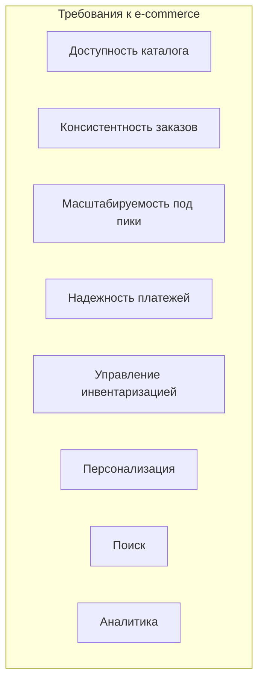
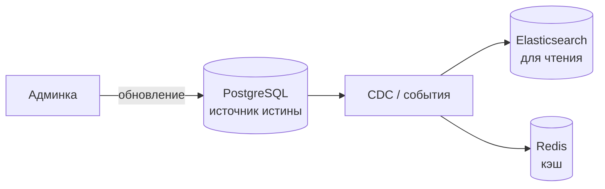
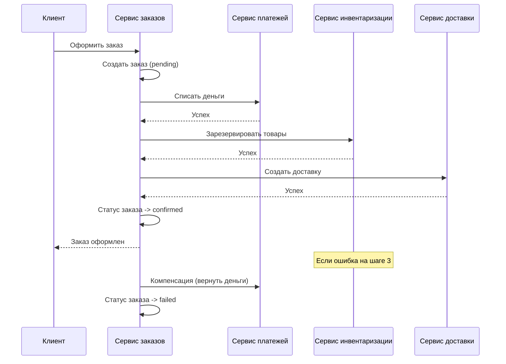
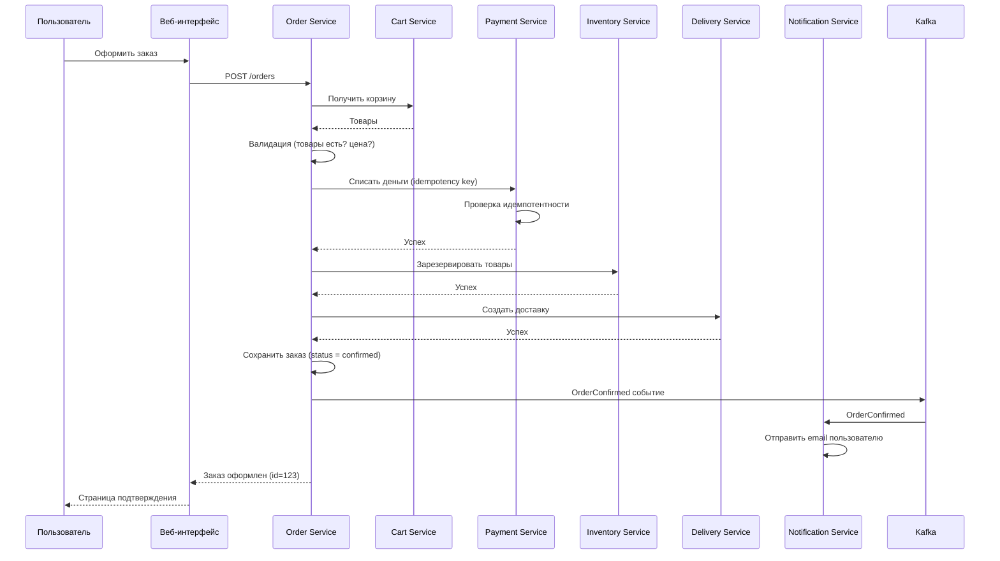
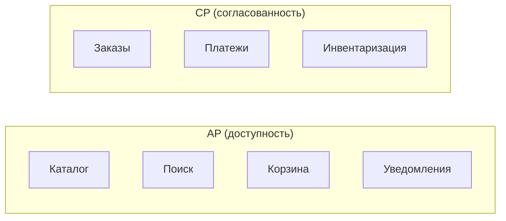
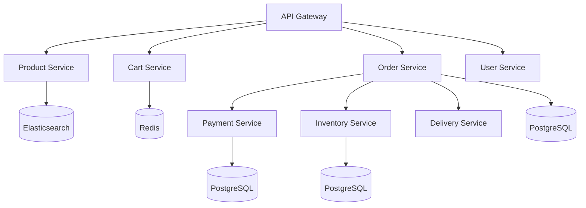

## Введение: Продажи в интернете

Интернет-магазин — это сложная система, которая объединяет в себе каталог товаров, корзину, оформление заказов, платежи, инвентаризацию, доставку и уведомления. В отличие от чата, где главное — скорость доставки сообщений, в e-commerce на первый план выходят консистентность данных (нельзя продать один товар дважды), надежность (платежи не должны теряться) и масштабируемость (пиковые нагрузки в "черную пятницу" могут быть в 10-100 раз выше обычных).

E-commerce архитектура должна балансировать между строгой согласованностью (для заказов, платежей, инвентаризации) и высокой доступностью (каталог должен быть доступен всегда, даже если база данных заказов упала). Это классический пример гибридной архитектуры, где разные части системы имеют разные требования.

## Ключевые требования к e-commerce архитектуре

**Высокая доступность каталога.** Пользователи должны видеть товары даже в часы пик. Каталог может быть немного устаревшим (eventual consistency), но он должен быть доступен.

**Строгая консистентность заказов и платежей.** Нельзя допустить, чтобы один товар был продан дважды. Нельзя списать деньги и не создать заказ. ACID-транзакции или их заменители (Saga) критичны.

**Масштабируемость под пиковые нагрузки.** "Черная пятница", распродажи, праздники. Система должна масштабироваться горизонтально (автоматически) и не падать.

**Надежность платежей.** Платежи не должны теряться. Повторы (retries) с идемпотентностью. Интеграция с внешними платежными шлюзами.

**Управление инвентаризацией.** Товары заканчиваются. Резервирование на время оформления заказа. Синхронизация со складом.

**Персонализация и рекомендации.** Рекомендации "похожие товары", "пользователи также купили". Требуют аналитики и ML.

**Поиск и фильтрация.** Полнотекстовый поиск по каталогу, фильтры по цене, брендам, характеристикам. Нужен Elasticsearch или аналоги.

**Аналитика и отчеты.** Продажи, конверсии, популярные товары. Data Warehouse + BI.



## Типовая архитектура e-commerce

```mermaid
graph TD
    Client[Клиент: браузер / приложение] --> CDN[CDN / Edge]
    CDN --> LB[Балансировщик]
    LB --> Web[Web сервер (nginx)]
    
    Web --> Catalog[Сервис каталога<br/>AP, Elasticsearch]
    Web --> Cart[Сервис корзины<br/>Redis]
    Web --> Order[Сервис заказов<br/>CP, PostgreSQL]
    Web --> Payment[Сервис платежей<br/>CP, PostgreSQL]
    Web --> Inventory[Сервис инвентаризации<br/>CP, PostgreSQL]
    Web --> User[Сервис пользователей<br/>CP, PostgreSQL]
    Web --> Search[Сервис поиска<br/>Elasticsearch]
    Web --> Recs[Сервис рекомендаций<br/>ML / Redis]
    
    Order --> Kafka[Kafka / очередь]
    Kafka --> Notification[Сервис уведомлений]
    Kafka --> Analytics[Сервис аналитики]
    
    Payment --> PSP[Внешний платежный шлюз]
    Inventory --> Warehouse[Внешний складской API]
```

## Компоненты e-commerce архитектуры

### Каталог товаров (Product Catalog)

Самый посещаемый компонент. Должен быть всегда доступен, даже если остальные сервисы упали. Данные каталога меняются нечасто (цены, описание, наличие — но наличие может часто меняться).

**Требования:** Высокая доступность (AP), низкая задержка, масштабируемость чтения.

**Технологии:** Денормализованная база данных (MongoDB, Elasticsearch) или кэш (Redis) перед основной БД. CDN для изображений.

**Варианты хранения:**

- **Elasticsearch (первичное хранилище).** Отличный поиск, масштабируется, eventual consistency. Но не ACID.
- **PostgreSQL + кэш (Redis).** Более строгая консистентность, но сложнее масштабировать.



### Корзина (Cart)

Хранит товары, которые пользователь добавил, но еще не оформил заказ. Корзина не требует строгой консистентности (если товар исчез из корзины, пользователь добавит его снова). Должна быть очень быстрой.

**Требования:** Низкая задержка, высокая доступность, eventual consistency.

**Технологии:** Redis (in-memory), сериализация корзины в JSON. Для неавторизованных пользователей — корзина в localStorage браузера + синхронизация с Redis при входе.

**Проблема:** Redis не хранит данные постоянно (при падении данные теряются). Для восстановления можно периодически сохранять корзины в PostgreSQL.

### Сервис заказов (Order Service)

Ядро e-commerce. Оформление заказа — сложная транзакция, затрагивающая несколько сервисов.

**Требования:** Строгая консистентность (CP), ACID-транзакции в пределах сервиса, распределенные транзакции (Saga) между сервисами.

**Технологии:** PostgreSQL (ACID), Saga паттерн (оркестрация или хореография).

**Поток оформления заказа (Saga):**



### Сервис платежей (Payment Service)

Обрабатывает платежи через внешние шлюзы (Stripe, PayPal, банки).

**Требования:** Строгая консистенция, идемпотентность (один и тот же платеж не должен списываться дважды), надежность.

**Технологии:** PostgreSQL, идемпотентность через idempotency key (уникальный ключ запроса). Saga для отката (возврат денег).

**Idempotency key:**

```http
POST /v1/payments
Idempotency-Key: order-123-2024-01-15
Content-Type: application/json

{ "amount": 100, "currency": "USD", "source": "tok_visa" }
```

Сервер запоминает `Idempotency-Key` и при повторном запросе возвращает тот же результат (не списывает повторно).

### Сервис инвентаризации (Inventory Service)

Управляет остатками товаров на складе. Критичен для консистентности (нельзя продать товар, которого нет).

**Требования:** Строгая консистенция, резервирование товаров на время оформления заказа (timeout резерва), интеграция с внешними складскими системами.

**Технологии:** PostgreSQL (ACID), резервирование через отдельную таблицу или поле `reserved`. Таймаут резерва — если заказ не оформлен, резерв снимается автоматически.

```sql
-- Резервирование товара (в транзакции)
UPDATE inventory 
SET reserved = reserved + @quantity, available = available - @quantity
WHERE product_id = @product_id AND available >= @quantity;
```

### Сервис поиска (Search Service)

Полнотекстовый поиск по каталогу с фильтрами, сортировкой, релевантностью.

**Требования:** Низкая задержка, eventual consistency (данные могут быть не мгновенно свежими), масштабируемость.

**Технологии:** Elasticsearch, Meilisearch, Typesense. Синхронизация с каталогом через CDC (Debezium) или события.

### Сервис рекомендаций (Recommendation Service)

"Пользователи также купили", "С этим товаром покупают". Требует аналитики и машинного обучения.

**Требования:** Низкая задержка (до 50-100 мс), eventual consistency, может быть неточным.

**Технологии:** Precomputed рекомендации в Redis, или онлайн-модель на основе данных из Kafka.

### Сервис уведомлений (Notification Service)

Отправляет email, SMS, push-уведомления о статусе заказа.

**Требования:** Асинхронность (не блокирует оформление заказа), надежность (сообщение не должно потеряться).

**Технологии:** Kafka или очередь, обработчик, интеграция с внешними сервисами (SendGrid, Twilio, Firebase).

## Поток оформления заказа (детально)



## CAP выбор в e-commerce

Разные компоненты имеют разный CAP выбор:

| Компонент | CAP выбор | Почему |
| :--- | :--- | :--- |
| **Каталог** | AP | Доступность важнее. Устаревшая цена на 5 секунд не страшна. |
| **Поиск** | AP | Аналогично. |
| **Корзина** | AP | Потеря корзины неприятна, но не фатальна. |
| **Заказы** | CP | Строгая консистенция критична. Нельзя создать два заказа на один товар. |
| **Платежи** | CP | Строгая консистенция критична. Нельзя дважды списать деньги. |
| **Инвентаризация** | CP | Нельзя продать больше, чем есть. |
| **Уведомления** | AP | Письмо может прийти с задержкой. |



## Масштабирование e-commerce

### Каталог и поиск

- **Горизонтальное масштабирование.** Elasticsearch и Cassandra масштабируются добавлением узлов.
- **Кэширование (CDN).** Изображения товаров на CDN. Статические страницы категорий — в кэше.

### Заказы и платежи

- **Вертикальное масштабирование (CP системы).** PostgreSQL сложно масштабировать горизонтально. Используют мощные серверы, репликацию (для чтения), шардирование (Citus) при большом объеме.
- **Шардирование по `customer_id`.** Заказы пользователя попадают в один шард, что упрощает запросы.

### События (Kafka)

- **Горизонтальное масштабирование.** Kafka масштабируется добавлением брокеров и партиций. События заказов идут в отдельные партиции по `order_id`.

## Пример: E-commerce на микросервисах



## Распространенные ошибки

**Ошибка 1: Ожидание строгой консистентности от каталога.** Каталог не должен быть CP. Используйте eventual consistency и кэширование.

**Ошибка 2: Использование реляционной БД для корзины.** Корзина не требует ACID. Redis намного быстрее и дешевле.

**Ошибка 3: Отсутствие идемпотентности в платежах.** При повторе запроса (из-за сетевого сбоя) пользователь может быть списан дважды. Всегда используйте idempotency key.

**Ошибка 4: Хранение изображений в базе данных.** Это убивает производительность. Храните в S3 или CDN.

**Ошибка 5: Отсутствие мониторинга инвентаризации.** Товары могут закончиться. Нужны алерты.

**Ошибка 6: Отсутствие fallback для внешних сервисов.** Если платежный шлюз недоступен, пользователь должен получить понятную ошибку, а не "500 Internal Server Error". Circuit breaker и fallback.

**Ошибка 7: Монолитная архитектура для всего.** E-commerce — идеальный кандидат на микросервисы. Но начинать лучше с модульного монолита.

## Резюме

E-commerce архитектура — это гетерогенная распределенная система, где разные компоненты имеют разные требования к консистенции, доступности и производительности.

**Ключевые компоненты:**

- **Каталог (AP, Elasticsearch + CDN)** — высокая доступность, eventual consistency.
- **Поиск (AP, Elasticsearch)** — быстрый, eventual consistency.
- **Корзина (AP, Redis)** — очень быстрая, не критична.
- **Заказы (CP, PostgreSQL + Saga)** — строгая консистенция, распределенные транзакции.
- **Платежи (CP, PostgreSQL + idempotency key)** — строгая консистенция, интеграция с внешними шлюзами.
- **Инвентаризация (CP, PostgreSQL)** — резервирование, строгая консистенция.
- **Уведомления (AP, Kafka + обработчик)** — асинхронные, надежные.
- **Аналитика (Data Warehouse, Kafka)** — для отчетов и ML.

**CAP выбор:** AP для каталога, поиска, корзины, уведомлений. CP для заказов, платежей, инвентаризации.

**Ключевые паттерны:**

- **Saga** для оформления заказа (распределенная транзакция).
- **CQRS** для каталога (запись в PostgreSQL, чтение из Elasticsearch).
- **Idempotency key** для платежей.
- **Circuit breaker** для внешних платежных шлюзов.
- **CDC (Debezium)** для синхронизации каталога с поиском.

**Масштабирование:**

- Каталог и поиск — горизонтальное (Elasticsearch, Cassandra).
- Заказы и платежи — вертикальное + шардирование (Citus).
- Очереди (Kafka) — горизонтальное.

E-commerce — это сложная, но хорошо изученная предметная область. Существуют готовые решения (Shopify, Magento, Saleor) для небольших проектов. Для крупных проектов (Amazon, Alibaba) строят кастомные архитектуры, сочетая микросервисы, event sourcing, CQRS и распределенные транзакции. Главное — правильно разделить ответственность и выбрать правильный CAP компромисс для каждого компонента.