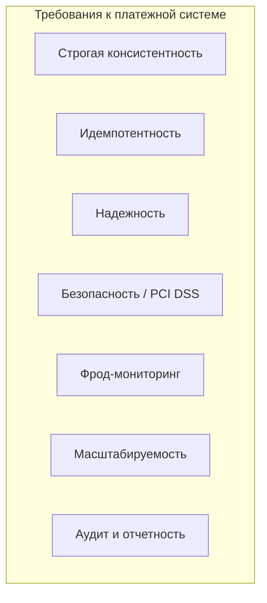
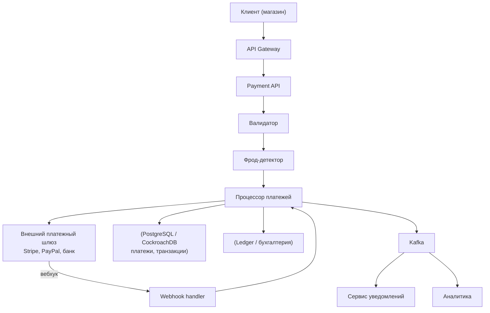
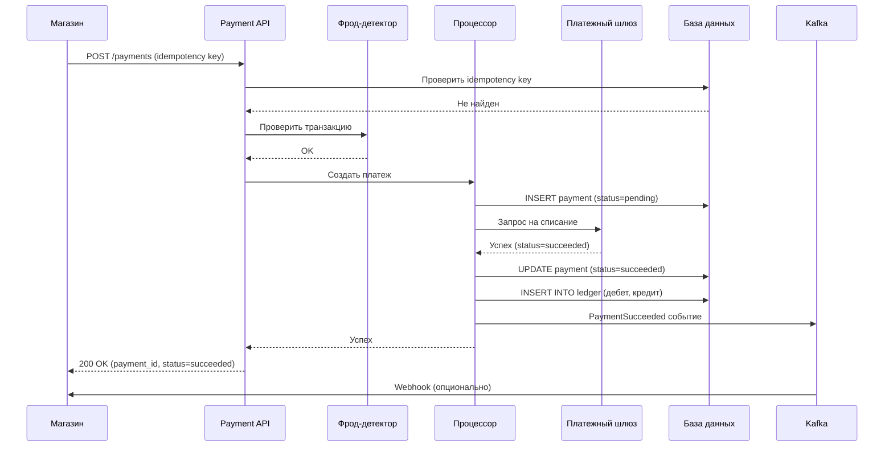
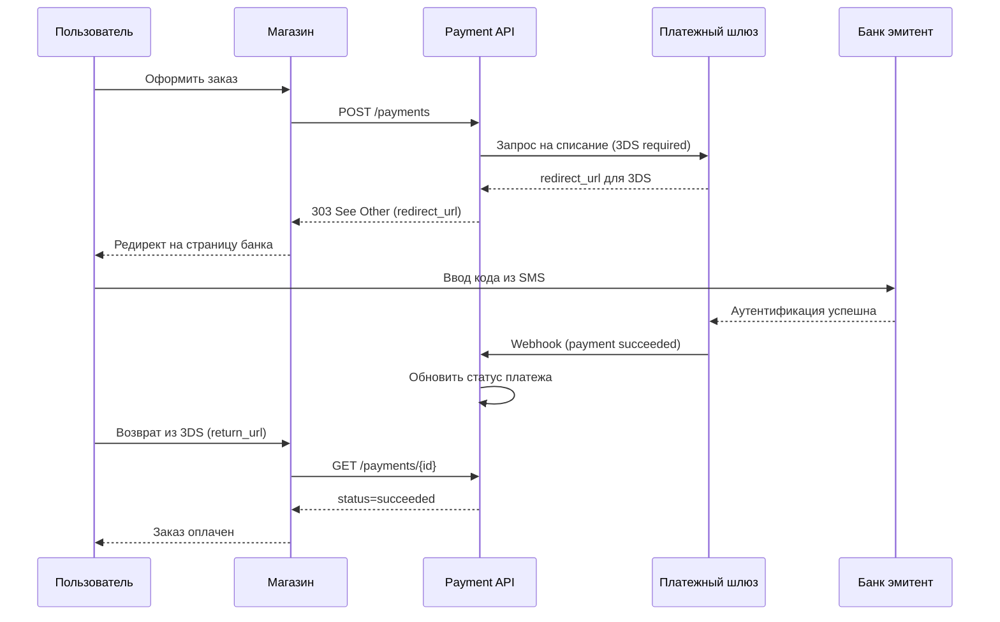
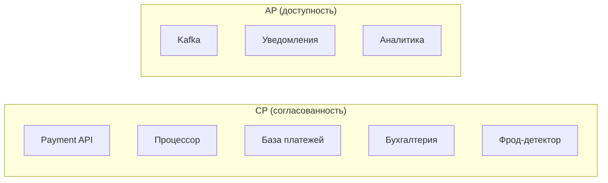

## Введение: Деньги под контролем

Платежная система — это, пожалуй, самая требовательная к надежности и безопасности часть любой коммерческой архитектуры. Ошибка здесь может привести к прямому ущербу: списание денег не за тот заказ, двойное списание, потеря транзакций. Регуляторы (Центробанки, финансовые органы) предъявляют жесткие требования к таким системам.

В отличие от чата (где eventual consistency приемлема) или e-commerce (где каталог может быть AP), платежная система обязана быть CP (Consistency + Partition tolerance). Согласованность данных важнее доступности. Лучше временно не принимать платежи, чем обработать их неправильно.

Платежная система обычно включает в себя: прием платежей (через внешние шлюзы), обработку платежей, фрод-мониторинг (обнаружение мошенничества), расчеты с продавцами, возвраты, отчетность для бухгалтерии.

## Ключевые требования к платежной системе

**Строгая консистентность (ACID).** Каждая транзакция должна быть атомарной. Нельзя списать деньги и не создать платеж. Нельзя создать платеж и не обновить баланс. ACID-транзакции или их заменители (Saga) обязательны.

**Идемпотентность.** Повторный запрос (из-за сетевого сбоя, ретрая) не должен приводить к двойному списанию. Idempotency key — обязательный паттерн.

**Надежность.** Платежи не должны теряться. Если система упала, после восстановления платеж должен быть обработан. Журнал транзакций (WAL) и очереди с гарантией доставки.

**Безопасность.** PCI DSS (Payment Card Industry Data Security Standard) — обязательный стандарт для систем, работающих с картами. Шифрование данных карты, токенизация, защита от атак.

**Фрод-мониторинг.** Обнаружение подозрительных транзакций в реальном времени или близком к реальному. Блокировка мошеннических платежей.

**Масштабируемость под пики.** Платежные системы должны выдерживать пики (пятница вечером, распродажи) без потери производительности.

**Аудит и отчетность.** Каждая транзакция должна быть залогирована и доступна для аудита. Бухгалтерские отчеты, выверка с банками.



## Типовая архитектура платежной системы



## Компоненты платежной системы

### Payment API

Внешний API для магазинов (клиентов). Принимает запросы на создание платежа, проверку статуса, возврат.

**Требования:** Идемпотентность (idempotency key), аутентификация магазина (API ключ), rate limiting.

**Пример запроса:**

```http
POST /v1/payments
Idempotency-Key: order-123-2024-01-15
Authorization: Bearer sk_live_xxx
Content-Type: application/json

{
  "amount": 10000,
  "currency": "RUB",
  "payment_method": {
    "type": "card",
    "card_number": "4111111111111111",
    "exp_month": 12,
    "exp_year": 2025,
    "cvv": "123"
  },
  "description": "Заказ №123",
  "return_url": "https://shop.example.com/success"
}
```

**Ответ:**

```json
{
  "id": "pay_123456",
  "status": "processing",
  "amount": 10000,
  "currency": "RUB",
  "created_at": "2024-01-15T10:00:00Z"
}
```

### Валидатор

Проверяет корректность запроса: сумма не отрицательная, валюта поддерживается, данные карты прошли базовую проверку (Luhn алгоритм для номера карты), нет подозрительных параметров.

### Фрод-детектор (Fraud Detection)

Анализирует транзакцию на предмет мошенничества в реальном времени.

**Признаки фрода:**

- Слишком большая сумма (выше обычной для этого магазина/пользователя)
- Много неудачных попыток оплаты с одной карты
- Страна карты отличается от страны IP
- Необычное время (3 часа ночи)
- Карта из черного списка

**Решения:** Правила (rule-based) или ML модель. При подозрении — блокировка или отправка на ручную проверку.

### Процессор платежей (Payment Processor)

Ядро системы. Отвечает за взаимодействие с внешними платежными шлюзами, обновление статусов, идемпотентность.

**Схема работы:**

1. Проверить, нет ли уже платежа с таким idempotency key (в базе).
2. Если есть — вернуть существующий платеж (идемпотентность).
3. Если нет — создать запись о платеже со статусом `pending`.
4. Вызвать внешний платежный шлюз (через API).
5. Обновить статус платежа (`succeeded`, `failed`).
6. Записать в бухгалтерию (ledger).
7. Отправить событие в Kafka.

**Важно:** Все операции должны быть в ACID-транзакции (в рамках одного сервиса). Для вызова внешнего шлюза — паттерн Transactional Outbox: сначала сохранить событие в базе (в той же транзакции), потом отправить в очередь.

### Внешний платежный шлюз (PSP - Payment Service Provider)

Stripe, PayPal, Adyen, банковский шлюз. Отвечает за фактическое списание денег с карты/счета пользователя.

**Типы интеграции:**

- **API (синхронный).** Магазин вызывает API шлюза, шлюз возвращает результат.
- **Webhook (асинхронный).** Шлюз вызывает ваш эндпоинт, когда статус меняется (например, оплата подтверждена через 3D Secure).
- **Редирект.** Пользователь перенаправляется на страницу шлюза (например, Sberbank), а потом возвращается в магазин.

**Webhook handler** должен быть идемпотентным (шлюз может отправить один и тот же вебхук несколько раз) и аутентифицировать запрос (подпись).

### Бухгалтерия (Ledger)

Система, которая хранит все финансовые движения: поступления, списания, комиссии, возвраты. Это не просто таблица "платежи", а полноценная бухгалтерская система с двойной записью (дебет/кредит).

**Требования:** Неизменяемость записей (append-only), аудит, возможность восстановления состояния на любой момент (event sourcing).

### Очередь (Kafka) и асинхронные обработчики

- **Сервис уведомлений.** Отправляет email/sms пользователю и магазину о статусе платежа.
- **Аналитика.** Данные о платежах в Data Warehouse для отчетов.
- **Фрод-постпроцессинг.** Анализ уже прошедших платежей для улучшения моделей.

## Поток платежа (синхронный, без 3D Secure)



## Идемпотентность: ключевой паттерн

**Проблема:** Магазин отправил запрос, но ответ не получил (сетевой сбой). Он повторяет запрос. Если система не идемпотентна, деньги спишутся дважды.

**Решение:** Idempotency key — уникальный ключ, который магазин генерирует для каждого платежа (обычно это order_id + timestamp или UUID).

```sql
CREATE TABLE payments (
    id UUID PRIMARY KEY,
    idempotency_key VARCHAR(255) UNIQUE NOT NULL,
    order_id VARCHAR(255),
    amount BIGINT,
    status VARCHAR(50),
    created_at TIMESTAMP
);

-- При создании платежа
INSERT INTO payments (idempotency_key, ...) VALUES (@key, ...);
-- Если ключ уже существует, INSERT не пройдет (UNIQUE constraint)
```

При повторном запросе с тем же idempotency key система возвращает существующий платеж.

**Важно:** Idempotency key должен храниться в базе. Даже если процессор упал после успешного списания, но перед отправкой ответа, повторный запрос вернет успех (не списав повторно).

## 3D Secure (3DS) — асинхронный поток

Для многих карт требуется дополнительная аутентификация (3D Secure). Пользователя перенаправляют на страницу банка, где он вводит код из SMS.



**Ключевые моменты:**

- Webhook от шлюза должен быть идемпотентным.
- Магазин должен уметь обрабатывать асинхронное подтверждение (через вебхук или периодический опрос API).

## Возвраты (Refunds)

Возврат денег пользователю — отдельная операция, не являющаяся обратным платежом.

**Требования:** Идемпотентность (возврат не должен выполняться дважды), валидация (сумма возврата не больше суммы платежа), аудит.

```http
POST /v1/payments/{payment_id}/refunds
Idempotency-Key: refund-456-2024-01-16

{
  "amount": 5000,
  "reason": "Товар не понравился"
}
```

## Фрод-мониторинг (Fraud Detection)

**Схема работы:**

1. Транзакция поступает в фрод-детектор.
2. Применяются правила (rule-based):
   - Сумма > 100 000 → подозрительно
   - Страна карты ≠ страна IP → подозрительно
   - Много неудачных попыток за 1 час → блокировка
3. Если подозрительно — статус `requires_manual_review` или `blocked`.
4. Ручная проверка оператором.
5. После одобрения — платеж отправляется в процессор.

**Технологии:** Drools (rules engine), ML модели (определение аномалий), Redis для подсчета неудачных попыток.

## Отчетность и выверка (Reconciliation)

Каждый день нужно сверять данные своей системы с данными банка/шлюза.

**Проблема:** Расхождения (в вашей системе платеж успешен, в банке — нет). **Причины:** Технические сбои, двойные списания, комиссии.

**Решение:** Reconciliation engine:

1. Загрузить выписку от банка (CSV, MT940).
2. Сопоставить транзакции с платежами в своей системе.
3. Найти расхождения.
4. Создать отчет для бухгалтерии.

## CAP выбор в платежной системе

В отличие от e-commerce, здесь почти везде CP (согласованность).

| Компонент | CAP выбор | Почему |
| :--- | :--- | :--- |
| **Payment API** | CP | Должен вернуть консистентный ответ. |
| **Процессор** | CP | ACID транзакции критичны. |
| **База платежей** | CP | PostgreSQL, синхронная репликация. |
| **Бухгалтерия** | CP | Двойная запись, строгая консистенция. |
| **Фрод-детектор** | AP (или CP) | Можно пропустить мошенничество ради доступности? Нет, лучше CP. |
| **Kafka** | AP | Eventual consistency приемлема для уведомлений и аналитики. |



## PCI DSS compliance

Если вы храните, обрабатываете или передаете данные карт, вы обязаны соблюдать PCI DSS.

**Уровни соответствия:**

- **Уровень 1.** Самый строгий (более 6 млн транзакций в год). Требуется внешний аудит (QSA).
- **Уровень 4.** Менее 20 000 транзакций. Самооценка (SAQ).

**Основные требования:**

- Не хранить CVV, PIN, данные трека (запрещено).
- Хранить номер карты только в зашифрованном виде (токенизация).
- Шифрование передачи данных (TLS).
- Ограничение доступа к данным карт.
- Логирование доступа.
- Регулярное тестирование безопасности.

**Токенизация:** Замена номера карты на случайный токен. Карта хранится в защищенном хранилище (vault), в базах — только токен.

```sql
-- В базе платежей
payment_id=123, card_token="tok_abc123", last4="4242", expiry="12/25"
-- Полный номер карты: только в vault, доступ по токену
```

## Пример: Архитектура платежной системы в Stripe (упрощенно)

Stripe — один из самых популярных платежных шлюзов. Их архитектура (из публичных материалов):

- **API Gateway** — маршрутизация, rate limiting.
- **Сервис платежей** — обработка платежей (на Ruby).
- **База данных** — распределенная (собственная реализация на основе PostgreSQL).
- **Бухгалтерия** — отдельный сервис (ledger), event sourcing.
- **Фрод-детектор** — ML модели (Radar).
- **Kafka** — для асинхронных задач (уведомления, отчеты).

## Распространенные ошибки

**Ошибка 1: Отсутствие идемпотентности.** Повторный запрос из-за сетевого сбоя создает двойной платеж. Всегда используйте idempotency key.

**Ошибка 2: Игнорирование вебхуков.** Полагаться только на синхронный ответ шлюза. 3D Secure требует вебхуков.

**Ошибка 3: Хранение данных карты в открытом виде.** Нарушение PCI DSS. Используйте токенизацию.

**Ошибка 4: Отсутствие выверки (reconciliation).** Вы не узнаете о расхождениях с банком. Это может привести к финансовым потерям.

**Ошибка 5: Синхронный вызов внешнего шлюза внутри большой транзакции.** Если шлюз тормозит, транзакция висит долго. Используйте transactional outbox + асинхронную обработку.

**Ошибка 6: Отсутствие мониторинга и алертов.** Падение платежного шлюза, рост числа ошибок, фрод-атаки — все должно быть под наблюдением.

## Резюме

Платежная система — это критическая финансовая система с высокими требованиями к консистенции, надежности и безопасности.

**Ключевые компоненты:**

- **Payment API** — прием запросов, идемпотентность.
- **Валидатор** — проверка входных данных.
- **Фрод-детектор** — обнаружение мошенничества (rule-based + ML).
- **Процессор платежей** — взаимодействие с внешними шлюзами, ACID-транзакции.
- **База платежей** — PostgreSQL (CP), синхронная репликация.
- **Бухгалтерия (Ledger)** — неизменяемый журнал всех финансовых движений.
- **Внешний платежный шлюз** — Stripe, PayPal, банк.
- **Очередь (Kafka)** — для асинхронных задач (уведомления, аналитика).
- **Reconciliation engine** — выверка с банком.

**Ключевые паттерны:**

- **Идемпотентность** (idempotency key) — обязательна.
- **Transactional Outbox** — сохранение события в БД в той же транзакции, что и данные.
- **Saga** — для распределенных транзакций (если платеж включает несколько систем).
- **Event Sourcing** — для бухгалтерии (неизменяемый журнал).
- **Circuit Breaker** — для внешних шлюзов (защита от недоступности).

**CAP выбор:** CP (согласованность) для критических компонентов, AP для уведомлений и аналитики.

**Безопасность:** PCI DSS compliance, токенизация карт, шифрование, аудит.

Платежная система — это не то, с чего стоит начинать стартап. Ошибки слишком дороги. Лучше использовать готовые решения (Stripe, Adyen, Braintree) для приема платежей, а свою платежную систему строить только при исключительной необходимости (специфические требования, большой объем, желание владеть критической инфраструктурой). Но если вы строите — помните об идемпотентности, консистентности и безопасности.