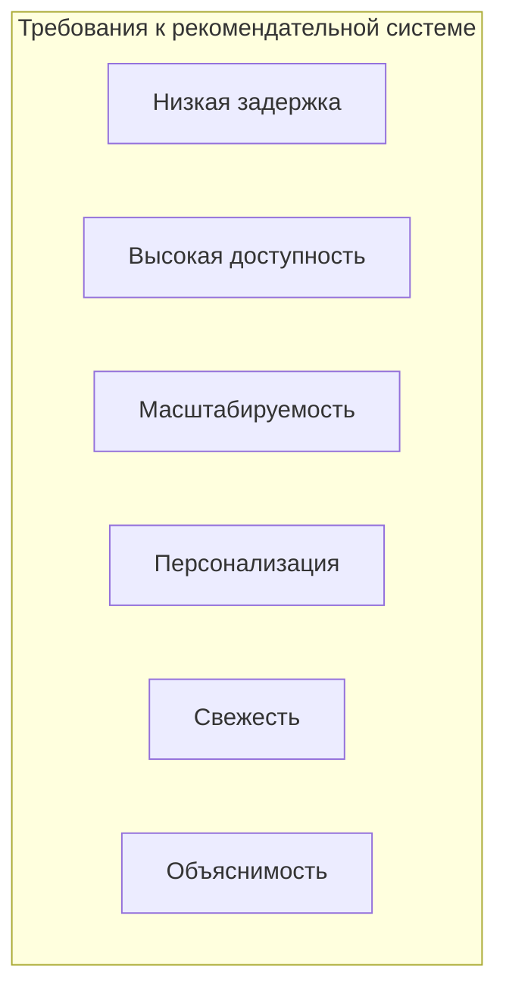
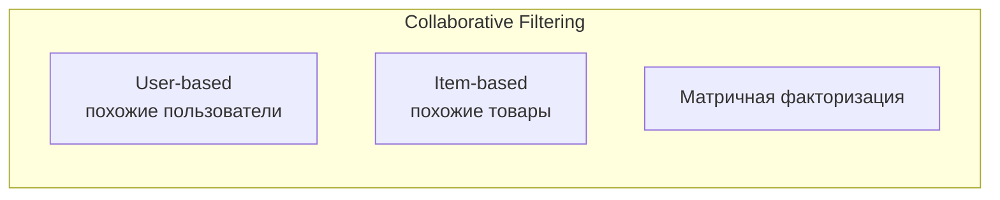
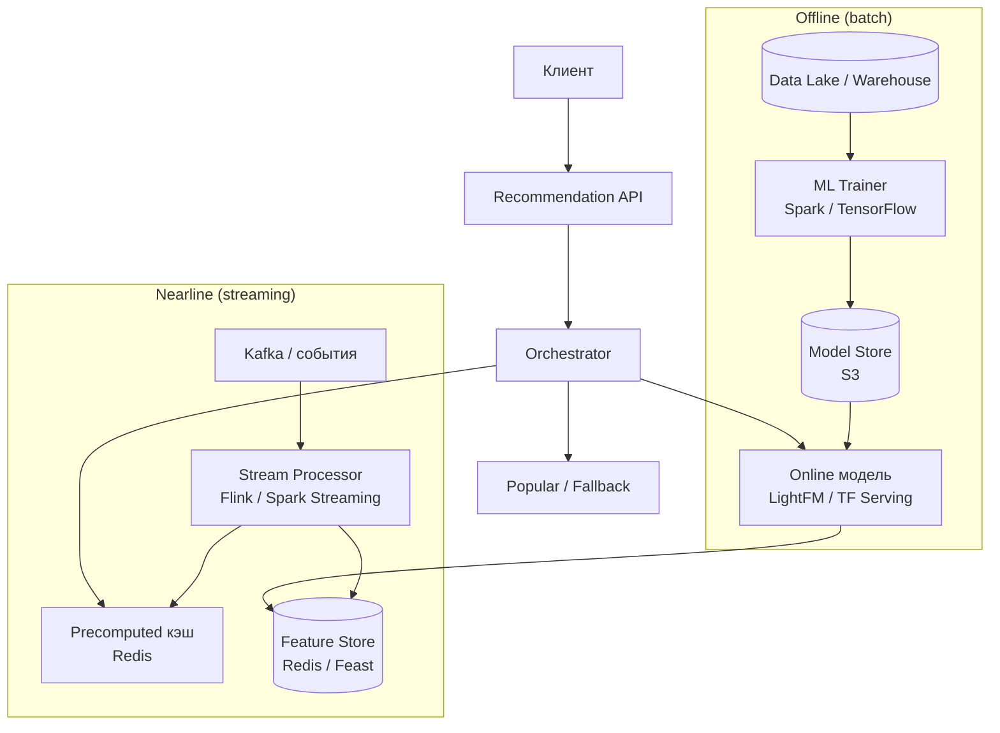
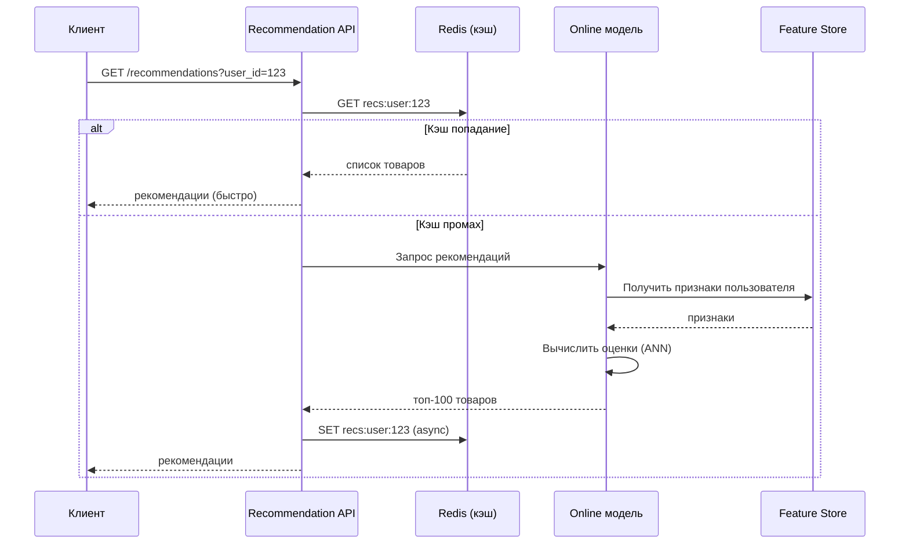

## Введение: Как система знает, что вам понравится

Когда вы заходите в Netflix, он предлагает фильмы, которые вам, скорее всего, понравятся. Amazon показывает товары "пользователи также купили". Spotify создает плейлист "на каждый день". Это работа рекомендательных систем.

Рекомендательная система — это алгоритм, который предсказывает, насколько пользователю понравится тот или иной объект (фильм, товар, музыка), и на основе этого предсказания предлагает наиболее релевантные объекты.

В отличие от платежной системы (где строгая консистенция критична), рекомендательная система может жить с eventual consistency и приблизительными вычислениями. Неточная рекомендация не приводит к финансовым потерям, только к небольшому разочарованию пользователя. Но задержка критична: рекомендации должны загружаться за десятки-сотни миллисекунд, иначе пользователь уйдет.

## Ключевые требования к рекомендательной системе

**Низкая задержка (low latency).** Рекомендации должны появляться на странице вместе с остальным контентом. Задержка более 200-300 мс заметна. Обычно целевая задержка — 50-100 мс.

**Высокая доступность (high availability).** Если рекомендации недоступны, пользователь видит пустую страницу или дефолтные товары. Лучше показать не очень релевантные, но быстрые рекомендации, чем вообще ничего.

**Масштабируемость.** Миллионы пользователей, миллионы объектов, миллиарды взаимодействий (просмотры, лайки, покупки).

**Персонализация.** Рекомендации должны учитывать историю пользователя, его предпочтения, контекст (время суток, устройство, местоположение).

**Свежесть (freshness).** Рекомендации должны учитывать новые взаимодействия. Если пользователь только что купил телефон, не надо рекомендовать ему другой телефон. Нужно рекомендовать аксессуары.

**Объяснимость (explainability).** "Почему мне рекомендуют этот товар?" — важно для доверия пользователя. "Потому что вы смотрели X".

## Типы рекомендательных систем

### Collaborative Filtering (Коллаборативная фильтрация)

Использует поведение других пользователей. "Пользователи, похожие на вас, купили эти товары".

**User-based:** Находим пользователей, похожих на текущего (по истории покупок/просмотров), и рекомендуем то, что понравилось им, но не видел текущий пользователь.

**Item-based:** Находим товары, похожие на те, которые пользователь уже купил/посмотрел. "Пользователи, купившие этот товар, также купили X". Это самый распространенный метод в e-commerce.

**Матричная факторизация (SVD, ALS).** Раскладываем матрицу "пользователь × товар" (оценки) на произведение двух матриц: пользовательские факторы и товарные факторы. Затем для пользователя вычисляем предсказанные оценки для всех товаров.

### Content-based filtering (Контентная фильтрация)

Использует характеристики объектов и профиль пользователя. "Вам понравились фильмы с этим актером → рекомендуем другие фильмы с ним".

**Как работает:** Для каждого объекта извлекаются признаки (жанр, актеры, цена, цвет). Строится профиль пользователя (например, средний вектор его любимых объектов). Рекомендуются объекты, наиболее близкие к профилю.

**Плюсы:** Не требует данных о других пользователях, хорошо для новых объектов (cold start). **Минусы:** Ограниченная серендипность (не откроет ничего нового, только похожее).

### Hybrid (Гибридные)

Комбинация collaborative и content-based. Например, взвешенная сумма или переключение между методами в зависимости от ситуации (новый пользователь — content-based, старый — collaborative).

## Архитектура рекомендательной системы

## Компоненты рекомендательной системы

### Recommendation API

Принимает запрос от клиента: `GET /recommendations?user_id=123&limit=10&context={"device":"mobile"}`.

**Задачи:**

- Аутентификация и rate limiting.
- Выбор стратегии (online модель, precomputed, popular).
- Агрегация результатов из нескольких источников.
- Объяснение рекомендаций (почему рекомендован этот товар).

**Требования:** Низкая задержка, высокая доступность.

### Online модель

ML модель, которая вычисляет рекомендации в реальном времени. Для каждого пользователя и кандидата (товара, фильма) модель вычисляет оценку (score) и возвращает топ-N.

**Технологии:**

- **Embedding-based (матричная факторизация).** Вектор пользователя и вектор товара. Score = dot(user_embedding, item_embedding). Быстро, если предварительно вычислить эмбеддинги.
- **LightFM.** Гибридная модель (CF + content-based).
- **TensorFlow Serving / PyTorch Serve.** Для сложных нейросетевых моделей (two-tower).

**Проблема:** Вычисление score для миллионов товаров для каждого пользователя — слишком медленно (O(N * M)). Решения:

- **ANN (Approximate Nearest Neighbors).** Индексы для быстрого поиска ближайших соседей в пространстве эмбеддингов (FAISS, Annoy, HNSW). O(log N).
- **Кандидат генерация (candidate generation).** Сначала отбираем несколько сотен кандидатов (по популярности, по коллаборативной фильтрации), потом ранжируем их моделью.

### Precomputed кэш (Redis)

Для большинства пользователей рекомендации можно вычислить заранее (batch, раз в час или раз в день) и сохранить в Redis.

**Ключ:** `recs:user:{user_id}` → список из 100 товаров с оценками.

**Запрос:** `LRANGE recs:user:123 0 9` (первые 10). Очень быстро (O(1)).

**Проблема:** Не учитывает свежие взаимодействия (пользователь только что купил телефон, но в precomputed кэше все еще старые рекомендации). Решение: обновлять кэш в реальном времени через stream processor.

### Feature Store (хранилище признаков)

Централизованное хранилище для признаков пользователей и объектов, используемых ML моделью.

**Признаки пользователя:** возраст, пол, geo, история покупок (агрегированная), средний чек.

**Признаки объекта:** цена, категория, бренд, популярность (за последний час, день, неделю).

**Технологии:** Redis (для низкой задержки), Feast (open source feature store), или собственная реализация на RocksDB.

### Offline trainer (batch)

Периодически (раз в час, раз в день) переобучает ML модель на всех накопленных данных.

**Данные:** Взаимодействия пользователей с объектами (просмотры, лайки, покупки, пропуски). Хранятся в Data Lake / Warehouse.

**Выход:** Модель (файл весов) сохраняется в Model Store (S3).

### Nearline stream processor (Flink, Spark Streaming)

Обрабатывает события в реальном времени (просмотр товара, добавление в корзину, покупка) и обновляет:

- **Feature Store** (например, счетчик просмотров товара за последний час).
- **Precomputed кэш** (обновить рекомендации для пользователя, у которого было событие).

**Пример:** Пользователь купил телефон. Stream processor обновляет кэш рекомендаций для этого пользователя, убирая телефоны и добавляя аксессуары.

## Поток рекомендации (синхронный запрос)

## Офлайн-оценка качества рекомендаций

**Метрики:**

- **Precision@k, Recall@k.** Доля релевантных объектов среди рекомендованных.
- **MAP (Mean Average Precision).** Учитывает порядок.
- **NDCG (Normalized Discounted Cumulative Gain).** Учитывает релевантность и позицию.
- **Hit Rate (HR).** Был ли рекомендован объект, который пользователь в итоге выбрал.

**Hold-out validation:** Разделяем данные по времени (train: старые, test: новые). Оцениваем, насколько хорошо модель предсказывает будущие взаимодействия.

## Онлайн-оценка (A/B тестирование)

Лучший способ оценить рекомендательную систему — A/B тест:

- **Группа A (контроль).** Старая модель / популярные товары.
- **Группа B (эксперимент).** Новая модель.

**Метрики:**

- CTR (Click-Through Rate) — кликают ли по рекомендациям.
- CR (Conversion Rate) — покупают ли рекомендованные товары.
- Revenue per user.
- Время на сайте.

## Проблема холодного старта (Cold Start)

**Новый пользователь (нет истории).** Не можем использовать collaborative filtering. Решения:

- Показать популярные товары.
- Попросить пользователя выбрать интересы при регистрации (content-based).
- Использовать контекст (geo, устройство, время суток).

**Новый товар (нет взаимодействий).** Решения:

- Использовать content-based (признаки товара).
- Показывать новый товар случайным пользователям для сбора данных (exploration).

## Пример: Рекомендательная система в Amazon (упрощенно)

Amazon использует гибридную систему:

- **Item-based collaborative filtering.** "Пользователи, купившие этот товар, также купили". Вычисляется офлайн (раз в день).
- **Content-based.** Для новых товаров.
- **Popular.** Для холодного старта.
- **Персонализация через историю покупок и просмотров.**

**Инфраструктура:**

- **DynamoDB** для хранения предвычисленных рекомендаций.
- **Redis** для кэша.
- **SageMaker** для обучения моделей.
- **Kinesis** для потоковой обработки событий.

## CAP выбор в рекомендательной системе

| Компонент | CAP выбор | Почему |
| :--- | :--- | :--- |
| **Recommendation API** | AP | Доступность важнее. Лучше вернуть популярные товары, чем ошибку. |
| **Precomputed кэш (Redis)** | AP | Eventual consistency. |
| **Online модель** | AP | Можно вернуть приблизительный результат. |
| **Feature Store** | CP (или AP) | Потеря признака может ухудшить рекомендацию, но не критично. |
| **Offline trainer** | CP | Консистентность данных важна для обучения. |

## Масштабирование рекомендательной системы

- **Precomputed кэш (Redis)** — горизонтальное масштабирование (Redis Cluster).
- **Online модель** — горизонтальное масштабирование (много инстансов, балансировка).
- **Feature Store** — шардирование по ключу (user_id или item_id).
- **Stream processor (Flink)** — горизонтальное масштабирование (партиции по ключу).

## Распространенные ошибки

**Ошибка 1: Слишком сложная модель онлайн.** Нейросеть с 10 миллионами параметров не уложится в 50 мс. Используйте легковесные модели онлайн, сложные — офлайн.

**Ошибка 2: Игнорирование свежести.** Рекомендации не обновляются после действия пользователя. Пользователь видит уже купленный товар. Используйте nearline stream processor.

**Ошибка 3: Только collaborative filtering.** Новые пользователи и товары остаются без рекомендаций. Добавьте content-based и popular.

**Ошибка 4: Оценка только офлайн.** Офлайн-метрики (precision@k) не всегда коррелируют с бизнес-метриками (CTR). Проводите A/B тесты.

**Ошибка 5: Однородные рекомендации (нет diversity).** Все рекомендации похожи друг на друга. Пользователю скучно. Добавьте механизм разнообразия (MMR — Maximal Marginal Relevance).

**Ошибка 6: Отсутствие explainability.** Пользователь не доверяет рекомендациям. Добавьте строку "Потому что вы купили X".

## Резюме

Рекомендательная система — это сложный комплекс из офлайн-обучения (batch), nearline-обновлений (streaming) и онлайн-инференса (real-time).

**Типы методов:**

- **Collaborative filtering** (item-based, user-based, матричная факторизация) — использует поведение других пользователей.
- **Content-based** — использует признаки объектов.
- **Hybrid** — комбинация.

**Архитектура (online + nearline + offline):**

- **Online:** Recommendation API, online модель (ANN), feature store (Redis), precomputed кэш (Redis).
- **Nearline:** Stream processor (Flink) для обновления feature store и кэша в реальном времени.
- **Offline:** Trainer (Spark/TensorFlow) для обучения модели на Data Lake.

**Ключевые требования:** Низкая задержка (50-100 мс), высокая доступность, масштабируемость, персонализация, свежесть.

**CAP выбор:** AP (доступность) для рекомендательного API, кэша, online модели. Eventual consistency приемлема.

**Проблемы:** Холодный старт (новые пользователи/товары), оценка качества (offline + A/B), explainability.

**Масштабирование:** Redis Cluster (precomputed кэш), горизонтальное масштабирование online моделей, партиционирование feature store.

Рекомендательная система — это не только ML, но и инженерная задача: как доставить предсказания за 50 мс при миллионах пользователей. Часто самый простой и эффективный подход — precomputed кэш (Redis) с обновлением раз в час, а online модель использовать только для персонализации топ-кандидатов. Начинайте с item-based collaborative filtering (легко интерпретировать, просто реализовать), затем добавляйте персонализацию и nearline обновления.