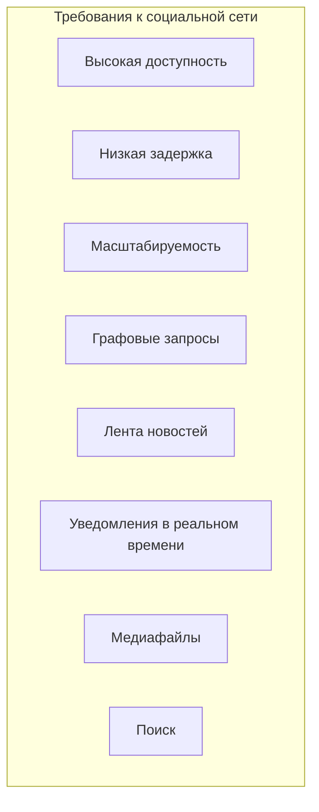
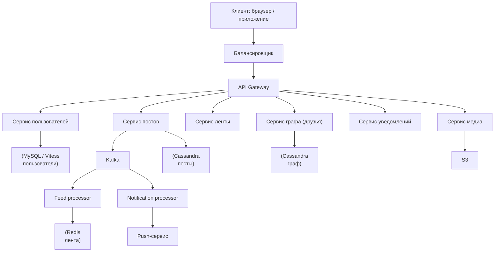
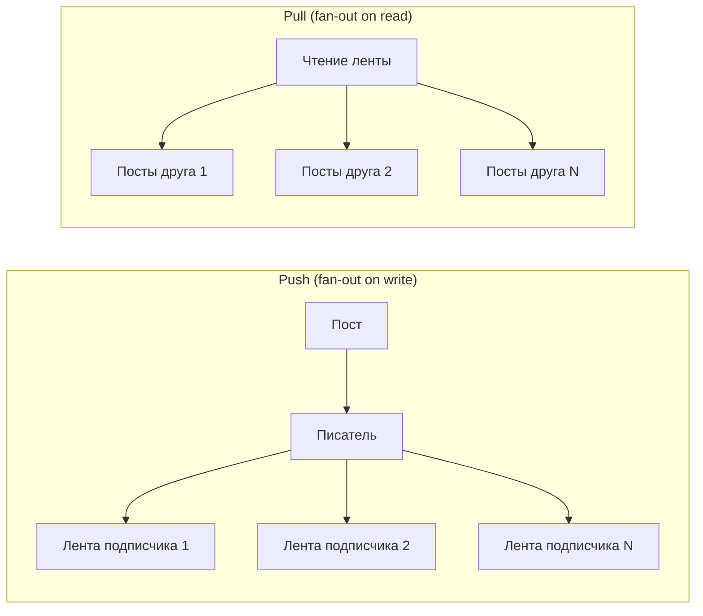
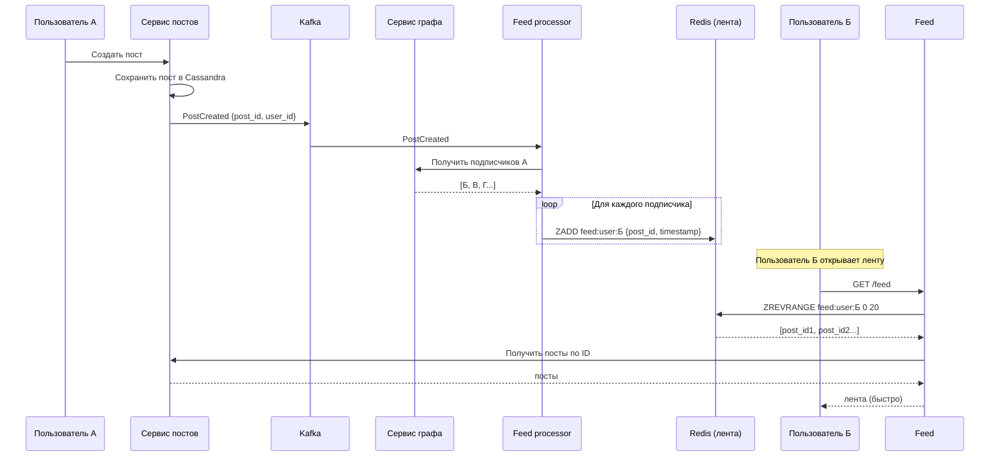

## Введение: Граф связей и лента новостей

Социальная сеть — это, пожалуй, самая сложная из всех архитектур с точки зрения масштаба и требований к реальному времени. Миллиарды пользователей, миллиарды связей ("друзья", "подписчики"), миллиарды постов, лайков, комментариев. Лента новостей должна обновляться мгновенно, уведомления приходить без задержки, а система должна быть доступна 24/7.

В отличие от платежной системы (где строгая консистенция критична), социальная сеть может жить с eventual consistency. Если вы поставили лайк, и он появился через 2 секунды — никто не заметит. Если лента новостей показывает не самые свежие посты — пользователь может расстроиться, но не уйдет навсегда. Но доступность критична: если Facebook недоступен 5 минут, это мировая новость.

Социальная сеть — это классический пример системы, где архитектура должна масштабироваться горизонтально, использовать асинхронность и кэширование на всех уровнях, а также эффективно работать с графовыми данными (связи между пользователями).

## Ключевые требования к социальной сети

**Высокая доступность (high availability).** Социальные сети должны работать 24/7. Даже минутный простой вызывает волну жалоб.

**Низкая задержка (low latency).** Лента новостей должна загружаться за сотни миллисекунд. Посты должны появляться мгновенно.

**Масштабируемость.** Миллиарды пользователей, миллиарды постов, миллиарды лайков. Система должна горизонтально масштабироваться.

**Графовые запросы.** "Друзья друзей", "рекомендации друзей", "кто лайкнул пост". Эффективная обработка графовых данных — ключевая задача.

**Лента новостей (news feed).** Агрегация постов от друзей и подписок в хронологическом или релевантном порядке. Одна из самых сложных задач.

**Уведомления в реальном времени.** Push-уведомления о лайках, комментариях, новых подписчиках.

**Медиафайлы.** Фото, видео требуют отдельной инфраструктуры (CDN, S3, обработка).

**Поиск.** Поиск по пользователям, постам, комментариям.



## Типовая архитектура социальной сети



## Компоненты социальной сети

### Сервис пользователей (User Service)

Управляет профилями пользователей: регистрация, аутентификация, профиль (имя, аватар, биография).

**Требования:** Высокая доступность, масштабируемость чтения (профили читают часто, пишут редко).

**Технологии:** MySQL (Vitess для шардирования), кэш (Redis) для профилей.

### Сервис графа (Graph Service)

Управляет связями между пользователями: друзья, подписчики, подписки, блокировки. Это граф с миллиардами ребер.

**Запросы:**

- "Показать всех друзей пользователя"
- "Пользователь А подписан на Б?"
- "Рекомендации друзей (friends of friends)"
- "Кто лайкнул этот пост" (тоже граф: пост → пользователи)

**Технологии:** Специализированные графовые базы данных (Neo4j, Amazon Neptune) или распределенные key-value (Cassandra) с денормализацией. Facebook использует TAO (собственная графовая БД на основе MySQL).

**Схема в Cassandra (пример):**

```sql
-- Ребро: пользователь А дружит с Б
CREATE TABLE friendships (
    user_id uuid,
    friend_id uuid,
    created_at timestamp,
    PRIMARY KEY (user_id, friend_id)
);

-- Запрос: все друзья пользователя
SELECT * FROM friendships WHERE user_id = @user_id;
```

### Сервис постов (Post Service)

Создание, чтение, удаление постов. Пост содержит текст, медиа-вложения, автора, время создания.

**Требования:** Очень высокая нагрузка на запись (миллионы постов в секунду в час пик). Хранение миллиардов постов.

**Технологии:** Cassandra (распределенная, AP, хороша для записи). Или S3 для старых постов + БД для метаданных.

**Схема в Cassandra:**

```sql
CREATE TABLE posts_by_user (
    user_id uuid,
    post_id timeuuid,  -- включает timestamp
    text text,
    media_urls list<text>,
    created_at timestamp,
    PRIMARY KEY (user_id, post_id)
) WITH CLUSTERING ORDER BY (post_id DESC);

-- Запрос: последние 10 постов пользователя (для профиля)
SELECT * FROM posts_by_user WHERE user_id = @user_id LIMIT 10;
```

### Сервис ленты (Feed Service)

Самая сложная часть. Лента новостей — это агрегация постов от друзей и подписок.

**Два подхода:**

**Push (fan-out on write).** При создании поста система доставляет его в ленты всех подписчиков (пишет в список). Лента читается очень быстро (O(1)), но на запись тратится много ресурсов (один пост → миллионы записей для популярных пользователей).

**Pull (fan-out on read).** При чтении ленты система собирает посты от друзей (запросы к их последним постам) и сортирует. Лента читается медленно (запросы к N друзьям), но запись дешевая.

**Гибрид:** Для обычных пользователей — push (лента заранее вычисляется). Для супер-популярных (миллионы подписчиков) — pull (иначе один пост создаст миллионы записей).



**Хранение ленты (push-подход):** Redis sorted set или Cassandra. Ключ: `feed:user:{user_id}`, значение: список `post_id` с score = timestamp.

**Обновление ленты (через Kafka):**

1. Пользователь создает пост.
2. Сервис постов отправляет событие `PostCreated` в Kafka.
3. Feed processor читает событие, определяет всех подписчиков (через Graph Service).
4. Feed processor добавляет `post_id` в ленту каждого подписчика (Redis или Cassandra).

### Сервис уведомлений (Notification Service)

Отправляет push-уведомления (iOS, Android), email, in-app уведомления.

**Требования:** Асинхронность (не блокировать основной поток), надежность (уведомление должно быть доставлено хотя бы один раз).

**Технологии:** Kafka + обработчик, интеграция с FCM (Firebase Cloud Messaging) и APNs (Apple Push Notification service).

### Сервис медиа (Media Service)

Загрузка и хранение изображений, видео.

**Требования:** Масштабируемое хранилище (S3), CDN для быстрой доставки, обработка (генерация thumbnails, конвертация видео).

**Поток загрузки фото:**

1. Клиент запрашивает presigned URL для загрузки в S3.
2. Клиент загружает фото в S3.
3. Клиент отправляет сообщение с URL фото в сервис постов.
4. Media service (по событию) генерирует thumbnail (разные размеры) и сохраняет в S3.

## Лента новостей: детальный поток (push-подход)



## Проблема популярных пользователей (celebrity problem)

Если у пользователя 100 миллионов подписчиков, push-подход не работает: один пост создаст 100 миллионов записей в Redis (запись займет часы, Redis может не выдержать).

**Решение:** Гибридный подход.

- Для обычных пользователей (до 5000 подписчиков) — push.
- Для популярных (больше 5000) — pull.

При чтении ленты:

1. Получить посты от друзей (обычных) из Redis (push-часть).
2. Получить посты от популярных пользователей, на которых подписан пользователь, через отдельный запрос (pull-часть).
3. Смержить и отсортировать.

```python
def get_feed(user_id):
    # Push: посты от обычных друзей (из Redis)
    feed_posts = redis.zrevrange(f"feed:{user_id}", 0, 50)
    
    # Pull: посты от популярных, на которых подписан
    popular_following = graph.get_popular_following(user_id)
    for popular_user in popular_following:
        posts = post_service.get_recent_posts(popular_user, limit=5)
        feed_posts.extend(posts)
    
    # Сортировка по времени
    feed_posts.sort(key=lambda x: x.created_at, reverse=True)
    return feed_posts[:20]
```

## CAP выбор в социальной сети

| Компонент | CAP выбор | Почему |
| :--- | :--- | :--- |
| **Сервис пользователей** | CP (или AP) | Профиль должен быть консистентным. Но можно AP с eventual. |
| **Сервис графа** | AP | Eventual consistency приемлема. Дружба может появиться с задержкой. |
| **Сервис постов** | AP | Высокая доступность важнее. Пост может появиться через пару секунд. |
| **Сервис ленты** | AP | Пользователь не заметит задержку в пару секунд. |
| **Лайки** | AP | Счетчик лайков может быть eventual. |
| **Уведомления** | AP | Уведомление может прийти с задержкой. |

## Масштабирование социальной сети

- **Шардирование по user_id.** Пользователи, посты, граф — шардируются по user_id.
- **Кэширование (Redis).** Лента, профили, счетчики лайков.
- **CDN.** Фото, видео, статика.
- **Асинхронность (Kafka).** Обновление ленты, уведомления — через очереди.
- **Чтение из реплик.** Для постов, профилей.

## Пример: Архитектура Twitter (упрощенно)

Twitter — хороший пример социальной сети с микросервисной архитектурой (из публичных материалов):

- **API Gateway** (много экземпляров).
- **Сервис твитов** (Cassandra).
- **Сервис пользователей** (MySQL, шардирование).
- **Сервис графа** (подписки, подписчики) — FlockDB (собственная графовая БД).
- **Лента (Timeline)** — гибрид: домашняя лента (push для обычных, pull для популярных), поисковая лента (pull).
- **Поиск** — Elasticsearch (индексирует твиты).
- **Kafka (или собственная очередь)** — для асинхронных задач.

## Распространенные ошибки

**Ошибка 1: Чистый push для всех.** При появлении супер-популярного пользователя система ляжет. Нужен гибрид.

**Ошибка 2: Хранение всех постов в реляционной БД.** PostgreSQL не выдержит миллиарды постов. Нужна распределенная NoSQL (Cassandra).

**Ошибка 3: Отсутствие кэширования ленты.** Каждый запрос ленты собирается заново. Это убьет базу данных.

**Ошибка 4: Синхронное обновление ленты.** Пользователь ждет, пока пост разошлется миллиону подписчиков. Используйте асинхронность (Kafka).

**Ошибка 5: Игнорирование графовых запросов.** Запрос "друзья друзей" на реляционной БД с JOIN будет очень медленным. Используйте графовую БД или денормализацию.

**Ошибка 6: Хранение медиа в базе данных.** Это убивает производительность. Храните в S3.

## Резюме

Социальная сеть — это распределенная система с экстремальными требованиями к масштабируемости, доступности и задержке.

**Ключевые компоненты:**

- **Сервис пользователей** — профили (MySQL + Redis).
- **Сервис графа** — друзья, подписчики (Cassandra / графовая БД).
- **Сервис постов** — хранение постов (Cassandra).
- **Сервис ленты** — агрегация постов от друзей (Redis + гибрид push/pull).
- **Сервис уведомлений** — push (Kafka + FCM/APNs).
- **Сервис медиа** — фото, видео (S3 + CDN).
- **Поиск** — Elasticsearch.

**Ключевые паттерны:**

- **Push (fan-out on write)** для обычных пользователей (лента вычисляется при создании поста).
- **Pull (fan-out on read)** для популярных пользователей (лента собирается при чтении).
- **Гибрид** — лучший подход.
- **Асинхронность (Kafka)** — обновление ленты, уведомления.
- **Кэширование (Redis)** — лента, профили, счетчики.

**CAP выбор:** AP (доступность) для большинства компонентов. Eventual consistency приемлема.

**Масштабирование:** Шардирование по user_id, кэширование, CDN, асинхронность.

**Проблемы:** Популярные пользователи (celebrity problem), графовые запросы, хранение миллиардов постов, real-time уведомления.

Социальная сеть — это одна из самых сложных инженерных задач. Начинать с нуля не рекомендуется (лучше использовать готовые решения). Но понимание архитектуры помогает анализировать требования и компромиссы. Главный урок: асинхронность, кэширование и правильный выбор CAP компромисса (AP > CP) — ключ к масштабируемой социальной сети.