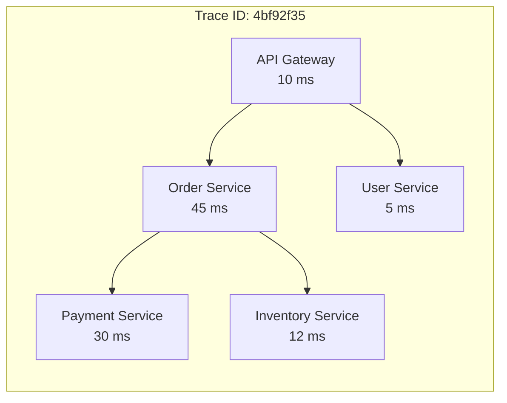
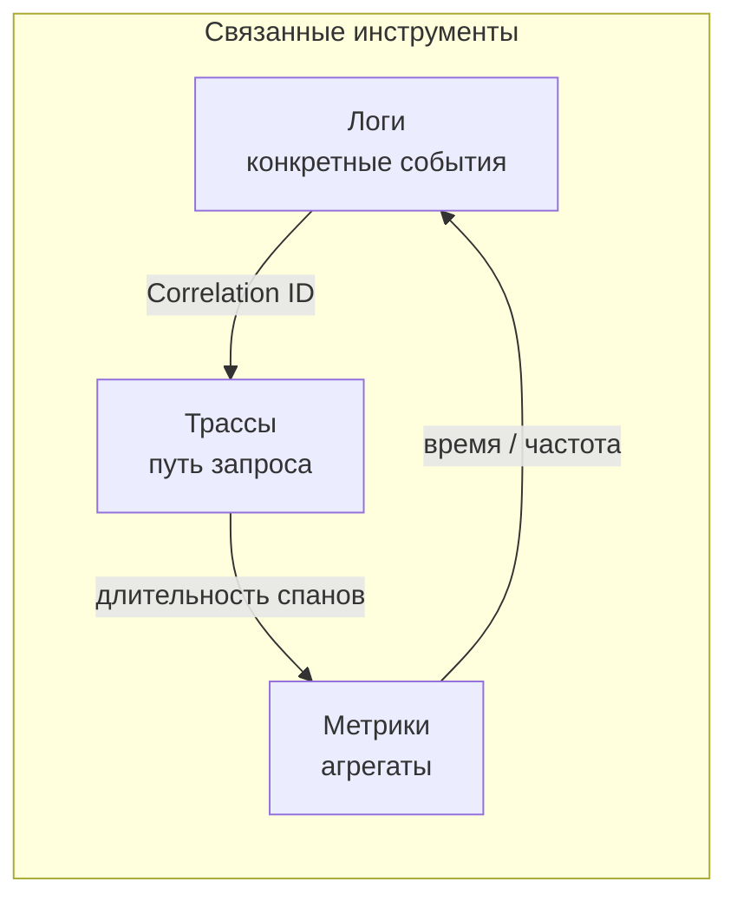

## Observability: как понять, что происходит внутри системы

Выпустить систему в продакшен — это только половина дела. Дальше начинается самое сложное: понять, что в ней происходит. Почему запросы стали медленнее? Почему пользователи жалуются на ошибки? Где узкое место? Без инструментов наблюдения система — это черный ящик. Вы знаете, что что-то входит и что-то выходит, но не имеете понятия, что происходит внутри.

**Observability (наблюдаемость)** — это способность понять внутреннее состояние системы по её внешним проявлениям (логам, метрикам, трассам). Хорошо наблюдаемая система позволяет ответить на вопрос "почему это произошло" без развертывания нового кода или добавления дополнительных точек логирования.

Observability строится на трех столпах: **logs** (логи), **metrics** (метрики), **traces** (трассировки). По отдельности каждый из них полезен, но вместе они дают полную картину.

## Почему observability, а не просто мониторинг

Мониторинг — это часть observability. Мониторинг отвечает на вопрос: "система работает или нет?" Он использует заранее определенные метрики (CPU, память, количество запросов) и алерты. Observability идет дальше: она позволяет задавать произвольные вопросы о поведении системы, в том числе о том, что не было предусмотрено заранее.

> **Мониторинг** говорит вам, что система упала. **Observability** говорит, почему.

**Пример:**
- Мониторинг: "Количество ошибок 500 выросло до 10%".
- Observability: "Ошибки происходят только для запросов с параметром `?version=legacy`, и только в сервисе платежей, при вызове внешнего API Visa. Трассировка показывает, что таймаут возникает через 2 секунды, что совпадает с настройкой таймаута в коде".

Observability требует, чтобы система была инструментирована: логи структурированы, метрики имеют метки (labels), трассировки проходят через все сервисы.

## Три столпа observability

### Логи (Logs)

**Логи** — это дискретные, структурированные (желательно) записи о конкретных событиях. Каждая запись содержит временную метку, сообщение и (в идеале) контекст.

**Что логировать?**

- Входящие и исходящие запросы (HTTP, RPC).
- Ошибки и исключения (с стектрейсом).
- Бизнес-события: "заказ создан", "платеж выполнен".
- Изменения состояния (переходы статуса).
- Аутентификация и авторизация (кто, что сделал).

**Формат логов:** Структурированные логи (JSON) лучше текстовых. JSON позволяет легко фильтровать и агрегировать. Включайте Correlation ID для связывания запросов между сервисами.

**Пример хорошего лога (JSON):**

```json
{
  "timestamp": "2025-01-15T10:30:00Z",
  "level": "ERROR",
  "service": "payment-service",
  "correlation_id": "123e4567-e89b-12d3-a456-426614174000",
  "message": "Payment gateway timeout",
  "payment_id": "pay_123",
  "gateway": "stripe",
  "duration_ms": 3000,
  "error_type": "timeout"
}
```

**Инструменты:** ELK (Elasticsearch, Logstash, Kibana), Loki (Grafana), Splunk.

**Когда нужны логи:** Для отладки конкретных инцидентов, анализа редких ошибок, аудита.

### Метрики (Metrics)

**Метрики** — это агрегированные числовые показатели, измеряемые с течением времени. В отличие от логов, которые описывают отдельные события, метрики дают суммарную картину.

**Типы метрик:**

- **Counter (счетчик).** Только увеличивается. Примеры: количество запросов, количество ошибок, количество обработанных сообщений.
- **Gauge (текущее значение).** Может увеличиваться и уменьшаться. Примеры: количество активных соединений, размер очереди, использование памяти.
- **Histogram (гистограмма).** Распределение значений. Примеры: время ответа (p50, p95, p99), размер запроса.
- **Summary (резюме).** Похож на гистограмму, но вычисляется на клиенте.

**Метрики должны иметь метки (labels), чтобы их можно было группировать.** Пример метрики с метками:

```
http_requests_total{method="GET", endpoint="/api/users", status="200"} 1500
http_requests_total{method="GET", endpoint="/api/users", status="500"} 5
```

**Инструменты:** Prometheus (сбор), Grafana (визуализация), Graphite, InfluxDB.

**Когда нужны метрики:** Для мониторинга SLO, обнаружения аномалий (внезапный рост ошибок), планирования capacity (тренды), дашбордов.

### Трассы (Traces)

**Трассы** показывают путь запроса через распределенную систему. Они связывают события в разных сервисах в одну цепочку и показывают, сколько времени занял каждый шаг.

**Структура трассы:**

- **Trace ID** — уникальный идентификатор запроса (корреляция между сервисами).
- **Span** — одна операция в одном сервисе (например, HTTP вызов, запрос к БД, обработка). У каждого спана есть свой Span ID.
- **Parent-child relationship** — спаны могут быть вложенными.



**Пример визуализации трассы в Jaeger/UiZipkin:**

```
Trace ID: 4bf92f35
├─ API Gateway (10 ms)
│  ├─ Order Service (45 ms)
│  │  ├─ Payment Service (30 ms)
│  │  └─ Inventory Service (12 ms)
│  └─ User Service (5 ms)
```

**Инструменты:** Jaeger, Zipkin, Tempo (Grafana), AWS X-Ray.

**Когда нужны трассы:** Для поиска узких мест в распределенных системах, отладки задержек, понимания зависимостей между сервисами.

## Как три столпа работают вместе

Отдельно логи, метрики и трассы полезны, но по-настоящему мощны они в связке.

**Сценарий 1: На дашборде (метрики) вы видите, что p95 latency сервиса заказов выросла с 100 мс до 2 секунд.**

- **Метрики** показывают проблему, но не её причину.
- Вы смотрите **трассы** для этого сервиса и видите, что запросы к сервису инвентаризации (по трассе) стали долгими.
- Внутри трассы видите, что сервис инвентаризации делает медленный запрос к БД.
- Вы идете в **логи** сервиса инвентаризации, фильтруете по Trace ID, находите конкретный SQL-запрос, который выполнялся 1.8 секунды. Причина — неоптимальный план запроса из-за нехватки индекса.

**Сценарий 2: Пользователь жалуется в поддержку, что его заказ не был оформлен, но он не знает, когда именно.**

- Поддержка имеет Correlation ID из ответа API (если вы его возвращаете).
- Инженер ищет логи по Correlation ID и видит, что в сервисе заказов не хватило средств.
- По трассе видит, что сервис заказов вызвал сервис платежей, который вернул ошибку "insufficient funds".
- Метрики подтверждают, что ошибок такого типа стало больше в последний час.



## Корреляция через Correlation ID

Связующим звеном между тремя столпами является **Correlation ID** (или Trace ID). Каждый запрос (или бизнес-транзакция) получает уникальный идентификатор, который передается через все сервисы.

- **Логи** включают Correlation ID.
- **Трассы** используют тот же Trace ID.
- **Метрики** могут быть размечены Correlation ID (редко, обычно используют агрегацию).

**Требование к API:** Все входящие запросы должны принимать заголовок `X-Correlation-Id` (или генерировать его, если не передан). Все исходящие вызовы (HTTP, gRPC, Kafka) должны передавать этот ID.

## Наблюдаемость на уровне аналитика: что нужно знать и требовать

Системный аналитик не пишет парсеры логов и не настраивает Prometheus. Но он должен:

- **Зафиксировать в требованиях необходимость observability.** Это не "nice to have", а обязательное архитектурное решение для production систем.
- **Определить бизнес-метрики (RED, USE).**
  - **RED (Rate, Errors, Duration).** Для каждого сервиса: количество запросов, ошибок, время ответа.
  - **USE (Utilization, Saturation, Errors).** Для каждого ресурса: использование CPU, насыщение памяти, ошибки диска.
- **Требовать структурированные логи (JSON)** с фиксированным набором полей: `timestamp`, `level`, `service`, `correlation_id`, `message`.
- **Согласовать уровни логирования (INFO, WARN, ERROR).** В production INFO не должно быть много, чтобы не забить диски. ERROR — только ошибки, требующие вмешательства.
- **Убедиться, что трассировка проходит через все сервисы.** Если есть интеграция через Kafka или другие брокеры, Correlation ID должен передаваться в заголовках сообщений.
- **Запросить дашборды (Grafana) для бизнес-метрик.** Например, "конверсия из корзины в заказ", "среднее время оформления заказа". Это поможет увидеть проблемы до того, как они приведут к инциденту.

## Распространенные ошибки

**1. Логи в текстовом формате (не JSON).** Их сложно парсить. "grep" и "awk" — не инструменты observability.

**2. Слишком много логов (INFO для каждого чиха).** Диск заполняется, ищите причину потом трудно. Используйте семплтрование (sampling) для высоконагруженных эндпоинтов.

**3. Отсутствие Correlation ID.** Нельзя связать логи разных сервисов. Трассировка невозможна.

**4. Метрики без меток (labels).** "Количество запросов" без разбивки по эндпоинтам, статусам, пользователям — бесполезно.

**5. Трассировка только в одном сервисе.** Не видно, где происходит задержка в распределенной системе.

**6. Наблюдаемость после релиза, а не до.** Добавлять логи и метрики в аварию — это слишком поздно.

## Пример: Наблюдаемость для интернет-магазина

**Логи (JSON):**

- Сервис заказов: при создании заказа.
- Сервис платежей:при вызове шлюза, при ответе.
- Сервис доставки:при назначении курьера.

**Метрики (Prometheus):**

- `orders_created_total`, `orders_created_failed_total`.
- `payment_gateway_duration_seconds` (p95), `payment_errors_total` по типу ошибки.
- `inventory_reservation_duration_seconds`.

**Трассы (Jaeger):**

- Каждый запрос от API Gateway до сервиса заказов, платежей, инвентаризации, доставки.
- Показывают, где именно задержка (например, платежный шлюз тормозит).

**Business метрики (Grafana дашборды):**

- Конверсия: просмотр товара -> добавление в корзину -> оформление -> оплата.
- Время от оформления до оплаты.
- Частота возвратов по причинам.

## Резюме

Observability — это способность понять внутреннее состояние системы по её внешним проявлениям. Она строится на трех столпах: логи, метрики, трассы.

- **Логи (Logs).** Дискретные, структурированные события. Полезны для отладки конкретных инцидентов, аудита.
- **Метрики (Metrics).** Агрегированные числовые показатели. Полезны для мониторинга, дашбордов, алертов, трендов.
- **Трассы (Traces).** Путь запроса через распределенную систему. Полезны для поиска узких мест, понимания зависимостей.

Вместе они обеспечивают полную картину и позволяют отвечать на сложные вопросы о системе.

**Для аналитика:** Настаивайте на observability как на архитектурном требовании, а не как на техническом долге. Определите бизнес-метрики, RED/USE метрики. Требуйте структурированные логи, Correlation ID и распределенную трассировку. Помните: если вы не можете измерить систему, вы не можете её улучшить. Observability — это не роскошь, а условие выживания в мире распределенных систем.