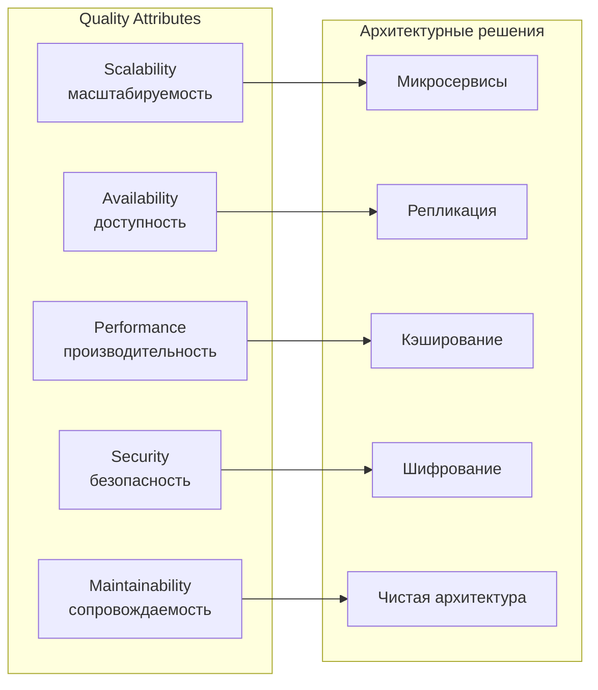
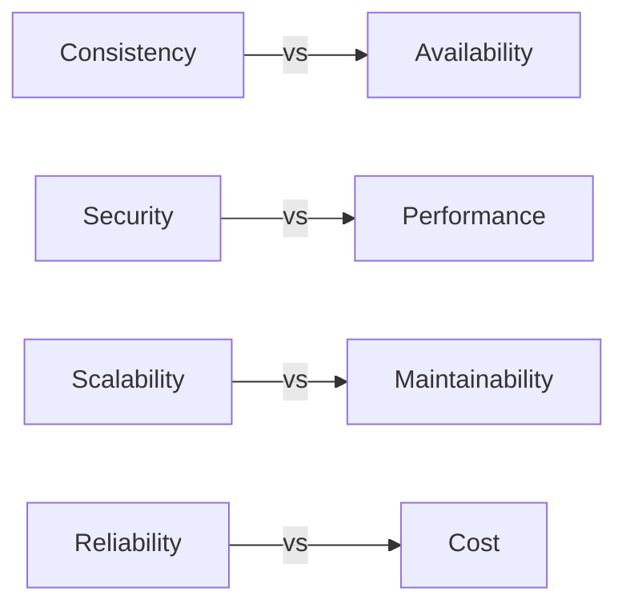

## Quality Attributes: как нефункциональные требования формируют архитектуру

Когда начинают проектировать систему, первым делом обычно говорят о функциях: "пользователь может зарегистрироваться", "может оформить заказ", "может отправить сообщение". Это функциональные требования. Они отвечают на вопрос "что делает система". Но для архитектуры часто важнее другой вопрос: "как хорошо система это делает". Ответ на него дают нефункциональные требования — **Quality Attributes (атрибуты качества)**.

Quality Attributes определяют, насколько система удобна, надежна, безопасна, производительна и сопровождаема. Именно они, а не список функций, диктуют выбор архитектурных стилей, паттернов и технологий.

## Что такое Quality Attributes и почему они важны

Quality Attributes (нефункциональные требования, NFR) — это критерии, по которым оценивается работа системы. В отличие от функциональных требований, они не описывают конкретное поведение, а задают ограничения и цели.

Пример функционального требования: "Система должна отправлять email при регистрации пользователя". Пример атрибута качества: "Система должна обрабатывать 1000 регистраций в секунду" (производительность) или "Email должен доставляться не позднее чем через 5 секунд после регистрации" (задержка).

**Почему архитектура зависит от NFR:**

- **Масштабируемость (Scalability).** Если нужно обслуживать миллионы пользователей, монолит с одной базой данных не подходит. Нужны микросервисы, шардирование, очереди.
- **Доступность (Availability).** Если простой недопустим, нужны реплики, балансировщики, автоматический failover и избыточность на всех уровнях.
- **Безопасность (Security).** Если система хранит персональные данные, нужны шифрование, аудит, разграничение доступа, защита от инъекций.
- **Сопровождаемость (Maintainability).** Если систему будут развивать 10 лет, нужна чистая архитектура, модульность, тесты, документация.

## Ключевые атрибуты качества и их влияние на архитектуру

### Производительность (Performance)

**Что это:** Способность системы обрабатывать запросы с заданной скоростью и задержкой. Измеряется в latency (время ответа) и throughput (количество операций в секунду).

**Как влияет на архитектуру:**

- **Кэширование (CDN, Redis, in-memory cache).** Чтобы снизить задержку, часто используемые данные хранятся ближе к клиенту.
- **Асинхронность (очереди, брокеры сообщений).** Долгие операции не блокируют основной поток.
- **Горизонтальное масштабирование (балансировщики, шардирование).** Добавление серверов увеличивает throughput.
- **Выбор БД.** Для быстрых чтений по ключу подходит Redis; для сложной аналитики — колоночные БД (ClickHouse); для транзакций — PostgreSQL.
- **Избегание N+1 запросов.** API Composition, GraphQL, batch-эндпоинты.

**Пример:** Риал-тайм чат требует задержки < 100 мс. WebSocket + Redis для онлайн-статусов + кэширование истории. База данных сообщений (Cassandra) — AP, потому что строгая согласованность не нужна.

### Масштабируемость (Scalability)

**Что это:** Способность системы увеличивать производительность пропорционально добавленным ресурсам. Вертикальное (увеличить мощность сервера) и горизонтальное (добавить серверы).

**Как влияет на архитектуру:**

- **Stateless сервисы (горизонтальное масштабирование).** Любой экземпляр обрабатывает любой запрос. Состояние выносится в кэш (Redis) или БД.
- **Stateful сервисы сложно масштабировать.** Для БД — шардирование, реплики для чтения, но не бесконечно.
- **Микросервисная архитектура.** Разные сервисы масштабируются независимо.
- **Асинхронная обработка (очереди).** Сглаживает пики, но не решает проблему масштабирования БД.

**Пример:** E-commerce в черную пятницу. Stateless серверы приложений масштабируются горизонтально. База данных заказов — шардирование по `orderId`. Каталог — Elasticsearch (AP, горизонтальное масштабирование). Инвентаризация — bottleneck (CP), но её трафик относительно низкий.

### Доступность (Availability)

**Что это:** Доля времени, в течение которого система работает корректно. Выражается в "девятках": 99.9% (три девятки) — ~8 часов простоя в год; 99.999% (пять девяток) — ~5 минут в год.

**Как влияет на архитектуру:**

- **Репликация и отказоустойчивость (redundancy).** Нет единой точки отказа (single point of failure). Минимум 2 экземпляра каждого сервиса, 3 реплики БД.
- **Автоматический failover.** При падении мастера БД реплика автоматически становится мастером.
- **Балансировщики нагрузки.** Распределяют трафик между живыми инстансами.
- **Graceful degradation.** Если один сервис упал, остальные работают (например, каталог доступен, даже если платежи временно недоступны).
- **Retry, Circuit Breaker, Timeout.** Защита от каскадных отказов.

**Пример:** Платежная система должна иметь доступность 99.99%. Реплики PostgreSQL (синхронная репликация), балансировщик, автоматический failover, резервный дата-центр. Избыточность = стоимость.

### Безопасность (Security)

**Что это:** Защита данных и системы от несанкционированного доступа, модификации, уничтожения.

**Как влияет на архитектуру:**

- **Аутентификация (OAuth2, JWT, OpenID Connect).** Кто пользователь.
- **Авторизация (RBAC, ABAC).** Что пользователь может делать.
- **Шифрование данных в транзите (TLS) и в покое (encryption at rest).**
- **Токенизация чувствительных данных (номера карт).**
- **Аудит доступа (логи, кто что делал).**
- **Изоляция компонентов (сетевые политики, разные сервисы).**

**Пример:** Система, работающая с персональными данными (GDPR). Шифрование на диске, TLS между сервисами, аудит всех операций, разграничение доступа через OAuth2. Инфраструктура дороже, задержка выше (шифрование). Для платежей — изоляция сервиса платежей, только он имеет доступ к данным карт (PCI DSS).

### Сопровождаемость (Maintainability)

**Что это:** Легкость, с которой систему можно изменять, тестировать, развертывать, откатывать.

**Как влияет на архитектуру:**

- **Модульность (низкая связанность, высокая связность внутри модуля).** Изменение в одном модуле не задевает другие.
- **Чистая архитектура, гексагональная архитектура.** Бизнес-логика не зависит от фреймворков и БД.
- **Тестируемость (unit, integration, contract).** Компоненты можно тестировать изолированно.
- **Автоматизация развертывания (CI/CD).** Инфраструктура как код.
- **Наличие документации (для чего компонент, как использовать API).**

**Пример:** Монолит легче сопровождать на старте (один код, один деплой). С ростом команды поддержка ухудшается. Модульный монолит (с четкими границами) дает сопровождаемость без сложности микросервисов. Микросервисы тяжелее в отладке и развертывании.

### Надежность (Reliability)

**Что это:** Вероятность того, что система не откажет в течение определенного времени. Близка к доступности, но включает также устойчивость к некорректным данным (fault tolerance).

**Как влияет на архитектуру:**

- **Retry, Circuit Breaker, Backoff.**
- **Dead Letter Queue (DLQ)** для сообщений, которые невозможно обработать (poison messages).
- **Checkpointing и восстановление состояния (state recovery).**
- **Идемпотентность операций (чтобы повтор не навредил).**
- **Мониторинг и алерты (чтобы узнать об отказе до пользователя).**

**Пример:** Потоковая обработка (Kafka Streams) использует ченжлоги для восстановления состояния. При обработке события consumer сохраняет прогресс (offset) и обрабатывает идемпотентно. При сбое восстановление из ченжлога.

## Как атрибуты качества конфликтуют между собой

Архитектура — это искусство компромисса. Часто два NFR противоречат друг другу.

**Consistency vs. Availability (CAP).** Банк выбирает консистентность (CP). Социальная сеть — доступность (AP).

**Security vs. Performance.** Шифрование замедляет систему, аудит требует ресурсов. Нужно шифровать не все, а только чувствительные данные.

**Scalability vs. Maintainability.** Микросервисы хорошо масштабируются, но сложны в поддержке и отладке. Монолит проще, но не масштабируется.

**Reliability vs. Cost.** Дополнительные реплики, резервные дата-центры, автоматический failover — все это стоит денег. Гарантия 99.999% обходится дороже 99.9%.

## Как аналитик должен работать с Quality Attributes

**Сбор NFR:** Задавайте вопросы о масштабе, задержках, доступности, безопасности на этапе сбора требований. Без них архитектор примет решения по умолчанию, которые могут не подойти.

**Приоритизация:** Не все NFR одинаково важны. Вместе с бизнесом расставьте приоритеты. Для MVP доступность 99% может быть OK, для платежей — нет.

**Количественные метрики:** Вместо "быстрый ответ" напишите "95% запросов должны отвечать за 100 мс". Вместо "высокая доступность" напишите "доступность 99.9% в месяц".

**Документирование компромиссов:** Если мы выбираем микросервисы (scalability), мы платим снижением maintainability. Зафиксируйте это в ADR (Architecture Decision Record).

## Пример: Атрибуты качества для системы бронирования билетов

**Scenario:** Онлайн-кинотеатр, продажа билетов.

**Функциональные требования:** выбрать фильм, выбрать место, оплатить, получить QR-код.

**Качество (NFR):**

- **Performance:** выбор мест (чтение) должен быть за 50 мс, оформление заказа за 2 с.
- **Scalability:** 5000 одновременных пользователей в пятницу вечером.
- **Availability:** 99.9% в часы работы (кинотеатр физически открыт). Простой в 3 ночи допустим.
- **Consistency:** строгая, нельзя продать одно место дважды (CP).
- **Security:** данные карт не храним, передаем через шлюз. Пользователи аутентифицируются по email/phone.

**Архитектурные решения, продиктованные NFR:**

- **Performance + Scalability чтения:** Кэширование выборки мест в Redis (обновление при бронировании). API для выбора мест — легковесный.
- **Consistency записи:** PostgreSQL для заказов и бронирований. Использовать `SELECT FOR UPDATE` при бронировании. Это не масштабируется для записи, но write throughput невелик.
- **Availability:** Балансировщик для stateless серверов приложений. PostgreSQL с репликой (manual failover, потому что автоматический может дать split brain).
- **Security:** JWT для авторизации. Платежный шлюз (Stripe) — PCI DSS на их стороне.

## Распространенные ошибки

**Ошибка 1: NFR — второстепенны.** "Сделаем функции, потом подумаем о масштабе". Это приводит к переписыванию системы через год.

**Ошибка 2: Не количественные требования.** "Система должна быть быстрой". Это измерить нельзя. Нужно: "p95 latency 200 мс".

**Ошибка 3: Игнорирование компромиссов.** "Сделаем микросервисы для масштабируемости" — но команда из 3 человек не справится с поддержкой 10 сервисов.

**Ошибка 4: Все NFR имеют высший приоритет.** Не бывает системы, которая одновременно максимально производительна, безопасна, масштабируема и дешева. Расставляйте приоритеты.

**Ошибка 5: NFR фиксируются, но не проверяются.** После релиза нужно измерить реальную задержку, доступность. Иначе требования останутся на бумаге.

## Резюме

Quality Attributes (нефункциональные требования) — это критерии, по которым оценивается работа системы: производительность, масштабируемость, доступность, безопасность, сопровождаемость, надежность.

**Они влияют на архитектуру фундаментально:**

- Производительность → кэширование, асинхронность, выбор БД.
- Масштабируемость → stateless сервисы, шардирование, микросервисы.
- Доступность → репликация, failover, избыточность, graceful degradation.
- Безопасность → аутентификация, авторизация, шифрование, изоляция.
- Сопровождаемость → модульность, чистая архитектура, CI/CD, документация.
- Надежность → retry, circuit breaker, DLQ, мониторинг.

**Компромиссы неизбежны:** Consistency vs Availability, Security vs Performance, Scalability vs Maintainability, Reliability vs Cost.

**Для аналитика:** собирайте количественные NFR, приоритезируйте их с бизнесом, документируйте компромиссы. Архитектура, построенная только на функциях, — это дом без фундамента. Качества — это и есть фундамент. Без них система рухнет под первой же реальной нагрузкой или первой попытке изменения. Хороший аналитик понимает это и делает NFR первой главой в требованиях, а не последней.