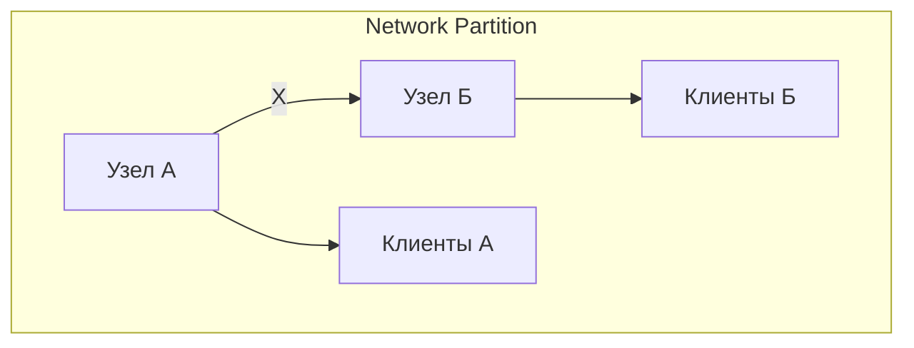
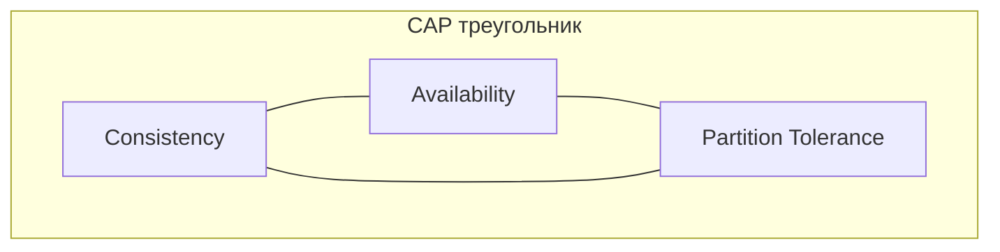
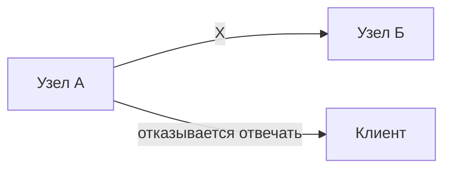
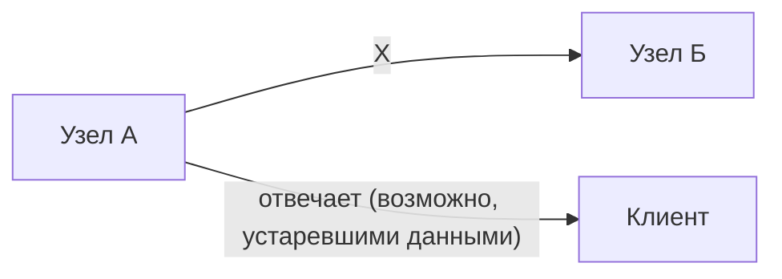
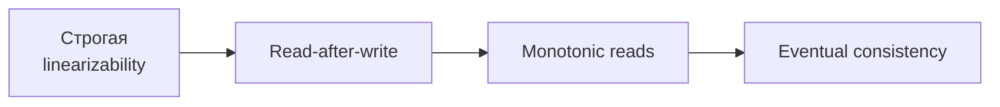
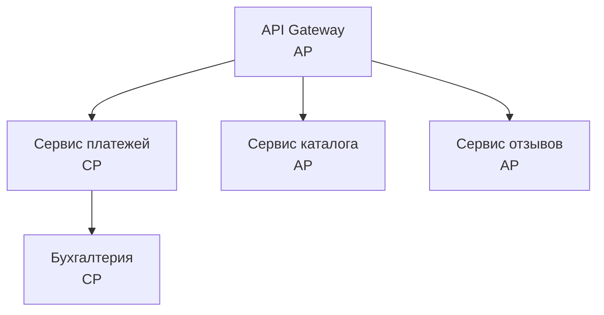
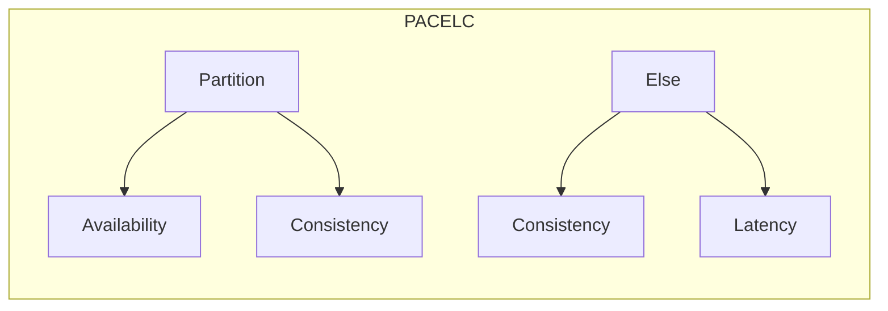

## Введение: Только два из трех

Представьте, что вы управляете сетью банкоматов по всему городу. Клиенты снимают деньги, кладут на счета, проверяют баланс.

Однажды связь между банкоматами и центральным сервером прервалась. Клиент подходит к банкомату и хочет снять 5000 рублей. На счету у него 10 000 рублей, но банкомат не может проверить баланс из-за обрыва связи. Что делать?

**Выбор А (Consistency):** Банкомат говорит: "Извините, связь недоступна, приходите позже". Клиент не может снять деньги, но система остается согласованной — нет риска, что клиент снимет больше, чем у него есть.

**Выбор Б (Availability):** Банкомат выдает деньги, доверяя тому, что клиент честен (или используя локальный кэш). Клиент счастлив, но есть риск: если у клиента на счету меньше 5000, банкомат ошибся. Система стала несогласованной (баланс в банкомате и на сервере разошелся), но доступной.

**CAP-теорема (теорема Брюера)** утверждает: в распределенной системе невозможно одновременно обеспечить все три свойства:

- **Consistency (Согласованность)** — все узлы видят одни и те же данные в одно и то же время
- **Availability (Доступность)** — каждый запрос к системе получает ответ (успешный или неудачный)
- **Partition Tolerance (Устойчивость к разделению)** — система продолжает работать даже при потере связи между узлами

На практике network partition (разделение сети) неизбежна. Поэтому выбор сводится к CP (согласованность + устойчивость к разделению) или AP (доступность + устойчивость к разделению).

## Три свойства CAP

### Consistency (Согласованность)

Все узлы распределенной системы видят одни и те же данные в один момент времени.

- После того как клиент обновил данные, все последующие чтения (с любого узла) увидят это обновление.
- Нет "устаревших" данных.

**Пример:** В банковской системе после перевода денег баланс должен быть одинаковым на всех банкоматах.

### Availability (Доступность)

Каждый запрос к системе получает ответ (не ошибку, не таймаут). Система всегда отвечает, даже если некоторые узлы упали или сеть разделена.

- Ответ может быть не самым свежим (если данные еще не синхронизировались).
- Но система не отказывает клиенту.

**Пример:** В социальной сети вы всегда можете поставить лайк, даже если сервер временно недоступен (лайк сохранится локально и отправится позже).

### Partition Tolerance (Устойчивость к разделению)

Система продолжает работать, даже если связь между узлами потеряна (network partition).

- Узел А не может общаться с узлом Б, но каждый продолжает обрабатывать запросы.
- Разделение сети неизбежно в распределенных системах (сетевые сбои, обрывы кабелей, падение маршрутизаторов).



## Почему нельзя иметь все три

Допустим, у нас есть два узла (А и Б) и network partition между ними. Клиент пишет данные на узел А, а затем читает с узла Б.

**Чтобы обеспечить Consistency:** Узел Б должен вернуть те же данные, что и узел А. Но из-за network partition узел Б не может узнать об обновлении. Единственный способ — узел Б отказаться отвечать (или вернуть ошибку), пока не восстановится связь. Это нарушает Availability.

**Чтобы обеспечить Availability:** Узел Б должен ответить, даже если не получил обновление. Он возвращает старые данные. Это нарушает Consistency.

**Вывод:** При network partition вы должны выбрать между Consistency и Availability. Partition Tolerance не выбирают — она нужна всегда (сети ненадежны).



## Три варианта выбора

### CP (Consistency + Partition Tolerance) — жертвуем доступностью

При разделении сети система предпочитает согласованность доступности. Если узлы не могут общаться, система отказывается отвечать (или отвечает ошибкой), чтобы не нарушить согласованность.



**Примеры:** HBase, MongoDB (в конфигурации по умолчанию), Zookeeper, etcd, Consul, CockroachDB.

**Когда использовать:** Финансовые системы, системы бронирования, инвентаризация — везде, где неверные данные дороже недоступности.

### AP (Availability + Partition Tolerance) — жертвуем согласованностью

При разделении сети система предпочитает доступность согласованности. Каждый узел отвечает на запросы, даже если данные могут быть устаревшими или несогласованными.



**Примеры:** Cassandra, DynamoDB, CouchDB, Amazon S3, DNS, Redis (в режиме кластера).

**Когда использовать:** Социальные сети, аналитика, IoT, системы с eventual consistency — везде, где доступность важнее абсолютной точности.

### CA (Consistency + Availability) — невозможно в распределенной системе

Теоретически возможна только в системах без сетевых разделений (одноузловые базы данных). Как только у вас больше одного узла и есть сеть — partition tolerance нужна.

**Примеры:** традиционные одноузловые базы данных (PostgreSQL, MySQL в режиме одного сервера).


## Consistency: Строгая vs Eventual

Важно понимать, что "consistency" в CAP — это строгая согласованность (linearizability). Все узлы видят одни и те же данные в один момент времени.

Существуют более слабые формы согласованности:

- **Eventual consistency (согласованность в конечном счете).** Данные станут согласованными через некоторое время (но не мгновенно). Пример: DNS, Cassandra.
- **Read-after-write consistency.** Клиент видит свои собственные записи сразу, но чужие — может быть, нет.
- **Monotonic reads.** Если клиент прочитал значение, он не увидит более старую версию позже.



Системы, которые выбирают AP, обычно предлагают eventual consistency или другие слабые модели.

## Примеры из реальной жизни

### Банкомат (CP)

Вы приходите в банкомат, но связь с сервером прервана. Банкомат говорит: "Сервис недоступен, попробуйте позже". Это выбор CP: согласованность важнее доступности. Банк не рискует выдать деньги, не проверив баланс.

### Социальная сеть (AP)

Вы ставите лайк под фото. Сервер временно недоступен, но приложение показывает, что лайк поставлен (локально). Через несколько секунд, когда связь восстановится, лайк синхронизируется. Это выбор AP: доступность важнее строгой согласованности. Пользователь не ждет, система отвечает.

### DNS (AP)

Вы вводите google.com в браузере. DNS-сервер отвечает IP-адресом, даже если данные немного устарели (TTL). DNS жертвует строгой согласованностью ради доступности.

## CAP на практике: Компромиссы

В реальных распределенных системах вы редко выбираете "чистый CP" или "чистый AP". Часто используются гибридные подходы.

**Tunable consistency (настраиваемая согласованность).** Cassandra позволяет выбрать для каждой операции: сколько узлов должны подтвердить запись, сколько узлов должны подтвердить чтение.

```yaml
# Cassandra: настраиваемая согласованность
CONSISTENCY QUORUM;  # баланс между C и A
CONSISTENCY ALL;     # строгая C, но ниже A
CONSISTENCY ONE;     # высокая A, но слабая C
```

**CRDT (Conflict-free replicated data types).** Специальные структуры данных, которые автоматически разрешают конфликты без координации. Позволяют получить и высокую доступность, и в конечном счете согласованность.

**Leader-follower репликация.** В PostgreSQL, MySQL: мастер принимает запись, реплики читают. При разделении сети реплики могут быть недоступны для записи (выбор CP) или продолжать работу (выбор AP с eventual consistency).

## CAP и базы данных

| База данных | CAP выбор | Комментарий |
| :--- | :--- | :--- |
| PostgreSQL (одноузловая) | CA | Нет распределенности |
| PostgreSQL (репликация) | CP (обычно) | Мастер-реплика, при разделении реплики не принимают запись |
| MySQL (группа репликации) | CP | Аналогично |
| MongoDB (по умолчанию) | CP | Читает с мастера, при разделении может не отвечать |
| MongoDB (настроенная) | AP | Можно ослабить согласованность |
| Cassandra | AP | Высокая доступность, eventual consistency |
| DynamoDB | AP | По умолчанию AP, но можно усилить C (увеличив consistency level) |
| CockroachDB | CP | Распределенная SQL с сильной согласованностью |
| Redis (кластер) | AP | При разделении может вернуть устаревшие данные |
| Zookeeper, etcd | CP | Строгая согласованность, но при разделении могут быть недоступны |

## CAP и микросервисы

В микросервисной архитектуре каждый сервис может делать свой выбор между C и A в зависимости от его роли.



- **Сервис платежей** — CP. Согласованность критична.
- **Сервис каталога** — AP. Каталог должен быть доступен всегда, устаревшие цены на несколько секунд допустимы.
- **Сервис отзывов** — AP. Отзывы могут загружаться асинхронно.

## Распространенные заблуждения

**"CAP означает, что нужно выбрать два из трех, и это навсегда".** Нет. Вы можете динамически менять баланс между C и A в зависимости от ситуации. Например, в нормальных условиях система дает сильную согласованность, при разделении сети переключается в режим высокой доступности с eventual consistency.

**"AP системы не гарантируют согласованность вообще".** Нет. AP системы гарантируют eventual consistency. Данные станут согласованными, но не мгновенно.

**"CA системы возможны в распределенных системах".** Нет. Как только у вас больше одного узла и есть сеть, partition tolerance нужна. CA возможна только в одноузловых системах.

**"CAP — это все, что нужно знать о распределенных системах".** Нет. CAP описывает только один компромисс (согласованность vs доступность при разделении сети). Есть и другие компромиссы (латентность, производительность, стоимость). PACELC теорема расширяет CAP, добавляя компромисс между согласованностью и задержкой (latency) при отсутствии разделения сети.

## PACELC теорема (расширение CAP)

PACELC теорема (от Daniel Abadi) расширяет CAP: при разделении сети (Partition) выбираем между Availability и Consistency (как в CAP). При отсутствии разделения (Else) выбираем между Consistency и Latency.



**Примеры:**

- **DynamoDB:** При разделении → AP. При отсутствии разделения → выбирает Latency (быстрые ответы, даже если строгая согласованность не гарантирована).
- **HBase:** При разделении → CP. При отсутствии разделения → выбирает Consistency (ждет синхронизации, даже если это увеличивает задержку).

## Резюме

CAP-теорема (теорема Брюера) утверждает: в распределенной системе невозможно одновременно обеспечить Consistency (согласованность), Availability (доступность) и Partition Tolerance (устойчивость к разделению).

**Три свойства:**

- **Consistency (C)** — все узлы видят одни и те же данные
- **Availability (A)** — каждый запрос получает ответ
- **Partition Tolerance (P)** — система работает при разделении сети

**На практике:** Network partition неизбежна, поэтому выбор сводится к:

- **CP (Consistency + Partition tolerance)** — жертвуем доступностью. Система отказывается отвечать, если не может гарантировать согласованность.
- **AP (Availability + Partition tolerance)** — жертвуем строгой согласованностью. Система всегда отвечает, но данные могут быть устаревшими.

**Что выбрать?**

- **CP** — банки, бронирование, инвентаризация (неверные данные дороже недоступности)
- **AP** — соцсети, аналитика, рекомендации, IoT (доступность важнее абсолютной точности)

**Важно:**

- CAP не означает "навсегда". Баланс между C и A можно менять динамически.
- AP системы гарантируют eventual consistency, а не "никакой согласованности".
- CAP — только один из компромиссов. PACELC добавляет компромисс Consistency vs Latency при отсутствии разделения.

CAP-теорема не говорит, что выбрать, а показывает, что вы должны сделать выбор осознанно, понимая последствия. Для банка важнее согласованность (CP), для социальной сети — доступность (AP). Нет правильного ответа для всех — есть правильный ответ для вашего бизнеса.