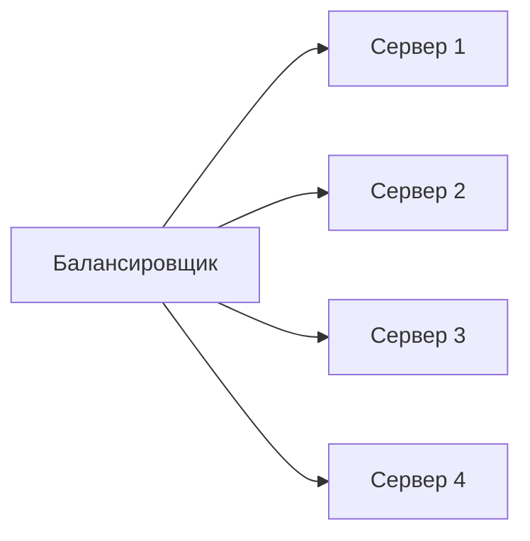
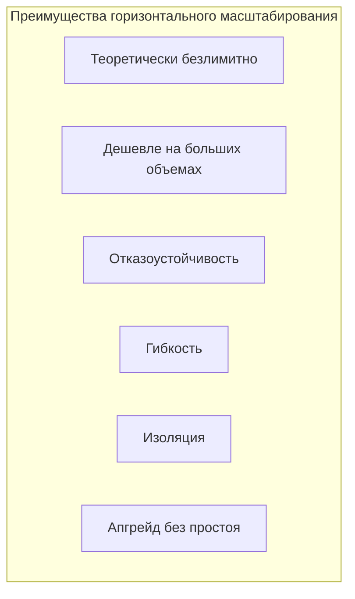
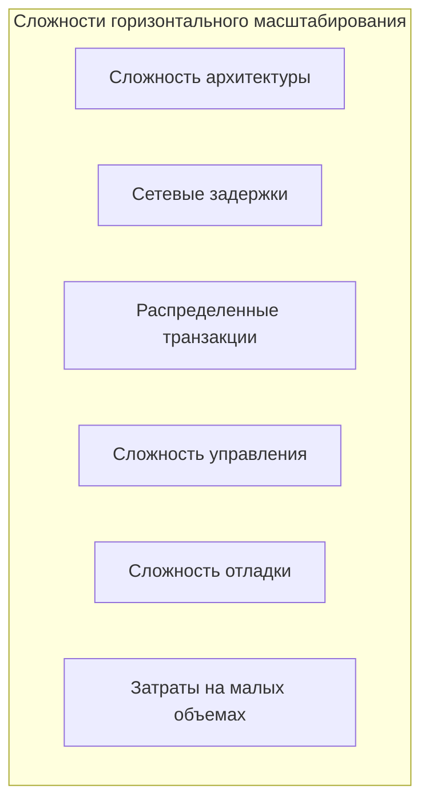
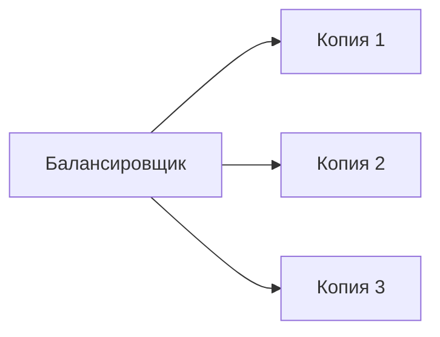
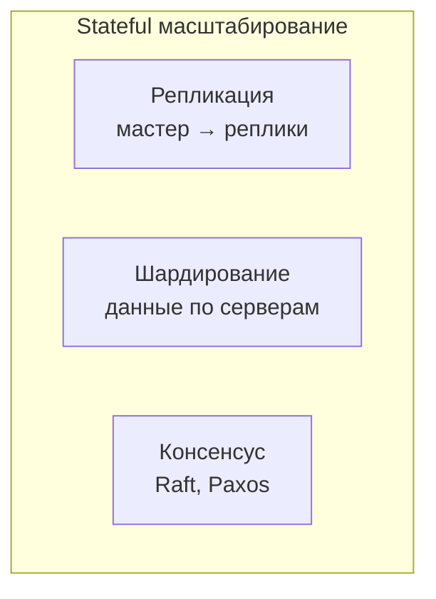
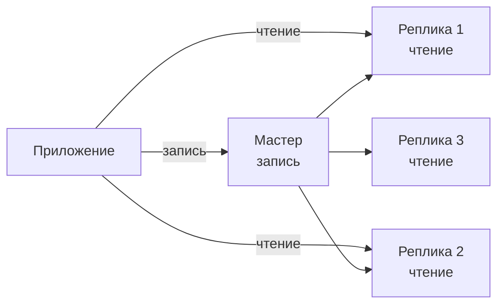
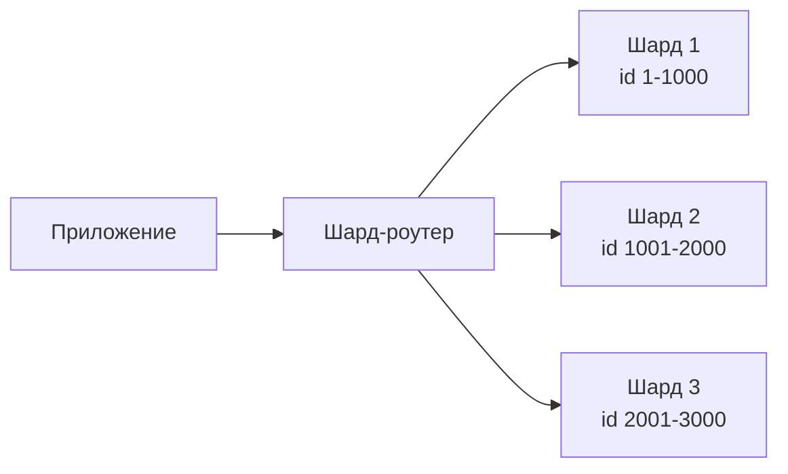
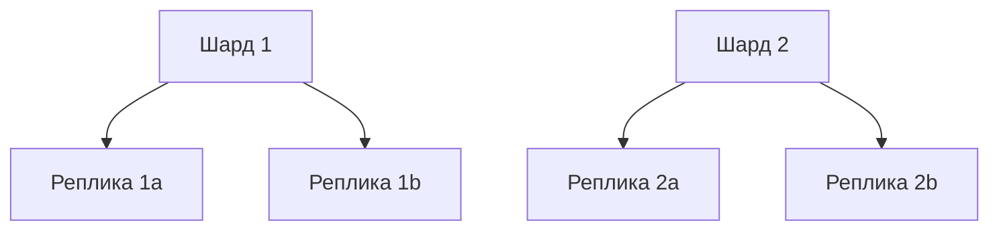
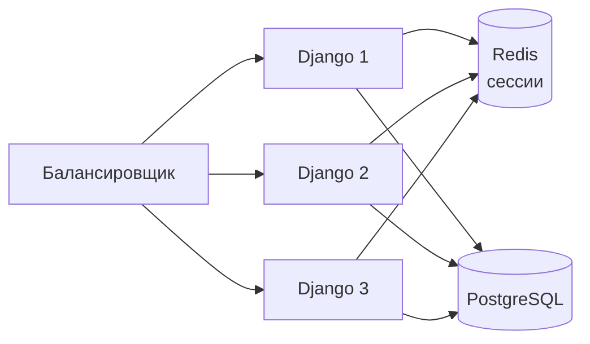
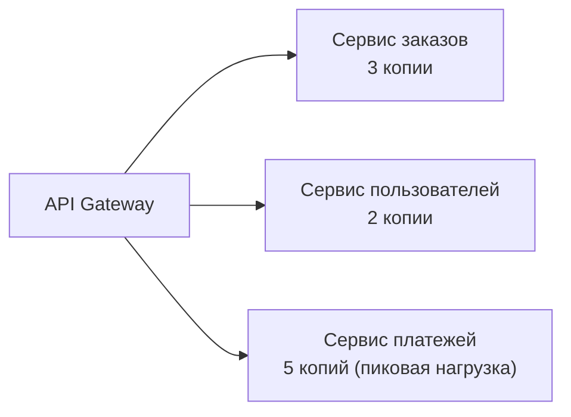

## Введение: Больше не мощнее, а больше

Представьте, что ваш ресторан стал очень популярным. Вместо того чтобы строить один огромный ресторан на 1000 мест (что дорого и имеет пределы), вы открываете 10 небольших ресторанов в разных районах города. Каждый ресторан обслуживает своих посетителей. Посетители идут в ближайший к ним ресторан. Если один ресторан переполнен, посетители могут пойти в другой.

**Горизонтальное масштабирование (Scaling Out)** — это добавление новых серверов в систему. Вместо одного мощного сервера — много маленьких. Нагрузка распределяется между ними. Если нужно больше мощности — добавляете еще один сервер. Теоретически — безлимитно.

Горизонтальное масштабирование — это путь роста для крупных систем. Google, Amazon, Facebook используют именно его. Но оно требует изменения архитектуры: приложение должно уметь работать в распределенной среде, база данных должна уметь шардироваться, а синхронизация состояния между серверами становится нетривиальной.

## Как работает горизонтальное масштабирование

**Stateless компоненты (без состояния):** Добавляем новые серверы (или контейнеры) и ставим перед ними балансировщик нагрузки (load balancer). Балансировщик распределяет запросы между серверами.



**Stateful компоненты (с состоянием, например, базы данных):** Сложнее. Нужно синхронизировать данные между серверами. Используются:

- **Репликация (replication).** Копирование данных с мастера на реплики. Масштабирует чтение.
- **Шардирование (sharding).** Разбиение данных на части, каждая часть на своем сервере. Масштабирует и чтение, и запись.
- **Консенсус (consensus).** Распределенные алгоритмы (Raft, Paxos) для согласования состояния.

## Преимущества горизонтального масштабирования

**Теоретически безлимитно.** Вы можете добавлять серверы до тех пор, пока позволяет бюджет и физическое пространство в дата-центре. Нет потолка, как при вертикальном масштабировании.

**Дешевле на больших объемах.** Много маленьких серверов дешевле, чем один огромный. Пять серверов по $100 ($500) могут быть мощнее и дешевле, чем один сервер за $2000.

**Отказоустойчивость.** Если один сервер упал, другие продолжают работать. Система деградирует gracefully (часть серверов недоступна, но не вся система). При правильной архитектуре с балансировщиком и репликами отказ одного узла незаметен для пользователя.

**Гибкость.** Вы можете добавлять серверы по мере роста нагрузки. Не нужно заранее покупать огромный сервер "на вырост". Платите только за то, что используете сейчас.

**Изоляция (при правильной архитектуре).** Можно изолировать разные типы нагрузки на разные группы серверов. Например, выделить отдельные серверы для тяжелых отчетов, чтобы они не мешали основным запросам.

**Апгрейд без простоя (rolling update).** Можно обновлять серверы по одному, не останавливая всю систему. Пока один сервер обновляется, остальные работают.



## Недостатки и сложности

**Сложность архитектуры.** Приложение должно быть спроектировано для работы в распределенной среде. Нет общих переменных в памяти. Сессии нельзя хранить локально (нужна общая Redis). Запросы от одного пользователя могут попадать на разные серверы.

**Сетевые задержки.** Вместо вызова функции (наносекунды) — сетевые вызовы между серверами (миллисекунды). Это в тысячи раз медленнее.

**Распределенные транзакции.** Обеспечить атомарность операции, затрагивающей несколько серверов, сложно. Нужны паттерны вроде Saga, eventual consistency.

**Сложность управления.** Кластер из 10 серверов сложнее администрировать, чем один сервер. Нужны: балансировщики, service discovery, распределенный мониторинг, централизованное логирование.

**Сложность отладки.** Запрос прошел через балансировщик, потом через сервер А, потом вызвал сервер Б, потом вернулся. Логи на разных серверах. Нужна распределенная трассировка (Jaeger, Zipkin).

**Затраты на малых объемах.** Для небольшой нагрузки (1000 пользователей) один сервер дешевле, чем три маленьких. Накладные расходы на кластер (балансировщик, дополнительные серверы) не окупаются.



## Stateless vs Stateful при горизонтальном масштабировании

### Stateless приложения (без состояния)

**Примеры:** веб-сервер (nginx, Apache), API Gateway, serverless функции, микросервисы без хранения сессий.

**Как масштабировать:** Добавляем копии за балансировщиком. Любой сервер может обработать любой запрос. Нет необходимости синхронизировать состояние между серверами.



**Сессии:** Если приложение хранит сессии в памяти, при горизонтальном масштабировании пользователь может попасть на другой сервер и потерять сессию. Решение: вынести сессии в общее хранилище (Redis) или использовать sticky sessions (но это костыль).

### Stateful приложения (с состоянием)

**Примеры:** базы данных (PostgreSQL, MySQL), кэши (Redis), очереди (Kafka), файловые хранилища.

**Как масштабировать:** Сложно. Используются:

- **Репликация.** Масштабирует чтение. Запись идет в один мастер.
- **Шардирование.** Масштабирует и чтение, и запись. Сложно, требует изменения приложения.
- **Консенсус (Raft, Paxos).** Для распределенных систем, где нужна согласованность (etcd, ZooKeeper).



## Стратегии горизонтального масштабирования

### Масштабирование чтения (Read Scaling)

**Проблема:** Запросов на чтение в 100 раз больше, чем на запись. Мастер БД не справляется с чтением.

**Решение:** Репликация. Один мастер (принимает запись), много реплик (принимают чтение). Реплики асинхронно синхронизируются с мастером.



**Ограничения:** Запись все еще идет в один мастер. Задержка репликации (replica lag) — данные на репликах могут быть не свежими (eventual consistency).

### Масштабирование записи (Write Scaling)

**Проблема:** Запросов на запись много, и мастер не справляется. Репликация не помогает (все равно пишем в один мастер).

**Решение:** Шардирование (Sharding). Данные разбиваются на части (шарды) по ключу шардирования (shard key). Каждый шард находится на отдельном сервере.

```yaml
Шард 1: пользователи с id 1-1000
Шард 2: пользователи с id 1001-2000
Шард 3: пользователи с id 2001-3000

Запись:
  - Пользователь с id=500 → шард 1
  - Пользователь с id=1500 → шард 2
  - Пользователь с id=2500 → шард 3
```



**Ограничения:** JOIN между шардами невозможны (или очень медленные). Перебалансировка при добавлении нового шарда сложна (нужно перемещать данные). Выбор ключа шардирования критичен.

### Гибрид: Шардирование + Репликация

Для больших систем используют оба подхода: каждый шард может иметь свои реплики для масштабирования чтения и отказоустойчивости.



## Пример: Горизонтальное масштабирование веб-приложения

**Исходное состояние:** Один сервер: nginx + Django + PostgreSQL. 1000 пользователей.

**Шаг 1: Горизонтальное масштабирование stateless слоя.** Добавляем балансировщик (nginx, HAProxy). Запускаем 3 копии Django на разных серверах. Сессии выносим в Redis (общий для всех копий). PostgreSQL пока один.



**Шаг 2: Репликация PostgreSQL.** Добавляем реплики PostgreSQL для чтения. Django направляет запросы на чтение на реплики, запись — на мастер.

**Шаг 3: Шардирование PostgreSQL.** Когда мастер перестает справляться с записью, переходим к шардированию (например, Citus для PostgreSQL).

## Горизонтальное масштабирование в облаке vs on-premise

| Аспект | On-premise | Облако (AWS, GCP, Azure) |
| :--- | :--- | :--- |
| **Добавление сервера** | Долго (заказ, доставка, установка) | Мгновенно (API, авто-масштабирование) |
| **Стоимость на малых объемах** | Высокая (покупка оборудования) | Низкая (плата за час) |
| **Стоимость на больших объемах** | Ниже (нет наценки облака) | Выше (наценка облачного провайдера) |
| **Автоматическое масштабирование** | Сложно | Из коробки (auto-scaling groups) |
| **Управление** | Вы сами | Провайдер (managed K8s, RDS) |

## Горизонтальное масштабирование и микросервисы

Микросервисная архитектура — это, по сути, горизонтальное масштабирование на уровне архитектуры. Каждый микросервис может масштабироваться независимо.



**Преимущества:** Можно масштабировать только те сервисы, которые действительно нагружены. Сервис платежей в 5 копий, сервис пользователей в 2. Эффективнее, чем масштабировать весь монолит целиком.

## Когда горизонтальное масштабирование — правильный выбор

- **Высокая нагрузка (10 000+ RPS).** Один сервер не справляется, даже самый мощный.

- **Большие объемы данных (10+ TB).** Данные не помещаются на один сервер. Нужно шардирование.

- **Отказоустойчивость критична.** Нужно zero downtime. При падении одного сервера система должна продолжать работать.

- **Неравномерная нагрузка.** Пик в 10 раз выше обычной нагрузки. Горизонтальное масштабирование позволяет добавлять серверы на время пика (auto-scaling).

- **Глобальная система.** Пользователи по всему миру. Можно разместить серверы в разных регионах (ближе к пользователям).

- **Stateless компоненты.** Их масштабировать легко и дешево.

## Когда горизонтальное масштабирование — не нужно

- **Маленький проект (< 1000 пользователей).** Один сервер дешевле и проще.

- **Простая архитектура без распределенных требований.** Если приложение не спроектировано для горизонтального масштабирования, добавить его потом сложно.

- **Требования к строгой консистентности и сложным JOIN.** Распределенные системы плохо подходят для ACID-транзакций между шардами.

- **Команда не имеет опыта.** Горизонтальное масштабирование требует навыков работы с распределенными системами.

## Распространенные ошибки

**Ошибка 1: Преждевременное горизонтальное масштабирование.** Сложность распределенной системы не нужна, если один сервер справляется. Начинайте с вертикального.

**Ошибка 2: Игнорирование stateful компонентов.** Масштабировали приложение до 100 копий, а база данных одна. Толку нет. Нужно масштабировать и БД (репликация, шардирование).

**Ошибка 3: Хранение состояния на серверах.** Сессии в локальной памяти, загрузка файлов на локальный диск. При горизонтальном масштабировании это ломается. Нужно выносить в общее хранилище (Redis, S3).

**Ошибка 4: Неправильный ключ шардирования.** Выбрали ключ, который создает "горячий" шард (например, статус "active"). Один шард перегружен, остальные простаивают.

**Ошибка 5: Игнорирование сетевых задержек.** Синхронные вызовы между 10 сервисами создают большую задержку. Нужно проектировать асинхронно (очереди, события).

## Стоимость горизонтального масштабирования

```yaml
5 серверов по 4 CPU, 16 GB: 5 × $100 = $500/мес
10 серверов по 4 CPU, 16 GB: 10 × $100 = $1000/мес
100 серверов по 4 CPU, 16 GB: 100 × $100 = $10 000/мес

Цена растет линейно.
```

**Вывод:** Горизонтальное масштабирование дешевле на больших объемах. Один сервер на $2000 в месяц может быть заменен 20 серверами по $100. 20 серверов дадут больше суммарной мощности (20×4 vCPU = 80 vCPU vs 16 vCPU у одного мощного сервера) и отказоустойчивость. Но сложность управления 20 серверами выше.

## Резюме

Горизонтальное масштабирование (Scaling Out) — это добавление новых серверов в систему. Нагрузка распределяется между ними.

**Преимущества:**

- Теоретически безлимитно
- Дешевле на больших объемах
- Отказоустойчивость
- Гибкость (добавляем по мере роста)
- Апгрейд без простоя

**Недостатки и сложности:**

- Сложность архитектуры (распределенная система)
- Сетевые задержки
- Распределенные транзакции (Saga, eventual consistency)
- Сложность управления и отладки
- Затраты на малых объемах

**Для stateless компонентов:** Простое добавление копий за балансировщиком. Сессии выносим в общее хранилище (Redis).

**Для stateful компонентов (БД):** Репликация (масштабирует чтение) или шардирование (масштабирует запись). Оба подхода сложны.

**Когда выбирать:**

- Высокая нагрузка (10 000+ RPS)
- Большие объемы данных (10+ TB)
- Отказоустойчивость критична
- Неравномерная нагрузка (auto-scaling)
- Глобальная система

**Когда не нужно:**

- Маленький проект
- Простая архитектура
- Требования к строгой консистентности
- Команда не имеет опыта

Горизонтальное масштабирование — это путь роста для крупных систем. Оно неизбежно, когда вертикальное масштабирование достигает предела. Но оно требует инвестиций в архитектуру, инструменты и навыки команды. Многие компании начинают с вертикального масштабирования, а когда упираются в потолок, переходят к горизонтальному. Это правильная стратегия: не усложнять раньше времени, но быть готовым к росту.