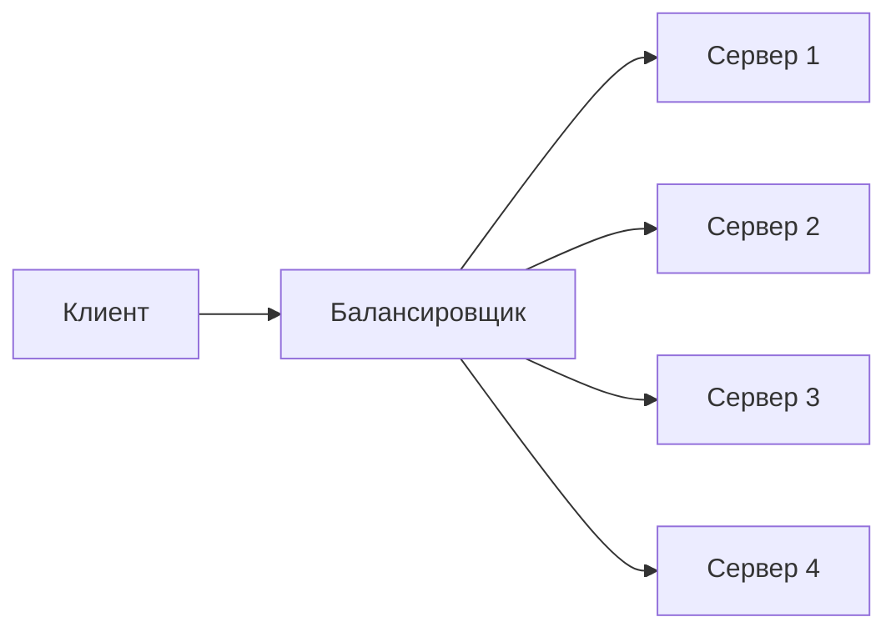
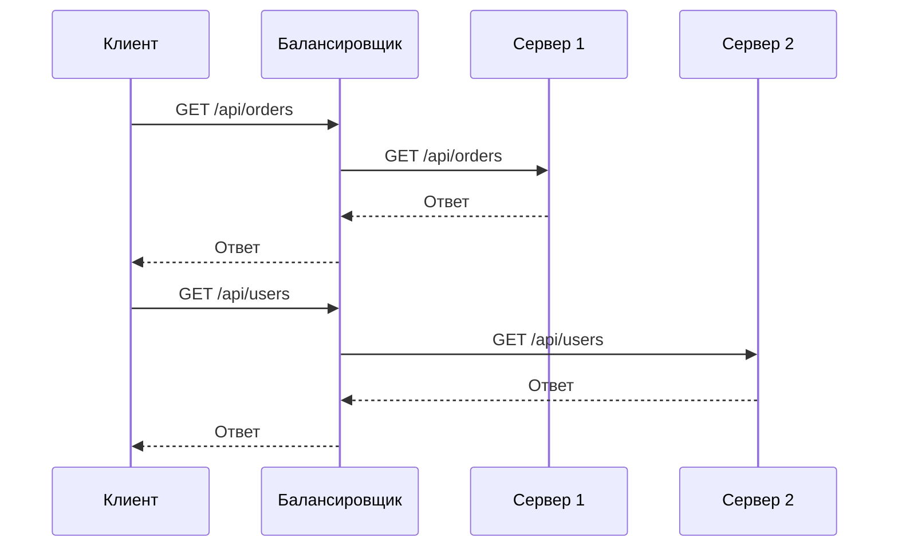
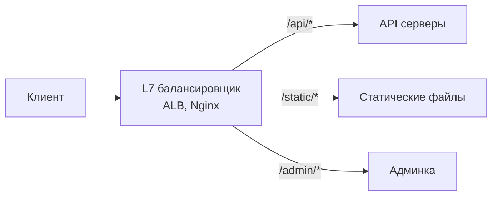
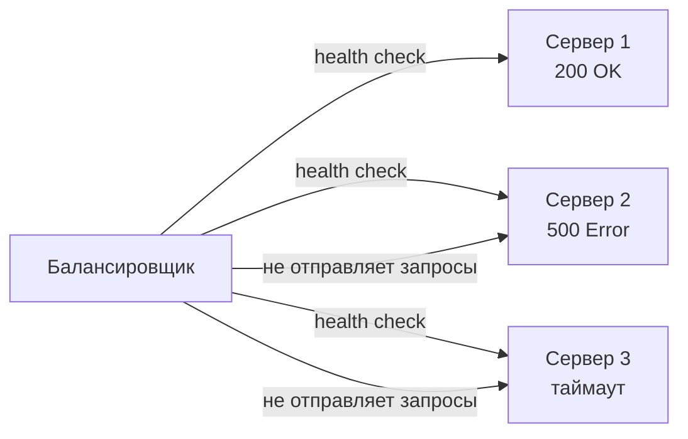
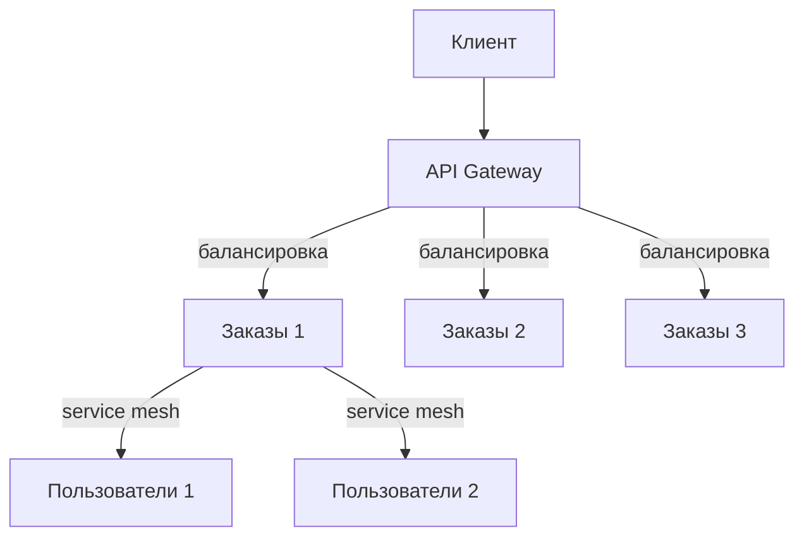
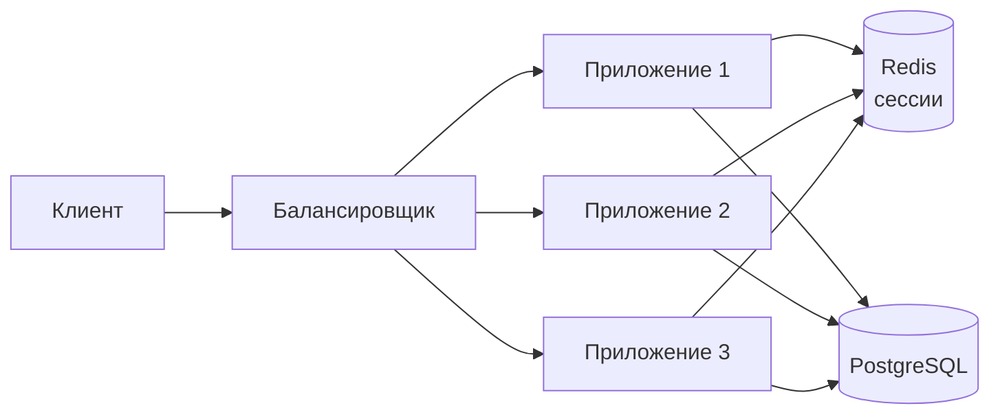

## Введение: Распределяем нагрузку между несколькими серверами

Представьте, что вы открыли несколько касс в супермаркете. Как покупатели решают, к какой кассе идти? В простом случае — сами выбирают. В более организованном — администратор направляет покупателей к свободной кассе.

**Балансировщик нагрузки (Load Balancer)** делает то же самое в мире серверов. Он распределяет входящие запросы между несколькими серверами, чтобы ни один сервер не был перегружен, а пользователи получали быстрый ответ.

Балансировка нагрузки — это фундаментальный компонент горизонтального масштабирования. Без нее добавление новых серверов не имеет смысла — все запросы все равно пойдут на один сервер. Балансировщик решает: какой сервер получит следующий запрос.

## Зачем нужен балансировщик нагрузки

**Распределение нагрузки.** Главная функция. Если у вас 3 сервера, балансировщик распределяет запросы так, чтобы каждый сервер получал примерно одинаковое количество запросов.

**Отказоустойчивость.** Если один сервер упал, балансировщик перестает направлять на него запросы. Пользователи этого не замечают (могут заметить небольшое замедление, если нагрузка перераспределяется на оставшиеся серверы).

**Масштабируемость.** Можно добавлять и убирать серверы за балансировщиком без изменения клиентского кода. Клиент всегда обращается к балансировщику, а не к конкретным серверам.

**SSL termination.** Балансировщик может расшифровывать HTTPS-трафик и передавать внутренним серверам обычный HTTP. Это снижает нагрузку на серверы приложений.

**Сжатие и кэширование.** Балансировщик может сжимать ответы, кэшировать статику.



## Как работает балансировщик нагрузки

Клиент (браузер, мобильное приложение) отправляет запрос на IP-адрес балансировщика. Балансировщик выбирает один из серверов за собой (по определенному алгоритму) и перенаправляет запрос. Затем получает ответ от сервера и возвращает его клиенту. Для клиента балансировщик выглядит как один сервер.



## Алгоритмы балансировки

### Round Robin (Циклический)

Запросы распределяются по очереди: первый на сервер 1, второй на сервер 2, третий на сервер 3, четвертый снова на сервер 1.

```yaml
Запрос 1 → Сервер 1
Запрос 2 → Сервер 2
Запрос 3 → Сервер 3
Запрос 4 → Сервер 1
Запрос 5 → Сервер 2
```

**Плюсы:** Просто, равномерно, если все запросы одинаковые по сложности. **Минусы:** Если запросы разные по времени выполнения, одни серверы могут быть перегружены, другие свободны.

### Least Connections (Наименьшее количество соединений)

Запрос направляется на сервер с наименьшим количеством активных соединений.

```yaml
Сервер 1: 10 соединений
Сервер 2: 2 соединения → следующий запрос на сервер 2
Сервер 3: 5 соединений
```

**Плюсы:** Учитывает разную сложность запросов. Сервер, который обрабатывает тяжелые запросы, получает меньше новых, пока не освободится. **Минусы:** Нужно отслеживать количество соединений (дополнительная работа балансировщика).

### IP Hash (Хэширование по IP)

IP-адрес клиента хэшируется, и результат определяет, какой сервер получит запрос. Один клиент всегда попадает на один и тот же сервер.

**Плюсы:** Решает проблему сессий (sticky sessions). Пользователь не "перескакивает" между серверами, теряя сессию. **Минусы:** При добавлении или удалении сервера хэш-распределение меняется, пользователи могут перескочить на другой сервер.

### Least Response Time (Наименьшее время ответа)

Запрос направляется на сервер с наименьшим средним временем ответа и наименьшим количеством соединений.

**Плюсы:** Учитывает реальную производительность серверов. Сервер, который работает быстрее, получает больше запросов. **Минусы:** Сложнее реализовать, нужен мониторинг времени ответа.

### Random (Случайный)

Случайный выбор сервера.

**Плюсы:** Просто. **Минусы:** Неравномерно при малом количестве запросов.

## Типы балансировщиков

### Аппаратный (Hardware Load Balancer)

Физическое устройство, которое подключается к сети. Примеры: F5 BIG-IP, Citrix ADC.

**Плюсы:** Очень производительный (миллионы запросов в секунду), надежный. **Минусы:** Дорогой (десятки тысяч долларов), сложный в настройке.

### Программный (Software Load Balancer)

Программа, работающая на обычном сервере. Примеры: Nginx, HAProxy, Apache httpd, Envoy.

**Плюсы:** Дешево (open source), гибко, можно запустить в облаке. **Минусы:** Менее производительный, чем аппаратный (но для большинства задач достаточно).

### Облачный (Cloud Load Balancer)

Managed-сервис облачного провайдера. Примеры: AWS ELB/ALB, Google Cloud Load Balancing, Azure Load Balancer.

**Плюсы:** Не нужно администрировать, автоматически масштабируется, интегрируется с другими сервисами облака. **Минусы:** Привязка к вендору (vendor lock-in), дороже программного на больших объемах.


## Уровни балансировки

### L4 (Транспортный уровень, TCP/UDP)

Балансировщик работает на уровне TCP/UDP. Он не смотрит на содержимое запроса (HTTP, HTTPS), а просто перенаправляет TCP-соединения на серверы.

**Примеры:** AWS Network Load Balancer (NLB), HAProxy в режиме TCP.

**Плюсы:** Быстрый, низкая задержка, не зависит от протокола (можно балансировать любые TCP/UDP приложения). **Минусы:** Не может использовать информацию из HTTP (заголовки, cookies, URL).

### L7 (Прикладной уровень, HTTP/HTTPS)

Балансировщик работает на уровне HTTP. Он разбирает HTTP-запросы и может принимать решения на основе URL, заголовков, cookies, метода (GET/POST).

**Примеры:** AWS Application Load Balancer (ALB), Nginx, HAProxy в режиме HTTP.

**Плюсы:** Гибкая маршрутизация (например, /api/* → один бэкенд, /static/* → другой). Может использовать sticky sessions на основе cookies. Может проверять содержимое ответов. **Минусы:** Медленнее L4 (разбирает HTTP), потребляет больше ресурсов.



## Балансировка с сохранением сессий (Sticky Sessions / Session Affinity)

**Проблема:** Пользователь залогинился на сервере 1. Следующий запрос от того же пользователя может попасть на сервер 2, где у него нет сессии. Пользователь будет разлогинен.

**Решение:** Sticky sessions. Балансировщик запоминает, какой сервер обслуживал пользователя (по IP, по cookie), и направляет все последующие запросы этого пользователя на тот же сервер.

```yaml
Пользователь 1 (IP 1.2.3.4) → Сервер 1 (запомнили)
Пользователь 2 (IP 5.6.7.8) → Сервер 2
Пользователь 1 → Сервер 1 (всегда)
```

**Недостатки:** Нарушает равномерное распределение нагрузки (один пользователь может создавать много запросов). Если сервер упал, пользователь теряет сессию (хотя в современных системах сессии хранят в Redis, и sticky sessions не нужны).

**Современный подход:** Не использовать sticky sessions. Хранить сессии в общем хранилище (Redis). Любой сервер может обслужить любого пользователя.

## Health Checks (Проверки здоровья)

Балансировщик должен знать, какие серверы живы, а какие нет. Для этого он периодически отправляет проверки (health checks).

**Типы проверок:**

- **TCP check.** Просто пытается открыть TCP-соединение на порт сервера. Если соединение установлено — сервер жив.
- **HTTP check.** Отправляет HTTP-запрос (например, GET /health) и проверяет ответ (200 OK). Более точный, проверяет, что приложение действительно работает.
- **Custom check.** Выполняет произвольную проверку (например, проверяет, что база данных доступна).

```yaml
Проверка каждые 5 секунд:
  GET /health
  Ожидаемый статус: 200
  Таймаут: 2 секунды

Если 3 неудачных проверки подряд → сервер считается мертвым
Если 2 успешных проверки подряд → сервер снова живой
```



## Балансировка в микросервисной архитектуре

В микросервисах балансировка нагрузки используется на нескольких уровнях.

**API Gateway.** Клиенты обращаются к API Gateway, который маршрутизирует запросы к нужным микросервисам и балансирует между их экземплярами.

**Service Mesh.** В service mesh (например, Istio, Linkerd) балансировка встроена в sidecar-прокси. Каждый микросервис имеет свой sidecar, который балансирует вызовы к другим микросервисам.



## Реализации балансировщиков

### Nginx

Самый популярный программный балансировщик. Может работать и как веб-сервер, и как reverse proxy, и как балансировщик.

```nginx
upstream backend {
    least_conn;  # алгоритм: наименьшее количество соединений
    server backend1.example.com weight=3;  # вес 3 (получает больше запросов)
    server backend2.example.com;
    server backend3.example.com backup;  # резервный
}

server {
    listen 80;
    location / {
        proxy_pass http://backend;
        health_check interval=5s;
    }
}
```

### HAProxy

Специализированный балансировщик. Очень производительный, много алгоритмов, тонкая настройка.

```haproxy
frontend web
    bind *:80
    default_backend servers

backend servers
    balance leastconn
    option httpchk GET /health
    server s1 10.0.0.1:80 check
    server s2 10.0.0.2:80 check
    server s3 10.0.0.3:80 check
```

### AWS ALB (Application Load Balancer)

Облачный L7 балансировщик. Поддерживает маршрутизацию по пути, hostname, заголовкам. Интегрируется с auto-scaling.

```yaml
# AWS ALB правила:
- IF path = /api/* → forward к target group api-servers
- IF path = /static/* → forward к target group static-servers
- IF host = admin.example.com → forward к target group admin-servers
```

### Kubernetes Ingress

В Kubernetes балансировка на уровне Ingress controller (например, NGINX Ingress, AWS Load Balancer Controller).

```yaml
apiVersion: networking.k8s.io/v1
kind: Ingress
metadata:
  name: my-ingress
spec:
  rules:
  - host: example.com
    http:
      paths:
      - path: /api
        pathType: Prefix
        backend:
          service:
            name: api-service
            port:
              number: 80
```

## Балансировка и SSL/TLS

Балансировщик может работать в двух режимах:

**SSL termination.** Балансировщик расшифровывает HTTPS, передает внутренним серверам HTTP. Внутренний трафик не шифрован (быстрее). Балансировщик должен иметь SSL-сертификат.

**SSL passthrough.** Балансировщик не расшифровывает трафик, а передает его как есть. Внутренние серверы сами работают с HTTPS. Балансировщик не может смотреть на содержимое (не может делать L7 маршрутизацию). Медленнее (шифрование на каждом сервере).


## Балансировка и горизонтальное масштабирование

Балансировка нагрузки — это ключевой компонент горизонтального масштабирования. Без нее вы не можете добавить второй сервер.

**Типичная архитектура:**

1. Балансировщик (Nginx, HAProxy, AWS ALB)
2. Несколько серверов приложений (stateless)
3. Общее хранилище сессий (Redis)
4. База данных (PostgreSQL с репликами)



## Распространенные ошибки

**Ошибка 1: Балансировщик как единая точка отказа.** Если балансировщик один и он упал, вся система недоступна. Нужно использовать два балансировщика с floating IP (VRRP) или облачный managed-балансировщик (у них своя отказоустойчивость).

**Ошибка 2: Игнорирование health checks.** Без health checks балансировщик будет отправлять запросы на упавшие серверы, вызывая ошибки у пользователей.

**Ошибка 3: Sticky sessions как костыль.** Если вам нужны sticky sessions, вероятно, вы неправильно храните сессии. Вынесите сессии в Redis.

**Ошибка 4: Неправильный выбор алгоритма.** Round Robin при разной сложности запросов может перегружать одни серверы. Используйте Least Connections.

**Ошибка 5: Балансировка на неправильном уровне.** L7 балансировка дает больше возможностей, но медленнее L4. Для простых TCP-протоколов (базы данных, очереди) используйте L4.

## Резюме

Балансировка нагрузки — это распределение входящих запросов между несколькими серверами.

**Зачем нужен балансировщик:**

- Распределение нагрузки (чтобы ни один сервер не был перегружен)
- Отказоустойчивость (при падении сервера запросы идут на живые)
- Масштабируемость (можно добавлять серверы без изменения клиентов)
- SSL termination, сжатие, кэширование

**Алгоритмы балансировки:**

- Round Robin — по очереди
- Least Connections — на сервер с наименьшим количеством соединений
- IP Hash — один клиент всегда на один сервер (sticky)
- Least Response Time — на самый быстрый сервер

**Типы балансировщиков:**

- Аппаратный (F5) — дорого, производительно
- Программный (Nginx, HAProxy) — бесплатно, гибко
- Облачный (AWS ALB) — managed, не нужно администрировать

**Уровни балансировки:**

- L4 (TCP/UDP) — быстрый, но не видит HTTP
- L7 (HTTP/HTTPS) — медленнее, но гибкая маршрутизация

**Health checks:** Балансировщик периодически проверяет, жив ли сервер. Если нет — не отправляет запросы.

**Sticky sessions:** Запоминает, какой сервер обслуживал пользователя, чтобы последующие запросы шли туда же. Современный подход — выносить сессии в Redis и не использовать sticky sessions.

**Где используется:** Везде, где есть горизонтальное масштабирование. API Gateway, микросервисы, серверы приложений, базы данных (реплики).

Балансировщик нагрузки — это сердце горизонтального масштабирования. Без него добавление второго сервера не имеет смысла. Выберите правильный алгоритм, настройте health checks, используйте L7 для HTTP-трафика, не забывайте про отказоустойчивость самого балансировщика. И, что важно, не используйте sticky sessions как костыль — лучше вынесите состояние в общее хранилище.