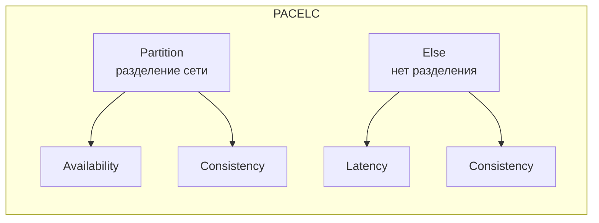
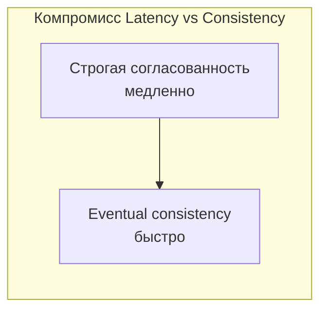
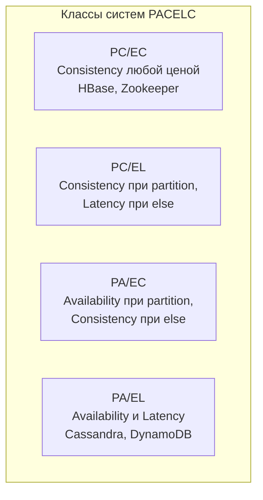
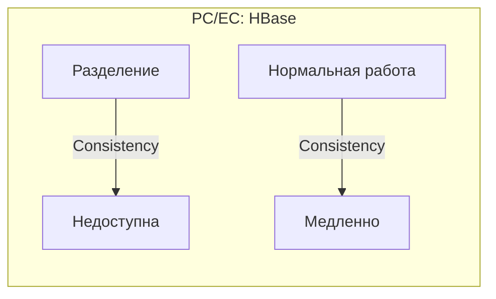
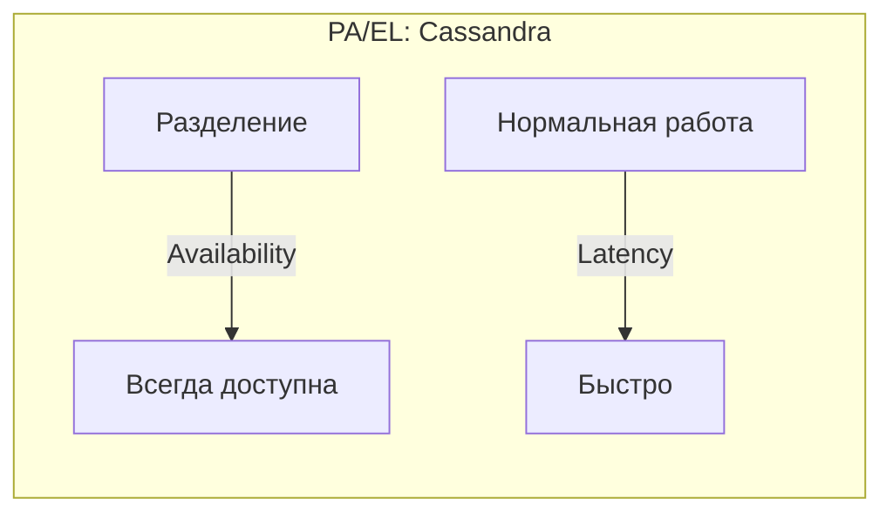
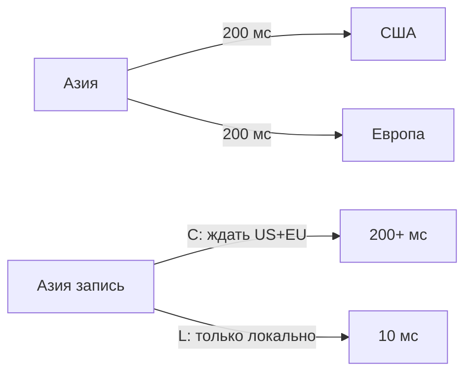
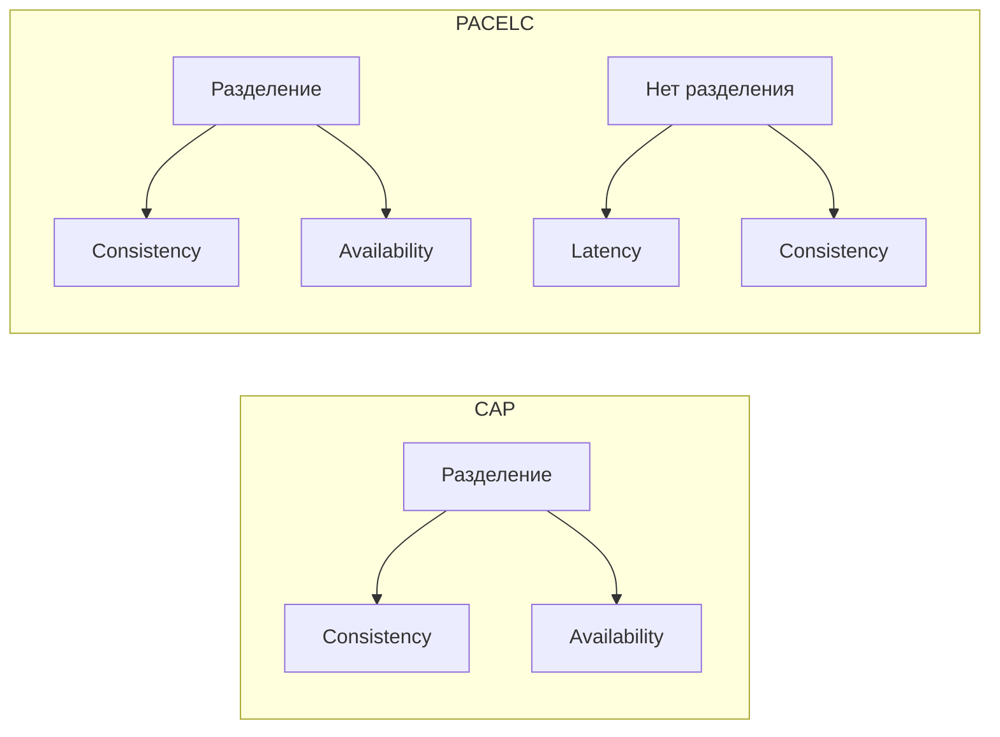

## Введение: CAP недостаточно

CAP-теорема говорит нам о компромиссе между Consistency и Availability при разделении сети (network partition). Но что происходит, когда сеть работает нормально? Когда все узлы могут общаться друг с другом? В таких условиях у нас есть другой компромисс: между Consistency и Latency (задержкой).

**PACELC теорема** (расшифровывается как PACELC) была предложена Дэниелом Абади (Daniel Abadi) в 2012 году. Она расширяет CAP, добавляя важный аспект: поведение системы при отсутствии разделения сети.

**Формулировка PACELC:**

- **P** (Partition) — при разделении сети (как в CAP)
- **A** (Availability) vs **C** (Consistency) — выбираем между доступностью и согласованностью

- **E** (Else) — при отсутствии разделения (сеть работает нормально)
- **L** (Latency) vs **C** (Consistency) — выбираем между задержкой и согласованностью

## Проблема, которую решает PACELC

CAP-теорема игнорирует компромисс между согласованностью и задержкой в нормальных условиях. Но в реальных системах этот компромисс очень важен.

**Пример:** Распределенная база данных с репликами в США, Европе и Азии. Сеть работает нормально, но задержка между континентами — 100-200 мс.

Если вы хотите строгую согласованность (чтобы все реплики всегда имели одинаковые данные), каждая запись должна быть подтверждена всеми репликами. Это займет 200+ мс (latency).

Если вы готовы пожертвовать строгой согласованностью (eventual consistency), запись может быть подтверждена только одной репликой. Задержка — 10 мс.

**PACELC говорит:** даже когда сеть работает нормально, вы должны выбирать между низкой задержкой (L) и строгой согласованностью (C).

## Четыре класса систем по PACELC

### PC/EC (Partition → Consistency, Else → Consistency)

При разделении сети выбирает Consistency (жертвует Availability). При отсутствии разделения выбирает Consistency (жертвует Latency).

**Примеры:** HBase, Zookeeper, etcd, CockroachDB (в режиме строгой согласованности).

**Характеристики:** Высокая согласованность любой ценой. Может быть недоступна при разделении. Может быть медленной при нормальной работе (если реплики далеко).

### PC/EL (Partition → Consistency, Else → Latency)

При разделении сети выбирает Consistency (жертвует Availability). При отсутствии разделения выбирает Latency (жертвует строгой согласованностью).

**Примеры:** Некоторые конфигурации MongoDB (write concern majority, но read preference primary).

**Характеристики:** При разделении может быть недоступна. При нормальной работе быстрая, но с eventual consistency.

### PA/EC (Partition → Availability, Else → Consistency)

При разделении сети выбирает Availability (жертвует строгой согласованностью). При отсутствии разделения выбирает Consistency (жертвует Latency).

**Примеры:** Некоторые конфигурации DynamoDB (при разделении — AP, при нормальной работе можно настроить строгую согласованность).

**Характеристики:** Всегда доступна, но при разделении данные могут расходиться. При нормальной работе — строгая согласованность, но медленнее.

### PA/EL (Partition → Availability, Else → Latency)

При разделении сети выбирает Availability (жертвует строгой согласованностью). При отсутствии разделения выбирает Latency (жертвует строгой согласованностью).

**Примеры:** Cassandra, DynamoDB (по умолчанию), Redis (кластер), DNS.

**Характеристики:** Всегда доступна. Всегда быстрая. Но всегда eventual consistency (нет строгой согласованности).

## PACELC в деталях

### PC/EC: Consistency любой ценой (HBase, Zookeeper, etcd)

**При разделении (P → C):** Система жертвует доступностью. Если узлы не могут общаться, они отказываются отвечать, чтобы не нарушить согласованность.

**При нормальной работе (E → C):** Система жертвует задержкой. Запись должна быть подтверждена большинством узлов (или всеми), что увеличивает latency, особенно при географически распределенных узлах.

**Когда использовать:** Финансовые системы, системы бронирования, где согласованность критична, а недоступность или задержка приемлемы.

### PA/EL: Availability и Low Latency (Cassandra, DynamoDB)

**При разделении (P → A):** Система всегда доступна. При разделении сети каждый узел продолжает отвечать, даже если данные могут расходиться.

**При нормальной работе (E → L):** Система выбирает низкую задержку. Запись подтверждается одним узлом (или небольшим большинством), не дожидаясь всех реплик.

**Когда использовать:** Социальные сети, аналитика, IoT, где доступность и скорость важнее строгой согласованности.

### PC/EL и PA/EC: Гибридные подходы

**PC/EL:** Например, MongoDB с настройкой "write concern majority" (при разделении может быть недоступна), но "read preference primary" (при нормальной работе быстро, но возможна eventual consistency). Встречается реже.

**PA/EC:** Например, DynamoDB с "strongly consistent reads" (при нормальной работе можно запросить строгую согласованность, но за большую задержку). При разделении все равно выбирает Availability.

## Примеры баз данных в терминах PACELC

| База данных | PACELC классификация | Комментарий |
| :--- | :--- | :--- |
| **HBase** | PC/EC | Строгая согласованность всегда. При разделении недоступна. При нормальной работе может быть медленной. |
| **Zookeeper, etcd** | PC/EC | Консенсус (Raft). Строгая согласованность. При разделении не пишут. |
| **CockroachDB** | PC/EC (по умолчанию) | Распределенная SQL. Строгая согласованность (изоляция Serializable). |
| **MongoDB (по умолчанию)** | PC/EL (часто) | Читает с мастера (Consistency при разделении?), но запись асинхронная → низкая задержка. |
| **Cassandra** | PA/EL | Всегда доступна. Всегда eventual consistency (можно настроить, но по умолчанию). |
| **DynamoDB (по умолчанию)** | PA/EL | Eventually consistent reads. Низкая задержка. Всегда доступна. |
| **DynamoDB (strongly consistent)** | PA/EC (для чтения) | Можно запросить strongly consistent read, но за большую задержку. |
| **Redis (кластер)** | PA/EL | Асинхронная репликация, возможна потеря данных при разделении. |

## PACELC и географически распределенные системы

PACELC особенно важен для глобальных систем с репликами в разных регионах.

**Пример:** База данных с репликами в США, Европе, Азии.

- **Строгая согласованность (C):** Запись из Азии должна подтвердиться репликами в США и Европе. Задержка: 200+ мс.
- **Eventual consistency (L):** Запись подтверждается только локальной репликой в Азии. Задержка: 10 мс.

**Выбор:** Если ваши пользователи в Азии и им нужна низкая задержка, вы, вероятно, выберете L (eventual consistency) и примете, что данные могут быть несогласованы несколько секунд. Если вы банк, вы выберете C (строгую согласованность), даже если это значит 200 мс задержки.

## CAP vs PACELC

| Аспект | CAP | PACELC |
| :--- | :--- | :--- |
| **Рассматривает** | Только разделение сети | Разделение сети + нормальную работу |
| **Компромисс при разделении** | C vs A | C vs A |
| **Компромисс при нормальной работе** | Нет | L (Latency) vs C (Consistency) |
| **Когда использовать** | Понимание базового компромисса | Реальный выбор базы данных |

## PACELC на практике: Выбор базы данных

**Вопросы, которые нужно задать:**

- Допустима ли недоступность при разделении сети? (P → A или P → C)
- Допустима ли высокая задержка при нормальной работе ради строгой согласованности? (E → L или E → C)

**Таблица выбора:**

| Если вам нужно... | Выбирайте... |
| :--- | :--- |
| Строгая согласованность любой ценой (даже если система недоступна при разделении, даже если медленно) | PC/EC (HBase, Zookeeper) |
| Строгая согласованность при разделении (может быть недоступна), но при нормальной работе важнее скорость | PC/EL (некоторые настройки MongoDB) |
| Доступность при разделении (всегда отвечает), но при нормальной работе важнее строгая согласованность (даже медленно) | PA/EC (DynamoDB с strongly consistent reads) |
| Доступность при разделении и низкая задержка при нормальной работе (eventual consistency) | PA/EL (Cassandra, DynamoDB по умолчанию) |

## Распространенные заблуждения

**"PACELC заменил CAP".** Нет. PACELC расширяет CAP, добавляя компромисс Latency vs Consistency при нормальной работе. CAP остается фундаментальной теоремой.

**"Все системы PA/EL не гарантируют никакой согласованности".** Нет. PA/EL системы гарантируют eventual consistency (согласованность в конечном счете). Данные станут согласованными, но не мгновенно.

**"PC/EC системы всегда медленные".** Не всегда. Если все узлы в одном дата-центре, задержка низкая. Проблемы начинаются при географическом распределении.

**"Можно выбрать PA/EL и потом добавить строгую согласованность".** Можно (как в DynamoDB strongly consistent reads), но за большую задержку. Компромисс остается.

## Резюме

PACELC теорема расширяет CAP, добавляя важный компромисс: при отсутствии разделения сети (Else) система выбирает между Latency (задержкой) и Consistency (согласованностью).

**Формулировка PACELC:**

- **P** (Partition) — при разделении сети: выбор между Availability и Consistency
- **E** (Else) — при отсутствии разделения: выбор между Latency и Consistency

**Четыре класса систем:**

| Класс | При разделении (P) | При нормальной работе (E) | Примеры |
| :--- | :--- | :--- | :--- |
| **PC/EC** | Consistency | Consistency | HBase, Zookeeper, etcd |
| **PC/EL** | Consistency | Latency | Некоторые настройки MongoDB |
| **PA/EC** | Availability | Consistency | DynamoDB (strong reads) |
| **PA/EL** | Availability | Latency | Cassandra, DynamoDB (default) |

**Что выбрать?**

- **PC/EC** — финансы, бронирование (согласованность важнее всего)
- **PA/EL** — соцсети, аналитика, IoT (доступность и скорость важнее)
- **PC/EL или PA/EC** — гибридные сценарии (например, строгая согласованность для чтения, но быстрая запись)

**Ключевой вывод:** Даже когда сеть работает идеально, вы не можете иметь и строгую согласованность, и низкую задержку. Нужно выбирать. PACELC помогает сделать этот выбор осознанно, в зависимости от требований вашего бизнеса.