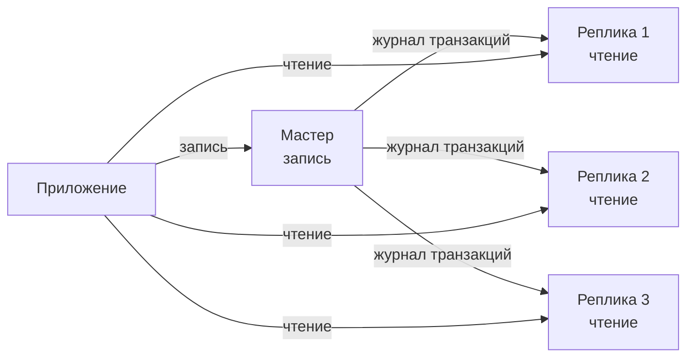
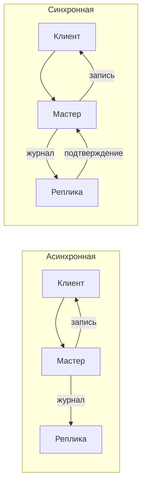
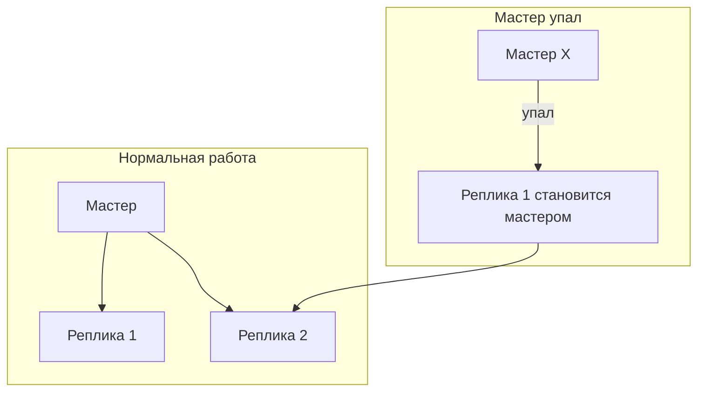
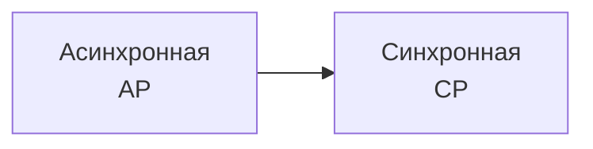
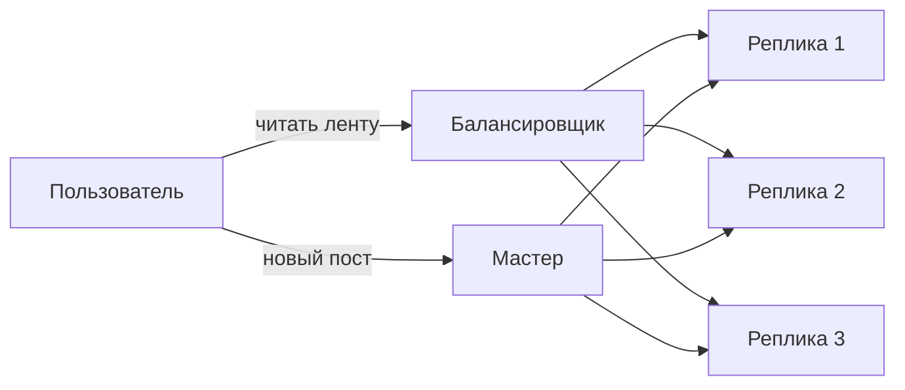

## Введение: Копируем данные на несколько серверов

Представьте популярный новостной сайт. Миллионы читателей заходят, чтобы прочитать статьи. Но писать новости могут только редакторы — их несколько человек. Если бы все читатели обращались к одному серверу базе данных, он бы не выдержал.

Решение: сделать несколько копий базы данных. Одна главная (мастер), куда редакторы пишут новости. И несколько копий (реплик), которые синхронизируются с мастером. Все читатели читают новости с реплик. Мастер не перегружен, реплик может быть много.

**Репликация (Replication)** — это процесс копирования данных с одного сервера базы данных (мастера) на один или несколько других серверов (реплик). Реплики содержат ту же информацию, что и мастер (или её часть), с небольшой задержкой.

Репликация используется для масштабирования чтения (read scaling), повышения отказоустойчивости и для создания резервных копий.

## Как работает репликация

**Мастер (Master, Primary, Leader).** Главный сервер. Принимает запросы на запись (INSERT, UPDATE, DELETE). Изменения записываются в журнал транзакций (WAL в PostgreSQL, binlog в MySQL).

**Реплика (Replica, Slave, Follower).** Второстепенный сервер. Подключается к мастеру, читает журнал транзакций и применяет те же изменения к своей копии данных. Реплика может принимать запросы на чтение (SELECT).



**Асинхронная репликация.** Реплика применяет изменения после того, как мастер зафиксировал транзакцию. Между записью на мастере и появлением данных на реплике есть задержка (replica lag). Мастер не ждет подтверждения от реплик.

**Синхронная репликация.** Мастер ждет, пока реплика подтвердит, что получила и применила изменение, прежде чем подтвердить транзакцию клиенту. Задержка выше (клиент ждет), но данные не теряются.



## Виды репликации

### Master-Slave (Один мастер, много реплик)

Классическая схема. Один мастер принимает запись, реплики принимают чтение.

```yaml
Архитектура:
  - Мастер: запись, чтение (опционально)
  - Реплика 1: чтение
  - Реплика 2: чтение
  - Реплика N: чтение

Преимущества:
  - Просто
  - Масштабирует чтение
  - Отказоустойчивость (если мастер упал, можно продвинуть реплику)

Недостатки:
  - Запись ограничена одним сервером
  - Задержка репликации (eventual consistency)
```

### Master-Master (Несколько мастеров)

Несколько серверов принимают запись. Изменения синхронизируются между ними.

```yaml
Архитектура:
  - Мастер 1: запись + чтение
  - Мастер 2: запись + чтение
  - Изменения реплицируются в обе стороны

Преимущества:
  - Масштабирует запись (несколько мастеров)
  - Высокая доступность

Недостатки:
  - Сложность (конфликты при одновременной записи)
  - Не все БД поддерживают (или требуют осторожности)
```

### Multi-Source Replication

Одна реплика может получать данные из нескольких мастеров.

```yaml
Архитектура:
  - Мастер А
  - Мастер Б
  - Реплика (получает данные и от А, и от Б)
```

## Задержка репликации (Replication Lag)

**Replication lag** — это задержка между тем, когда изменение произошло на мастере, и когда оно появилось на реплике. Обычно миллисекунды или секунды, но при высокой нагрузке может достигать минут.

**Причины задержки:**

- Реплика медленнее мастера (меньше ресурсов)
- Сетевые задержки
- Длинные транзакции на мастере
- Высокая нагрузка на запись

**Последствия:**

- Клиент может прочитать устаревшие данные (eventual consistency)
- Если мастер упал, реплика может не содержать последних изменений

**Мониторинг:** SHOW SLAVE STATUS (MySQL), pg_stat_replication (PostgreSQL).

## Репликация в разных базах данных

### PostgreSQL

**Физическая репликация (streaming replication).** Копирует на уровне байтов (WAL). Реплика — точная копия мастера.

**Логическая репликация (logical replication).** Копирует на уровне таблиц. Можно реплицировать только выбранные таблицы, можно между разными версиями PostgreSQL.

```sql
-- Настройка реплики PostgreSQL
primary_conninfo = 'host=master port=5432 user=replica password=...'
```

### MySQL

**Асинхронная репликация (стандартная).** Реплика читает binlog мастера и применяет.

**Полусинхронная репликация.** Мастер ждет, пока хотя бы одна реплика подтвердит получение binlog, но не применения.

**Групповая репликация (Group Replication, MySQL 8).** Схема с несколькими мастерами на основе Paxos.

```sql
-- Настройка реплики MySQL
CHANGE MASTER TO MASTER_HOST='master', MASTER_LOG_FILE='...';
START SLAVE;
```

### MongoDB

**Replica Set.** Набор из минимум 3 узлов: один primary (принимает запись), остальные secondary (реплики). Автоматический failover (выбор нового primary при падении старого).

```yaml
replication:
  replSetName: "rs0"
```

## Репликация для отказоустойчивости

**Автоматический failover.** Если мастер упал, система автоматически выбирает новым мастером одну из реплик. Клиенты перенаправляются на новый мастер.



**Ручной failover.** Администратор вручную продвигает реплику в мастер.

**Полусинхронная репликация.** Гарантирует, что изменения не потеряются при падении мастера (хотя бы одна реплика получила данные).

## Репликация и масштабирование чтения

Самое распространенное применение репликации — масштабирование чтения.

```yaml
Архитектура:
  - 1 мастер: 1000 запросов/сек на запись
  - 5 реплик: 5000 запросов/сек на чтение (по 1000 на каждую)
```

Приложение должно направлять запросы на запись на мастер, запросы на чтение — на реплики.

```python
# Псевдокод: маршрутизация запросов
def handle_request(request):
    if request.method in ['POST', 'PUT', 'DELETE']:
        return master_db.execute(request)  # запись → мастер
    else:
        return replica_db.execute(request)   # чтение → реплика
```

**Проблема:** запись, а затем сразу чтение (например, создал заказ, сразу показал его). Если чтение пойдет на реплику, данных может еще не быть (replication lag). Решение: "read-after-write" consistency — читать с мастера для критичных запросов.

## Репликация и резервные копии

Реплика может использоваться для создания резервных копий без остановки мастера.

**Преимущества:** Мастер не нагружается (бэкап на реплике). Можно делать бэкап в любое время.

**Недостатки:** Реплика может отставать от мастера. Если делать бэкап на реплике, а потом восстановить его, данные могут быть не самыми свежими (но для большинства сценариев это OK).

## Репликация в облаке

**Amazon RDS (Read Replicas).** Управляемый сервис. Можно добавить до 5 реплик чтения для MySQL/PostgreSQL. Репликация асинхронная.

**Amazon Aurora.** Реплики разделяют хранилище (storage level replication). Реплики быстрее синхронизируются, failover быстрее.

**Google Cloud SQL.** Реплики чтения, асинхронная репликация.

**Azure SQL Database.** Active Geo-Replication (реплики в разных регионах).

## Недостатки и сложности репликации

**Replication lag (задержка).** Главная проблема. При высокой нагрузке реплики могут отставать. Клиенты видят устаревшие данные.

**Запись ограничена мастером.** Даже если у вас 100 реплик, запись идет в один мастер. При росте записи вертикальное масштабирование мастера имеет предел.

**Сложность конфигурации.** Настройка репликации (особенно с SSL, с мониторингом) требует знаний.

**Failover — не автоматический (в большинстве БД).** MySQL и PostgreSQL не делают автоматический failover "из коробки". Нужны дополнительные инструменты (MHA, Patroni, Orchestrator).

**Не все БД поддерживают синхронную репликацию.** Асинхронная репликация может терять данные при падении мастера.

**Проблема "split brain" (разделение мозга).** При разрыве сети между мастерами могут возникнуть два мастера, которые пишут независимо. Данные разойдутся.

## Репликация и CAP-теорема

Репликация — это пример компромисса между согласованностью (Consistency) и доступностью (Availability).

- **Асинхронная репликация:** Высокая доступность (мастер не ждет реплики), но eventual consistency (реплики могут отставать). → AP.

- **Синхронная репликация:** Строгая согласованность (данные на репликах всегда свежие), но доступность ниже (если реплика недоступна, мастер может не принимать запись). → CP.



## Пример: Социальная сеть с репликацией

**Схема:**

- Мастер PostgreSQL: запись (новые посты, лайки, комментарии)
- 3 реплики PostgreSQL: чтение (лента новостей, профили пользователей)
- Redis: кэш популярных постов (уменьшает нагрузку на реплики)



**Проблема:** Пользователь написал пост и сразу обновил ленту. Пост может не появиться (replication lag). **Решение:** После записи перенаправлять пользователя на чтение с мастера (для его собственных постов). Остальные пользователи читают с реплик.

## Распространенные ошибки

**Ошибка 1: Ожидание строгой консистентности от реплик.** Реплики могут отставать. Если вам нужно строгое read-after-write, читайте с мастера.

**Ошибка 2: Реплики с теми же ресурсами, что и мастер.** Если у мастера 16 CPU, а у реплики 2 CPU, реплика будет отставать. Реплики должны быть достаточно мощными, чтобы успевать применять изменения.

**Ошибка 3: Игнорирование replication lag.** Не мониторите lag, а потом удивляетесь, почему данные несвежие.

**Ошибка 4: Использование реплик для отчетов, которые идут долго.** Тяжелые аналитические запросы могут нагрузить реплику, увеличить lag. Лучше выделить отдельную реплику только для отчетов.

**Ошибка 5: Нет плана на failover.** Мастер упал — и вы не знаете, как продвинуть реплику. Автоматизируйте или имейте четкий runbook.

## Резюме

Репликация — это копирование данных с одного сервера базы данных (мастера) на другие (реплики).

**Как работает:**

- Мастер принимает запись, пишет в журнал транзакций
- Реплики читают журнал и применяют изменения
- Асинхронная (быстро, но eventual consistency) или синхронная (строгая консистентность, но медленнее)

**Преимущества:**

- Масштабирование чтения (читаем с реплик)
- Отказоустойчивость (если мастер упал, реплику можно сделать мастером)
- Резервные копии (без остановки мастера)

**Недостатки и сложности:**

- Replication lag (задержка)
- Запись ограничена одним мастером
- Сложность конфигурации и failover
- Не все БД поддерживают синхронную репликацию
- Split brain (разделение мозга)

**Виды репликации:**

- Master-Slave (один мастер, много реплик) — самый распространенный
- Master-Master (несколько мастеров) — сложно
- Multi-Source (реплика из нескольких мастеров)

**Когда использовать:**

- Чтений значительно больше, чем записей (типично для веб-приложений)
- Нужна отказоустойчивость
- Нужны резервные копии без остановки

**Когда не использовать:**

- Запись растет так же, как чтение (нужно шардирование)
- Нужна строгая консистентность (read-after-write всегда)
- Маленький проект (один сервер справляется)

Репликация — это первый шаг к масштабированию базы данных. Она проще, чем шардирование, и решает проблему "много чтения". Но у нее есть предел: запись все еще идет в один мастер. Когда запись становится узким местом, пора переходить к шардированию. Но для большинства приложений репликация + кэширование достаточно.