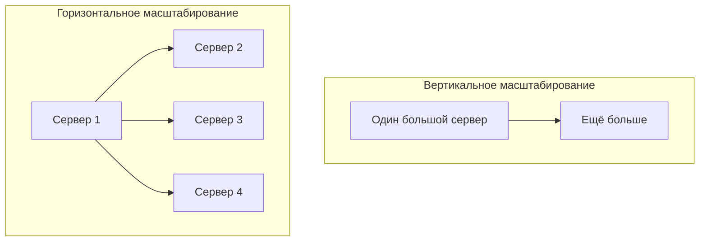
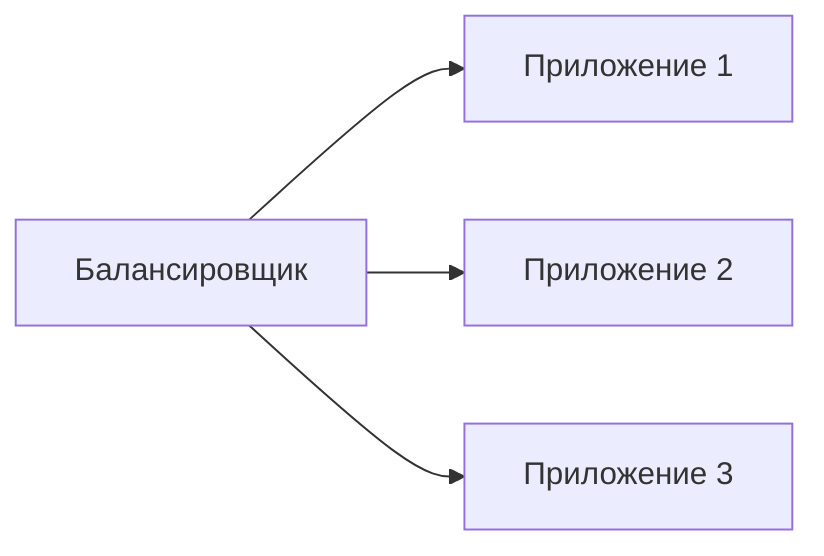
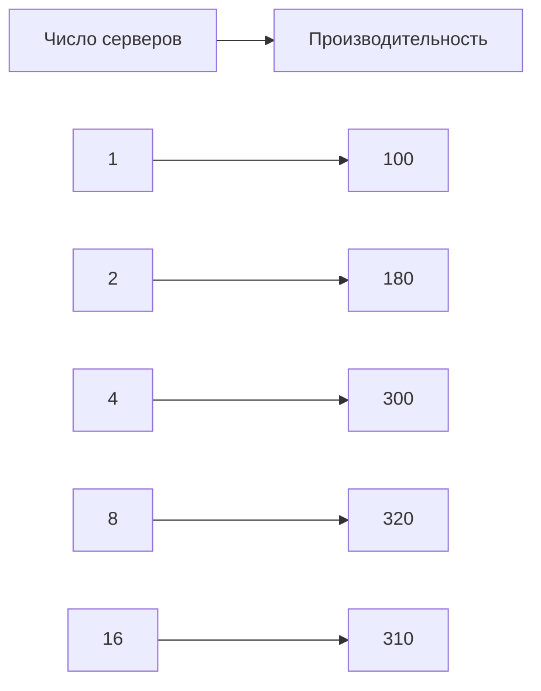
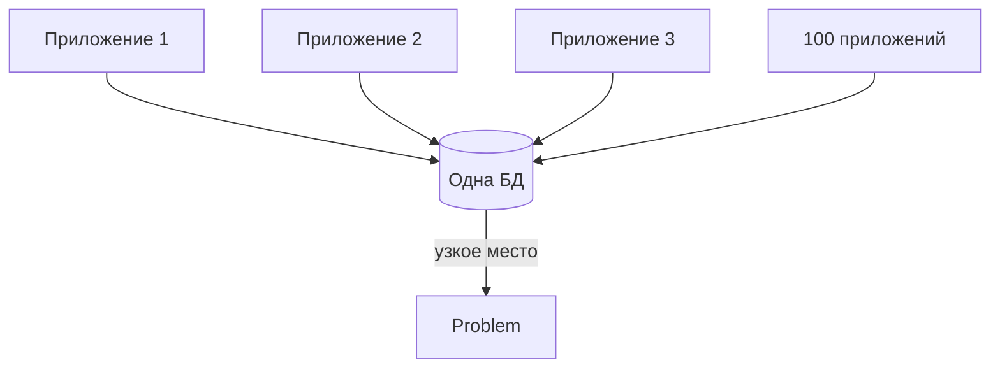
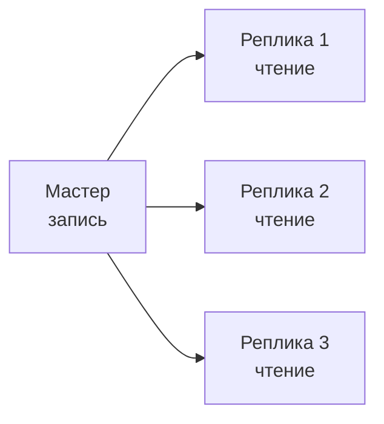
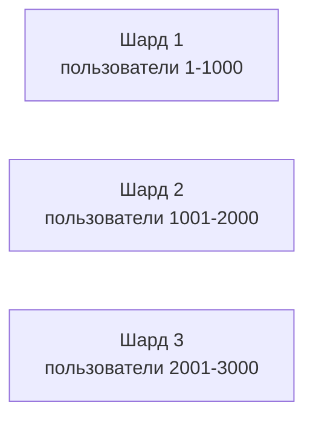
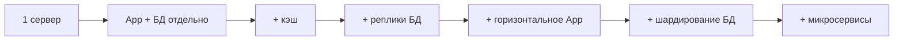

## Введение: Когда один сервер перестаёт справляться

Представьте, что у вас есть небольшой магазин. За день заходит 50 человек — вы справляетесь. Через месяц — 500 человек. Вы нанимаете ещё одного продавца. Через год — 5000 человек в день. Ваш маленький магазин не вмещает всех. Что делать? Можно переехать в огромный торговый центр (вертикальное масштабирование). А можно открыть несколько магазинов в разных районах города (горизонтальное масштабирование).

С базами данных и серверами та же история. Сначала вы ставите всё на один сервер. Данных немного, запросов мало. Потом бизнес растёт. Данных становится всё больше. Запросов — всё больше. Один сервер перестаёт справляться: медленные ответы, долгие бэкапы, высокий CPU.

**Масштабирование** — это способность системы увеличивать свою производительность и ёмкость при росте нагрузки. Хорошо масштабируемая система при увеличении ресурсов (добавлении серверов, увеличении мощности) показывает пропорциональный рост производительности.

Плохо масштабируемая система при добавлении ресурсов почти не ускоряется — упирается в узкие места: базу данных, сеть, архитектуру.

## Два типа масштабирования

| Тип | Что делаем | Аналогия |
| :--- | :--- | :--- |
| **Вертикальное** | Увеличиваем мощность одного сервера | Переезжаем в больший офис |
| **Горизонтальное** | Добавляем новые серверы | Открываем филиалы |

## Вертикальное масштабирование (Scaling Up)

### Что это

Вы берёте существующий сервер и делаете его мощнее: больше CPU, больше RAM, быстрее диски. Или переезжаете на более крупный сервер в облаке.

### Как это выглядит

```yaml
Было:
  - 4 CPU, 16 GB RAM, SSD 500 GB

Стало:
  - 16 CPU, 64 GB RAM, SSD 2 TB
```

### Преимущества

| Преимущество | Объяснение |
| :--- | :--- |
| **Простота** | Не нужно менять архитектуру приложения |
| **Совместимость** | Все функции базы данных работают как раньше |
| **Транзакции** | ACID, внешние ключи, JOIN — всё сохраняется |
| **Управление** | Один сервер проще администрировать |

### Недостатки

| Недостаток | Объяснение |
| :--- | :--- |
| **Физический предел** | Нельзя бесконечно увеличивать мощность |
| **Стоимость** | Самые мощные серверы очень дороги |
| **Отсутствие отказоустойчивости** | Сервер упал — всё упало |
| **Простой при апгрейде** | Чтобы увеличить память, часто нужна остановка |

### Когда использовать

```yaml
Подходит:
  - Начальный этап (пока нагрузки мало)
  - Данные помещаются на один сервер
  - Бюджет позволяет купить мощный сервер
  - Нет времени/ресурсов на сложную архитектуру

Не подходит:
  - Данные > 10 ТБ (дорого)
  - Запросов > 10 000 в секунду
  - Нужна отказоустойчивость
```

## Горизонтальное масштабирование (Scaling Out)

### Что это

Вы добавляете новые серверы, и нагрузка распределяется между ними. Вместо одного мощного сервера — много маленьких.

### Как это выглядит

```yaml
Было:
  - 1 сервер (4 CPU, 16 GB RAM)

Стало:
  - 5 серверов (каждый 4 CPU, 16 GB RAM)
  - Итого: 20 CPU, 80 GB RAM
```

### Преимущества

| Преимущество | Объяснение |
| :--- | :--- |
| **Теоретически безлимитно** | Можно добавлять серверы бесконечно |
| **Дешевле** | Много маленьких серверов дешевле одного огромного |
| **Отказоустойчивость** | Если один сервер упал, другие работают |
| **Гибкость** | Можно добавлять серверы по мере роста |

### Недостатки

| Недостаток | Объяснение |
| :--- | :--- |
| **Сложность** | Приложение должно знать о нескольких серверах |
| **Ограниченные возможности** | Не все базы данных хорошо шардируются |
| **Транзакции** | Распределённые транзакции сложны |
| **JOIN** | JOIN между разными серверами медленные или невозможны |

### Когда использовать

```yaml
Подходит:
  - Данные > 1 ТБ
  - Запросов > 10 000 в секунду
  - Нужна отказоустойчивость
  - Бюджет ограничен (много маленьких серверов дешевле)

Не подходит:
  - Маленькие проекты (избыточно)
  - Требуются сложные транзакции
  - Команда не имеет опыта распределённых систем
```

## Горизонтальное vs Вертикальное: Сравнение



| Аспект | Вертикальное | Горизонтальное |
| :--- | :--- | :--- |
| **Предел** | Есть (максимальный сервер) | Практически нет |
| **Сложность** | Низкая | Высокая |
| **Стоимость (на малых объемах)** | Дешевле | Дороже |
| **Стоимость (на больших объемах)** | Дороже | Дешевле |
| **Отказоустойчивость** | Нет (одна точка отказа) | Да |
| **Изменение архитектуры** | Не требуется | Требуется |

## Что масштабировать: Stateless vs Stateful

### Stateless приложения (без состояния)

Приложение не хранит данные между запросами. Каждый запрос может быть обработан любым экземпляром.

**Примеры:** веб-сервер (nginx), API Gateway, функции (AWS Lambda).

**Масштабирование:** Простое горизонтальное. Добавляем копии за балансировщиком. Нет проблем с синхронизацией.



### Stateful приложения (с состоянием)

Приложение хранит данные между запросами. Сессии, базы данных, очереди.

**Примеры:** PostgreSQL, Redis, Kafka.

**Масштабирование:** Сложное. Нужно синхронизировать состояние между экземплярами (репликация, шардирование, консенсус).

## Показатели масштабируемости

### Масштабируемость по нагрузке (Scalability)

- **Линейная.** Удвоили серверы → удвоили производительность. Идеал.
- **Суб-линейная.** Удвоили серверы → производительность выросла на 80%. Хорошо.
- **Сверх-линейная.** Удвоили серверы → производительность выросла на 150%. Редко, бывает из-за кэшей.

### Законы масштабирования

**Закон Амдала.** Ускорение системы ограничено самой медленной последовательной частью. Если 50% кода не может быть распараллелено, то даже бесконечное количество серверов даст ускорение не более чем в 2 раза.

**Закон Гюнтера (USL - Universal Scalability Law).** Учитывает не только последовательную часть, но и накладные расходы на синхронизацию. При росте числа процессоров сначала ускорение растёт, потом достигает пика, а потом может даже падать из-за contention (конкуренции за общие ресурсы).



## Узкие места (Bottlenecks) в масштабировании

Даже если вы добавляете серверы, система может упереться в узкое место — компонент, который не масштабируется.

**Общие узкие места:**

- **База данных.** Много серверов приложений бьют в одну БД. БД не масштабируется.
- **Сеть.** Пропускная способности сети может не хватить.
- **Дисковая подсистема.** IOPS диска ограничен.
- **Архитектура.** Последовательные части (по закону Амдала).



## Стратегии масштабирования

### Масштабирование чтения (Read Scaling)

Когда запросов на чтение больше, чем на запись.

**Решение:** Репликация (Replication). Один мастер (пишем), много реплик (читаем).



### Масштабирование записи (Write Scaling)

Когда запросов на запись много, репликация не помогает (пишем всё равно в один мастер).

**Решение:** Шардирование (Sharding). Данные разбиваются на части (шарды), каждый шард на отдельном сервере.



### Масштабирование и база данных

| Подход | Простота | Эффективность |
| :--- | :--- | :--- |
| Вертикальное | Высокая | Средняя |
| Репликация | Средняя | Высокая (для чтения) |
| Шардирование | Низкая | Высокая (для записи) |

## План масштабирования: этапы роста

**Этап 1: Один сервер.** Всё на одном сервере: приложение + БД. Просто, дёшево.

**Этап 2: Отдельный сервер БД.** Приложение на одном сервере, БД на другом. Уже лучше.

**Этап 3: Кэш.** Добавляем Redis для кэширования часто запрашиваемых данных.

**Этап 4: Репликация БД.** Мастер (запись) + реплики (чтение). Масштабируем чтение.

**Этап 5: Горизонтальное масштабирование приложения (stateless).** Несколько копий приложения за балансировщиком.

**Этап 6: Шардирование БД.** Данные разбиваются на шарды. Сложно.

**Этап 7: Микросервисы.** Разделение приложения на сервисы, каждый со своей БД.



## Распространённые ошибки

### Ошибка 1: Позднее масштабирование

Ждут, пока сервер упадёт, и только тогда начинают думать о масштабировании.

**Решение:** Мониторить CPU, RAM, IOPS, размер данных. Планировать масштабирование заранее.

### Ошибка 2: Шардирование преждевременно

Шардирование на 100 серверов, когда данных на 10 GB. Сложность не оправдана.

**Решение:** Начинать с вертикального. Переходить на горизонтальное только когда вертикальное упёрлось в потолок.

### Ошибка 3: Масштабирование без устранения узких мест

Добавляют серверы приложений, но база данных остаётся одна. Толку нет.

**Решение:** Найти узкое место (профилирование). Масштабировать узкое место.

### Ошибка 4: Игнорирование стоимости

Горизонтальное масштабирование на маленьких объемах дороже вертикального.

**Решение:** Считать стоимость. Для 1000 пользователей вертикальное дешевле.

## Стоимость масштабирования

### Вертикальное

```yaml
Сервер 4 CPU, 16 GB: $100/мес
Сервер 16 CPU, 64 GB: $400/мес
Сервер 64 CPU, 256 GB: $2000/мес

Цена растёт нелинейно.
```

### Горизонтальное

```yaml
5 серверов по 4 CPU, 16 GB: 5 × $100 = $500/мес
10 серверов по 4 CPU, 16 GB: 10 × $100 = $1000/мес

Цена растёт линейно.
```

**Вывод:** Для больших объёмов горизонтальное масштабирование дешевле. Для маленьких — вертикальное.

## Резюме

Масштабирование — это способность системы увеличивать производительность при росте нагрузки.

**Два типа:**

- **Вертикальное** — увеличиваем мощность одного сервера. Просто, но есть потолок, дорого на больших объёмах.
- **Горизонтальное** — добавляем новые серверы. Сложно, но безлимитно, дешевле на больших объёмах.

**Stateless vs Stateful:**

- Stateless (веб-серверы) масштабируются горизонтально легко.
- Stateful (БД) масштабируются сложно (репликация, шардирование).

**Законы масштабирования:**

- Закон Амдала: ускорение ограничено последовательной частью.
- USL: синхронизация создаёт накладные расходы.

**Узкие места:** БД, сеть, диск, архитектура.

**Этапы роста:** 1 сервер → отдельная БД → кэш → репликация БД → горизонтальное приложение → шардирование БД → микросервисы.

**Распространённые ошибки:** Позднее масштабирование, преждевременное шардирование, игнорирование узких мест, игнорирование стоимости.

Масштабирование — это не только про технику, но и про экономику. Для маленьких проектов вертикальное масштабирование дешевле и проще. Для больших — горизонтальное неизбежно, но требует инвестиций в архитектуру. Главное — масштабироваться осознанно, когда это действительно нужно, а не "на всякий случай".