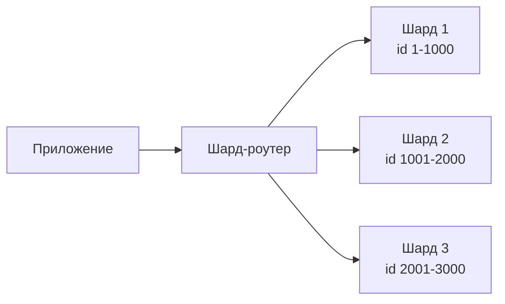
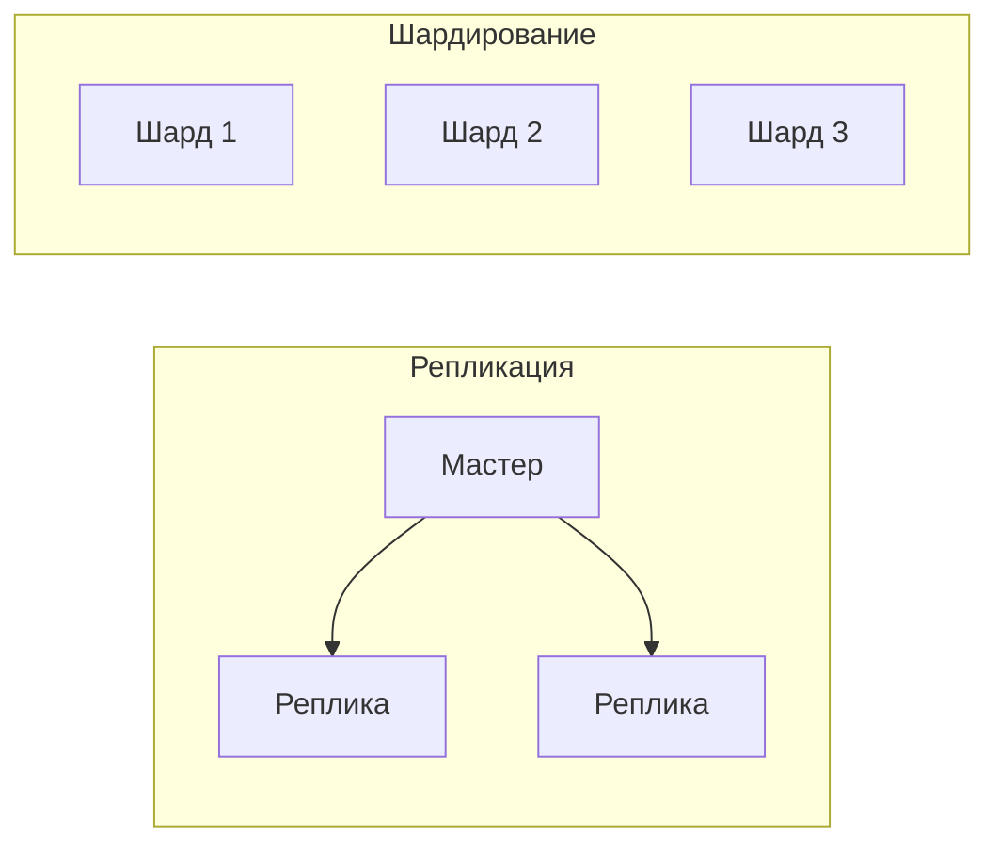
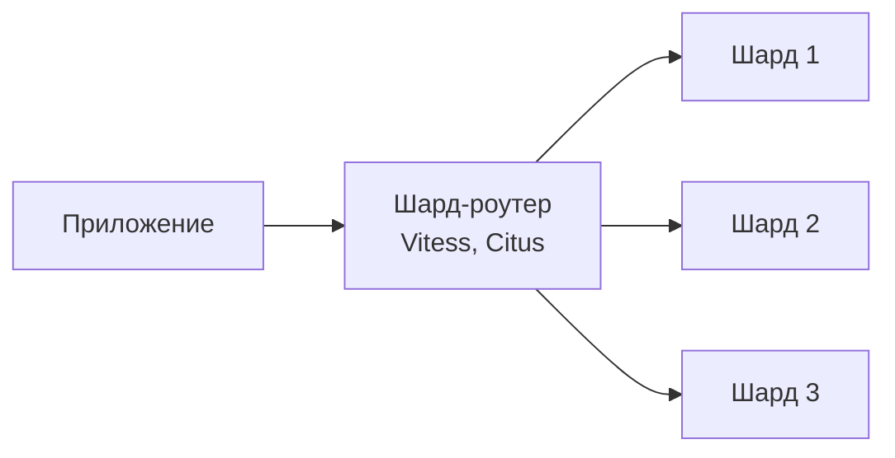
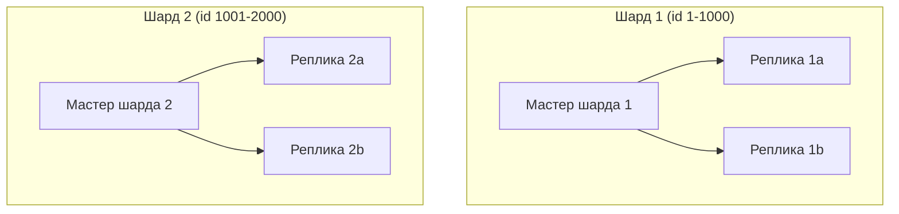

## Введение: Разделяем данные на части

Представьте огромную библиотеку. В ней миллионы книг. Если хранить все книги в одной комнате, найти нужную книгу будет трудно, а библиотекарю придется ходить по всей комнате.

Что делает библиотека? Она разделяет книги по темам: художественная литература в одном зале, научная — в другом, история — в третьем. Каждый зал отвечает за свою часть книг. Чтобы найти книгу по физике, вы идете в зал научной литературы.

**Шардирование (Sharding)** — это метод горизонтального масштабирования базы данных, при котором данные разбиваются на части (шарды) и распределяются по разным серверам. Каждый шард содержит только часть данных. Вместо одного огромного сервера — несколько маленьких, каждый отвечает за свой диапазон данных.

Шардирование решает проблему масштабирования записи (write scaling), которую не решает репликация (там все равно один мастер на запись). Но шардирование значительно сложнее репликации и требует изменений в приложении.

## Как работает шардирование

**Ключ шардирования (Shard Key)** — это поле, по которому мы решаем, в какой шард попадет запись. Например, по user_id. Все записи с user_id от 1 до 1000 — в шард 1, от 1001 до 2000 — в шард 2, и так далее.

```yaml
Шард 1: пользователи с id 1-1000
Шард 2: пользователи с id 1001-2000
Шард 3: пользователи с id 2001-3000

Запрос:
  - SELECT * FROM users WHERE id = 500 → шард 1
  - SELECT * FROM users WHERE id = 1500 → шард 2
  - INSERT INTO users (id=2500) → шард 3
```



## Репликация vs Шардирование

| Аспект | Репликация | Шардирование |
| :--- | :--- | :--- |
| **Что делает** | Копирует данные | Разделяет данные |
| **Масштабирование чтения** | Да | Да (каждый шард читает свои данные) |
| **Масштабирование записи** | Нет (один мастер) | Да (запись распределяется по шардам) |
| **Сложность** | Низкая | Высокая |
| **JOIN** | Работают (на одной реплике) | Между шардами невозможны |
| **Транзакции** | ACID внутри одного сервера | ACID только внутри шарда, между шардами — нет |
| **Когда использовать** | Чтения >> записи | И чтения, и записи высоки |



## Выбор ключа шардирования (Shard Key)

Выбор ключа шардирования — самое важное и сложное решение при проектировании шардирования.

**Хороший ключ шардирования:**

- **Равномерно распределяет данные.** Ни один шард не должен быть перегружен.
- **Стабильный.** Не меняется со временем (иначе данные нужно перемещать между шардами).
- **Используется в большинстве запросов.** Если 90% запросов ищут по user_id, то user_id — хороший ключ.
- **Позволяет делать запросы без обращения ко всем шардам.** Запрос `WHERE user_id = 123` идет только в один шард.

**Плохой ключ шардирования:**

- **Создает "горячие" шарды.** Например, по полю "status" (active/inactive). 99% записей имеют статус "active". Один шард перегружен.
- **Часто меняется.** При изменении ключа данные нужно перемещать.
- **Не используется в запросах.** Запрос без ключа шардирования вынужден идти во все шарды (fan-out).

```yaml
Хороший ключ: user_id, order_id, customer_id
Плохой ключ: status, country (если 90% пользователей из одной страны), timestamp (если все запросы за последний час)
```

## Стратегии шардирования

### Range-based шардирование (по диапазонам)

Данные разбиваются на диапазоны значений ключа.

```yaml
Шард 1: user_id 1-1000
Шард 2: user_id 1001-2000
Шард 3: user_id 2001-3000
```

**Плюсы:** Просто, легко добавить новый шард (например, 3001-4000). Хорошо для range-запросов (WHERE user_id BETWEEN 500 AND 1500 — затронет шарды 1 и 2).

**Минусы:** Неравномерное распределение, если данные не равномерно распределены по диапазонам (например, старые пользователи активны меньше). Может создавать "горячие" шарды.

### Hash-based шардирование (по хэшу)

Хэш от ключа определяет шард.

```python
shard_id = hash(user_id) % number_of_shards
# hash(500) % 3 = 1 → шард 1
# hash(1500) % 3 = 0 → шард 0
```

**Плюсы:** Равномерное распределение (при хорошей хэш-функции). Нет "горячих" шардов.

**Минусы:** Сложно добавить новый шард (изменяется number_of_shards → все данные нужно перераспределять). Range-запросы (BETWEEN) идут во все шарды.

### Directory-based шардирование (через справочник)

Отдельный сервис (lookup) хранит映射 между ключом и шардом.

```yaml
Справочник:
  user_id 500 → шард 1
  user_id 1500 → шард 2
  user_id 2500 → шард 3
```

**Плюсы:** Гибкость (можно перемещать данные между шардами, обновив справочник). Не нужно менять логику при добавлении шарда.

**Минусы:** Дополнительный сервис (точка отказа). Задержка на lookup.

### Географическое шардирование

Данные распределяются по географическому признаку.

```yaml
Шард 1: пользователи из EU
Шард 2: пользователи из US
Шард 3: пользователи из ASIA
```

**Плюсы:** Данные ближе к пользователям (меньше задержка). Соответствие регуляторам (GDPR — данные EU в EU).

**Минусы:** Неравномерное распределение (если в EU больше пользователей).

## Проблемы шардирования

### JOIN между шардами

Запрос, объединяющий данные из разных шардов, невозможен (или очень медленный).

```sql
-- Заказ в шарде 1, пользователь в шарде 2
SELECT orders.*, users.name
FROM orders
JOIN users ON orders.user_id = users.id
WHERE orders.id = 123;
```

**Решения:**

- **Денормализация.** Хранить копию user.name в таблице orders (в том же шарде).
- **API Composition.** Приложение делает два запроса: сначала в шард заказов (получает user_id), потом в шард пользователей (получает name).
- **Перепроектирование.** Изменить ключ шардирования, чтобы связанные данные попадали в один шард (co-location).

### Распределенные транзакции

Операция, затрагивающая несколько шардов, не может быть атомарной.

```sql
-- Перевести деньги со счета в шарде 1 на счет в шарде 2
UPDATE accounts SET balance = balance - 100 WHERE id = 1; -- шард 1
UPDATE accounts SET balance = balance + 100 WHERE id = 2; -- шард 2
```

**Решения:**

- **Saga (распределенная транзакция).** Разбить на шаги с компенсациями.
- **Избегать операций между шардами.** Проектировать так, чтобы связанные данные были в одном шарде.
- **Eventual consistency.** Принять, что данные будут согласованы не мгновенно.

### Перебалансировка (Rebalancing)

При добавлении нового шарда нужно переместить часть данных со старых шардов на новый.

**Проблемы:** Долго, требует остановки записи (или сложной онлайн-миграции), может нарушить равномерность распределения.

**Решения:**

- **Hash-based с consistent hashing.** Минимизирует объем перемещаемых данных.
- **Directory-based.** Просто обновить справочник (но данные физически еще на старом шарде).
- **Планировать заранее.** Создавать больше шардов, чем нужно сейчас (например, 256 шардов), чтобы долго не перебалансировать.

### Горячие шарды (Hot shards)

Один шард получает непропорционально много запросов.

**Примеры:** Шардирование по user_id, но один пользователь (например, президент США) создает 50% всех запросов. Шардирование по country, но 80% пользователей из одной страны.

**Решения:**

- **Выбрать другой ключ шардирования.** Например, шардировать по order_id, а не по user_id.
- **Shard splitting.** Разбить "горячий" шард на несколько.
- **Кэширование.** Кэшировать данные "горячего" пользователя в Redis, чтобы не нагружать шард.

## Шардирование и приложение

Приложение должно знать, как найти нужный шард. Есть два подхода.

### Шард-роутер (прокси)

Приложение обращается к роутеру, который перенаправляет запрос в нужный шард.



**Примеры:** Vitess (для MySQL), Citus (для PostgreSQL), MongoDB sharding.

### Шардирование на уровне приложения

Приложение само вычисляет, в какой шард идти.

```python
def get_shard(user_id):
    shard_id = hash(user_id) % 3
    return connection_pools[shard_id]

conn = get_shard(user_id)
conn.execute("SELECT * FROM users WHERE id = %s", user_id)
```

**Плюсы:** Просто, нет дополнительного сервиса. **Минусы:** Логика шардирования в коде приложения, сложно менять.

## Шардирование и репликация вместе

В крупных системах шардирование комбинируют с репликацией: каждый шард имеет свои реплики.



**Преимущества:** Масштабирование и записи (шардирование), и чтения (репликации). Отказоустойчивость внутри каждого шарда.

## Пример: Шардирование в интернет-магазине

**Исходные данные:** 100 млн пользователей, 1 млрд заказов. Один сервер PostgreSQL не справляется.

**Решение:** Шардирование по user_id (так как большинство запросов ищет данные конкретного пользователя).

```yaml
Шард 1: user_id 1-10M
Шард 2: user_id 10M-20M
Шард 3: user_id 20M-30M
...
Шард 10: user_id 90M-100M
```

**Как работают запросы:**

- `SELECT * FROM orders WHERE user_id = 12345` → шард 1 (быстро, один шард)
- `SELECT * FROM orders WHERE order_id = 67890` → нужно знать, какому user_id принадлежит order_id. Если нет индекса, придется идти во все шарды (медленно).

**Проблема:** Запросы по order_id (без user_id) становятся дорогими.

**Решение:** Денормализация. В таблице orders хранить user_id, чтобы знать, в каком шарде искать. Или сделать отдельный справочник (order_id → shard).

## Шардирование в разных базах данных

**PostgreSQL.** Нет встроенного шардирования. Используются расширения: **Citus** (распределяет таблицы по узлам, поддерживает SQL), **pg_shardman**. Или шардирование на уровне приложения.

**MySQL.** Нет встроенного шардирования. Используются: **Vitess** (YouTube создал для масштабирования MySQL), **ProxySQL**, шардирование на уровне приложения.

**MongoDB.** Встроенное шардирование. Выбираете ключ шардирования (shard key), MongoDB автоматически распределяет данные. Поддерживает range и hash шардирование.

**Cassandra.** Встроенное шардирование через consistent hashing. Нет ключа шардирования — используется partition key из PRIMARY KEY.

```sql
-- MongoDB: включение шардирования
sh.enableSharding("my_db")
sh.shardCollection("my_db.users", { "user_id": "hashed" })
```

```sql
-- Citus (PostgreSQL)
SELECT create_distributed_table('users', 'user_id');
```

## Когда шардирование — правильный выбор

- **Очень большой объем данных (10+ TB).** Данные не помещаются на один сервер, даже самый мощный.

- **Высокая нагрузка на запись (10 000+ запросов в секунду).** Репликация не помогает (один мастер). Нужно распределять запись по нескольким серверам.

- **Вертикальное масштабирование достигло предела.** Самый мощный сервер облачного провайдера уже не справляется.

- **Запросы хорошо изолируются по ключу шардирования.** Большинство запросов содержат ключ шардирования (например, user_id). JOIN между шардами редки.

- **Команда готова к сложности.** Есть опыт работы с распределенными системами, готова к изменениям в приложении.

## Когда шардирование не нужно

- **Маленький проект (< 1 TB).** Один сервер справится. Шардирование — оверинжиниринг.

- **Сложные JOIN и транзакции.** Если бизнес-логика требует частых JOIN между сущностями, шардирование сделает их очень сложными.

- **Запросы без ключа шардирования.** Если 90% запросов ищут по полю, которое не является ключом шардирования, придется сканировать все шарды.

- **Команда не имеет опыта.** Шардирование — это сложно. Ошибки могут привести к потере данных или катастрофическому падению производительности.

## Распространенные ошибки

**Ошибка 1: Неправильный выбор ключа шардирования.** Ключ создает "горячие" шарды, не используется в запросах, часто меняется.

**Ошибка 2: Преждевременное шардирование.** Добавили сложность, когда один сервер еще справлялся. YAGNI.

**Ошибка 3: JOIN между шардами.** Не учли, что JOIN между шардами не работают. Пришлось перепроектировать схему.

**Ошибка 4: Отсутствие плана перебалансировки.** Добавили новый шард, а данные со старых не переместили. Один шард пустой, другие перегружены.

**Ошибка 5: Шардирование только по одному ключу, а запросы по другому.** Пришлось делать fan-out (запрос во все шарды) для каждого запроса.

## Резюме

Шардирование — это метод горизонтального масштабирования базы данных, при котором данные разбиваются на части (шарды) и распределяются по разным серверам.

**Как работает:**

- Выбирается ключ шардирования (shard key)
- По значению ключа определяется, в какой шард попадет запись
- Каждый шард содержит часть данных

**Стратегии шардирования:**

- **Range-based** — по диапазонам (просто, но неравномерно)
- **Hash-based** — по хэшу (равномерно, но сложно добавлять шарды)
- **Directory-based** — через справочник (гибко, но дополнительный сервис)
- **Географическое** — по региону (близко к пользователям)

**Преимущества:**

- Масштабирование записи (не один мастер)
- Масштабирование чтения (каждый шард читает свои данные)
- Огромные объемы данных (10+ TB)

**Недостатки и сложности:**

- JOIN между шардами невозможны
- Распределенные транзакции (Saga, eventual consistency)
- Перебалансировка при добавлении шардов
- Горячие шарды (неравномерное распределение)
- Сложность в приложении (знать, где какой шард)

**Когда использовать:**

- Очень большой объем данных (10+ TB)
- Высокая нагрузка на запись (10 000+ RPS)
- Вертикальное масштабирование достигло предела
- Запросы хорошо изолируются по ключу шардирования

**Когда не использовать:**

- Маленький проект (< 1 TB)
- Сложные JOIN и транзакции
- Запросы без ключа шардирования
- Команда не имеет опыта

Шардирование — это мощный, но сложный инструмент. Это последний шаг в масштабировании базы данных после вертикального масштабирования и репликации. Многие компании никогда не доходят до шардирования — им хватает репликации и кэширования. Но для систем масштаба Google, Amazon, Facebook шардирование неизбежно. Начинайте с вертикального, затем репликация, и только когда упираетесь в потолок по записи — переходите к шардированию. И тщательно выбирайте ключ шардирования — это самое важное решение.