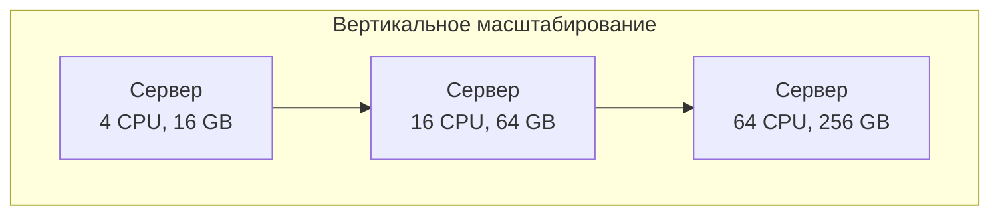
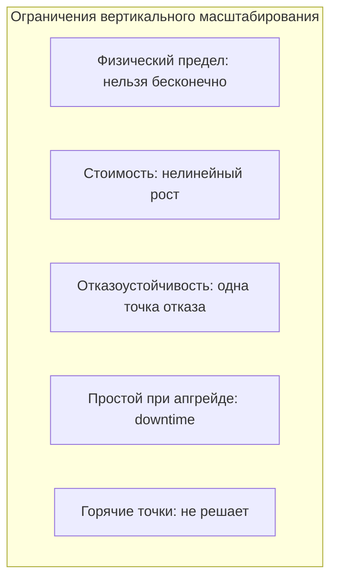
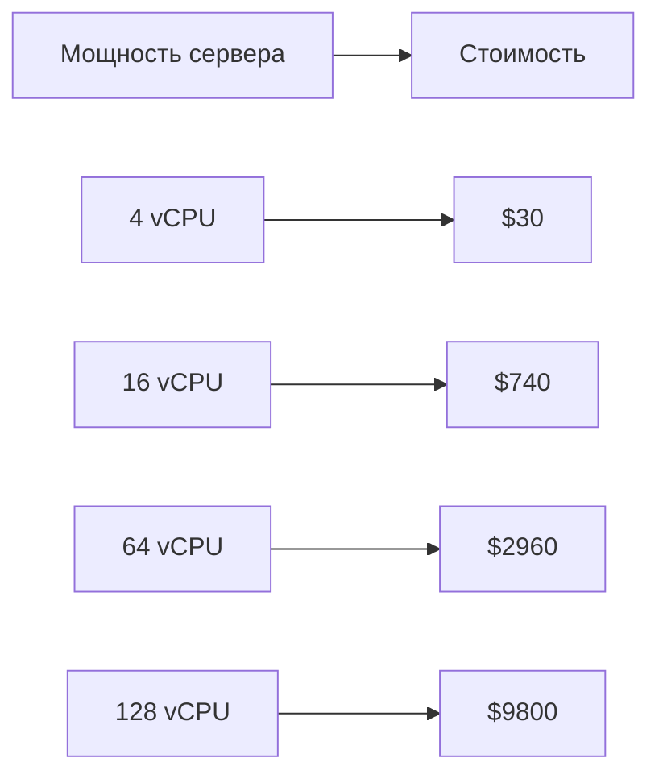

## Введение: Увеличиваем мощность, а не количество

Представьте, что ваш компьютер стал медленно работать. Вы открываете системный блок и меняете старый процессор на новый, более мощный. Добавляете планки оперативной памяти. Меняете жесткий диск на быстрый SSD. Компьютер стал быстрее. Вы не покупали второй компьютер — вы улучшили тот, что уже есть.

**Вертикальное масштабирование (Scaling Up)** — это увеличение мощности одного сервера. Вы не добавляете новые серверы. Вы делаете существующий сервер мощнее: больше CPU, больше RAM, быстрее диски (SSD вместо HDD), быстрее сеть.

Вертикальное масштабирование — это самый простой и понятный способ справиться с ростом нагрузки. Оно не требует изменения архитектуры приложения. Но у него есть физический предел — нельзя бесконечно увеличивать мощность одного сервера.

## Как работает вертикальное масштабирование

**Физические серверы (on-premise):** Вы покупаете сервер с более мощным процессором (например, 64 ядра вместо 16), добавляете оперативную память (512 GB вместо 64 GB), меняете диски на более быстрые (NVMe SSD вместо SATA SSD). Или покупаете новый, более мощный сервер.

**Облачные серверы (AWS EC2, Google Compute Engine, Azure VMs):** Вы выбираете другой тип инстанса (instance type) с большим количеством CPU и RAM. Например, переходите с t3.medium (2 vCPU, 4 GB RAM) на t3.xlarge (4 vCPU, 16 GB RAM) или на r5.8xlarge (32 vCPU, 256 GB RAM).

```yaml
Было (AWS EC2 t3.medium):
  - 2 vCPU
  - 4 GB RAM
  - Сетевой bandwidth: до 5 Gbps

Стало (AWS EC2 t3.xlarge):
  - 4 vCPU
  - 16 GB RAM
  - Сетевой bandwidth: до 5 Gbps

Или (AWS EC2 r5.8xlarge):
  - 32 vCPU
  - 256 GB RAM
  - Сетевой bandwidth: 10 Gbps
```

В облаке вертикальное масштабирование — это просто изменение типа инстанса. В большинстве случаев требуется перезапуск сервера (несколько минут простоя). Некоторые облачные провайдеры поддерживают "горячее" изменение ресурсов без перезапуска (например, изменение RAM в некоторых типах виртуальных машин).

## Преимущества вертикального масштабирования

**Простота.** Это самое главное преимущество. Вам не нужно менять архитектуру приложения. Нет распределенных транзакций, нет шардирования, нет сетевых задержек между компонентами. Все работает как раньше, просто на более мощном железе.

**Совместимость.** Все функции базы данных и приложения работают как раньше. ACID-транзакции, внешние ключи, сложные JOIN, хранимые процедуры — все это сохраняется. При горизонтальном масштабировании многие из этих функций становятся недоступными или очень сложными.

**Производительность.** Внутри одного сервера нет сетевых задержек между компонентами. Вызовы между модулями — это вызовы функций (наносекунды), а не сетевые запросы (миллисекунды). Для многих задач вертикальное масштабирование дает лучшую производительность на один сервер.

**Управление.** Один сервер проще администрировать, чем кластер из 10 серверов. Один бэкап, один мониторинг, одна конфигурация.



## Недостатки и ограничения

**Физический предел.** Нельзя бесконечно увеличивать мощность одного сервера. Даже самые мощные серверы имеют ограничения. На 2024 год максимальная конфигурация AWS EC2 (x2idn.32xlarge): 128 vCPU, 2 TB RAM. Больше — уже не один сервер, нужно горизонтальное масштабирование.

**Стоимость (на больших объемах).** Самые мощные серверы очень дороги. Цена растет нелинейно. Сервер с 64 CPU стоит не в 4 раза дороже сервера с 16 CPU, а значительно дороже.

**Отсутствие отказоустойчивости.** Один сервер — единая точка отказа. Если он упал, система недоступна. Нет автоматического переключения на другой сервер.

**Простой при апгрейде.** Чтобы увеличить память или сменить процессор, сервер обычно нужно остановить. Даже в облаке смена типа инстанса требует перезапуска. Это означает downtime (простой).

**Горячие точки (hot spots).** Даже если сервер мощный, одни и те же данные (например, популярная запись в базе данных) могут создавать конкуренцию за ресурсы. Горизонтальное масштабирование может распределить нагрузку, вертикальное — нет.



## Стоимость вертикального масштабирования

Цена серверов растет нелинейно. Самые мощные серверы имеют наценку за "мощность".

```yaml
# Примерные цены AWS EC2 (us-east-1, on-demand, 2024)

t3.medium (2 vCPU, 4 GB):     $0.0416/час ≈ $30/мес
t3.xlarge (4 vCPU, 16 GB):    $0.1664/час ≈ $120/мес
r5.4xlarge (16 vCPU, 128 GB): $1.008/час ≈ $740/мес
r5.8xlarge (32 vCPU, 256 GB): $2.016/час ≈ $1480/мес
r5.16xlarge (64 vCPU, 512 GB): $4.032/час ≈ $2960/мес
x2idn.32xlarge (128 vCPU, 2 TB): $13.339/час ≈ $9800/мес
```

Удвоение мощности (с 16 до 32 vCPU) увеличивает стоимость в 2 раза (линейно). Удвоение с 32 до 64 — тоже в 2 раза. Но переход с 64 до 128 — уже не 2x по цене? Примерно да, но абсолютные цифры большие. Главное: самый мощный сервер стоит почти $10 000 в месяц. Десять серверов по 16 vCPU стоят $7400. Десять серверов дешевле одного сверх-мощного.



## Когда вертикальное масштабирование — правильный выбор

- **Начальный этап проекта.** Пока нагрузки мало, вертикальное масштабирование — самый быстрый и дешевый способ. Не нужно тратить месяцы на проектирование распределенной архитектуры.

- **Монолитная архитектура.** Ваше приложение — монолит. Горизонтальное масштабирование (много копий) возможно, но база данных остается общей. Вертикальное масштабирование БД — естественный путь.

- **Требования к ACID и сложным JOIN.** Распределенные системы плохо подходят для сложных транзакций и JOIN. Вертикальное масштабирование сохраняет все возможности реляционной БД.

- **Предсказуемый рост.** Если вы знаете, что нагрузка вырастет в 2-3 раза, а не в 100, вертикальное масштабирование может быть дешевле и проще.

- **Маленькая команда.** У вас нет DevOps-инженеров для управления кластером. Вертикальное масштабирование проще в эксплуатации.

- **Ограниченный бюджет на начальном этапе.** Пока у вас мало пользователей, сервер на $100/мес дешевле, чем кластер на $500/мес.

## Когда вертикальное масштабирование перестает работать

Признаки того, что вертикальное масштабирование больше не помогает:

- **Вы уже используете самый мощный сервер, который может предложить облачный провайдер.** Дальше только горизонтальное.

- **Цена дальнейшего увеличения мощности становится неоправданно высокой.** $10 000 в месяц за один сервер — дорого. Пять серверов по $2000 могут быть дешевле и надежнее.

- **Простой при апгрейде становится проблемой.** Если ваш бизнес не может позволить себе 5-10 минут простоя для смены типа инстанса, нужно горизонтальное масштабирование с отказоустойчивостью.

- **База данных упирается в CPU, но уже на максимальной конфигурации.** Дальше только шардирование.

- **Приложение страдает от "шумного соседа" (noisy neighbor).** Один модуль потребляет все ресурсы, мешая другим. Горизонтальное масштабирование позволяет изолировать модули.


## Вертикальное масштабирование в облаке vs on-premise

| Аспект | On-premise (свои серверы) | Облако (AWS, GCP, Azure) |
| :--- | :--- | :--- |
| **Стоимость на малых объемах** | Высокая (покупка оборудования) | Низкая (плата за час) |
| **Стоимость на больших объемах** | Ниже (нет наценки облака) | Выше (наценка облачного провайдера) |
| **Скорость апгрейда** | Медленно (заказ, доставка, установка) | Быстро (минуты в консоли) |
| **Простой при апгрейде** | Да (обычно) | Да (обычно перезапуск) |
| **Гибкость** | Низкая | Высокая (изменил тип — получил ресурсы) |

## Альтернативы: Горизонтальное масштабирование

Когда вертикальное масштабирование достигает предела, приходит время горизонтального.

**Для stateless компонентов (веб-серверы, API Gateway):** Добавляем копии за балансировщиком. Это просто.

**Для stateful компонентов (базы данных):**

- **Репликация (read scaling).** Много реплик для чтения. Мастер для записи. Просто, но запись не масштабируется.
- **Шардирование (write scaling).** Данные разбиваются на шарды. Сложно, но масштабирует и запись, и чтение.

## Пример: Рост интернет-магазина

**Месяц 1:** 100 пользователей в день. Один сервер (4 CPU, 8 GB) с PostgreSQL и приложением. Вертикальное масштабирование не нужно.

**Месяц 6:** 10 000 пользователей в день. Сервер (8 CPU, 32 GB) еле справляется. Увеличиваем до (16 CPU, 64 GB). Стоимость выросла с $100 до $400 в месяц. Все еще OK.

**Месяц 12:** 100 000 пользователей в день. Сервер (32 CPU, 128 GB) на пределе. Следующий шаг — (64 CPU, 256 GB) за $3000 в месяц. Дорого. Добавляем реплики БД для чтения. Приложение масштабируем горизонтально (несколько копий за балансировщиком).

**Месяц 18:** 1 000 000 пользователей. Даже самый мощный сервер БД не справляется. Начинаем шардирование.


## Распространенные ошибки

**Ошибка 1: Преждевременный переход на горизонтальное масштабирование.** Сложность распределенных систем не нужна, если вертикального масштабирования достаточно. Начинайте с вертикального.

**Ошибка 2: Игнорирование предела вертикального масштабирования.** Не ждите, пока сервер упадет. Планируйте переход на горизонтальное заранее, когда вы достигли 70-80% от максимальной конфигурации.

**Ошибка 3: Вертикальное масштабирование БД, но не приложения.** Если приложение stateless, его можно масштабировать горизонтально дешевле. Не тратьте деньги на огромный сервер для приложения, если можно добавить 5 маленьких.

**Ошибка 4: Отсутствие мониторинга.** Вы не знаете, когда упретесь в потолок. Мониторьте CPU, RAM, IOPS, размер данных.

## Резюме

Вертикальное масштабирование (Scaling Up) — это увеличение мощности одного сервера: больше CPU, больше RAM, быстрее диски.

**Преимущества:**

- Простота (не нужно менять архитектуру)
- Совместимость (ACID, JOIN, внешние ключи)
- Производительность (нет сетевых задержек)
- Простота управления (один сервер)

**Недостатки и ограничения:**

- Физический предел (нельзя бесконечно)
- Стоимость (нелинейный рост на больших объемах)
- Отсутствие отказоустойчивости (одна точка отказа)
- Простой при апгрейде (downtime)
- Не решает проблему горячих точек

**Когда выбирать:**

- Начальный этап проекта
- Монолитная архитектура
- Требования к ACID и сложным JOIN
- Предсказуемый рост (2-3x, а не 100x)
- Маленькая команда
- Ограниченный бюджет на начальном этапе

**Когда переходить на горизонтальное:**

- Достигнут максимальный доступный сервер
- Стоимость дальнейшего вертикального масштабирования неоправданно высока
- Нужна отказоустойчивость (zero downtime)
- БД упирается в CPU даже на максимальной конфигурации

Вертикальное масштабирование — это первый шаг в росте системы. Оно простое, понятное и дешевое на начальном этапе. Но у него есть потолок. Успешные системы начинают с вертикального масштабирования, а когда достигают предела, переходят к горизонтальному (репликация, шардирование, микросервисы). Главное — не переходить на горизонтальное слишком рано (сложность не нужна) и не слишком поздно (система падает).