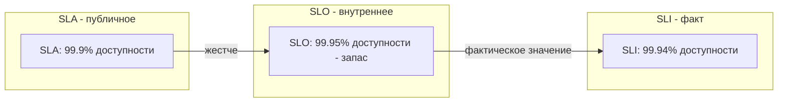

## SLO / SLA / SLI: как измерять надежность системы и отвечать за нее

Когда вы говорите “система работает надежно” — что это значит? 99.9% времени? 99.99%? А что считается “работой”? Система доступна, но отвечает за 5 секунд — это нормально? А если 1% запросов падает с ошибкой?

SLA, SLO и SLI — это инструменты, которые переводят размытые понятия “надежно”, “быстро”, “доступно” в измеримые, достижимые и юридически значимые цели. Они разделяют ответственность между бизнесом, разработкой и эксплуатацией.

SLI (Service Level Indicator) — это метрика, измеряющая аспект работы системы. SLO (Service Level Objective) — целевое значение для этой метрики. SLA (Service Level Agreement) — юридически закрепленное обещание перед клиентом с компенсациями за нарушение.

## SLI (Service Level Indicator): метрика качества

SLI — это количественная мера того, насколько хорошо система выполняет свою функцию. Это то, что вы измеряете. Это операционная метрика, за которой следят инженеры.

SLI должна быть:

- **Измеримой.** Можно получить число.
- **Релевантной для пользователя.** Отвечает на вопрос, доволен ли пользователь.
- **Действенной.** Если SLI упал, команда может что-то сделать.

**Типичные SLI для сервиса:**

| Категория | SLI | Что измеряет |
| :--- | :--- | :--- |
| **Доступность** | Доля успешных запросов / общее количество запросов | Доступен ли сервис? (HTTP 5xx считаются ошибкой, 200, 4xx — нет?) |
| **Задержка (latency)** | Доля запросов, уложившихся в целевое время (например, p95 < 200 мс) | Насколько быстро сервис отвечает |
| **Точность данных** | Доля ответов с корректными данными | Сервис не возвращает битые данные |
| **Пропускная способность (throughput)** | Количество запросов в секунду (обычно не SLI, а capacity planning) | Не SLI, но важно для масштабирования |
| **Долговечность (durability)** | Доля сохраненных данных без потерь | Не потеряли ли вы данные пользователя |
| **Качество работы** | Например, для поиска — релевантность результатов (оценивается A/B тестами) | Сложнее измерить |

**Критическое уточнение: что считать успехом?**

Для SLI доступности:

- HTTP 200 OK — успех.
- HTTP 4xx (Bad Request, Not Found) — обычно НЕ ошибка сервиса, проблема клиента. Их не считают в SLI (иначе злонамеренный клиент может обрушить ваш SLI).
- HTTP 5xx (Internal Server Error, Bad Gateway) — ошибка сервиса.

**Пример SLI:** “99.9% запросов к API заказов возвращают HTTP ответ 2xx за последние 5 минут”. Или “p95 latency GET /orders/{id} менее 100 мс за последние 5 минут”.

## SLO (Service Level Objective): целевая планка

SLO — это целевое значение для SLI. “Мы обещаем себе (и клиентам), что в 99.9% случаев все будет хорошо”. SLO — это внутреннее обязательство команды, которое должно быть реалистичным и достижимым.

**Что делает SLO полезным:**

- **Отличие от SLI.** SLI = 99.5% (факт), SLO = 99.9% (цель). Если SLI ниже SLO, команда что-то делает (исправляет баги, добавляет ресурсы).
- **Приоритизация работы.** Если SLI ниже SLO, фичи откладываются, инженеры чинят надежность.
- **Компромисс между скоростью и надежностью.** Чем выше SLO (99.99% вместо 99.9%), тем дороже это стоит. Нужно обоснование.

**Примеры SLO:**

- Доступность: 99.9% (три девятки) — допустимо ~8.76 часов простоя в год.
- Задержка: 95% запросов к эндпоинту GET /orders обслуживаются за 100 мс.
- Точность данных: 99.999% сохраненных записей не теряются.

**Как выбрать целевое значение SLO:**

- **Исторические данные.** Какой SLI у нас сейчас стабильно? SLO должен быть чуть выше текущего, чтобы требовать улучшений, но не недостижим.
- **Отраслевые стандарты.** Для B2C сервисов (соцсети) достаточно 99.9% (три девятки). Для B2B API может требоваться 99.99%. Для финансов, телекома — 99.999% (пять девяток).
- **Бизнес-обоснование.** Сколько компания теряет при 0.1% дополнительного простоя? Если миллионы, то нужны четыре девятки.

## SLA (Service Level Agreement): юридическое обещание

SLA — это формальный контракт между поставщиком услуги и клиентом. В нем прописаны SLO (доступность, задержка), порядок измерения, ответственность сторон и, самое главное, **компенсации за нарушение SLO**.

**Что обычно содержится в SLA:**

- **Определение доступности.** Например, “доступность 99.9% в календарный месяц”.
- **Исключения.** Плановые работы по техническому обслуживанию, форс-мажор, проблемы на стороне клиента, DDoS (обычно не компенсируются).
- **Метрики и метод измерения.** “Доступность измеряется по HTTP 2xx и 5xx на эндпоинте /health”.
- **Компенсации.** Например, “при доступности 99.0-99.9% клиент получает кредит 10% от месячного платежа; при доступности ниже 99.0% — 25% кредит”.

**Важно:** SLO, указанные в SLA, обычно ниже (т.е. хуже для клиента), чем внутренние SLO команды. Например, SLA обещает 99.9%, а внутренний SLO — 99.95%. Запас (“error budget”) дает пространство для инцидентов без нарушения контракта.

## Error Budget: бюджет ошибок

**Error Budget = 1 - SLO.** Это количество “разрешенных” ошибок, сбоев, превышений задержки, которое команда может допустить без нарушения SLO.

Пример: SLO = 99.9%. Error Budget = 0.1% времени. За месяц в 30 дней (43 200 минут) допустимый простой = 0.1% * 43200 = 43.2 минуты. Если команда исчерпала budget, нужно замедлить релизы и исправлять надежность.

**Как использовать error budget:**

- Если error budget израсходован (SLI < SLO) — стоп новых фич. Только исправление надежности.
- Если error budget почти на исходе — команда осторожнее с рисковыми изменениями.
- Если error budget остался — можно тратить время на новые фичи или “эксперименты” (canary deployment без последствий).

## Как аналитик работает с SLO/SLA

Аналитик не устанавливает SLA (это юристы и продажи). Но он:

- **Участвует в определении SLI и SLO.** Какие метрики важны для пользователя? Доступность, задержка, точность данных? Какие уровни реалистичны?
- **Помогает измерить бизнес-эффект нарушения SLO.** Если сервис упал на час, сколько потеряно денег? Это обосновывает бюджет на повышение надежности.
- **Согласовывает исключения из SLA (плановые работы, ночные окна).** Например, “каждую среду с 03:00 до 03:30 плановое обслуживание, в SLA не входит”.
- **Переводит требования бизнеса в SLO.** “Конверсия не должна падать” → “p95 задержка страницы оформления заказа менее 200 мс”.

## Пример: SLO/SLA для интернет-магазина

**Для API каталога:**
- SLI доступности: доля HTTP 2xx (и, возможно, 404 — если клиент ищет несуществующий товар, это не ошибка сервиса).
- SLO доступности: 99.95% (за месяц допустим ~21 минута простоя).
- SLA доступности: 99.9% (для партнеров, подключенных через API). За нарушение — компенсация 10% от абонентской платы.
- SLI задержки: p95 GET /products?search время ответа.
- SLO задержки: p95 < 200 мс.
- Исключения для поиска: если запрос сложный (много фильтров), SLO может быть выше (500 мс).

**Для сервиса заказов (запись):**
- SLI доступности: 99.9% (письменные операции более чувствительны, допустимый простой 43 минуты в месяц).
- SLI точности данных: 99.999% заказов должны сохраняться без ошибок.
- SLO точности данных: 99.99% (допустимо 0.01% потерянных заказов — для малого бизнеса; для крупного 0.001%).

## Как выбрать SLO для нового сервиса

1. **Начните с SLI.**
2. **Определите минимально приемлемый уровень** — то, что клиент терпит (например, доступность 99%).
3. **Определите хороший уровень** — с которым клиент доволен (99.9%).
4. **Определите отличный уровень** — к которому вы стремитесь (99.95%).
5. **Поставьте SLO между хорошим и отличным.** Слишком низкий SLO не требует улучшений. Слишком высокий SLO нереалистичен.

## Компромиссы SLO

- **Высокий SLO (99.99%) требует избыточности** (больше серверов, реплик, автоматический failover). Это дорого. Нужно ли это бизнесу?
- **Строгий SLO замедляет разработку.** Команда тратит время на автоматическое тестирование, canary deployment, откаты. Если скорость важнее надежности (ранний стартап), SLO может быть 99%.
- **SLO должен учитывать зависимости.** Если сервис платежей, которым вы пользуетесь, имеет SLA 99.9%, ваш SLO не может быть выше 99.9% (иначе вы платите за недостижимое).

## Типичные ошибки

**Ошибка 1: Сложный SLI.** “Доля запросов, где пользователь не пожаловался в поддержку”. Это измерить невозможно.

**Ошибка 2: Игнорирование исключений.** Не включили плановые работы в SLA. Клиент подал иск за простой во время обслуживания.

**Ошибка 3: Одинаковые SLO для всех эндпоинтов.** Поиск может быть медленнее (500 мс p95) и это приемлемо. Оформление заказа должно быть быстрее (200 мс). Разделите SLO.

**Ошибка 4: SLO устанавливаются без учета зависимости.** У вас SLI 99.95%, но ваша зависимость (БД) имеет SLO 99.9%. Это означает, что 0.05% простоя добавляется из-за БД, вы не можете его контролировать. Закладывайте это.

**Ошибка 5: Компенсации в SLA превышают маржу.** Если вы гарантируете 99.999% и не выполняете, компенсация на 100 000 клиентов разорит бизнес.

## Резюме

SLI, SLO, SLA — это иерархия измерителей и обязательств по надежности.

- **SLI (Service Level Indicator).** Фактическая метрика. “Доля успешных запросов 99.5%”.
- **SLO (Service Level Objective).** Целевое значение метрики. “Наша цель — 99.9% успешных запросов”.
- **SLA (Service Level Agreement).** Юридически закрепленное обещание клиенту (обычно менее строгое, чем SLO) с компенсациями.

**Error budget = 1 — SLO.** Бюджет ошибок — это то, сколько можно “сломаться” без нарушения SLO. Он управляет балансом между новыми фичами и надежностью.

**Для аналитика:** SLO — это мост между техническими метриками (p95 latency) и бизнесом (конверсия). Помогите команде выбрать реалистичные SLO. Обоснуйте необходимость повышения надежности (или, наоборот, более низкого SLO для скорости). И помните, что SLO без мониторинга — просто цифры на бумаге. SLI должны быть автоматически измеряемы и доступны в дашбордах.