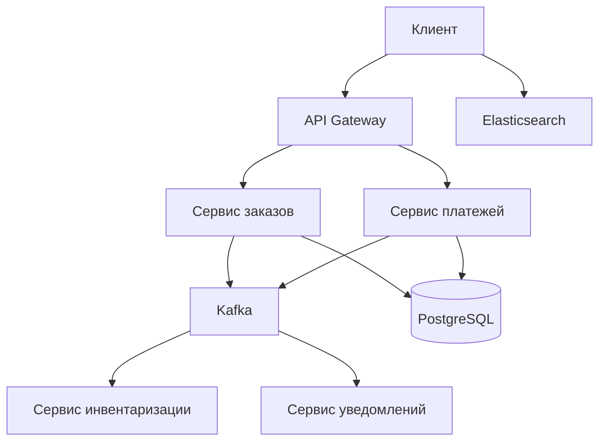

## System Design для аналитика: как рассуждать о системе на интервью

System Design Interview — это не экзамен по архитектуре и не проверка знания всех паттернов из книг. Это проверка того, как вы мыслите, как decompos'ируете (разбиваете) сложную задачу, как задаете вопросы, как находите компромиссы и как коммуницируете решения. Для системного аналитика этот формат даже важнее, чем для разработчика, потому что аналитик работает на стыке бизнеса и технологий.

Главное отличие: от разработчика на интервью ждут "нарисовать коробочки с базами данных и очередями". От аналитика ждут другое: понимание функциональных требований, нефункциональных ограничений, процессов и того, почему выбран тот или иной архитектурный стиль, а не как именно его имплементировать.

## Что проверяют на system design интервью у аналитика

В отличие от разработчика, где основной фокус на масштабировании (CPU, память, сеть), у аналитика проверяют:

- **Умение собирать и уточнять требования.** Вы не кидаетесь рисовать архитектуру, а задаете уточняющие вопросы.
- **Понимание процессов.** Не только "как хранить заказ", а "как заказ попадает в систему, как меняется его статус, кто его меняет".
- **Работу с компромиссами.** Почему выбран синхронный API, а не асинхронный? Почему Kafka , а не RabbitMQ? Почему монолит, а не микросервисы?
- **Мышление в терминах доменов и bounded context'ов.** Вы видите не просто "таблицу пользователей", а контексты "управления учетной записью", "аутентификации", "профиля".

## Структура ответа на system design интервью

Успешный ответ — это не "вот правильная архитектура". Это структурированный диалог, где вы ведете интервьюера по своему ходу мыслей. Шаги:

1. **Уточнить требования (Clarify requirements)**
2. **Выделить основные сущности и процессы (Domain & Processes)**
3. **Определить API и интеграции (Interfaces)**
4. **Нарисовать high-level архитектуру (High-level design)**
5. **Проговорить ключевые компоненты и их ответственность (Components)**
6. **Обсудить нефункциональные требования и компромиссы (NFRs & Trade-offs)**
7. **Обработать хотя бы один edge case в деталях (Deep dive)**

Ниже разберем каждый шаг.

## Шаг 1. Уточнить требования (Clarify requirements)

Это самый важный шаг для аналитика. Не начинайте рисовать схему, пока не задали вопросы.

**Примеры вопросов для чата/мессенджера:**

- "Кто пользователи? (люди, боты, интеграции?)"
- "Какие устройства? (веб, мобильное приложение, smart TV?)"
- "Онлайн-общение только или поддержка офлайн-сообщений?"
- "Нужна ли история сообщений и на какой срок?"
- "Сколько пользователей одновременно в одной комнате? (1-1, group, broadcast?)"

**Для интернет-магазина:**

- "Есть ли каталог товаров? Требуется ли поиск?"
- "Какие способы оплаты?"
- "Нужна ли интеграция со складом (остатки)?"
- "Какие пиковые нагрузки (черная пятница)?"
- "Допустима ли eventual consistency для каталога?"

**Для платежной системы:**

- "Допустима ли потеря транзакции или double charge?"
- "Нужна ли поддержка 3D Secure?"
- "Какие валюты?"

**Шаблон фиксации требований (в голове или на бумаге):**

- **Функциональные (Functional):** что система должна делать.
- **Нефункциональные (Non-functional):** масштаб, задержка, доступность, безопасность.
- **Ограничения (Constraints):** бюджет, сроки, существующие системы.

## Шаг 2. Выделить основные сущности и процессы

Переведите требования в язык сущностей и бизнес-процессов.

**Для чата:**

- Сущности: User, Message, Chat (Room/Conversation), ReadReceipt, UserStatus.
- Процессы: Отправка сообщения, доставка в офлайн, отметка о прочтении, уведомления.

**Для e-commerce:**

- Сущности: User, Product, Order, Payment, Shipment, Cart.
- Процессы: Поиск и фильтрация товаров, добавление в корзину, оформление заказа (Saga), оплата, доставка.

На этом этапе вы решаете, какие процессы синхронные, а какие асинхронные, и какие домены слабо связаны.

## Шаг 3. Определить API и интеграции

Напишите ключевые API (не в OpenAPI, а на уровне идеи).

**Пример для чата:**

- `POST /messages` — отправить сообщение в чат.
- `GET /messages?chat_id=...&limit=...&before=...` — получить историю.
- `WebSocket /ws` — для real-time доставки.
- Внутренние API для сервисов: `GET /users/{id}/status`, `POST /notifications`.

**Для e-commerce:**

- `GET /products?search=...&category=...` — поиск/каталог (кэшируемый, можно eventual consistency).
- `POST /orders` — оформление заказа (должен использовать идемпотентный ключ).
- `GET /orders/{id}` — статус заказа.
- `POST /payments` — платеж (идемпотентный).

Зафиксируйте, какие API будут синхронными (клиент ждет ответ), а какие асинхронными (ответ "принято", уведомление потом). В чате отправка сообщения синхронная (через WebSocket), но уведомления — асинхронные.

## Шаг 4. Нарисовать high-level архитектуру

Начинайте с крупных блоков, не уходя в каждую базу данных.

**Компоненты верхнего уровня:**

- **Клиентский слой (Client):** веб, мобилка.
- **Точка входа (Entry point):** API Gateway, Load Balancer.
- **Сервисы (Services):** по доменам: пользователи, заказы, платежи, инвентаризация.
- **Брокер сообщений (Message broker):** Kafka для асинхронных задач.
- **Хранилища (Storage):** PostgreSQL для платежей и заказов (ACID), Cassandra для сообщений и логов (AP), Redis для кэша и сессий, Elasticsearch для поиска.

Стремитесь к тому, чтобы каждый блок имел одно назначение.

## Шаг 5. Проговорить ключевые компоненты и их ответственность

Для каждого компонента кратко объясните, зачем он нужен и какие риски снимает.

- **API Gateway:** единая точка входа, аутентификация, rate limiting, маршрутизация. Позволяет скрыть внутреннюю структуру и централизовать сквозные функции.
- **База данных (SQL)**: для платежей и заказов нужна ACID, чтобы избежать двойных списаний и нарушений целостности. Сложность — масштабирование записи; буду использовать реплики для чтения.
- **Kafka:** асинхронная обработка, сглаживание пиков, гарантия at-least-once доставки. Позволяет отделить сервис заказов от инвентаризации и уведомлений. Для гарантии порядка использую partition key = `orderId`.
- **Redis:** для сессий, кэша популярных товаров, хранения статусов пользователей в чате (онлайн/офлайн). Высокая производительность, но не долговременное хранение.

## Шаг 6. Обсудить нефункциональные требования и компромиссы

Это самая важная часть для аналитика. Покажите, что вы мыслите не в вакууме, а в мире ограничений.

- **Масштабирование (scalability).** Stateless сервисы масштабируются горизонтально. Базы данных — реплики для чтения, шардирование для записи (если нужно). Kafka — добавлением партиций.
- **Доступность (availability).** Критично для чата и платежей. Резервирование компонентов, реплики БД, Kafka с фактором репликации 3.
- **Консистентность (consistency).** Для платежей и заказов — строгая (CP). Для каталога и уведомлений — eventual (AP).
- **Задержка (latency).** Для чата и поиска — критична (WebSocket, CDN, кэширование). Для отчетов — не критична.
- **Безопасность (security).** Шифрование (TLS), аутентификация через OAuth2 или JWT. Для платежей — PCI DSS compliance, токенизация карт.

**Образец фразы на интервью:** "Я проектирую систему с учетом того, что для платежей и инвентаризации нужна строгая консистентность, поэтому они не могут быть на AP базах. Для каталога, наоборот, я выбираю eventual consistency и кэши, чтобы выдерживать пиковые нагрузки."

## Шаг 7. Обработать хотя бы один edge case в деталях (Deep dive)

Выберите один важный сценарий (например, оформление заказа в e-commerce) и пройдите по всем шагам: от клиента до обновления всех участвующих сервисов. Покажите, как обрабатываете сбои, как идемпотентность работает, как реализована distributed transaction (Saga), как обрабатывается poison message.

**Пример для оформления заказа:**

1. Клиент вызывает `POST /orders` с idempotency ключом.
2. API Gateway проверяет аутентификацию, rate limit, передает в сервис заказов.
3. Сервис заказов:
   - Проверяет idempotency key.
   - Сохраняет заказ со статусом `pending`.
   - Публикует событие `OrderCreated`.
4. Kafka доставляет событие в сервис платежей и сервис инвентаризации.
5. Каждый из них выполняет свою часть и публикует событие успеха/неудачи.
6. Оркестратор (или хореография) отслеживает статусы. Если все успешно — заказ подтвержден. Если ошибка (например, нет товара) — запускается компенсация (Saga).

## Типичные ошибки аналитика на system design интервью

- **Не задавать вопросы.** Это главная ошибка. Аналитик должен задавать уточняющие вопросы.
- **Сразу лезть в код или БД.** Не начинайте с "выберем PostgreSQL", начните с требований и процессов.
- **Забыть об операционных процессах.** Как система мониторится? Как алертит? Как разворачивается? Как откатывается?
- **Предлагать микросервисы для всего.** Это красный флаг. Обоснуйте, почему монолит не подходит.
- **Игнорировать асинхронность и очереди.** Синхронный API на все случаи — антипаттерн для распределенных систем.
- **Забыть про идемпотентность в неидемпотентных операциях (POST).** Интервьюер это заметит.

## Как подготовиться к system design интервью аналитику

**1. Практикуйтесь задавать вопросы.** Возьмите любую систему (доставка еды, Uber, Twitter) и напишите список уточняющих вопросов до того, как начнете рисовать схему.

**2. Изучите паттерны, но фокус на "почему".** Не просто "использую Saga", а "использую Saga, потому что распределенная транзакция между заказами и платежами не должна блокировать ресурсы".

**3. Повторите CAP, ACID vs BASE, consistency models.** Интервьюеры любят спрашивать "почему выбрали именно эту базу данных".

**4. Изучите готовые примеры.** System design популярных систем (об этом много статей). Но не заучивайте, а разбирайте компромиссы.

## Резюме

System design для аналитика — это демонстрация того, как вы:

- **задаете правильные вопросы,**
- **видите процессы и сущности,**
- **обосновываете технологические решения бизнес-требованиями,**
- **находите компромиссы,**
- **и можете погрузиться в критический сценарий достаточно глубоко.**

На интервью вас оценят не по количеству нарисованных коробочек, а по качеству рассуждений и умению вести диалог. Начните с требований, закончите компромиссами, и в середине набросайте достаточно деталей, чтобы показать, что вы умеете переходить от высокоуровневой схемы к конкретному компоненту.