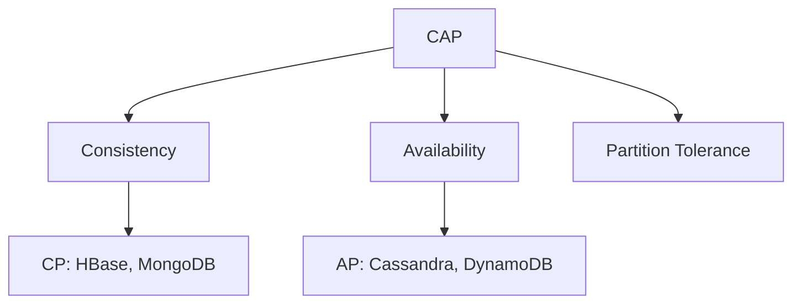

## Введение: Две философии надёжности

Представьте, что вы переводите деньги через банковское приложение. Вы нажимаете "Перевести". Приложение должно гарантировать: деньги спишутся с одного счёта и зачислятся на другой. Не может быть такого, что списались, но не зачислились. Не может быть такого, что вы видите старый баланс, пока перевод обрабатывается. Банк выбирает **ACID** — строгую, надёжную, но медленную модель.

Представьте, что вы ставите лайк в Instagram. Лайк появился не у всех друзей мгновенно? Это нормально. Через пару секунд все увидят. Если лайк временно потеряется при сбое? Пользователь поставит снова. Instagram выбирает **BASE** — быструю, масштабируемую, но с временной несогласованностью.

**ACID** и **BASE** — это два подхода к надёжности и согласованности данных. ACID выбирает строгую согласованность в ущерб производительности и масштабируемости. BASE выбирает производительность и масштабируемость в ущерб строгой согласованности.

Для системного аналитика понимание ACID и BASE — это ключ к выбору правильной базы данных. Банк не может использовать BASE. Социальная сеть не может использовать ACID (не выдержит нагрузки). Нужно понимать компромиссы.

## ACID: Надежность

**ACID** — это акроним, описывающий свойства транзакций в реляционных базах данных.

| Буква | Термин | Что значит простыми словами |
| :--- | :--- | :--- |
| **A** | Atomicity (Атомарность) | "Всё или ничего". Транзакция либо выполняется полностью, либо не выполняется вообще |
| **C** | Consistency (Согласованность) | Данные всегда в правильном, согласованном состоянии |
| **I** | Isolation (Изоляция) | Параллельные транзакции не мешают друг другу |
| **D** | Durability (Долговечность) | После COMMIT данные не теряются, даже при сбое |

### Atomicity (Атомарность)

**Что это:** Транзакция — это неделимая единица работы. Либо все операции внутри транзакции применяются, либо ни одна.

**Пример:** Перевод денег.

```yaml
Транзакция:
  1. Списать 1000 рублей со счёта А
  2. Зачислить 1000 рублей на счёт Б

Атомарность гарантирует:
  - Если списание прошло, а зачисление упало (сбой сети, ошибка) → откат списания
  - Деньги не исчезли и не размножились
```

**Как реализовано:** Журнал транзакций (WAL). При сбое система восстанавливается: зафиксированные транзакции применяются, незафиксированные — откатываются.

### Consistency (Согласованность)

**Что это:** Транзакция переводит базу данных из одного согласованного состояния в другое. Все ограничения (уникальность, внешние ключи, CHECK) соблюдаются.

**Пример:** Баланс не может быть отрицательным.

```yaml
Ограничение: balance >= 0

Транзакция:
  UPDATE accounts SET balance = balance - 1000 WHERE id = 1

Если balance = 500:
  - Баланс станет -500 → нарушение ограничения
  - Транзакция откатится
```

**Два уровня согласованности:**

| Уровень | Кто обеспечивает | Пример |
| :--- | :--- | :--- |
| **База данных** | Ограничения (CHECK, FOREIGN KEY, UNIQUE) | Баланс не отрицательный |
| **Приложение** | Бизнес-правила | Сумма дебета = сумме кредита |

### Isolation (Изоляция)

**Что это:** Параллельные транзакции не должны влиять друг на друга. Каждая транзакция работает так, как будто она одна в системе.

**Проблемы без изоляции:**

| Проблема | Описание |
| :--- | :--- |
| Грязное чтение (Dirty Read) | Чтение незафиксированных данных другой транзакции |
| Неповторяющееся чтение (Non-repeatable Read) | Повторное чтение даёт разные значения |
| Фантомное чтение (Phantom Read) | Появляются новые строки при повторной выборке |

**Уровни изоляции (от слабого к сильному):**

| Уровень | Грязное чтение | Неповторяющееся чтение | Фантомы |
| :--- | :--- | :--- | :--- |
| READ UNCOMMITTED | Да | Да | Да |
| READ COMMITTED | Нет | Да | Да |
| REPEATABLE READ | Нет | Нет | Да (кроме некоторых СУБД) |
| SERIALIZABLE | Нет | Нет | Нет |

### Durability (Долговечность)

**Что это:** После того как транзакция зафиксирована (COMMIT), данные сохраняются навсегда и не теряются при любых сбоях: отключении электричества, падении операционной системы, сбое диска.

**Как реализовано:**

- **WAL (Write-Ahead Logging):** сначала запись в журнал, потом на диск
- **Репликация:** копии данных на нескольких серверах
- **Резервное копирование:** регулярные бэкапы

**Гарантии:**

```yaml
Сценарий:
  1. BEGIN
  2. UPDATE accounts SET balance = balance - 100 WHERE id = 1
  3. COMMIT
  4. Отключение электричества

Результат:
  - При включении система восстанавливает зафиксированную транзакцию
  - Деньги списаны
```

## BASE: Фундамент масштабируемости

**BASE** — это акроним, описывающий свойства распределённых и нереляционных систем.

| Буква | Термин | Что значит простыми словами |
| :--- | :--- | :--- |
| **B** | Basically Available | Система всегда доступна, всегда отвечает |
| **A** | Soft state | Состояние может меняться без внешних действий |
| **E** | Eventual consistency | Рано или поздно все узлы увидят одни и те же данные |

### Basically Available (Базовая доступность)

**Что это:** Система всегда отвечает на запросы. Она не может сказать "я сейчас занята, придите позже". Ответ может содержать устаревшие данные, но он будет.

**Пример:** Лента новостей в социальной сети.

```yaml
Запрос: показать ленту
Ответ: лента (может быть не самой свежей, но есть)

Даже при сетевых проблемах сервер отвечает.
```

**Плата:** Согласованность. Вы можете получить не самые свежие данные.

### Soft state (Мягкое состояние)

**Что это:** Состояние системы может меняться без внешних воздействий, из-за фоновых процессов синхронизации.

**Пример:** DNS.

```yaml
Вы изменили IP сайта:
  - Через 5 минут: одни пользователи видят старый IP, другие — новый
  - Состояние "плавает", пока не распространится
```

**В отличие от ACID:** В ACID состояние меняется только транзакциями. В BASE состояние может меняться "само по себе".

### Eventual consistency (Конечная согласованность)

**Что это:** Если новые данные перестанут поступать, то через некоторое время все узлы системы придут к одному состоянию.

**Пример:** Лайки в Instagram.

```yaml
Вы поставили лайк:
  - Сразу: вы видите, что лайк поставлен
  - Через 1 секунду: ваши друзья видят лайк
  - Через 5 секунд: все серверы показывают лайк

Нет гарантии, что через 0.5 секунды лайк увидят все.
```

**Степени согласованности:**

| Уровень | Гарантия |
| :--- | :--- |
| **Strong consistency** | Чтение после записи всегда видит запись |
| **Read-your-writes** | Пользователь видит свои собственные записи |
| **Monotonic reads** | Если увидел X, не увидит более старую версию |
| **Eventual consistency** | Рано или поздно все увидят одно и то же |

## Сравнение ACID и BASE

| Характеристика | ACID | BASE |
| :--- | :--- | :--- |
| **Основная цель** | Согласованность и целостность | Доступность и масштабируемость |
| **Согласованность** | Сильная (сразу) | Конечная (eventual) |
| **Доступность** | Может жертвовать доступностью | Всегда доступна |
| **Состояние** | Меняется только транзакциями | Мягкое (меняется само) |
| **Транзакции** | Полная поддержка | Ограниченные |
| **Масштабирование** | Вертикальное (горизонтальное сложно) | Горизонтальное (из коробки) |
| **Примеры** | PostgreSQL, Oracle, MySQL | Cassandra, DynamoDB, MongoDB |
| **Типичное применение** | Финансы, бронирование | Соцсети, логи, кеши |

## CAP-теорема: Почему ACID и BASE существуют

CAP-теорема гласит: распределённая система может обеспечить только два из трёх свойств:

| Свойство | Что значит |
| :--- | :--- |
| **Consistency (C)** | Все узлы видят одни и те же данные |
| **Availability (A)** | Каждый запрос получает ответ |
| **Partition tolerance (P)** | Система работает при разрыве сети |



**ACID** тяготеет к **CP** (Consistency + Partition tolerance), жертвуя доступностью при сетевых проблемах.

**BASE** тяготеет к **AP** (Availability + Partition tolerance), жертвуя строгой согласованностью.

## Практические примеры

### Пример 1: Банковский перевод (ACID)

```yaml
Требования:
  - Деньги не могут потеряться
  - Деньги не могут размножиться
  - Баланс должен быть точным в любой момент

Выбор: ACID (PostgreSQL)

Почему:
  - Атомарность: перевод либо полностью выполнен, либо откачен
  - Согласованность: баланс не может стать отрицательным
  - Изоляция: другой перевод не увидит промежуточное состояние
  - Долговечность: после COMMIT деньги сохранены
```

### Пример 2: Лайки в социальной сети (BASE)

```yaml
Требования:
  - 1 миллион лайков в секунду
  - Пользователь не заметит задержку в 1 секунду
  - Потеря одного лайка при сбое не критична

Выбор: BASE (Cassandra)

Почему:
  - Basically Available: всегда отвечает
  - Eventual consistency: лайк появится у всех через секунду
  - Масштабируемость: горизонтальная, миллионы запросов
```

### Пример 3: Корзина покупок (гибрид)

```yaml
Требования:
  - Товар не должен быть продан дважды (ACID)
  - Корзина может быть временной (BASE)

Решение:
  - Заказы и остатки: PostgreSQL (ACID)
  - Корзина: Redis (BASE)
```

## Компромиссы

### Цена ACID

| Что мы платим | Почему |
| :--- | :--- |
| **Производительность** | Блокировки, синхронная запись на диск |
| **Масштабируемость** | Горизонтальное масштабирование сложно |
| **Доступность** | При сетевых проблемах может отказать |

### Цена BASE

| Что мы платим | Почему |
| :--- | :--- |
| **Согласованность** | Данные могут быть временно не свежими |
| **Сложность приложения** | Нужно обрабатывать конфликты |
| **Потеря данных** | В редких сценариях (при каскадных сбоях) |

## Гибридный подход

Современные системы часто используют оба подхода.

```yaml
Архитектура:
  - PostgreSQL (ACID): заказы, платежи, пользователи
  - Redis (BASE): корзина, сессии, кеш
  - Cassandra (BASE): логи, метрики, события

Результат:
  - Где нужна строгая согласованность → ACID
  - Где нужна скорость и масштаб → BASE
```

## Распространённые ошибки

### Ошибка 1: ACID везде

Используют PostgreSQL для логов (миллионы записей в секунду). Не выдерживает.

**Решение:** Cassandra или ClickHouse.

### Ошибка 2: BASE для финансов

Хранят деньги в MongoDB без транзакций. Деньги теряются.

**Решение:** PostgreSQL.

### Ошибка 3: Игнорирование eventual consistency

Читают с реплики сразу после записи. Получают старые данные.

**Решение:** Читать с мастера для критичных операций.

### Ошибка 4: Ожидание строгой согласованности в BASE

Думают, что Cassandra даст strong consistency. Она даёт eventual.

**Решение:** Выбирать базу данных под требования.

### Ошибка 5: ACID в распределённой системе

Пытаются сделать ACID-транзакцию на 10 серверах. Сложно, медленно, дорого.

**Решение:** Saga, компенсирующие транзакции.

## Резюме

1. **ACID** — строгая согласованность, целостность, надёжность. Для финансов, бронирования, учёта.

2. **BASE** — доступность, масштабируемость, скорость. Для социальных сетей, логов, кешей, метрик.

3. **Ключевые различия:** согласованность (сильная vs eventual), доступность (может быть недоступна vs всегда доступна), масштабирование (вертикальное vs горизонтальное).

4. **CAP-теорема** объясняет компромисс: при сетевых проблемах выбираем между согласованностью и доступностью.

5. **Нет "лучшего" — есть "подходящий".** ACID для критичных данных. BASE для масштаба и скорости.

6. **Гибридные архитектуры** — норма. Используйте ACID там, где нужна строгая согласованность, и BASE там, где нужна скорость.