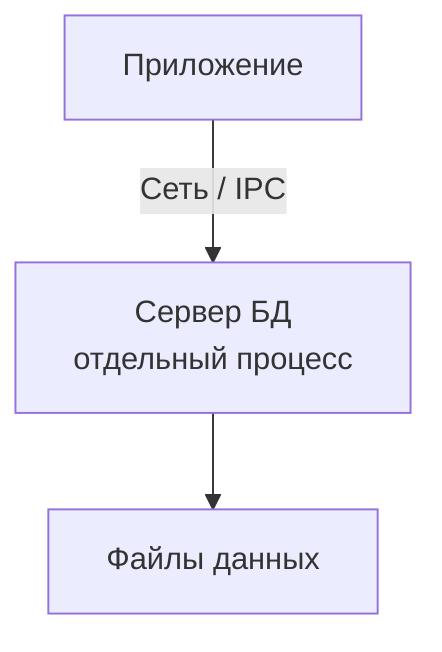
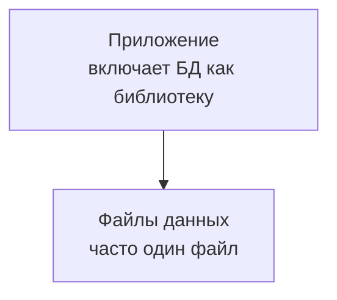

## Введение: База данных внутри приложения

Представьте, что вы пишете мобильное приложение для заметок. Каждой заметке нужен заголовок, текст, дата создания, теги. Вам нужно где-то хранить эти данные. Можно, конечно, запустить отдельный сервер PostgreSQL, но тогда ваше приложение не будет работать без интернета. Да и пользователи вряд ли оценят, что их заметки хранятся где-то "в облаке" без их согласия.

Вместо этого вы можете использовать **встраиваемую базу данных (embedded database)** — библиотеку, которая работает прямо внутри вашего приложения, не требует отдельного сервера и хранит данные в одном файле на диске.

**Embedded Database (встраиваемая БД)** — это база данных, которая поставляется как библиотека (DLL, so, dylib) и встраивается непосредственно в приложение. Приложение запускает БД в своем процессе, нет отдельного сервера, нет сетевых вызовов, нет отдельного администрирования.

**Single-file Database (однофайловая БД)** — это БД, которая хранит все свои данные (таблицы, индексы, метаданные) в одном файле на диске. Для бэкапа достаточно скопировать один файл. Это частный случай встраиваемых БД, но не единственный.

Самый яркий пример — **SQLite**. Это самая распространенная база данных в мире. Она работает в каждом смартфоне (iOS, Android), в каждом браузере (Chrome, Firefox, Safari), во многих десктопных приложениях (Skype, Dropbox, iTunes). И все это без единого сервера.

## Что такое Embedded Database

**Embedded database** — это база данных, которая работает внутри процесса приложения. Нет отдельного серверного процесса, нет сетевого соединения, нет порта, который нужно открывать. Приложение просто вызывает функции библиотеки, которые напрямую читают и пишут файлы на диске.

### Архитектура клиент-серверной БД (традиционной)



**Особенности:**
- Отдельный процесс (иногда на другом сервере)
- Сетевые вызовы (даже на localhost)
- Нужен администратор (установка, настройка, бэкапы)
- Несколько приложений подключаются к одной БД
- Высокая надежность, многопользовательский режим

### Архитектура встраиваемой БД



**Особенности:**
- Библиотека внутри процесса приложения
- Нет сетевых вызовов (прямой доступ к файлам)
- Не нужен администратор (приложение управляет БД)
- Обычно однопользовательская (или с ограниченным параллелизмом)
- Простота, малый размер, низкое потребление ресурсов

## Что такое Single-file Database

**Single-file database** — это база данных, которая хранит все свои данные в одном файле на диске. Этот файл содержит схему, данные, индексы, метаданные — все.

**Примеры:**
- SQLite: один файл `.db` или `.sqlite`
- Microsoft Access: один файл `.accdb`
- DuckDB: один файл `.duckdb`
- LMDB: один файл (или несколько, но может быть один)

### Преимущества однофайлового хранения

| Преимущество | Описание |
| :--- | :--- |
| **Простой бэкап** | Просто скопировать файл (в то время, когда приложение не пишет) |
| **Простое копирование** | Скопировал файл — получил точную копию БД |
| **Простое восстановление** | Скопировал файл обратно — восстановил БД |
| **Простая миграция** | Перенес файл на другой компьютер — БД работает |
| **Простое управление** | Один файл, а не сотни |
| **Отсутствие зависимостей** | Не нужен сервер, не нужны сетевые настройки |

### Недостатки однофайлового хранения

| Недостаток | Описание |
| :--- | :--- |
| **Ограничение размера** | Файловая система имеет ограничения (обычно 2 ТБ — 16 ТБ) |
| **Проблемы с параллелизмом** | Несколько процессов, пишущих в один файл, могут конфликтовать |
| **Коррупция** | Повреждение одного файла — потеря всех данных |
| **Восстановление** | Сложно восстановить часть данных (только весь файл целиком) |

## Популярные Embedded и Single-file БД

### SQLite

Самая популярная встраиваемая БД. Используется везде: от мобильных приложений до браузеров.

```python
import sqlite3

# Подключение (создает файл, если его нет)
conn = sqlite3.connect('myapp.db')

# Создание таблицы
conn.execute('''
    CREATE TABLE IF NOT EXISTS users (
        id INTEGER PRIMARY KEY,
        name TEXT NOT NULL,
        email TEXT UNIQUE
    )
''')

# Вставка
conn.execute('INSERT INTO users (name, email) VALUES (?, ?)', ('Иван', 'ivan@example.com'))

# Запрос
cursor = conn.execute('SELECT * FROM users WHERE name = ?', ('Иван',))
user = cursor.fetchone()

# Закрытие
conn.close()
```

**Характеристики SQLite:**
- Полноценный SQL (почти как в PostgreSQL)
- Транзакции (ACID)
- Размер библиотеки ~1 МБ
- Поддержка до 281 ТБ (теоретически)
- Однопользовательский режим (но есть WAL для конкурентного чтения)
- Используется в iOS, Android, Windows, macOS, Linux, браузерах (WebSQL, IndexedDB)

**Ограничения SQLite:**
- Нет полноценного многопользовательского режима (один процесс пишет)
- Нет хранимых процедур (но есть пользовательские функции)
- Нет полнотекстового поиска "из коробки" (но есть FTS5 расширение)
- Нет гранулярных прав доступа

### DuckDB

Новая встраиваемая БД, оптимизированная для аналитики (OLAP).

```python
import duckdb

# Подключение (создает файл)
conn = duckdb.connect('analytics.duckdb')

# Создание таблицы
conn.execute('CREATE TABLE sales (product VARCHAR, amount DECIMAL, sale_date DATE)')

# Вставка
conn.execute("INSERT INTO sales VALUES ('iPhone', 1000, '2024-01-15')")

# Аналитический запрос (колоночное выполнение)
result = conn.execute('''
    SELECT product, SUM(amount) as total, AVG(amount) as avg
    FROM sales
    GROUP BY product
''').fetchall()

conn.close()
```

**Характеристики DuckDB:**
- Колоночное хранение (оптимизировано для OLAP)
- Поддержка сложных аналитических запросов (оконные функции, GROUP BY)
- Нулевая конфигурация
- Интеграция с Pandas, Arrow, R
- PostgreSQL-совместимый SQL

**Когда использовать:**
- Аналитика на локальных данных (не в облаке)
- Обработка больших CSV/Parquet файлов
- Data science и исследования

### LMDB (Lightning Memory-Mapped Database)

Встраиваемая БД типа "ключ-значение". Используется в OpenLDAP, Firefox, Tor.

```c
// LMDB (C)
MDB_env *env;
mdb_env_create(&env);
mdb_env_open(env, "data.mdb", 0, 0664);

MDB_txn *txn;
mdb_txn_begin(env, NULL, 0, &txn);
MDB_dbi dbi;
mdb_dbi_open(txn, NULL, 0, &dbi);

MDB_val key = { .mv_size = 4, .mv_data = &id };
MDB_val value = { .mv_size = data_size, .mv_data = data };
mdb_put(txn, dbi, &key, &value, 0);
mdb_txn_commit(txn);
```

**Характеристики LMDB:**
- Ключ-значение (не SQL)
- Memory-mapped (отображение файла в память)
- Очень высокая производительность (чтение и запись)
- Транзакции (MVCC, без блокировок)
- Размер БД ограничен размером адресного пространства (обычно 128 ТБ на 64-бит)

### RocksDB (LevelDB)

Встраиваемая БД от Facebook, оптимизированная для высокой нагрузки на запись.

```cpp
// RocksDB (C++)
rocksdb::DB* db;
rocksdb::Options options;
options.create_if_missing = true;
rocksdb::DB::Open(options, "/path/to/db", &db);

db->Put(rocksdb::WriteOptions(), "key", "value");
std::string value;
db->Get(rocksdb::ReadOptions(), "key", &value);
delete db;
```

**Характеристики RocksDB:**
- LSM-дерево (оптимизировано для записи)
- Высокая производительность записи
- Сжатие данных
- Используется в MySQL (MyRocks), Kafka, Flink

### Microsoft Access

Классическая однопользовательская БД для Windows.

**Характеристики:**
- Формы, отчеты, макросы (все в одном)
- Простота использования для непрограммистов
- Устаревающая, не рекомендуется для новых проектов

### Paradox, dBase, FoxPro

Исторические встраиваемые БД (1980-1990-е). Сегодня практически не используются.


## Embedded vs Client-Server

| Характеристика | Embedded | Client-Server |
| :--- | :--- | :--- |
| **Архитектура** | Библиотека в приложении | Отдельный серверный процесс |
| **Сетевые вызовы** | Нет (прямой доступ к файлам) | Да (даже на localhost) |
| **Администрирование** | Не нужно | Нужно (установка, настройка, бэкапы) |
| **Многопользовательский режим** | Ограниченный (обычно один пишущий) | Полный (много пишущих) |
| **Производительность** | Очень высокая (нет сети) | Зависит от сети |
| **Безопасность** | На уровне файловой системы | На уровне БД (пользователи, роли) |
| **Масштабирование** | Вертикальное (мощнее сервер) | Горизонтальное (кластер) |
| **Примеры** | SQLite, DuckDB, LMDB | PostgreSQL, MySQL, Oracle |

## Сравнение SQLite, DuckDB, LMDB, RocksDB

| Характеристика | SQLite | DuckDB | LMDB | RocksDB |
| :--- | :--- | :--- | :--- | :--- |
| **Тип** | Реляционная (SQL) | Реляционная (SQL) | Ключ-значение | Ключ-значение |
| **Оптимизация** | OLTP | OLAP | Чтение/запись | Запись |
| **Хранение** | Строковое | Колоночное | Memory-mapped | LSM |
| **Транзакции** | ACID | ACID | ACID (MVCC) | ACID |
| **Язык** | SQL | SQL (PostgreSQL-совместимый) | C API | C++ API |
| **Размер БД** | до 281 ТБ | до 256 ТБ | до адресного пространства (128 ТБ) | до 512 ТБ |
| **Конкурентное чтение** | Да (WAL) | Да (MVCC) | Да | Да |
| **Конкурентная запись** | Нет (один процесс) | Нет | Да (MVCC) | Нет (один на уровне) |
| **Популярность** | Очень высокая | Растущая | Средняя | Высокая |

## Когда использовать Embedded Database

### Идеальные сценарии

| Сценарий | Почему подходит |
| :--- | :--- |
| **Мобильные приложения (iOS, Android)** | Не нужен сервер, работает офлайн, легко распространять |
| **Десктопные приложения** | Каждый пользователь имеет свою копию данных |
| **Браузерные приложения (IndexedDB)** | Хранение данных на стороне клиента |
| **Встраиваемые системы (IoT)** | Ограниченные ресурсы, нет сети |
| **Тестирование** | Быстро создать, заполнить, удалить временную БД |
| **Прототипирование** | Нулевая конфигурация, быстро начать |
| **Аналитика на локальных данных** | DuckDB для анализа CSV/Parquet |

### Сомнительные сценарии

| Сценарий | Почему плохо подходит |
| :--- | :--- |
| **Веб-приложения с тысячами пользователей** | Нет многопользовательского режима |
| **Системы, требующие гранулярной безопасности** | Нет прав доступа на уровне таблиц |
| **Очень большие объемы (> 1 ТБ)** | Могут быть проблемы с производительностью |
| **Геораспределенные системы** | Нет репликации из коробки |

## Single-file: Плюсы и минусы

### Плюсы

```bash
# Бэкап SQLite
cp myapp.db myapp.db.backup

# Восстановление
cp myapp.db.backup myapp.db

# Копирование на другой компьютер
scp myapp.db user@server:/path/

# Резервное копирование в облако
aws s3 cp myapp.db s3://my-backups/
```

**Простота бэкапа** — бесценна для многих приложений.

### Минусы

**Проблема 1: Конкурентный доступ**

```python
# Процесс 1 пишет
conn1 = sqlite3.connect('app.db')
conn1.execute('UPDATE users SET name = "Иван" WHERE id = 1')

# Процесс 2 тоже пытается писать
conn2 = sqlite3.connect('app.db')
conn2.execute('UPDATE users SET name = "Петр" WHERE id = 1')
# Ошибка: database is locked
```

**Решение:** Использовать WAL (Write-Ahead Logging) режим, но это не решает проблему полностью.

**Проблема 2: Коррупция файла**

Если файл поврежден (сбой питания, ошибка диска), вы теряете все данные. Нет возможности восстановить часть данных.

**Решение:** Регулярные бэкапы. Журнал транзакций (WAL) помогает восстановиться после сбоя.

**Проблема 3: Ограничение размера**

Некоторые файловые системы имеют ограничения (FAT32: 4 ГБ). SQLite может работать с файлами до 281 ТБ, но это требует 64-битной файловой системы.

**Решение:** Использовать современные файловые системы (NTFS, ext4, APFS).

## Практические примеры

### Пример 1: Мобильное приложение для заметок (SQLite)

```kotlin
// Android (Kotlin + Room)
@Entity(tableName = "notes")
data class Note(
    @PrimaryKey val id: Int,
    val title: String,
    val content: String,
    val createdAt: Long
)

@Dao
interface NoteDao {
    @Query("SELECT * FROM notes ORDER BY createdAt DESC")
    fun getAll(): List<Note>
    
    @Insert
    fun insert(note: Note)
}

// Приложение работает без интернета, данные хранятся локально
// При синхронизации с сервером данные копируются в облачную БД
```

### Пример 2: Анализ логов (DuckDB)

```python
import duckdb

# DuckDB может читать CSV/Parquet напрямую
conn = duckdb.connect()

# Запрос к большому CSV файлу (без импорта)
result = conn.execute('''
    SELECT 
        DATE(timestamp) as day,
        COUNT(*) as requests,
        AVG(latency) as avg_latency,
        COUNT(DISTINCT user_id) as unique_users
    FROM 'logs_2024.csv'
    WHERE status >= 400
    GROUP BY day
    ORDER BY day
''').fetchdf()

print(result)
```

### Пример 3: Браузерное приложение (IndexedDB)

```javascript
// IndexedDB — встроенная БД в браузере
const request = indexedDB.open('NotesDB', 1);

request.onupgradeneeded = (event) => {
    const db = event.target.result;
    const store = db.createObjectStore('notes', { keyPath: 'id', autoIncrement: true });
    store.createIndex('title', 'title', { unique: false });
};

// Сохранение заметки
function saveNote(title, content) {
    const db = request.result;
    const tx = db.transaction('notes', 'readwrite');
    const store = tx.objectStore('notes');
    store.add({ title, content, createdAt: Date.now() });
}

// Заметки хранятся локально, приложение работает офлайн
```

### Пример 4: Десктопное приложение (SQLite + Electron)

```javascript
// Electron + SQLite
const sqlite3 = require('sqlite3').verbose();
const db = new sqlite3.Database('user-data.db');

db.serialize(() => {
    db.run('CREATE TABLE IF NOT EXISTS settings (key TEXT PRIMARY KEY, value TEXT)');
    
    db.get('SELECT value FROM settings WHERE key = ?', ['theme'], (err, row) => {
        const theme = row ? row.value : 'light';
        applyTheme(theme);
    });
});
```

## Распространенные ошибки

### Ошибка 1: Использование SQLite для высоконагруженного веб-приложения

SQLite на сервере для тысячи одновременных пользователей.

**Как исправить:** Используйте PostgreSQL или MySQL. SQLite не справится с конкурентной записью.

### Ошибка 2: Отсутствие бэкапов

Храните единственную копию данных в одном файле SQLite без бэкапов.

**Как исправить:** Регулярные бэкапы. Используйте `sqlite3 .backup` или просто копируйте файл.

### Ошибка 3: Игнорирование WAL режима

Конкурентные запросы падают с ошибкой "database is locked".

**Как исправить:** Включите WAL режим: `PRAGMA journal_mode=WAL;`

### Ошибка 4: Хранение больших бинарных объектов

Хранение изображений, видео в SQLite.

**Как исправить:** Храните большие файлы в файловой системе, в SQLite — только пути.

### Ошибка 5: Длинные транзакции

Держите транзакцию открытой минутами, пока пользователь заполняет форму.

**Как исправить:** Транзакции в SQLite должны быть короткими (миллисекунды). Для длительных операций используйте временные данные в приложении.

## Резюме для системного аналитика

1. **Embedded database** — база данных как библиотека, работающая внутри приложения. Нет отдельного сервера, нет сети, нет администрирования. Идеально для мобильных, десктопных, встраиваемых приложений.

2. **Single-file database** — частный случай embedded БД, где все данные хранятся в одном файле. Простейший бэкап и копирование. Пример: SQLite, DuckDB.

3. **SQLite** — король embedded БД. Полноценный SQL, ACID, малый размер (1 МБ), работает везде. Но не подходит для высоконагруженных веб-приложений.

4. **DuckDB** — новый игрок, оптимизированный для аналитики (OLAP). Колоночное хранение, отличная производительность на больших данных.

5. **LMDB / RocksDB** — key-value embedded БД для специфических задач (высокая производительность, большие объемы).

6. **Выбор между embedded и client-server** — простота и отсутствие администрирования против многопользовательского режима и масштабируемости.