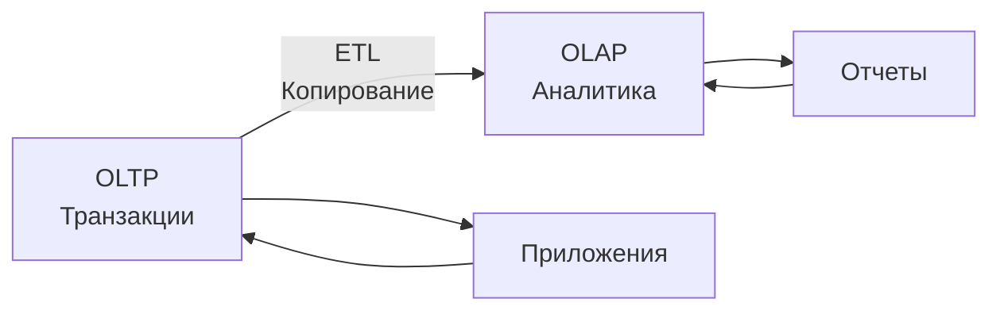
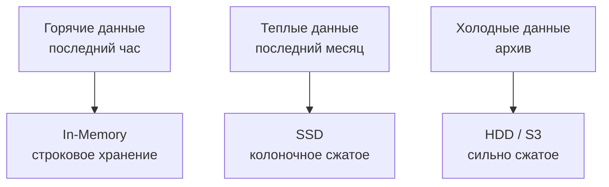
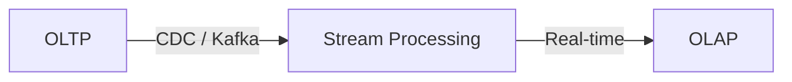

## Введение: Мост между двумя мирами

В предыдущей теме мы разобрали два разных мира: OLTP (транзакции) и OLAP (аналитика). У них разные цели, разная архитектура, разные базы данных. Но что, если вам нужно и то, и другое одновременно? Что, если вам нужно обрабатывать транзакции и тут же анализировать их, без задержек на ETL и копирование данных?

**HTAP (Hybrid Transactional/Analytical Processing)** — это подход, который объединяет OLTP и OLAP в одной системе. Одна база данных, которая умеет и быстро обрабатывать транзакции, и выполнять сложные аналитические запросы на тех же данных, в реальном времени.

Термин придуман в 2014 году аналитиками Gartner. HTAP обещает лучшее из двух миров: свежесть данных OLTP (актуальность в реальном времени) и мощность анализа OLAP (сложные запросы на больших данных). Без задержек ETL, без дублирования данных, без сложной архитектуры с копированием.

## Проблема, которую решает HTAP

### Традиционный подход: OLTP + OLAP + ETL



**Проблемы этого подхода:**

| Проблема | Описание |
| :--- | :--- |
| **Задержка данных** | ETL обычно запускается раз в час или раз в день. Аналитики видят устаревшие данные |
| **Сложность** | Нужно поддерживать две разные системы, два набора инструментов, два процесса |
| **Стоимость** | Две системы = двойное железо, двойное администрирование |
| **ETL-разрыв** | Данные могут потеряться или исказиться при копировании |
| **Нет real-time аналитики** | Нельзя увидеть, что происходит прямо сейчас |

### Пример: Мониторинг мошенничества в реальном времени

Представьте, что вы банк. Вы должны обнаруживать мошеннические транзакции в реальном времени, пока они происходят.

**Традиционный подход:** Транзакция → PostgreSQL → ETL раз в час → ClickHouse → отчет. Мошенник уже снял деньги, а вы узнаете через час.

**HTAP подход:** Транзакция → HTAP база → аналитический запрос на тех же данных за миллисекунды → блокировка мошеннической транзакции.

## Как работает HTAP

### Архитектурные подходы к HTAP

Существует несколько способов реализовать HTAP, от простых до очень сложных.

#### Подход 1: Отдельные движки, общее хранилище

Одна база данных использует два движка: один для OLTP (строковое хранение), другой для OLAP (колоночное хранение). Данные автоматически синхронизируются между движками.

```
Запись → Строковый движок (OLTP) → Автосинхронизация → Колоночный движок (OLAP)
                                                              ↓
Чтение (транзакции) ← Строковый движок                  Чтение (аналитика)
```

**Примеры:** Oracle (dual-format), SQL Server (Columnstore index), SingleStore.

#### Подход 2: Единый движок с гибридным хранением

Один движок, который умеет эффективно обрабатывать и точечные, и аналитические запросы.

```
Единый движок
    ├── Данные в памяти (для быстрых точечных операций)
    ├── Данные на диске (колоночно, для аналитики)
    └── Оптимизатор, выбирающий лучший план
```

**Примеры:** SAP HANA, MemSQL (SingleStore), VoltDB.

#### Подход 3: Разделение через репликацию (грязный HTAP)

OLTP база реплицируется в реальном времени на OLAP реплику.

```
OLTP Мастер → Синхронная/Асинхронная репликация → OLAP Реплика (read-only)
```

**Примеры:** PostgreSQL + реплика на ClickHouse, MySQL + реплика на StarRocks.

## Ключевые технологии HTAP

### Колоночные индексы в OLTP базах

Современные OLTP базы (PostgreSQL, SQL Server, Oracle) поддерживают колоночные индексы. Вы можете создать колоночный индекс на таблице и выполнять аналитические запросы прямо на OLTP базе.

```sql
-- PostgreSQL с расширением columnar (Citus)
CREATE TABLE sales (
    id BIGINT,
    customer_id INT,
    amount DECIMAL,
    created_at TIMESTAMP
) USING columnar;

-- Теперь аналитический запрос работает быстро
SELECT customer_id, SUM(amount) FROM sales 
WHERE created_at > '2024-01-01' 
GROUP BY customer_id;
```

**Плюсы:** Просто, не нужно отдельной системы
**Минусы:** Нагрузка на OLTP базу может повлиять на транзакции

### In-Memory хранение

HTAP базы часто хранят данные в оперативной памяти (полностью или частично). Это дает:

- Микросекундные задержки для точечных операций
- Высокую скорость аналитических запросов (данные уже в памяти)
- Проблему: RAM дороже диска

### Гибридное хранение (Hybrid Storage)

Данные хранятся и в памяти (для горячих данных), и на диске (для холодных). Плюс колоночное сжатие для дисковых данных.



### Многомерный оптимизатор

HTAP базы имеют умные оптимизаторы, которые распознают тип запроса и выбирают лучший план:

- Точечный запрос (`WHERE id = 123`) → строковый индекс, микросекунды
- Аналитический запрос (`GROUP BY, AVG`) → колоночный скан, миллисекунды

## Популярные HTAP системы

### SingleStore (ранее MemSQL)

Одна из первых коммерческих HTAP систем.

```sql
-- SingleStore
CREATE TABLE sales (
    id INT PRIMARY KEY,
    customer_id INT,
    amount DECIMAL(10,2),
    created_at DATETIME
);

-- Автоматически оптимизируется и для точечных, и для аналитических запросов
SELECT * FROM sales WHERE id = 123;  -- быстрый точечный
SELECT customer_id, AVG(amount) FROM sales GROUP BY customer_id;  -- быстрая аналитика
```

**Характеристики:**
- In-memory + дисковое хранение
- Колоночные индексы для аналитики
- SQL полный
- Горизонтальное масштабирование

### SAP HANA

Энтерпрайз-платформа, которая положила начало HTAP.

**Характеристики:**
- Полностью in-memory
- Обработка и транзакций, и аналитики в одной системе
- Встроенный движок машинного обучения
- Очень дорого, только для крупного бизнеса

### Oracle (dual-format)

Oracle может хранить одни и те же данные и в строковом, и в колоночном формате.

```sql
-- Oracle: гибридный колоночный формат
CREATE TABLE sales (
    ...
) COMPRESS FOR QUERY HIGH;
```

**Характеристики:**
- Данные хранятся в двух форматах
- Автоматическая синхронизация
- Оптимизатор выбирает лучший формат для запроса

### Google AlloyDB / Amazon Aurora DSQL

Облачные базы с HTAP-возможностями.

```sql
-- AlloyDB (PostgreSQL совместимая)
-- Автоматический колоночный движок для аналитических запросов
SELECT customer_id, SUM(amount) FROM sales 
WHERE created_at > NOW() - INTERVAL '1 day'
GROUP BY customer_id;  -- Использует колоночный движок автоматически
```

### TiDB (PingCAP)

Open-source распределенная HTAP база.

```sql
-- TiDB
-- Создание колоночной реплики для аналитики
ALTER TABLE sales ADD TIFLASH REPLICA 1;

-- OLTP запрос идет на строковую реплику
SELECT * FROM sales WHERE id = 123;

-- OLAP запрос автоматически идет на колоночную реплику
SELECT customer_id, SUM(amount) FROM sales GROUP BY customer_id;
```

**Характеристики:**
- Отдельные движки: TiKV (строковый) и TiFlash (колоночный)
- Синхронизация в реальном времени (Raft)
- Совместимость с MySQL
- Горизонтальное масштабирование

### PostgreSQL + Citus (columnar extension)

PostgreSQL с расширением Citus для колоночного хранения.

```sql
-- Включение колоночного хранения
CREATE EXTENSION columnar;
CREATE TABLE sales (id INT, amount DECIMAL, created_at TIMESTAMP) USING columnar;
```

## HTAP vs OLTP + OLAP + ETL

| Характеристика | OLTP + OLAP + ETL | HTAP |
| :--- | :--- | :--- |
| **Свежесть данных** | Часы (batch ETL) или минуты (micro-batch) | Реальное время (миллисекунды) |
| **Сложность** | Высокая (2-3 системы) | Средняя (1 система) |
| **Стоимость** | Высокая (две системы) | Средняя (одна, но мощнее) |
| **Запросы на свежих данных** | Нет (ждем ETL) | Да |
| **Аналитика на транзакциях** | Нет (только после ETL) | Да (в реальном времени) |
| **Транзакционная нагрузка** | Не влияет на аналитику | Может влиять |
| **Гибкость** | Высокая (разные инструменты) | Средняя (один инструмент) |

## Сценарии использования HTAP

### 1. Обнаружение мошенничества в реальном времени

```sql
-- Банк: блокировка подозрительных транзакций
SELECT COUNT(*) FROM transactions 
WHERE customer_id = 123 
  AND created_at > NOW() - INTERVAL '5 minutes'
  AND amount > 1000;

-- Если > 5 транзакций за 5 минут на сумму > 1000 — блокируем счет
```

**Почему HTAP:** Нельзя ждать час (ETL), нужно решение за миллисекунды.

### 2. Персонализация в реальном времени

```sql
-- Интернет-магазин: рекомендации на основе действий за последнюю минуту
SELECT product_id, COUNT(*) as clicks 
FROM user_actions 
WHERE user_id = 123 
  AND created_at > NOW() - INTERVAL '1 minute'
GROUP BY product_id
ORDER BY clicks DESC
LIMIT 10;
```

**Почему HTAP:** Рекомендации должны учитывать действия пользователя прямо сейчас.

### 3. Динамическое ценообразование

```sql
-- Авиакомпания: цена билета зависит от спроса за последние 5 минут
SELECT AVG(price) as avg_price, COUNT(*) as demand
FROM ticket_searches 
WHERE route = 'MOW-LED' 
  AND created_at > NOW() - INTERVAL '5 minutes';

-- Цена = базовая + (demand * 10) + (avg_price * 0.1)
```

**Почему HTAP:** Цена должна меняться мгновенно в ответ на спрос.

### 4. Операционные дашборды

```sql
-- Call-центр: текущая нагрузка на операторов
SELECT 
    AVG(call_duration) as avg_call_time,
    COUNT(*) as active_calls,
    AVG(wait_time) as avg_wait_time
FROM calls 
WHERE status = 'active';
```

**Почему HTAP:** Руководитель должен видеть, что происходит сейчас, а не час назад.

### 5. IoT и мониторинг

```sql
-- Промышленное оборудование: аномалии в реальном времени
SELECT 
    sensor_id,
    AVG(temperature) as avg_temp,
    MAX(temperature) as max_temp,
    STDDEV(temperature) as temp_variance
FROM sensor_readings 
WHERE created_at > NOW() - INTERVAL '1 minute'
GROUP BY sensor_id
HAVING max_temp > 100 OR temp_variance > 5;
```

**Почему HTAP:** Нужно обнаружить аномалию до того, как оборудование сломается.

## Преимущества и недостатки HTAP

### Преимущества

| Преимущество | Описание |
| :--- | :--- |
| **Реальное время** | Аналитика на самых свежих данных (миллисекунды, не часы) |
| **Простота** | Одна система вместо двух (или трех) |
| **Нет ETL** | Не нужно писать и поддерживать ETL-пайплайны |
| **Консистентность** | Аналитика видит те же данные, что и транзакции |
| **Меньше задержек** | Нет времени на копирование данных |
| **Снижение стоимости** | Одна платформа вместо двух (частично компенсируется мощным железом) |

### Недостатки

| Недостаток | Описание |
| :--- | :--- |
| **Влияние транзакций на аналитику** | Тяжелый аналитический запрос может замедлить транзакции |
| **Влияние аналитики на транзакции** | Обратная проблема тоже возможна |
| **Сложность реализации** | Очень сложно сделать хорошо (немногие системы справляются) |
| **Стоимость** | HTAP системы обычно требуют мощного железа (память, CPU) |
| **Меньший выбор инструментов** | Меньше BI-инструментов поддерживают HTAP |
| **Привязка к вендору** | HTAP часто требует специфических функций конкретной БД |

## Когда выбирать HTAP

### HTAP подходит, если:

| Признак | Пример |
| :--- | :--- |
| **Нужна аналитика на свежих данных** | Обнаружение мошенничества, персонализация |
| **ETL не успевает** | Данные меняются каждую секунду |
| **Сложность OLTP+OLAP слишком высока** | Маленькая команда, нет ресурсов на две системы |
| **Бюджет позволяет** | HTAP системы недешевы |
| **Объем данных средний (ГБ-ТБ)** | Для петабайт лучше специализированные OLAP |

### HTAP не подходит, если:

| Признак | Пример |
| :--- | :--- |
| **Очень большие объемы (ПБ)** | Data Warehouse на петабайты лучше делать отдельно |
| **Бюджет ограничен** | PostgreSQL + реплика на ClickHouse может быть дешевле |
| **OLTP и OLAP сильно разнесены** | Разные команды, разные SLA, разные требования |
| **Уже есть работающая OLTP+OLAP инфраструктура** | Миграция дороже, чем поддержка |
| **Очень высокие требования к изоляции** | Нельзя рисковать замедлением транзакций |

## HTAP vs Другие подходы

### Сравнение с OLTP + реплика (read replica)


**Плюсы:** Просто, не влияет на мастер, дешево
**Минусы:** Реплика не оптимизирована для аналитики (строковое хранение)

### Сравнение с OLTP + OLAP + ETL (real-time)



**Плюсы:** Масштабируемость, независимость
**Минусы:** Сложность, задержки (секунды)

### Сравнение с HTAP

| Подход | Задержка | Сложность | Стоимость | Масштаб |
| :--- | :--- | :--- | :--- | :--- |
| **OLTP + реплика (batch)** | Часы | Низкая | Низкая | Средний |
| **OLTP + ETL (micro-batch)** | Минуты | Средняя | Средняя | Большой |
| **OLTP + CDC + OLAP (real-time)** | Секунды | Высокая | Высокая | Очень большой |
| **HTAP** | Миллисекунды | Высокая | Высокая | Средний-большой |

## Распространенные ошибки

### Ошибка 1: HTAP для всех задач

Выбрали HTAP для всего, включая петабайтное хранилище данных.

**Как исправить:** HTAP хорош для средних объемов (ТБ) и real-time аналитики. Для очень больших объемов лучше использовать специализированный OLAP (ClickHouse, Snowflake).

### Ошибка 2: Ожидание, что HTAP бесплатен

HTAP системы требуют мощного железа (много RAM, быстрые SSD, мощные CPU). Экономия на ETL оборачивается затратами на железо.

**Как исправить:** Считайте TCO (Total Cost of Ownership). Иногда OLTP + ETL + OLAP на слабом железе дешевле, чем HTAP на мощном.

### Ошибка 3: HTAP на одной таблице

Попытка делать и транзакции, и аналитику на одной таблице без проектирования.

**Как исправить:** Даже в HTAP нужно проектировать схему: горячие данные (in-memory) vs холодные (диск), строковые vs колоночные индексы.

### Ошибка 4: Игнорирование изоляции ресурсов

Один тяжелый аналитический запрос кладет все транзакции.

**Как исправить:** Используйте ресурсные группы (resource groups), очереди запросов, read-only реплики для тяжелой аналитики.

### Ошибка 5: HTAP как серебряная пуля

HTAP не решает все проблемы. Для некоторых задач все равно нужен отдельный OLAP (машинное обучение, очень сложные запросы, огромные объемы).

**Как исправить:** Комбинируйте подходы. HTAP для real-time, OLAP для глубокой аналитики.

## Резюме для системного аналитика

1. **HTAP (Hybrid Transactional/Analytical Processing)** — подход, объединяющий OLTP и OLAP в одной системе. Одна база данных умеет быстро обрабатывать транзакции и выполнять сложные аналитические запросы на тех же данных, в реальном времени.

2. **Главное преимущество — аналитика на свежих данных.** Без задержек ETL (часы) или micro-batch (минуты). Данные видны для аналитики через миллисекунды после транзакции.

3. **Главный недостаток — сложность и стоимость.** HTAP системы требуют мощного железа (много RAM, быстрые диски) и сложной архитектуры.

4. **Ключевые технологии HTAP:** колоночные индексы в OLTP базах, in-memory хранение, гибридное хранение (строковое + колоночное), умные оптимизаторы.

5. **Примеры HTAP систем:** SingleStore, SAP HANA, Oracle dual-format, TiDB, Google AlloyDB.

6. **Идеальные сценарии:** обнаружение мошенничества в реальном времени, персонализация, динамическое ценообразование, IoT-мониторинг, операционные дашборды.