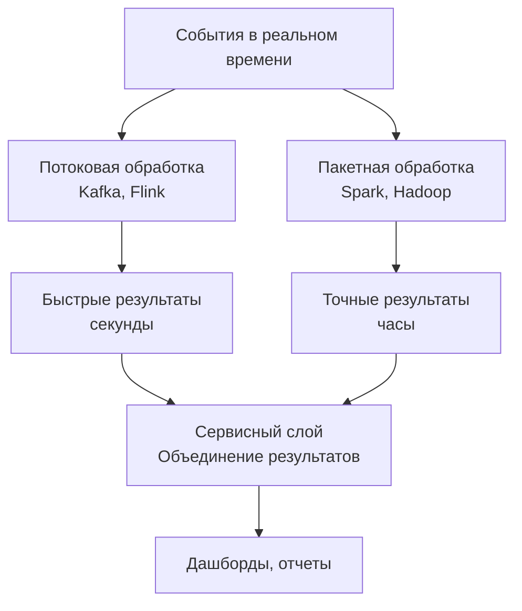

## Введение: Два мира данных

Представьте себе два совершенно разных типа работы с данными.

**Сценарий 1:** Вы заходите в интернет-магазин, кладете товар в корзину и оформляете заказ. Система должна мгновенно проверить остаток, списать деньги, создать заказ. Одна операция — несколько записей. Быстро, точно, надежно. Это OLTP.

**Сценарий 2:** Директор просит отчет: "Какие товары лучше всего продавались в прошлом месяце по каждому региону?" Система сканирует миллионы заказов, группирует, агрегирует, считает средние. Одна операция — миллионы строк. Медленно, но аналитически ценно. Это OLAP.

**OLTP (Online Transaction Processing)** — обработка транзакций в реальном времени. Системы, которые обслуживают повседневные операции: банковские переводы, заказы в магазине, бронирование билетов.

**OLAP (Online Analytical Processing)** — аналитическая обработка данных. Системы, которые помогают принимать решения: отчеты, дашборды, анализ продаж, прогнозирование.

Это не просто "два типа баз данных". Это два разных философских подхода к хранению и обработке данных. Разные цели, разные архитектуры, разные компромиссы. Один не лучше другого — они решают разные задачи. И в современном мире большинство компаний используют оба.

## Ключевые различия

| Характеристика | OLTP | OLAP |
| :--- | :--- | :--- |
| **Основная задача** | Обработка транзакций | Аналитика и отчеты |
| **Пользователи** | Клиенты, операторы | Аналитики, менеджеры |
| **Тип запросов** | Короткие, простые, предсказуемые | Сложные, длинные, ad-hoc |
| **Объем данных** | Текущие данные (ГБ - ТБ) | Исторические данные (ТБ - ПБ) |
| **Операции** | INSERT, UPDATE, DELETE (много) | SELECT, агрегации (много) |
| **Производительность** | Задержка (миллисекунды) | Пропускная способность (секунды - минуты) |
| **Нормализация** | Высокая (3NF) | Низкая (звезда, снежинка) |
| **Хранение** | Строковое (row-oriented) | Колоночное (column-oriented) |
| **Транзакции** | ACID (строгие) | BASE / eventual (мягкие) |
| **Примеры** | PostgreSQL, MySQL, Oracle | ClickHouse, Snowflake, Redshift |

## OLTP: Транзакционный мир

### Что такое OLTP

OLTP-системы — это "рабочие лошадки" бизнеса. Они обрабатывают повседневные операции. Каждая операция маленькая, быстрая, критичная для работы.

**Примеры OLTP-систем:**
- Система интернет-магазина (добавление в корзину, оформление заказа)
- Банковская система (перевод денег, проверка баланса)
- Система бронирования (поиск билетов, бронирование мест)
- CRM (добавление клиента, обновление статуса)

### Характеристики OLTP

**Много маленьких транзакций:**
- 1000-100 000 запросов в секунду
- Каждый запрос затрагивает 1-100 строк
- Запросы простые (поиск по ID, вставка, обновление)

**ACID обязателен:**
- Нельзя потерять заказ
- Нельзя списать деньги и не зачислить
- Нельзя показать пользователю чужие данные

**Нормализованная схема:**
- Минимум дублирования
- Целостность через внешние ключи
- Обновление в одном месте

```sql
-- OLTP схема (нормализованная)
CREATE TABLE customers (
    id INT PRIMARY KEY,
    name VARCHAR(100),
    email VARCHAR(100) UNIQUE
);

CREATE TABLE orders (
    id INT PRIMARY KEY,
    customer_id INT REFERENCES customers(id),
    created_at TIMESTAMP,
    status VARCHAR(20)
);

CREATE TABLE order_items (
    order_id INT REFERENCES orders(id),
    product_id INT,
    quantity INT,
    price DECIMAL(10,2)
);
```

**Индексы на первичные ключи и внешние ключи:**
- Быстрый поиск по ID
- Быстрые JOIN

### Пример OLTP запроса

```sql
-- Найти заказ пользователя по ID (простой, быстрый)
SELECT * FROM orders WHERE customer_id = 123 AND status = 'pending';

-- Оформить заказ (транзакция, несколько операций)
BEGIN;
    -- Проверка остатка
    SELECT stock FROM products WHERE id = 456 FOR UPDATE;
    -- Резервирование товара
    UPDATE products SET stock = stock - 1 WHERE id = 456;
    -- Создание заказа
    INSERT INTO orders (customer_id, status) VALUES (123, 'pending');
    INSERT INTO order_items (order_id, product_id, quantity, price) VALUES (last_id(), 456, 1, 1000);
COMMIT;
```

## OLAP: Аналитический мир

### Что такое OLAP

OLAP-системы помогают отвечать на вопросы бизнеса. "Почему упали продажи?", "Какие товары приносят больше всего прибыли?", "Какой регион показывает лучший рост?".

Они работают с большими объемами исторических данных и выполняют сложные аналитические запросы.

**Примеры OLAP-систем:**
- Хранилище данных (Data Warehouse)
- Дашборды продаж (Grafana, Tableau, Power BI)
- Бизнес-аналитика (отчеты, прогнозы)
- Научные исследования

### Характеристики OLAP

**Мало, но очень сложных запросов:**
- 1-100 запросов в секунду (не в минуту!)
- Каждый запрос сканирует миллионы или миллиарды строк
- Запросы сложные (группировки, агрегации, оконные функции)

**ACID не обязателен:**
- Можно потерять промежуточный расчет (пересчитаем заново)
- Допустима небольшая задержка актуальности
- Согласованность "в конечном итоге" (eventual) часто достаточна

**Денормализованная схема (звезда или снежинка):**

```sql
-- OLAP схема (звезда)
-- Факт-таблица (миллиарды записей)
CREATE TABLE sales_fact (
    sale_id BIGINT PRIMARY KEY,
    date_id INT REFERENCES date_dim(id),      -- внешний ключ на измерение дат
    product_id INT REFERENCES product_dim(id), -- внешний ключ на измерение товаров
    store_id INT REFERENCES store_dim(id),     -- внешний ключ на измерение магазинов
    customer_id INT REFERENCES customer_dim(id), -- внешний ключ на измерение клиентов
    quantity INT,                              -- мера (измеряемый факт)
    amount DECIMAL(15,2)                      -- мера
);

-- Измерения (тысячи-миллионы записей)
CREATE TABLE date_dim (
    id INT PRIMARY KEY,
    date DATE,
    year INT,
    month INT,
    quarter INT,
    day_of_week INT,
    is_holiday BOOLEAN
);

CREATE TABLE product_dim (
    id INT PRIMARY KEY,
    name VARCHAR(200),
    category VARCHAR(100),
    brand VARCHAR(100),
    price DECIMAL(10,2)
);
```

### Пример OLAP запроса

```sql
-- Продажи по категориям товаров за последний квартал
SELECT 
    p.category,
    SUM(f.quantity) AS total_quantity,
    SUM(f.amount) AS total_amount,
    AVG(f.amount) AS avg_amount,
    COUNT(DISTINCT f.customer_id) AS unique_customers
FROM sales_fact f
JOIN product_dim p ON f.product_id = p.id
JOIN date_dim d ON f.date_id = d.id
WHERE d.year = 2024 AND d.quarter = 1
GROUP BY p.category
ORDER BY total_amount DESC;
```

## Сравнение производительности

### OLTP: Быстрые маленькие запросы

```
Запрос: SELECT * FROM orders WHERE id = 12345
Сканирует: 1 строку (по индексу)
Время: 1-10 мс
Пропускная способность: 10 000 запросов/сек
```

### OLAP: Медленные большие запросы

```
Запрос: SELECT AVG(amount) FROM sales WHERE year = 2024
Сканирует: 1 миллиард строк (полное сканирование факт-таблицы)
Время: 5-60 секунд
Пропускная способность: 1 запрос/сек (но каждая обрабатывает много данных)
```

## Хранение данных: Строки vs Колонки

Это одно из самых важных технических различий.

### Строковое хранение (OLTP)

Данные на диске хранятся по строкам:

```
[1,Иван,30,Москва,50000] [2,Петр,25,СПб,45000] [3,Анна,35,Казань,55000]
```

**Хорошо для:** INSERT, UPDATE, DELETE, чтение всей строки
**Плохо для:** аналитических запросов (читают много строк, но мало столбцов)

### Колоночное хранение (OLAP)

Данные на диске хранятся по колонкам:

```
id: [1,2,3]
name: [Иван,Петр,Анна]
age: [30,25,35]
city: [Москва,СПб,Казань]
salary: [50000,45000,55000]
```

**Хорошо для:** аналитических запросов (читаем только нужные колонки)
**Плохо для:** INSERT, UPDATE (дорого переписать всю колонку)

**Почему это важно:**

```sql
-- OLAP запрос: нужны только city и AVG(salary)
-- Строковое хранение: читаем ВСЕ колонки (name, age, id...), 90% данных лишние
-- Колоночное хранение: читаем ТОЛЬКО city и salary, 100% данных нужные
```

## Схема данных: Нормализация vs Денормализация

### OLTP: Нормализация (3NF)

**Плюсы:** нет дублирования, просто обновлять, целостность
**Минусы:** много JOIN (медленно для аналитики)

```
customers (1) ───< orders (N) ───< order_items (N) >─── products (1)
```

### OLAP: Денормализация (звезда / снежинка)

**Плюсы:** мало JOIN, быстро для аналитики
**Минусы:** дублирование, сложно обновлять

```
                    ┌─────────────┐
                    │  date_dim   │
                    └──────┬──────┘
                           │
┌─────────────┐     ┌──────┴──────┐     ┌─────────────┐
│ product_dim │────▶│ sales_fact  │◀────│ store_dim   │
└─────────────┘     └──────┬──────┘     └─────────────┘
                           │
                    ┌──────┴──────┐
                    │ customer_dim│
                    └─────────────┘
```


## Популярные OLTP и OLAP системы

### OLTP (транзакционные)

| Система | Тип | Особенность |
| :--- | :--- | :--- |
| **PostgreSQL** | Реляционная | ACID, расширяемая, JSONB |
| **MySQL** | Реляционная | Популярная, веб-стандарт |
| **Oracle** | Реляционная | Энтерпрайз, дорогая |
| **SQL Server** | Реляционная | Интеграция с Microsoft |
| **MongoDB** | Документная | Гибкая схема, масштабирование |

### OLAP (аналитические)

| Система | Тип | Особенность |
| :--- | :--- | :--- |
| **ClickHouse** | Колоночная | Очень быстрая, open source |
| **Snowflake** | Облачная | Data warehouse as a service |
| **Amazon Redshift** | Облачная | Колоночная, AWS |
| **Google BigQuery** | Облачная | Серверлес, GCP |
| **Apache Druid** | Колоночная | Временные ряды, реальное время |
| **Apache Spark SQL** | Движок | Batch-обработка больших данных |

## Пример: Интернет-магазин

### OLTP база (PostgreSQL)

Хранит текущее состояние:
- Корзины пользователей
- Активные заказы
- Остатки товаров
- Сессии

**Объем:** 100 ГБ
**Запросы:** 10 000 в секунду

### ETL процесс (Extract, Transform, Load)

Каждую ночь данные копируются из OLTP в OLAP:

```
OLTP (PostgreSQL) → Extract → Transform → Load → OLAP (ClickHouse)
```

**Transform:** денормализация, агрегация, очистка

### OLAP база (ClickHouse)

Хранит историю:
- Все заказы за 5 лет
- Агрегаты по дням, месяцам, годам
- Данные о продажах, клиентах, товарах

**Объем:** 10 ТБ
**Запросы:** 10 в секунду (аналитики, дашборды)

## Lambda архитектура: Реальное время + аналитика

Современный подход — совмещать оба подхода.



**Пример:** Рекомендации товаров
- Быстрый путь: популярные товары за последний час (секунды)
- Медленный путь: персональные рекомендации на основе истории (часы)
- Объединение: показываем и то, и другое

## Когда что использовать

### OLTP необходим, когда:

| Признак | Пример |
| :--- | :--- |
| **Много мелких операций** | Тысячи заказов в секунду |
| **Требуется ACID** | Деньги не могут потеряться |
| **Данные часто меняются** | Остатки товаров, статусы заказов |
| **Запросы по ID** | "Найти заказ номер 12345" |
| **Маленькая задержка критична** | Пользователь не ждет |

### OLAP необходим, когда:

| Признак | Пример |
| :--- | :--- |
| **Аналитика и отчеты** | "Продажи по регионам за год" |
| **Большие объемы данных** | Терабайты и петабайты |
| **Сложные агрегации** | AVG, SUM, COUNT, GROUP BY |
| **Исторические данные** | "Как менялись продажи за 5 лет" |
| **Принятие решений** | Дашборды для руководства |

## Распространенные ошибки

### Ошибка 1: Использование OLTP для отчетов

Запрос `SELECT SUM(amount) FROM orders WHERE YEAR(created_at) = 2024` в PostgreSQL на 1 млрд заказов.

**Проблема:** Сканирование всей таблицы, часы выполнения, блокировка транзакций.

**Как исправить:** Выгружать данные в OLAP-систему (ClickHouse, Snowflake) для аналитики.

### Ошибка 2: Использование OLAP для транзакций

Попытка использовать ClickHouse как базу для интернет-магазина.

**Проблема:** Нет ACID, медленные UPDATE/INSERT по одной строке.

**Как исправить:** OLAP для аналитики, OLTP для транзакций.

### Ошибка 3: Нормализация в OLAP

Создание нормализованной схемы (3NF) в хранилище данных.

**Проблема:** Много JOIN, медленные запросы.

**Как исправить:** Используйте звездообразную схему (факты + измерения).

### Ошибка 4: Денормализация в OLTP

Хранение `customer_name` в каждой строке заказа для "ускорения".

**Проблема:** Если имя клиента изменится, нужно обновлять миллионы строк.

**Как исправить:** Нормализация для OLTP, денормализация для OLAP.

### Ошибка 5: OLTP и OLAP в одной базе

Хранение и транзакций, и отчетов в одном PostgreSQL.

**Проблема:** Аналитические запросы блокируют транзакционные (или наоборот).

**Как исправить:** Разделите системы. Используйте реплику OLTP для отчетов (read replica) или отдельный OLAP.

## Резюме для системного аналитика

1. **OLTP (Online Transaction Processing) — для повседневных операций.** Быстрые маленькие запросы, ACID, нормализация, строковое хранение. Примеры: заказы, переводы, бронирования.

2. **OLAP (Online Analytical Processing) — для аналитики и отчетов.** Медленные большие запросы, денормализация, колоночное хранение. Примеры: отчеты, дашборды, прогнозы.

3. **Главные отличия:** OLTP работает с текущими данными (ГБ), OLAP — с историческими (ТБ-ПБ). OLTP — много мелких операций, OLAP — мало крупных. OLTP — ACID, OLAP — eventual consistency.

4. **Хранение:** OLTP — строковое (row-oriented), OLAP — колоночное (column-oriented). Это фундаментальное различие в архитектуре.

5. **Схема данных:** OLTP — нормализованная (3NF), OLAP — денормализованная (звезда, снежинка). Нормализация хороша для обновлений, денормализация — для чтения.

6. **Разделяйте OLTP и OLAP.** Не пытайтесь делать отчеты на транзакционной базе. Используйте ETL/ELT процессы для перемещения данных из OLTP в OLAP (ежечасно, ежедневно).