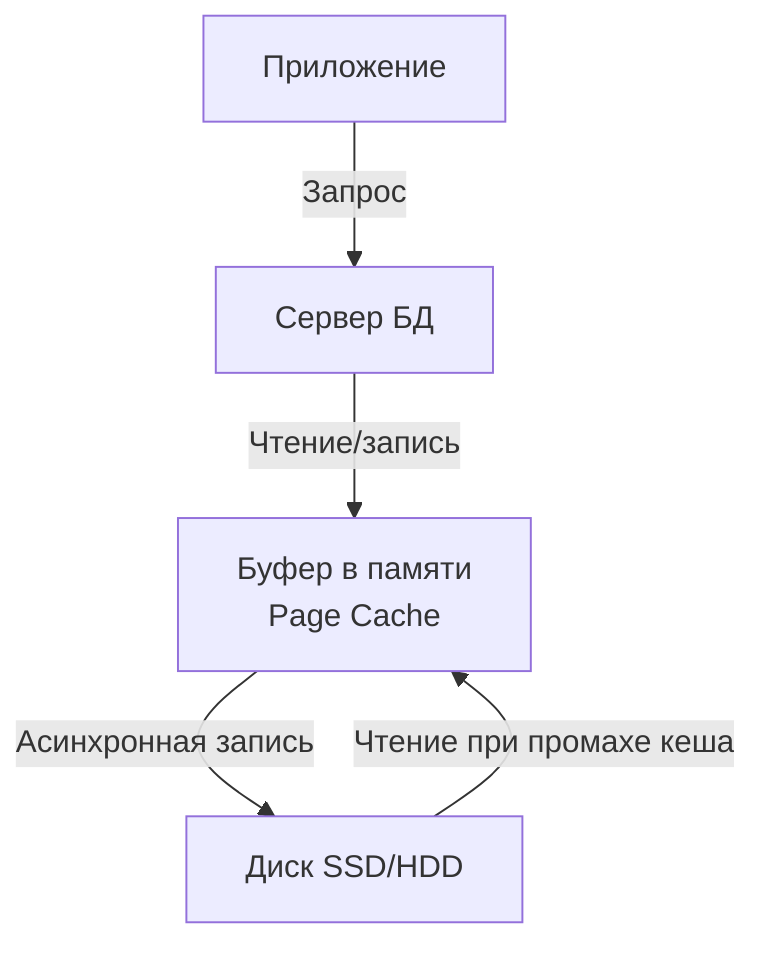
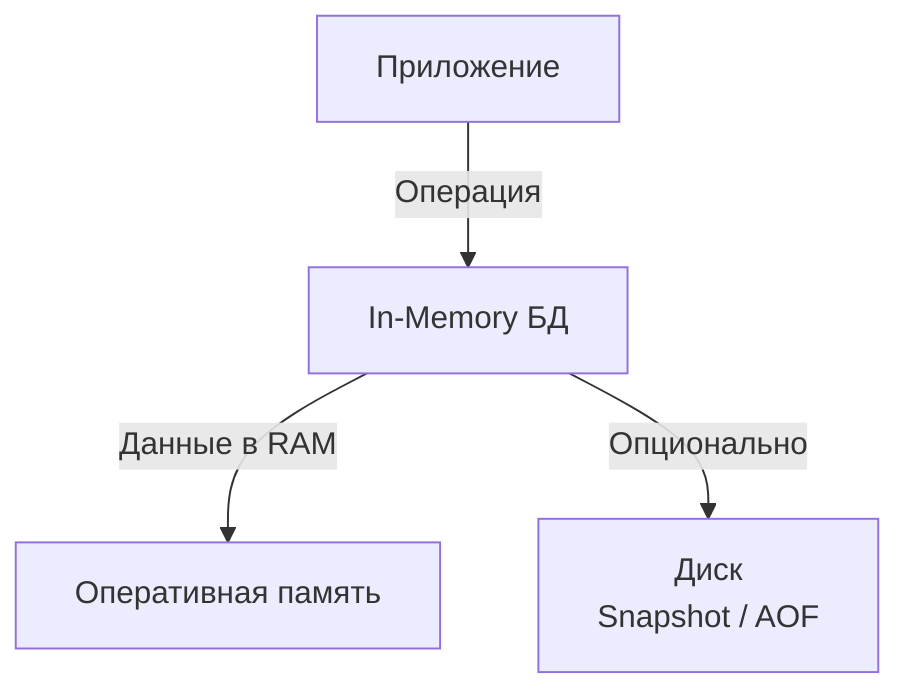
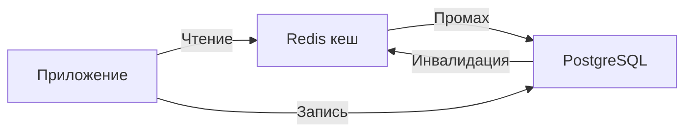

## Введение: Две философии хранения данных

Представьте, что вы работаете за столом. На столе лежат документы, с которыми вы работаете прямо сейчас — вы можете взять их мгновенно. В ящиках стола хранятся документы, которые вам не нужны в данный момент — чтобы их достать, нужно открыть ящик и порыться. В шкафу в соседней комнате — архив, который вы используете раз в год.

Оперативная память (RAM) — это как рабочий стол. Данные здесь доступны за наносекунды. Диск (SSD/HDD) — как ящики и шкафы. Данные здесь доступны за микросекунды или миллисекунды, то есть в 100-1000 раз медленнее.

**Persistent Database (персистентная БД)** — хранит данные на диске. После выключения питания данные сохраняются. При следующем запуске они на месте. Примеры: PostgreSQL, MySQL, SQLite, ClickHouse.

**In-Memory Database (БД в памяти)** — хранит данные в оперативной памяти. Скорость доступа — наносекунды. Но при выключении питания данные теряются (если не настроена персистентность). Примеры: Redis, Memcached, VoltDB, SAP HANA.

Это не просто "быстро" vs "медленно". Это разные компромиссы между скоростью, долговечностью, стоимостью и объемом хранения.

## Persistent Database: Данные на диске

### Как это работает



**Процесс записи (упрощенно):**
1. Приложение отправляет UPDATE
2. БД изменяет страницу в буфере в памяти
3. Запись в журнал (WAL) на диск (синхронно)
4. Асинхронно, позже, страница записывается на диск (checkpoint)

**Процесс чтения:**
1. Если страница в буфере (кеше) — вернуть мгновенно
2. Если нет — прочитать с диска, положить в кеш, вернуть

### Преимущества persistent БД

| Преимущество | Описание |
| :--- | :--- |
| **Долговечность (Durability)** | Данные переживают перезагрузку, отключение электричества, падение сервера |
| **Большой объем** | Диски дешевле RAM. Можно хранить терабайты и петабайты |
| **Экономичность** | SSD/HDD стоят значительно дешевле RAM за гигабайт |
| **Восстановление после сбоя** | Журналы (WAL) позволяют восстановить данные |
| **Исторические данные** | Можно хранить годы и десятилетия |

### Недостатки persistent БД

| Недостаток | Описание |
| :--- | :--- |
| **Медленнее RAM** | Диск в 100-1000 раз медленнее памяти |
| **Сложность** | Кеши, журналы, контрольные точки — сложная архитектура |
| **Задержки (latency)** | Даже при кешировании, синхронная запись на диск имеет задержку |

### Примеры persistent БД

| База данных | Тип | Особенность |
| :--- | :--- | :--- |
| **PostgreSQL** | Реляционная | ACID, расширяемая, надежная |
| **MySQL** | Реляционная | Популярная, веб-стандарт |
| **SQLite** | Встраиваемая | Один файл, нулевая конфигурация |
| **ClickHouse** | Колоночная | Аналитика, большие объемы |
| **MongoDB** | Документная | Гибкая схема |

## In-Memory Database: Данные в RAM

### Как это работает



**Процесс:**
- Все данные всегда в оперативной памяти
- Чтение и запись — наносекунды
- При выключении питания — данные теряются (если нет персистентности)

**Опциональная персистентность:**
- **Snapshot (RDB):** Периодический снимок всей БД на диск
- **AOF (Append-Only File):** Журнал всех операций
- При запуске: данные восстанавливаются с диска

### Преимущества in-memory БД

| Преимущество | Описание |
| :--- | :--- |
| **Максимальная скорость** | Наносекунды (в 100-1000 раз быстрее диска) |
| **Низкая задержка** | Нет ожидания диска |
| **Высокая пропускная способность** | Миллионы операций в секунду |
| **Простота** | Нет кешей, нет буферов, нет WAL (опционально) |
| **Предсказуемость** | Время выполнения операции стабильно |

### Недостатки in-memory БД

| Недостаток | Описание |
| :--- | :--- |
| **Потеря данных при сбое** | Без персистентности — данные исчезают |
| **Ограниченный объем** | RAM дороже диска. Сервер с 1 ТБ RAM — очень дорого |
| **Стоимость** | RAM стоит в 10-50 раз дороже диска за гигабайт |
| **Ограниченный размер** | Физический лимит RAM на сервере (обычно до нескольких ТБ) |

### Примеры in-memory БД

| База данных | Тип | Персистентность |
| :--- | :--- | :--- |
| **Redis** | Ключ-значение + структуры | RDB + AOF |
| **Memcached** | Ключ-значение (простой) | Нет (только кеш) |
| **VoltDB** | Реляционная (OLTP) | Да (синхронная запись на диск) |
| **SAP HANA** | Реляционная (HTAP) | Да |
| **Apache Ignite** | Ключ-значение + SQL | Да |
| **SingleStore** | Реляционная (HTAP) | Да (гибридное хранение) |

## Сравнение производительности

### Задержки (Latency)

| Операция | Persistent (диск) | In-Memory (RAM) | Разница |
| :--- | :--- | :--- | :--- |
| **Чтение из кеша** | 100 нс - 1 мкс | 100 нс - 1 мкс | Одинаково |
| **Чтение с диска (SSD)** | 50-100 мкс | — | В 100-1000 раз медленнее |
| **Чтение с диска (HDD)** | 5-10 мс | — | В 5000-10000 раз медленнее |
| **Запись (синхронная)** | 50 мкс - 10 мс | 100 нс - 1 мкс | В 100-10000 раз медленнее |

### Пропускная способность (Throughput)

| Операция | Persistent | In-Memory |
| :--- | :--- | :--- |
| **Простые GET (в кеше)** | 100k-500k ops/sec | 1M-5M ops/sec |
| **Простые GET (не в кеше)** | 5k-50k ops/sec | 1M-5M ops/sec |
| **SET (синхронная запись)** | 5k-50k ops/sec | 500k-2M ops/sec |

**Вывод:** In-Memory БД могут быть на 1-2 порядка быстрее для операций, требующих записи на диск.

## Гибридные подходы

### 1. Persistent с агрессивным кешированием

Большинство persistent БД кешируют горячие данные в памяти.

```sql
-- PostgreSQL: настройка shared_buffers
shared_buffers = '25% of RAM'  -- 25% оперативной памяти под кеш
```

**Как это работает:**
- Горячие данные — в памяти (быстро)
- Холодные данные — на диске (медленно)
- При записи — синхронно в WAL на диск, страница в кеше помечается dirty

**Плюсы:** Лучшее из двух миров для многих сценариев
**Минусы:** Все еще синхронная запись на диск

### 2. In-Memory с опциональной персистентностью

Redis и аналоги могут сохранять данные на диск.

```bash
# Redis: включение AOF (журнал операций)
appendonly yes
appendfsync everysec  # синхронизация раз в секунду
```

**Уровни персистентности в Redis:**

| Режим | Гарантии | Скорость |
| :--- | :--- | :--- |
| **AOF off** | Нет (потеря данных при сбое) | Максимальная |
| **AOF everysec** | Потеря последней секунды | Очень высокая |
| **AOF always** | Полная (каждая операция) | Низкая (как у persistent) |
| **RDB snapshot** | Потеря данных с последнего снэпшота | Высокая (периодическая запись) |

### 3. Гибридное хранение (HTAP)

SingleStore, SAP HANA хранят горячие данные в памяти, холодные — на диске.

```sql
-- SingleStore: таблица в памяти
CREATE TABLE hot_data (...) USING MEMORY;

-- Таблица на диске
CREATE TABLE cold_data (...) USING COLUMNSTORE;
```

### 4. Persistent + In-Memory кеш

Самая популярная архитектура: PostgreSQL + Redis.



---

## Сценарии использования

### Когда использовать persistent БД

| Сценарий | Почему |
| :--- | :--- |
| **Банковские транзакции** | Деньги не могут потеряться при сбое |
| **Системы бронирования** | Потеря билета = потеря клиента |
| **Хранилище данных (Data Warehouse)** | Огромные объемы (терабайты) |
| **Исторические данные** | Нужно хранить годы |
| **Системы с большими данными** | RAM не хватит |
| **Приложения, где потеря данных недопустима** | Финансы, медицина, авиация |

### Когда использовать in-memory БД

| Сценарий | Почему |
| :--- | :--- |
| **Кеширование** | Потеря кеша не страшна (пересчитаем) |
| **Сессии пользователей** | Временные данные |
| **Лимитирование (rate limiting)** | Счетчики за короткое окно |
| **Лидерборды** | Можно потерять (пересчитаем) |
| **Очереди (временные)** | Задачи, которые можно повторить |
| **Real-time аналитика** | Скорость важнее долговечности |
| **Pub/Sub сообщения** | Мгновенные уведомления |

### Гибридный подход: кеш + persistent

| Сценарий | Архитектура |
| :--- | :--- |
| **Интернет-магазин** | Redis (корзина, сессии) + PostgreSQL (заказы, пользователи) |
| **Социальная сеть** | Redis (лента, лайки) + MySQL (профили, посты) |
| **API сервис** | Redis (кеш ответов) + PostgreSQL (данные) |

## Стоимость: RAM vs Disk

### Цена за гигабайт (2024 год, приблизительно)

| Тип | Цена за ГБ | Относительная стоимость |
| :--- | :--- | :--- |
| **HDD** | $0.02 - $0.05 | 1x |
| **SSD SATA** | $0.08 - $0.15 | 3-5x |
| **SSD NVMe** | $0.15 - $0.30 | 5-10x |
| **RAM DDR4/DDR5** | $3 - $8 | 100-200x |

### Пример: Хранение 1 ТБ данных

| Решение | Стоимость железа | Примечание |
| :--- | :--- | :--- |
| **HDD** | $20-50 | Дешево, но медленно |
| **SSD** | $80-300 | Золотая середина |
| **RAM** | $3000-8000 | Очень дорого для больших объемов |

**Вывод:** In-memory БД экономически оправданы только для горячих данных (несколько ГБ). Для больших объемов (ТБ+) нужен диск.

## Примеры кода

### PostgreSQL (persistent)

```python
import psycopg2
import time

conn = psycopg2.connect("dbname=test user=postgres")
cur = conn.cursor()

# Создание таблицы
cur.execute("CREATE TABLE IF NOT EXISTS users (id SERIAL PRIMARY KEY, name TEXT)")

# Вставка (синхронная запись на диск)
start = time.time()
for i in range(10000):
    cur.execute("INSERT INTO users (name) VALUES (%s)", (f"User{i}",))
conn.commit()
print(f"PostgreSQL: {time.time() - start:.2f} sec")
# Типичный результат: 1-2 секунды (зависит от диска)
```

### Redis (in-memory)

```python
import redis
import time

r = redis.Redis(host='localhost', port=6379, db=0)

# Вставка (в память, синхронно на диск только если настроено AOF)
start = time.time()
for i in range(10000):
    r.set(f"user:{i}", f"User{i}")
print(f"Redis: {time.time() - start:.2f} sec")
# Типичный результат: 0.05-0.1 секунды (в 10-20 раз быстрее)
```

### SQLite (persistent, embedded)

```python
import sqlite3
import time

conn = sqlite3.connect('test.db')
cur = conn.cursor()

cur.execute("CREATE TABLE IF NOT EXISTS users (id INTEGER PRIMARY KEY, name TEXT)")

start = time.time()
for i in range(10000):
    cur.execute("INSERT INTO users (name) VALUES (?)", (f"User{i}",))
conn.commit()
print(f"SQLite: {time.time() - start:.2f} sec")
# Типичный результат: 0.5-1 секунда
```

## Persistent + In-Memory: Сравнение

| Характеристика | Persistent | In-Memory |
| :--- | :--- | :--- |
| **Скорость чтения (горячие данные)** | Высокая (из кеша) | Максимальная |
| **Скорость чтения (холодные данные)** | Низкая (с диска) | Не применимо |
| **Скорость записи** | Средняя (синхронный WAL) | Максимальная (до настройки персистентности) |
| **Долговечность** | Полная (ACID) | Опциональная (потеря секунд) |
| **Объем** | Терабайты - Петабайты | Гигабайты - Терабайты |
| **Стоимость за ГБ** | Низкая ($0.02-0.30) | Высокая ($3-8) |
| **Сложность** | Высокая (кеши, WAL, контрольные точки) | Низкая (все в памяти) |
| **Примеры** | PostgreSQL, MySQL, SQLite | Redis, Memcached |

## Распространенные ошибки

### Ошибка 1: Использование in-memory БД как единственного хранилища

Хранение критичных данных только в Redis без персистентности.

**Как исправить:** Включите AOF или RDB. Или используйте Redis как кеш, а основное хранилище — PostgreSQL.

### Ошибка 2: Хранение терабайтов данных в in-memory БД

Попытка загрузить 10 ТБ данных в Redis.

**Как исправить:** Используйте persistent БД для больших объемов. In-memory — для горячих данных (ГБ, не ТБ).

### Ошибка 3: Игнорирование персистентности в Redis для критичных данных

Redis используется как основное хранилище для сессий, но AOF выключен.

**Как исправить:** Включите AOF (appendonly yes). Или принимайте потерю сессий как бизнес-риск.

### Ошибка 4: Уверенность, что persistent БД всегда медленная

PostgreSQL с правильными индексами и кешем может быть очень быстрым (микросекунды для точечных запросов).

**Как исправить:** Измеряйте. Часто persistent БД достаточно быстра для 95% сценариев.

### Ошибка 5: Неправильный выбор между Redis и Memcached

Memcached не имеет персистентности вообще. Если вам нужна хотя бы опциональная персистентность — выбирайте Redis.

**Как исправить:** Memcached для простого кеша (терять можно). Redis для кеша + временное хранилище + очереди + лидерборды.

## Резюме для системного аналитика

1. **Persistent database** хранит данные на диске. Долговечность (ACID), большой объем, низкая стоимость. Но медленнее (диск) и сложнее архитектура. Выбор для систем, где потеря данных недопустима.

2. **In-memory database** хранит данные в оперативной памяти. Максимальная скорость, низкая задержка, простота. Но ограниченный объем, высокая стоимость, риск потери данных (без персистентности).

3. **Скорость:** In-memory в 100-1000 раз быстрее для операций с записью. Для чтения из кеша — разница невелика.

4. **Стоимость:** RAM в 100-200 раз дороже диска за гигабайт. In-memory экономически оправдана только для небольших объемов (ГБ) горячих данных.

5. **Гибридные подходы:** Persistent с агрессивным кешированием (данные на диске, горячие — в памяти). In-memory с опциональной персистентностью (Redis RDB/AOF). Кеш + persistent (Redis + PostgreSQL) — самый популярный паттерн.

6. **Выбор:**
   - **Persistent:** критичные данные, большие объемы, исторические данные, банки, бронирования.
   - **In-memory:** кеш, сессии, лимитирование, лидерборды, real-time, где потеря данных допустима.
   - **Гибрид:** кеш + persistent = лучшее из двух миров.