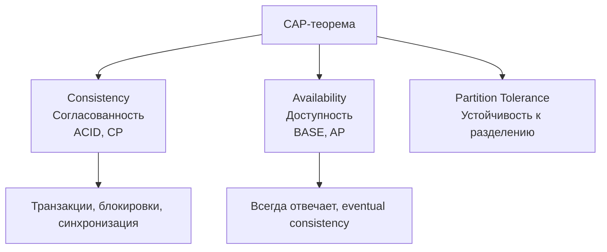

## Введение: Другой подход к надежности

В мире реляционных баз данных царит ACID. Транзакции атомарны, данные согласованы, изоляция строга, результат долговечен. Это надежно, но дорого. Как тяжелый бронепоезд: защищен, но медлителен и сложен в масштабировании.

В мире нереляционных (и многих распределенных) систем появился BASE. База (base) — фундамент, основа. Другой подход к надежности, где жертвуют строгостью ради доступности и масштабируемости. Как флот маленьких катеров: каждый менее защищен, но вместе они покрывают большую акваторию, и если один утонет — остальные продолжают работу.

**BASE** — это акроним, противопоставляемый ACID. Он описывает свойства распределенных систем, которые не могут позволить себе строгие гарантии реляционных баз.

| Буква | Термин | Что означает простыми словами |
| :--- | :--- | :--- |
| **B** | Basically Available | Система всегда доступна, всегда отвечает (даже если не самыми свежими данными) |
| **A** | Soft state | Состояние системы может меняться со временем даже без новых входных данных (из-за синхронизации, репликации) |
| **E** | Eventual consistency | Рано или поздно все узлы увидят одни и те же данные (но не обязательно сразу) |

BASE — это не "хуже" и не "лучше". Это "другое". ACID выбирает согласованность и надежность, BASE выбирает доступность и масштабируемость. В современном мире нужны оба подхода — для разных задач.

## Почему ACID не подходит для распределенных систем

Прежде чем понять BASE, нужно понять, почему ACID ломается в больших распределенных системах.

### Проблема 1: Транзакции не масштабируются

В реляционной базе транзакция может блокировать строки, таблицы, страницы. На одном мощном сервере это работает. На ста серверах, где данные распределены, транзакция, затрагивающая данные на разных узлах, становится катастрофой.

- Нужен координатор (как в 2PC), который общается со всеми узлами.
- Каждый узел должен заблокировать свои данные на время подготовки транзакции.
- Если один узел недоступен, транзакция не может завершиться.
- Время выполнения растет с количеством узлов.

Для систем с миллионами запросов в секунду это неприемлемо.

### Проблема 2: Согласованность требует синхронизации

Сильная согласованность (как в ACID) означает, что после записи все читатели должны видеть новое значение. В распределенной системе это требует синхронной репликации на все узлы.

- Каждая запись должна быть подтверждена несколькими узлами.
- Задержка (латентность) растет с каждым дополнительным узлом.
- Если один узел медленный или недоступен, запись замедляется или блокируется.

### Проблема 3: CAP-теорема

Напомним CAP-теорему: распределенная система может обеспечить только два из трех свойств: Согласованность (Consistency), Доступность (Availability), Устойчивость к разделению (Partition tolerance).

ACID тяготеет к CP (Consistency + Partition tolerance), жертвуя доступностью при сетевых проблемах.

BASE тяготеет к AP (Availability + Partition tolerance), жертвуя строгой согласованностью.



## Basically Available: Доступность прежде всего

### Что это значит

Система всегда доступна и всегда отвечает на запросы. Она не может сказать "я сейчас занята, придите позже" или "у меня сетевые проблемы, я не отвечу". Она всегда отвечает — даже если ответ содержит устаревшие данные.

**Простыми словами:** Кассир в супермаркете всегда обслуживает клиента. Если компьютер не может проверить остатки на центральном складе, кассир все равно пробьет товар, основываясь на локальной копии данных (которая может быть устаревшей).

### Как это работает на практике

В системах, следующих BASE, доступность часто достигается через:

**Репликация:** Данные копируются на множество узлов. Если один узел упал, другие продолжают работать.

**Асинхронная репликация:** Запись на мастер-узел не ждет подтверждения от реплик. Клиент получает ответ сразу, а реплики догоняют позже.

**Компромиссная согласованность:** Вместо того чтобы блокировать запрос до получения свежих данных, система отвечает из локального кеша или реплики, даже если данные устарели.

### Пример: Лента новостей в социальной сети

Вы постите новую фотографию. Система:
1. Немедленно сохраняет ее на ближайшем сервере.
2. Отвечает вам: "Опубликовано!"
3. Асинхронно начинает распространять фото на все сервера по всему миру.

Ваши друзья могут увидеть фото не мгновенно, а через несколько секунд. Но вы никогда не получите ошибку "сервер перегружен, попробуйте позже". Система всегда доступна.

## Soft State: Состояние может меняться без вашего участия

### Что это значит

В ACID состояние системы меняется только в ответ на операции (INSERT, UPDATE, DELETE). Между операциями состояние стабильно. В BASE состояние системы может меняться "само по себе" — из-за фоновых процессов репликации, синхронизации, согласования данных между узлами.

**Простыми словами:** Вы отправили письмо. Через минуту оно появилось у получателя. Но через еще минуту оно могло исчезнуть и появиться снова, если система пересортировала письма. Состояние "мягкое", не фиксированное.

### Почему состояние "мягкое"

В распределенных системах с асинхронной репликацией данные постоянно "путешествуют" между узлами:

- Вы записали данные на узел A.
- Узел A начал реплицировать их на узел B.
- Читающий запрос может попасть на узел B до завершения репликации — и не увидеть данные.
- Или может попасть на узел A — и увидеть.
- Или может попасть на узел C, который получил репликацию, но еще не применил ее.

Через некоторое время все узлы придут к одному состоянию. Но в промежутке состояние "плавает".

### Пример: Обновление DNS

Вы изменили IP-адрес своего сайта. DNS-серверы по всему миру не обновляются мгновенно. В течение нескольких часов (TTL) разные пользователи могут видеть:
- старый IP (на кеширующих DNS)
- новый IP (на обновленных DNS)
- ошибку (если DNS временно недоступен)

Состояние системы "мягкое" — оно меняется без ваших действий, просто потому что DNS-серверы синхронизируются между собой.

### Мягкое состояние vs жесткое состояние

| Жесткое состояние (ACID) | Мягкое состояние (BASE) |
| :--- | :--- |
| Изменяется только транзакциями | Изменяется также фоновыми процессами |
| После COMMIT состояние фиксировано | После записи состояние может временно "плавать" |
| Предсказуемо | Менее предсказуемо |
| Легко тестировать | Сложнее тестировать |

## Eventual Consistency: Согласованность как обещание

### Что это значит

Самая известная и самая важная часть BASE. Eventual consistency (конечная согласованность) обещает: если новые данные перестанут поступать, то через некоторое время все узлы системы придут к одному состоянию.

Нет гарантии, что чтение сразу после записи вернет новое значение. Но есть гарантия, что "рано или поздно" все увидят одно и то же.

**Простыми словами:** Вы пишете сообщение в чат. Ваши друзья увидят его не мгновенно, а с небольшой задержкой. Но через несколько секунд все увидят одно и то же. Сообщение не потеряется.

### Степени согласованности

Eventual consistency — это спектр, а не бинарное свойство. Разные системы предлагают разные гарантии:

| Уровень согласованности | Гарантии | Задержка | Примеры |
| :--- | :--- | :--- | :--- |
| **Strong consistency** | Чтение после записи всегда видит запись. Все узлы синхронны | Высокая (ждем всех) | ACID, ZooKeeper, etcd |
| **Read-your-writes** | Пользователь видит свои собственные записи | Средняя | Большинство систем |
| **Session consistency** | В рамках одной сессии (соединения) — read-your-writes | Средняя | Веб-приложения |
| **Monotonic reads** | Если пользователь увидел значение X, он не увидит более старую версию | Средняя | Системы с сессиями |
| **Eventual consistency** | Рано или поздно все увидят одно и то же. Порядок не гарантирован | Низкая (асинхронная) | DNS, Cassandra (по умолчанию) |

### Пример: Лайки в Instagram

Вы поставили лайк под фото. Что происходит?

1. Ваш лайк мгновенно отображается у вас (read-your-writes).
2. Друзья могут увидеть лайк с задержкой в 1-2 секунды.
3. Если обновить страницу через 5 секунд, лайк уже есть.
4. Система не гарантирует, что через 0.5 секунды лайк увидят все сервера мира.

Это eventual consistency. Для лайков это нормально. Для перевода денег — нет.

### Как измерять "eventual"

Ключевые метрики для систем с eventual consistency:

| Метрика | Что означает |
| :--- | :--- |
| **Время согласования** | Через сколько секунд 99.9% узлов увидят новое значение |
| **Окно неопределенности** | Интервал времени, когда разные узлы могут видеть разные значения |
| **Вероятность чтения старого значения** | Какой шанс, что запрос попадет на узел с устаревшими данными |

В хорошо спроектированной системе время согласования измеряется миллисекундами или секундами. Но в теории оно может быть бесконечным (если сеть разорвана навсегда).

## BASE на практике: Примеры из реальных систем

### Amazon DynamoDB (режим eventual consistency)

DynamoDB предлагает выбор: strong consistency (медленнее) или eventual consistency (быстрее). По умолчанию — eventual.

```javascript
// AWS SDK — чтение с eventual consistency (по умолчанию)
const params = {
    TableName: 'Users',
    Key: { 'UserId': '123' }
};
// Может вернуть устаревшие данные, но очень быстро
const result = await dynamodb.get(params).promise();

// Чтение с strong consistency (медленнее, но гарантирует свежесть)
const paramsStrong = {
    TableName: 'Users',
    Key: { 'UserId': '123' },
    ConsistentRead: true
};
const resultStrong = await dynamodb.get(paramsStrong).promise();
```

### Cassandra

Cassandra позволяет настраивать уровень согласованности для каждой операции:

```sql
-- Запись с согласованием на 2 из 3 узлов
INSERT INTO users (id, name) VALUES (1, 'Иван') USING CONSISTENCY QUORUM;

-- Чтение с согласованием на 1 из 3 узлов (быстро, может быть устаревшим)
SELECT * FROM users WHERE id = 1 USING CONSISTENCY ONE;

-- Чтение с согласованием на всех узлах (медленно, но свежие данные)
SELECT * FROM users WHERE id = 1 USING CONSISTENCY ALL;
```

### DNS (Domain Name System)

Классический пример eventual consistency. Когда вы меняете DNS-запись, изменения распространяются по миру в течение TTL (обычно 300-3600 секунд). В течение этого времени разные пользователи видят разные IP-адреса.

### Активные-активные (Active-Active) кластеры

Системы, где несколько узлов принимают запросы одновременно. Например, распределенная база данных с несколькими мастер-узлами. Если два пользователя одновременно обновляют одну запись на разных узлах, возникает конфликт. Система должна разрешить его позже (например, "последняя запись побеждает").

## BASE vs ACID: Сравнение

| Характеристика | ACID | BASE |
| :--- | :--- | :--- |
| **Основная цель** | Согласованность и целостность | Доступность и масштабируемость |
| **Согласованность** | Сильная (сразу) | Конечная (eventual) |
| **Доступность** | Может жертвовать доступностью ради согласованности | Всегда доступна |
| **Транзакции** | Полная поддержка, блокировки | Ограниченные (часто только на уровне документа) |
| **Масштабирование** | Вертикальное (реже горизонтальное) | Горизонтальное (из коробки) |
| **Схема данных** | Фиксированная, нормализованная | Гибкая, денормализованная |
| **Подход к проектированию** | Сначала схема, потом данные | Сначала запросы, потом модель |
| **Примеры** | PostgreSQL, Oracle, SQL Server | Cassandra, DynamoDB, Riak |

### Когда ACID, когда BASE

| Сценарий | Выбор | Почему |
| :--- | :--- | :--- |
| **Банковский перевод** | ACID | Деньги не могут "потеряться" или "временно удвоиться" |
| **Бронирование авиабилетов** | ACID | Одно место не может быть продано дважды |
| **Лента новостей** | BASE | Допустима задержка в пару секунд |
| **Счетчик лайков** | BASE | Небольшая рассинхронизация не страшна |
| **Корзина покупок** | BASE | Временное расхождение (товар добавился, но не отображается) приемлемо |
| **Инвентаризация склада** | ACID | Нельзя продать последний товар дважды |
| **Аналитика больших данных** | BASE | Согласованность не нужна, скорость и объем важны |
| **Кеширование** | BASE | Устаревшие данные в кеше — норма |

## Компромиссы BASE: Чем вы платите

### Плата 1: Сложность приложения

Приложение должно быть готово к тому, что чтение может вернуть устаревшие данные. Это требует дополнительной логики:

- Проверка версий данных
- Обнаружение конфликтов
- Повторные попытки
- Компенсирующие операции (если что-то пошло не так)

```javascript
// Пример: обработка возможной устаревшей версии
async function updateUserBalance(userId, amount) {
    let retries = 3;
    while (retries > 0) {
        try {
            // Читаем с сильной согласованностью (если поддерживается)
            const user = await db.get(userId, { consistency: 'strong' });
            const newBalance = user.balance + amount;
            // Записываем с условием (оптимистичная блокировка)
            const success = await db.put(userId, { 
                balance: newBalance, 
                version: user.version + 1 
            }, { 
                condition: 'version = :user.version' 
            });
            if (success) return;
        } catch (error) {
            if (error.code === 'CONDITION_FAILED') {
                retries--; // Кто-то изменил данные, пробуем еще раз
            } else {
                throw error;
            }
        }
    }
    throw new Error('Не удалось обновить баланс после нескольких попыток');
}
```

### Плата 2: Потеря данных (в редких сценариях)

При асинхронной репликации есть окно, когда данные записаны на мастер-узел, но еще не скопированы на реплики. Если мастер умирает в этот момент, данные могут быть потеряны.

**Защита:**
- Синхронная репликация на как минимум один узел (кворум)
- Журналирование (WAL) на мастер-узле
- Регулярные бэкапы

### Плата 3: Сложность отладки

Проблемы в распределенных системах с eventual consistency трудно воспроизвести локально. "У меня все работает, а в продакшене иногда падает" — типичная жалоба.

**Инструменты:**
- Логирование с trace-id для отслеживания запросов через всю систему
- Мониторинг задержек репликации
- Тестирование с эмуляцией сетевых проблем

### Плата 4: Необходимость идемпотентности

В системах с асинхронной репликацией операции могут быть выполнены несколько раз (например, при повторе из-за сетевого сбоя). Операции должны быть идемпотентными — повторное выполнение не должно менять результат.

```javascript
// НЕ идемпотентно
db.increment('counter', 1);  // Повтор увеличит счетчик еще раз

// Идемпотентно
db.setIfNotExists('order:123', { status: 'created' });  // Повтор не создаст второй заказ
```

## Eventual Consistency в деталях

### Модели согласованности

Существует целая иерархия моделей согласованности, от самых строгих до самых слабых:

| Модель | Описание | Пример использования |
| :--- | :--- | :--- |
| **Linearizability** | Самая строгая. Все операции выглядят как мгновенные в едином глобальном порядке | ZooKeeper, etcd |
| **Sequential consistency** | Порядок операций каждого узла сохраняется, но глобального порядка нет | Некоторые распределенные БД |
| **Causal consistency** | Если операция A причинно связана с B, все увидят A до B | Системы с версионированием |
| **Read-your-writes** | Пользователь видит свои записи | Большинство веб-систем |
| **Monotonic reads** | Если пользователь увидел X, он не увидит более старую версию | Сессии |
| **Monotonic writes** | Записи одного пользователя упорядочены | Сессии |
| **Eventual consistency** | Самая слабая. Рано или поздно все увидят одно и то же | DNS, Cassandra (по умолчанию) |

### Как достичь read-your-writes в eventual системе

Даже в системе с eventual consistency можно гарантировать, что пользователь видит свои собственные записи. Техника: привязка пользователя к узлу, где его данные наиболее свежие.

```javascript
// Использование session affinity (липкие сессии)
app.get('/api/profile', (req, res) => {
    // Пользователь всегда направляется на тот же узел (по session ID)
    const node = getNodeForUser(req.session.userId);
    const data = node.get(req.session.userId);
    res.json(data);
});
```

## BASE в контексте CAP-теоремы

BASE и ACID — это практические следствия CAP-теоремы.

| Выбор | CAP | Свойства | Примеры |
| :--- | :--- | :--- | :--- |
| **ACID** | CP (Consistency + Partition tolerance) | Согласованность в ущерб доступности при разделении | Большинство реляционных БД |
| **BASE** | AP (Availability + Partition tolerance) | Доступность в ущерб строгой согласованности | Cassandra, DynamoDB, CouchDB |
| **Гибрид** | Настраивается (per-operation) | Можно выбирать для каждой операции | Cassandra (CONSISTENCY), DynamoDB |

Ни одна система не может быть одновременно ACID и BASE для всех операций. Но можно смешивать: для критических операций использовать strong consistency, для остальных — eventual.

## Распространенные ошибки в понимании BASE

### Ошибка 1: "BASE означает отсутствие согласованности"

BASE не означает "данные никогда не согласованы". Означает "данные согласованы в конечном итоге". Рано или поздно все узлы увидят одно и то же.

### Ошибка 2: "BASE проще ACID"

BASE сложнее в применении. ACID дает простую ментальную модель: "транзакция либо выполнена, либо нет". BASE требует думать о временных расхождениях, конфликтах, разрешении коллизий.

### Ошибка 3: "Все нереляционные БД — BASE"

Не все. MongoDB поддерживает ACID-транзакции на нескольких документах (с версии 4.0). FoundationDB — ACID-система. Выбор BASE или ACID — это настройка или архитектурное решение, а не свойство класса БД.

### Ошибка 4: "BASE означает потерю данных"

Нет. Хорошо спроектированная BASE-система не теряет данные. Данные могут быть временно недоступны на некоторых узлах, но в конечном итоге они будут реплицированы. Потеря данных возможна только при каскадном отказе узлов до завершения репликации.

### Ошибка 5: "Eventual consistency — это всегда долго"

Время согласования может быть миллисекунды. В хорошо спроектированной системе eventual consistency почти не заметна пользователю. DNS обновляется минуты, но это крайний случай.

## Резюме для системного аналитика

1. **BASE — это альтернатива ACID для распределенных систем.** Она жертвует строгой согласованностью ради доступности и масштабируемости. BASE = Basically Available + Soft state + Eventual consistency.

2. **Basically Available** — система всегда отвечает на запросы. Даже при сетевых проблемах или отказе узлов. Ответ может содержать устаревшие данные, но он будет.

3. **Soft state** — состояние системы может меняться без внешних воздействий, из-за фоновой репликации и синхронизации. В отличие от ACID, где состояние стабильно между операциями.

4. **Eventual consistency** — рано или поздно все узлы увидят одни и те же данные. Нет гарантии, что чтение сразу после записи вернет новое значение. Но есть гарантия, что через некоторое время все узлы сойдутся.

5. **BASE — следствие CAP-теоремы.** В распределенных системах при сетевом разделении нужно выбирать между согласованностью и доступностью. BASE выбирает доступность (AP-системы).

6. **Eventual consistency — это спектр.** От read-your-writes (пользователь видит свои записи) до слабой eventual (никаких гарантий, кроме конечной сходимости). Разные системы и даже разные операции могут предлагать разные уровни.

7. **BASE сложнее ACID.** Приложения должны быть готовы к устаревшим данным, конфликтам, повторным попыткам. Нужна идемпотентность, версионирование, разрешение коллизий.